# Admin Lab 01 - Hydrating MSLab

<!-- TOC -->

- [Admin Lab 01 - Hydrating MSLab](#admin-lab-01---hydrating-mslab)
    - [Lab overview](#lab-overview)
    - [Task 1 - Check hardware requirements](#task-1---check-hardware-requirements)
    - [Task 2 - Download all necessary files](#task-2---download-all-necessary-files)
    - [Task 3 - Hydrate lab](#task-3---hydrate-lab)
        - [Expected result](#expected-result)
    - [Task 4 - Create Azure Stack HCI parent disk](#task-4---create-azure-stack-hci-parent-disk)
        - [Expected result](#expected-result)

<!-- /TOC -->


## Lab overview

In this lab you will learn how to prepare MSLab to be able to setup labs. As result, you will have a folder with MSLab files (Domain Controller - ready to be imported, and three parent disks - Windows Server 2022 and Azure Stack HCI)

## Task 1 - Check hardware requirements

* Client or Server Operating System that supports Hyper-V (Windows 10 Pro, Windows 11 Pro or Windows Server)

* Hyper-V feature has to be enabled (tool will check it for you)

* at least 16GB RAM

* at least 100GB free space on SSD

Optionally you can setup VM in Azure Virtual Machine.

## Task 2 - Download all necessary files

In this task you will download all necessary files required to setup [MSLab](https://aka.ms/mslab).

**1.** Download MSLab scripts by navigating to [MSLab Download](https://aka.ms/mslab/download)

**2.** Download latest Windows Server ISO - either from [MSDN Downloads](https://my.visualstudio.com/downloads), [Eval Center](https://www.microsoft.com/en-us/evalcenter/evaluate-windows-server-2022) or [VLSC Portal](https://www.microsoft.com/licensing/servicecenter)

**3.** Download latest [Azure Stack HCI OS ISO](https://azure.microsoft.com/en-us/products/azure-stack/hci/hci-download/). In the same location you can download VHDx now, so it's not needed to create parent disk from ISO. Note: VHDx contains 64GB disk size, you might need to expand it for some scenarios (new deployment tool requires at least 60GB free space, therefore resizing to 127GB is good idea)

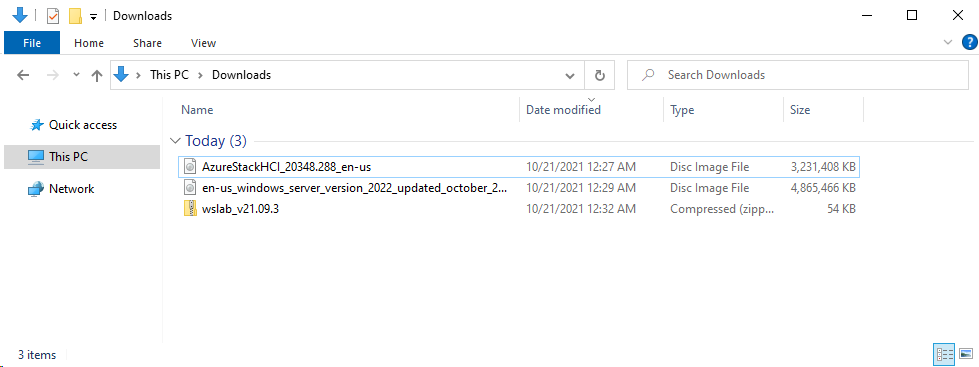

## Task 3 - Hydrate lab

**1.** Unzip files from downloaded zip into a folder on SSD, where is enough available space (at least 100GB)

**2.** Replace content of LabConfig.ps1 with following code. You can double-click the file to open it in Notepad.

```PowerShell
$LabConfig=@{ 
DomainAdminName='LabAdmin'; AdminPassword='LS1setup!'; DCEdition='4'}
 
```
> Above labconfig will create custom Domain Controller. Built on top of Windows Server Datacenter with GUI.


**3.** Right-click 1_Prereq.ps1 and select **Run with PowerShell**

    the script will automatically elevate. Allow it run as administrator

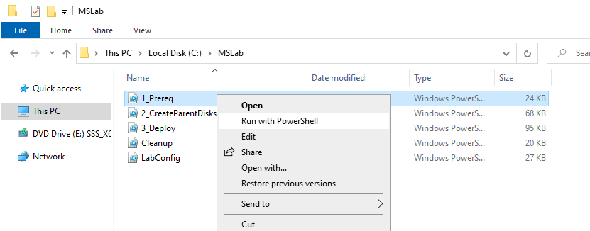

**4.** The script will finish. It will download necessary files and create folders. You can close PowerShell window now by pressing enter.

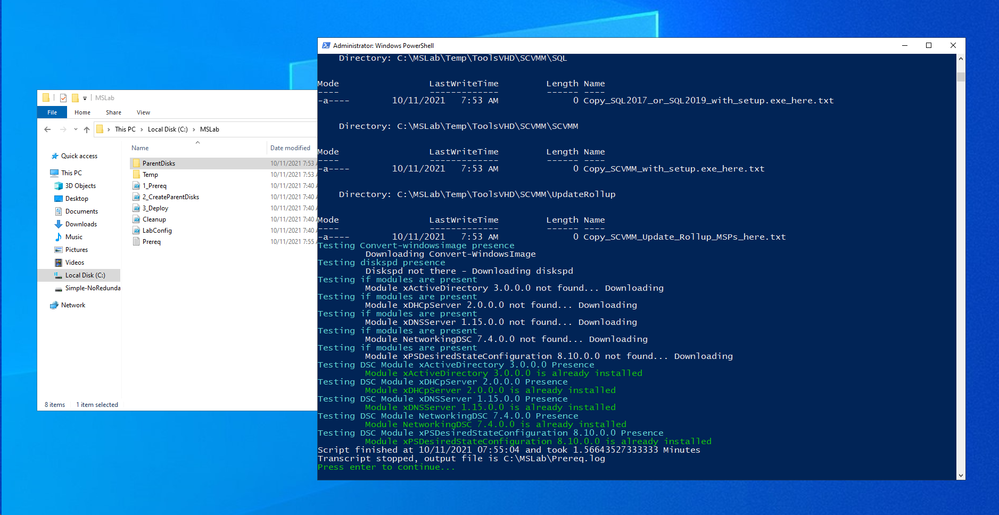

**5.** Right-click 2_CreateParentDisks.ps1 and select **Run with PowerShell**

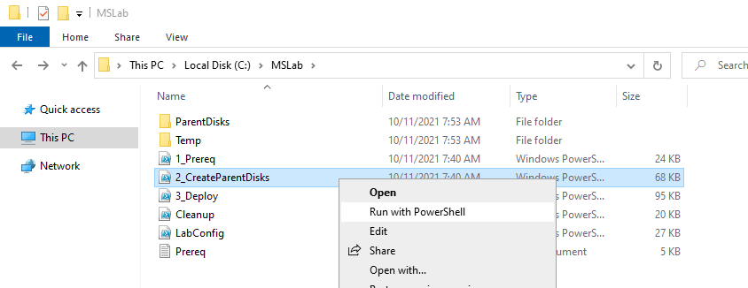

**6.** When asked for ISO file, choose Windows Server 2022


**7.** When asked for Windows Server Update (msu), click **cancel**

> Script will now create Domain Controller and Windows Server 2022 parent disks. It will take 15-30 minutes to finish. Once Finished, press Enter to close window (it will cleanup unnecessary files and folders).

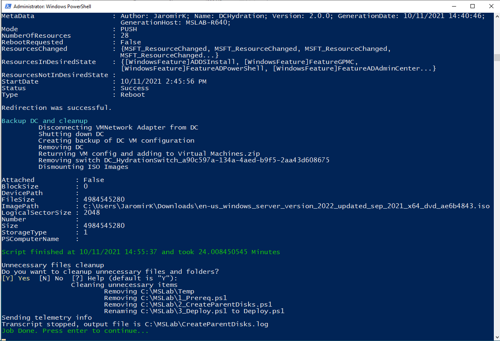

### Expected result

In MSLab folder you should see LAB and ParentDisks folder along with three PowerShell scripts and log files.

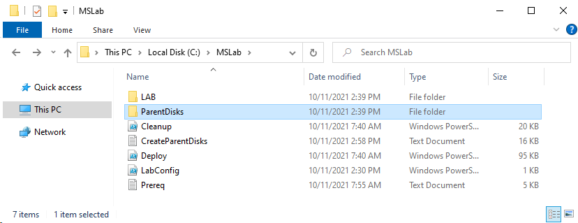

## Task 4 - Create Azure Stack HCI parent disk

**1.** Navigate to MSLab folder. In MSLab folder, open ParentDisks folder.

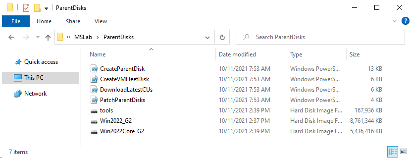

**2.** Right-click on CreateParentDisk.ps1 and select **Run with PowerShell**

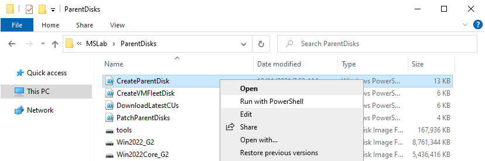

**3.** When asked for ISO file, select AzureStackHCI. Hit Cancel when asked for MSU package.

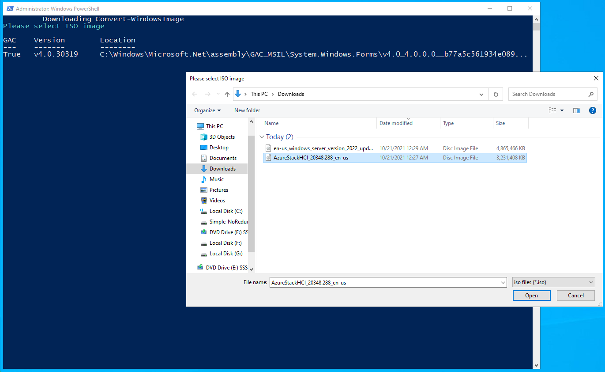

**4.** When asked for VHD Name and size, just hit enter.

> note: when creating Azure Stack HCI 22H2, you need to provide name manually, as version 22H2 is detected as 21H2 (version is detected from setup.exe, but it was not updated in 22H2)

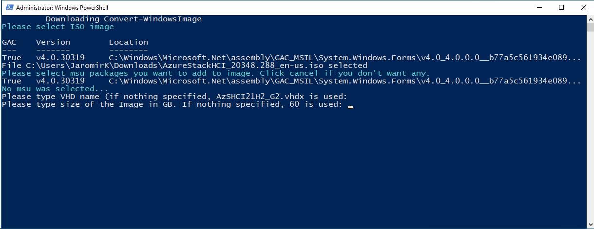

> Script will finish in few minutes. When done, press enter to close PowerShell window. Azure Stack HCI image will be created


### Expected result

Azure Stack HCI 21H2 (or 22H2) image will be created in ParentDisks folder.

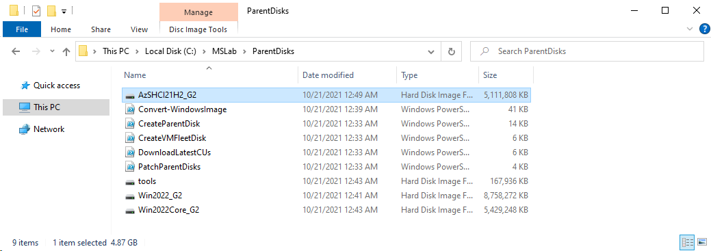