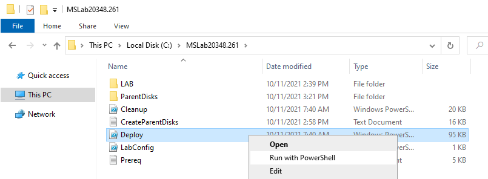
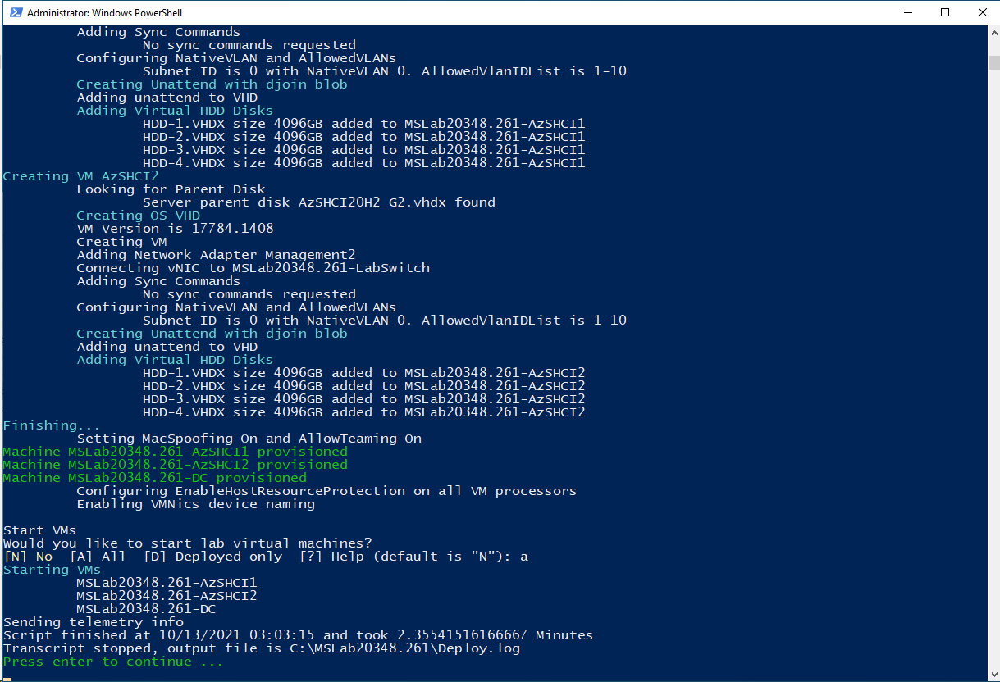
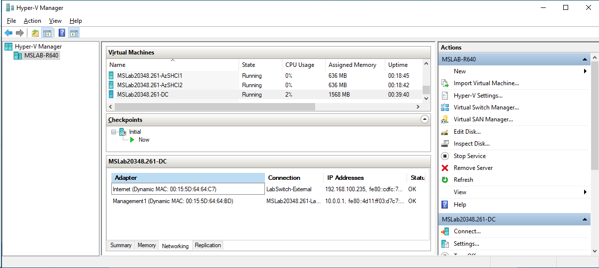
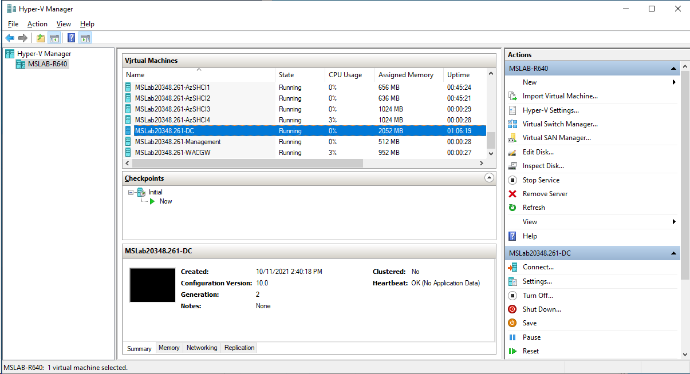
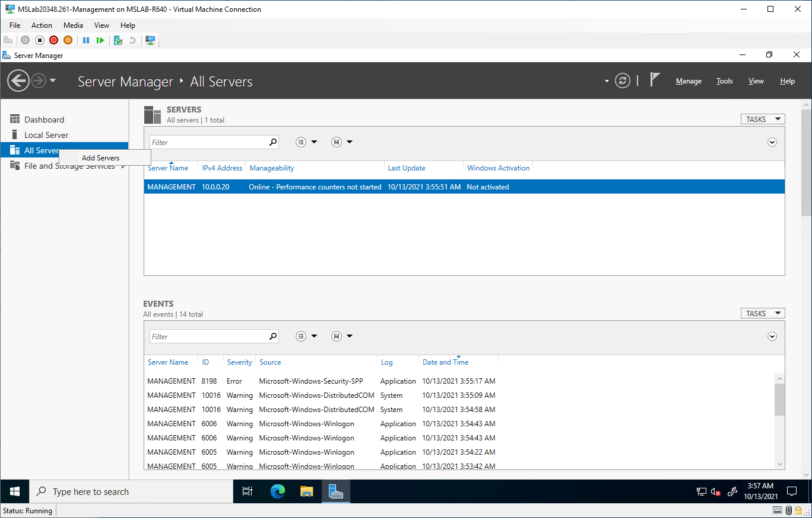
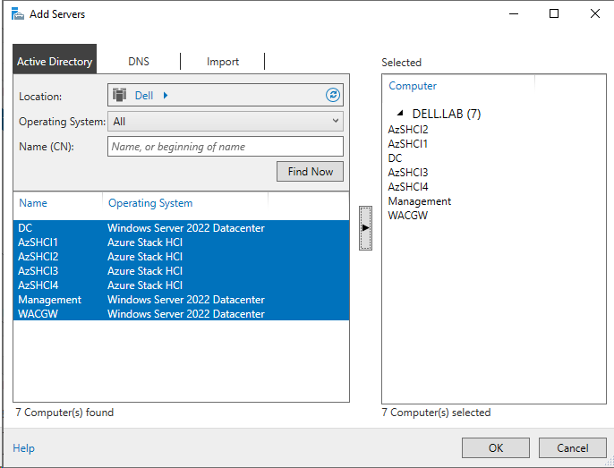
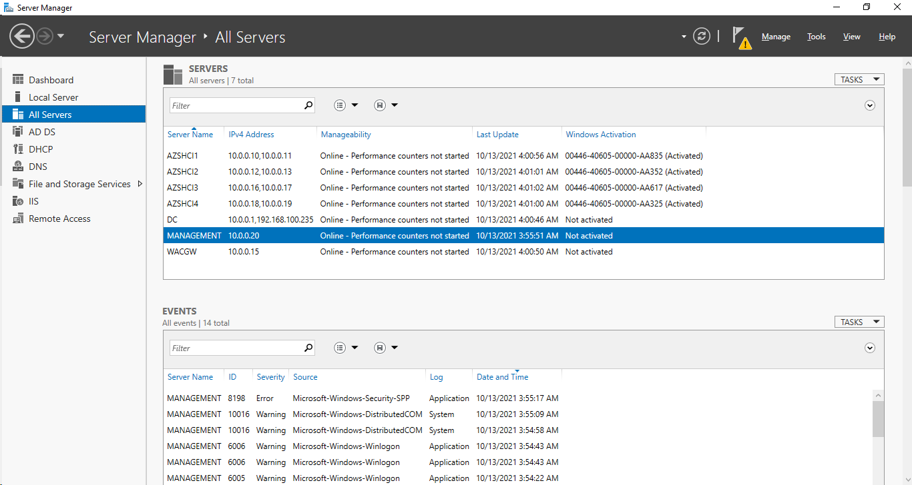
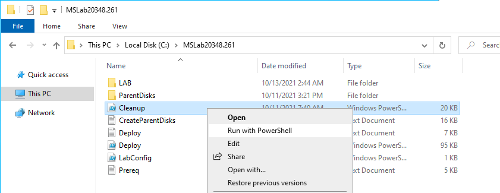
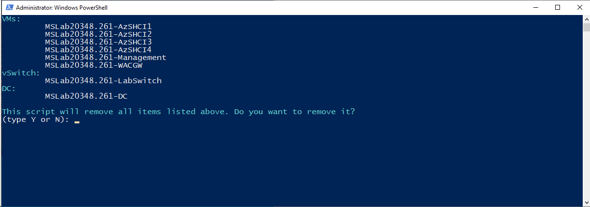

# Admin Lab 02 - Working with MSLab

<!-- TOC -->

- [Admin Lab 02 - Working with MSLab](#admin-lab-02---working-with-mslab)
    - [Prerequisites](#prerequisites)
    - [Working with LabConfig](#working-with-labconfig)
    - [Deploying](#deploying)
        - [Expected result](#expected-result)
    - [Connecting lab to internet](#connecting-lab-to-internet)
        - [Expected result](#expected-result)
    - [Adding more VMs](#adding-more-vms)
        - [Expected result](#expected-result)
    - [Explore the lab](#explore-the-lab)
        - [Expected result](#expected-result)
    - [Cleaning lab](#cleaning-lab)

<!-- /TOC -->

## Prerequisites

* Hydrated MSLab with LabConfig from [01-HydrateMSLab](admin-guides/01-HydrateMSLab/readme.md)

## Working with LabConfig

Before deploying lab, you should review what is in the labconfig. Let's start with the simplest example

> This labconfig contains only username and password for Domain Controller, so the script will be able to log in into DC

**1.** Navigate to MSLab folder, open LabConfig.ps1 and replace content with following code to deploy 2 Azure Stack HCI VMs, each with four 4TB HDDs.

```PowerShell
$LabConfig=@{ 
DomainAdminName='LabAdmin'; AdminPassword='LS1setup!' ; VMs=@()}

1..2 | ForEach-Object {$VMNames="AzSHCI"; $LABConfig.VMs += @{ VMName = "$VMNames$_" ; Configuration = 'S2D' ; ParentVHD = 'AzSHCI21H2_G2.vhdx'; HDDNumber = 4; HDDSize= 4TB ; MemoryStartupBytes= 1GB }}
 
```


> It is important to specify the same username, password as used in Labconfig during 2_CreateParentDisk.ps1. Otherwise Script will end up in loop trying to log in into DC, create VMs ... Prefix of the lab will be automatically added from name of the folder where MSLab is located, or it can be specified manually.

> It is also very useful to keep version of operating system in name of MSLab folder. Like "MSLab20348.261" where 20348 is major version of Windows Server 2022 and 261 is [update level](https://support.microsoft.com/en-us/topic/windows-server-2022-update-history-e1caa597-00c5-4ab9-9f3e-8212fe80b2ee#:~:text=%20Windows%20Server%202022%20update%20history%20%201,and%20messages.%20%205%20Troubleshooting.%20%20More%20).

## Deploying

**1.** Once LabConfig.ps1 content is replaced, right-click on Deploy.ps1 and select **Run With PowerShell**.



> The script will run and will import Domain Controller. It will create a snapshot (so later for cleanup it can be returned to previous state)

**2.** Once script will finish, you will be asked if you want to start VMs. Answer A to start all VMs.



### Expected result

You should now see all VMs in Hyper-V Manager with Prefix that matches folder name where MSLab is located.


## Connecting lab to internet

To connect lab to internet you need to specify this in LabConfig.ps1 by adding one more parameter - Internet=$true. It will connect DC to external switch (and will create one if there is no external switch or default switch in Windows Client OS). It will then install NAT into DC to provide connectivity for other VMs connected to lab.

**1.** Modify LabConfig.ps1 with following code

```PowerShell
$LabConfig=@{ Internet=$true; DomainAdminName='LabAdmin'; AdminPassword='LS1setup!'; VMs=@()}

1..2 | ForEach-Object {$VMNames="AzSHCI"; $LABConfig.VMs += @{ VMName = "$VMNames$_" ; Configuration = 'S2D' ; ParentVHD = 'AzSHCI21H2_G2.vhdx'; HDDNumber = 4; HDDSize= 4TB ; MemoryStartupBytes= 1GB }}
 
```

> you can also add parameter "UseHostDnsAsForwarder=$true" to use host DNS addresses. It's useful when access to public DNS Servers is blocked and you want to use your own. For more information check [LabConfig.ps1](https://github.com/microsoft/MSLab/blob/master/Scripts/LabConfig.ps1) in MSLab

**2.** Right-click on Deploy.ps1 and select **Run with PowerShell** to connect lab to internet

### Expected result

Domain Controller will be connected to external network.



## Adding more VMs

To add more VMs you can simply edit LabConfig.ps1 and add more records into $LabConfig.VMs

**1.** Open LabConfig.ps1 in notepad and add replace content with following code

```PowerShell
$LabConfig=@{ Internet=$true; DomainAdminName='LabAdmin'; AdminPassword='LS1setup!'; DomainNetbiosName="Dell"; DomainName="Dell.lab"; VMs=@()}

1..4 | ForEach-Object {$VMNames="AzSHCI"; $LABConfig.VMs += @{ VMName = "$VMNames$_" ; Configuration = 'S2D' ; ParentVHD = 'AzSHCI21H2_G2.vhdx'; HDDNumber = 4; HDDSize= 4TB ; MemoryStartupBytes= 1GB }}

$LabConfig.VMs += @{ VMName = 'Management' ; ParentVHD = 'Win2022_G2.vhdx' ; MGMTNICs=1 }

$LabConfig.VMs += @{ VMName = 'WACGW' ; ParentVHD = 'Win2022Core_G2.vhdx' ; MGMTNICs=1 }
 
```

**2.** Right-Click on Deploy.ps1 and select **Run with PowerShell** to expand the lab.

> as you might have noticed, the code will add 2 more nodes with the same config as previous machine just by modifying single digit. It will also add two more servers - one with Windows Server Core, and one with GUI that can be used as dedicated machine for management.

### Expected result



## Explore the lab

**1.** In Hyper-V Manager, right-click on Management and click on Connect


**2.** Log in with following credentials

> Username: LabAdmin

> Password: LS1setup!

**3.** In Server Manager, right-click on All Servers and click on Add Servers



**4.** In Add Servers window click on Find Now, select all servers and add servers by clicking on arrow between found computers window and selected window. Click OK to close window.



### Expected result

You can see that all servers are domain joined and reachable from Management machine. 



## Cleaning lab

Cleaning lab is simple process. Cleanup.ps1 will remove all VMs and resources (Hyper-V switch) with lab prefix. Since lab prefix was not configured in labconfig, script will use folder name.

**1.** Right-click on Cleanup.ps1 and select "Run with PowerShell"



**2.** The script will run and ask you if you want to clean the lab. Type **Y** to confirm cleaning lab



**3.** The MSLab folder will now be in original state - before you ran Deploy.ps1. This way You can deploy and destroy your lab anytime in very short timeframe.