# Network configuration

<!-- TOC -->

- [Network configuration](#network-configuration)
    - [Introduction](#introduction)
        - [Universal Configuration](#universal-configuration)
        - [Advanced Configuration](#advanced-configuration)
    - [Configuring the switch](#configuring-the-switch)
    - [Checking where is port connected to using LLDP](#checking-where-is-port-connected-to-using-lldp)
    - [Advanced LLDP information - DCBX](#advanced-lldp-information---dcbx)
    - [Capture data with PSDiscoveryProtocol and explore with WireShark](#capture-data-with-psdiscoveryprotocol-and-explore-with-wireshark)

<!-- /TOC -->

## Introduction

Dell Switches (in this example we will talk about S5212F-ON) are relative simple to configure - via SSH. In our examples we will talk about two configurations - Universal and Advanced. For simplicity we will assume only Converged setup, where VMs,Management and Storage traffic will be handled with the same network adapter.

This network configuration also assumes, you are using NetworkATC without any overrides. Therefore VLANs for SMB Direct traffic will be configured as 711-718. It will also assume, that Management VLAN is configured as Access (native). In this example is Management VLAN 700 (but can be adjusted). For tenant VMs there is an example with VLANs 200-210.

This is simplified guide, therefore there is no configuration for SDN.

### Universal Configuration

This config is designed to be bulletproof, and universal. It assumes aggregate switches connected 10/25Gbps ports. It also does not matter if someone will connect some servers NIC Port1 to TOR1 and some to TOR2. As result, VLTi connection can host SMB Direct communication (as if connected correctly, there would be zero traffic, but can be quite utilized if half of servers are connected Port1 <-> TOR2 / Port2 <-> TOR1). Since there is enough capacity, TOR will allow all storage VLANs to communicate on both switches.

* [TOR1- S5212F-ON Universal Configuration](./media/S5212F-ON-TOR1-Universal.cfg)
* [TOR2- S5212F-ON Universal Configuration](./media/S5212F-ON-TOR2-Universal.cfg)

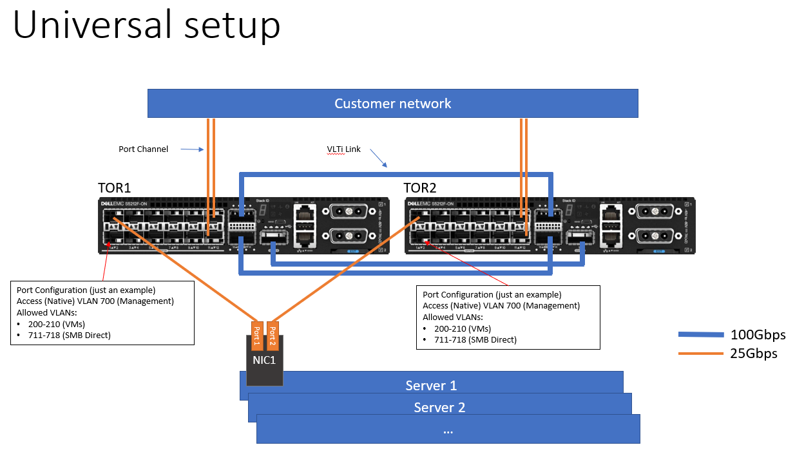

### Advanced Configuration

This configuration assumes you/customer is using 100/200Gbps ports in aggregate switches. As S5212F has 3x100Gbps ports, two will be used for North-South communication and only one 100Gbps connection will be for East-West (as if not connected correctly, host will not communicate as odd VLANs are available only on TOR1 and even VLANs are on TOR2). The only traffic that could use VLTi is from VMs and it will flow only if one TOR switch will loose connectivity to Aggregate switches. On the picture are four ports connected (two NICs), but it also can be just one NIC (two ports).

* [TOR1- S5212F-ON Advanced Configuration](./media/S5212F-ON-TOR1-Advanced.cfg)
* [TOR2- S5212F-ON Advanced Configuration](./media/S5212F-ON-TOR2-Advanced.cfg)


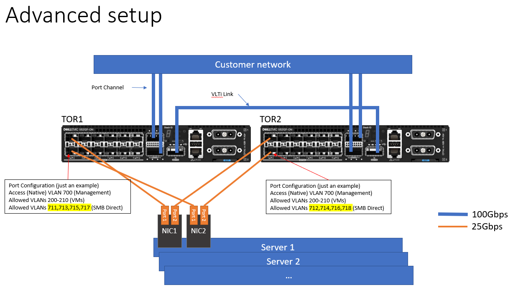

## Configuring the switch

Switches can be managed with SSH with default username/password admin/admin. You can simply open PowerShell and type **ssh admin@IPADDRESS** to connect to switch.

```config
 ssh admin@IPADDRESS
 
```

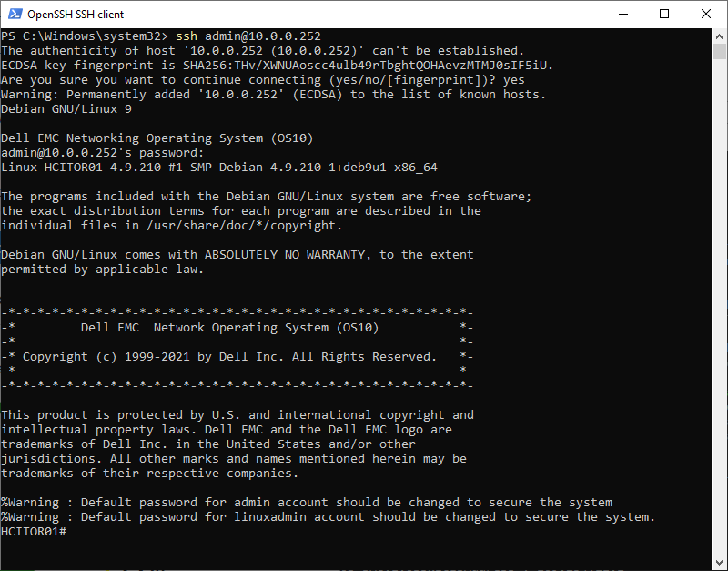

There are just few things you need to know and it is how to enter configuration mode - command **configure terminal**, or just **conf**

```config
configure terminal

```
 
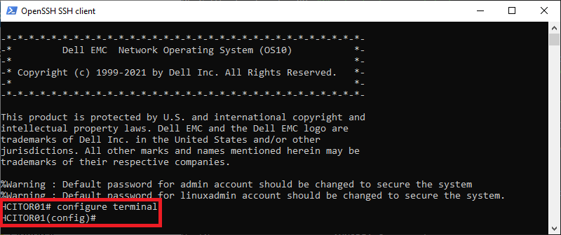

To display running configuration, you have to exit from config mode by typing **exit** and then you can type **show running-configuration** to display configuration.

```config
exit
show running-configuration
 
```

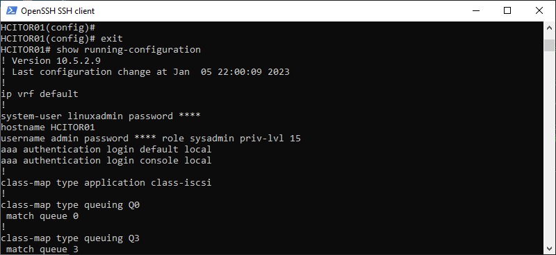

In case you don't like holding key to display entire configuration, you can type  **show running-configuration | no-more**

```config
show running-configuration | no-more
 
```

To save configuration (so it will not be rewritten after reboot) you need to copy configuration into startup-configuration

```config
copy running-configuration startup-configuration
 
```

## Checking where is port connected to using LLDP

In following example we will use [PSDiscoveryProtocol](https://github.com/lahell/PSDiscoveryProtocol) to display LLDP information. It will collect packets and process it to display it. You can run it from management machine against your cluster nodes. 

Unfortunately it works only if physical adapters are not in the Virtual Switch.

```PowerShell
Install-Module -Name PSDiscoveryProtocol -Force
 
```

You collect information using this command

```Powershell
$Servers="Axnode1","Axnode2","Axnode3","Axnode4"

$Packet = Invoke-DiscoveryProtocolCapture -Type LLDP -ComputerName $Servers
Get-DiscoveryProtocolData -Packet $Packet
 
```

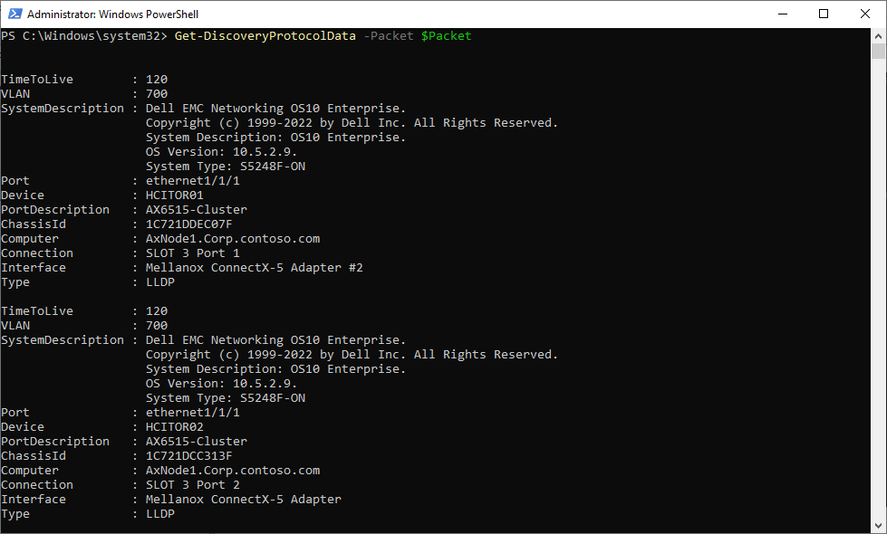

> As you can notice, you can see switch OS Version (10.5.2.9), model (S5248F-ON) and where is each port connected to (SLOT 3 PORT 1 <-> ethernet1/1/1 on HCITOR01)

You can also run same as above like this, with output into the out-gridview

```PowerShell
$Servers="Axnode1","Axnode2","Axnode3","Axnode4"

Invoke-DiscoveryProtocolCapture -Type LLDP -ComputerName $Servers | Get-DiscoveryProtocolData | Out-GridView
 
```

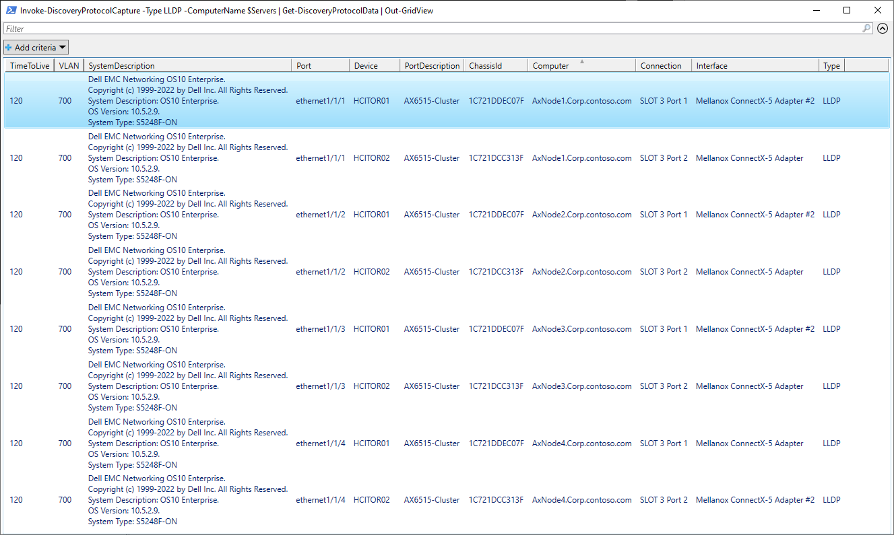

## Advanced LLDP information - DCBX

It is also possible to collect information about the physical switch if from LLDP packet capture (using PSDiscoveryProtocol) if ports are configured with either IEEE od CEE https://www.dell.com/support/manuals/no-no/smartfabric-os10-emp-partner/smartfabric-os-user-guide-10-5-4/dcbx-version?guid=guid-466ba5ec-7ecd-4d5a-9a34-dd508619d67b&lang=en-us

```PowerShell
configure terminal
interface range ethernet1/1/1-1/1/12
dcbx version ieee
 
```

After above is configured, you will be able to see DCBX information in LLDP packets using following code.

```PowerShell
$Servers="Axnode1","Axnode2","Axnode3","Axnode4"

$Packet = Invoke-DiscoveryProtocolCapture -Type LLDP -ComputerName $Servers
Get-DiscoveryProtocolData -Packet $Packet | ConvertTo-Json -Depth 4
 
```

IEEE

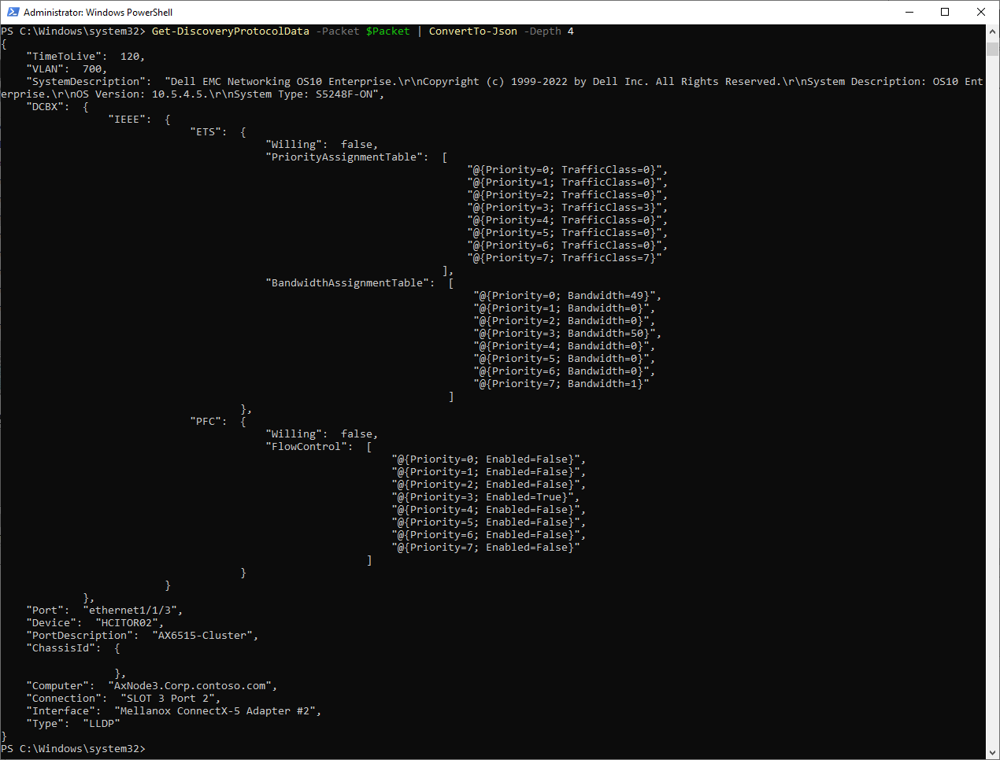

CEE

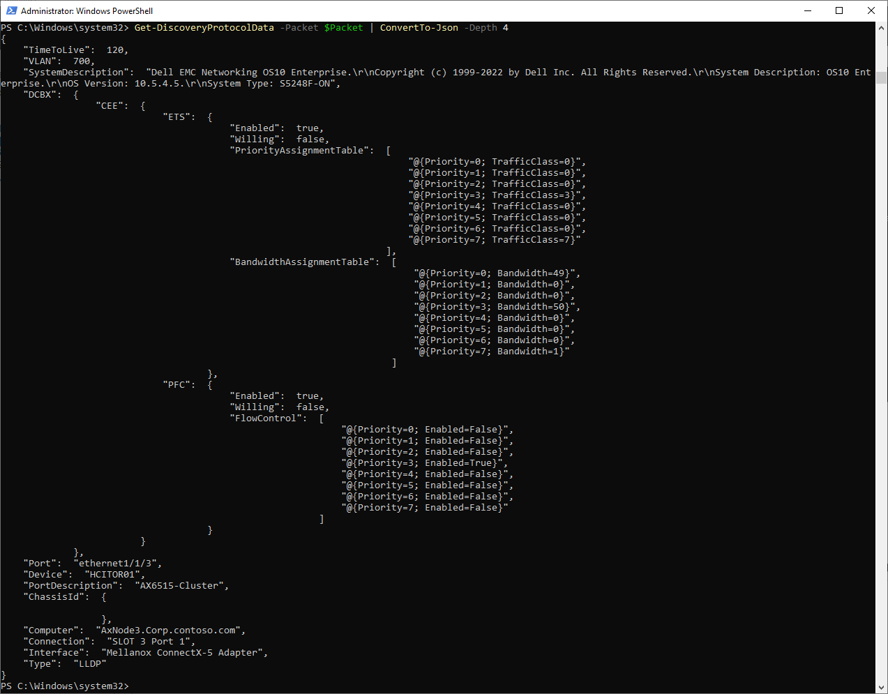

## Capture data with PSDiscoveryProtocol and explore with WireShark

I you want to see raw information captured with PSDiscoveryProtocol, you can export packets into the pcap and explore with [wireshark](https://www.wireshark.org/)

```Powershell
$Servers="Axnode1","Axnode2","Axnode3","Axnode4"

$Packet = Invoke-DiscoveryProtocolCapture -Type LLDP -ComputerName $Servers
$Packet | Export-Pcap -Path $env:USERNAME\Downloads\LLDPCapture.pcap
 
```

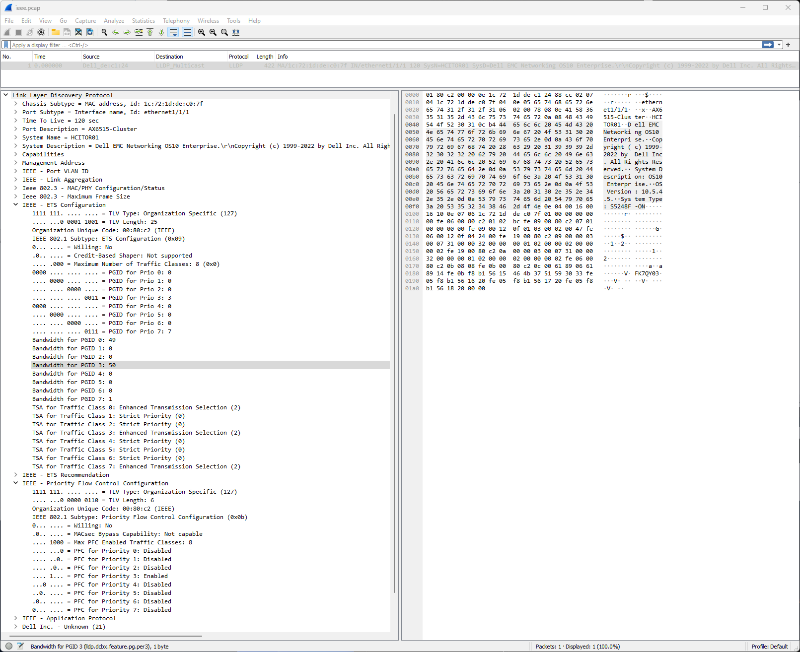

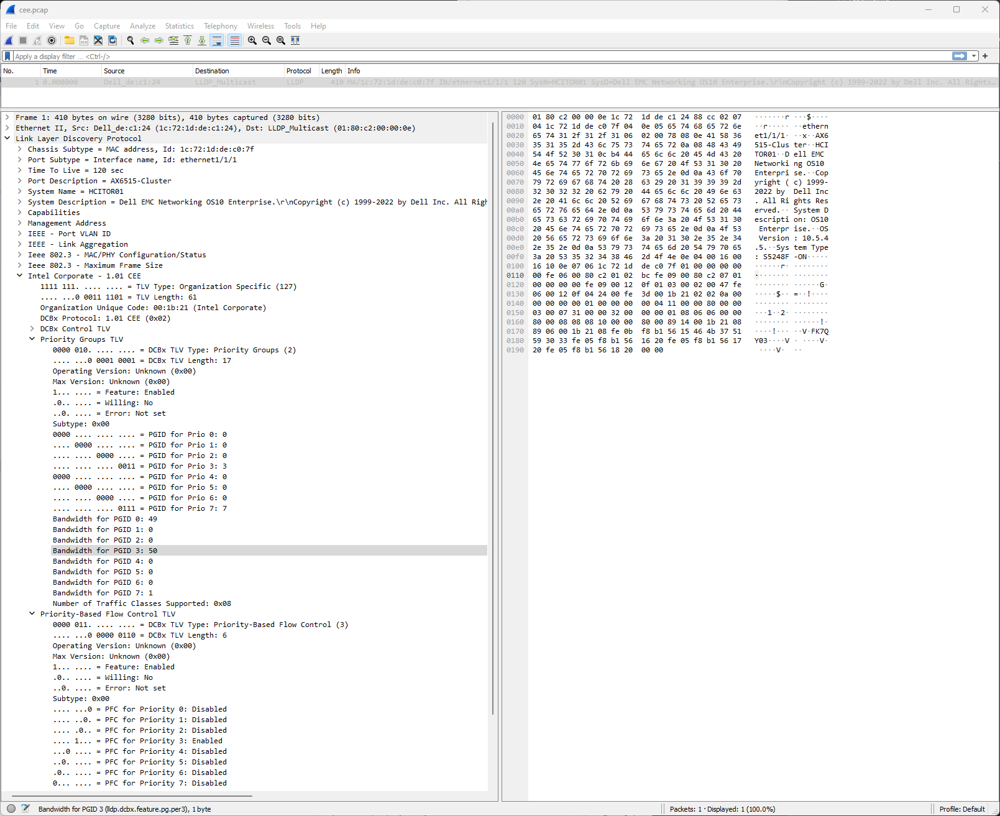

I also made pcaps available here: [cee](./media/cee.pcap) and [ieee](./media/ieee.pcap)