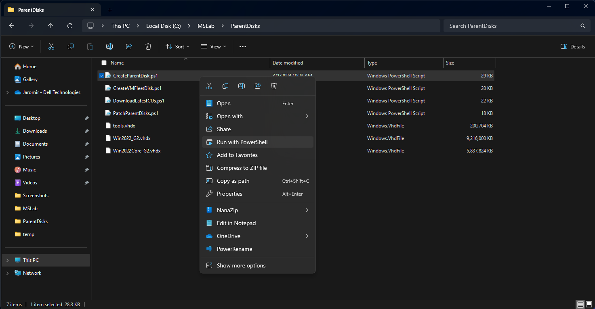
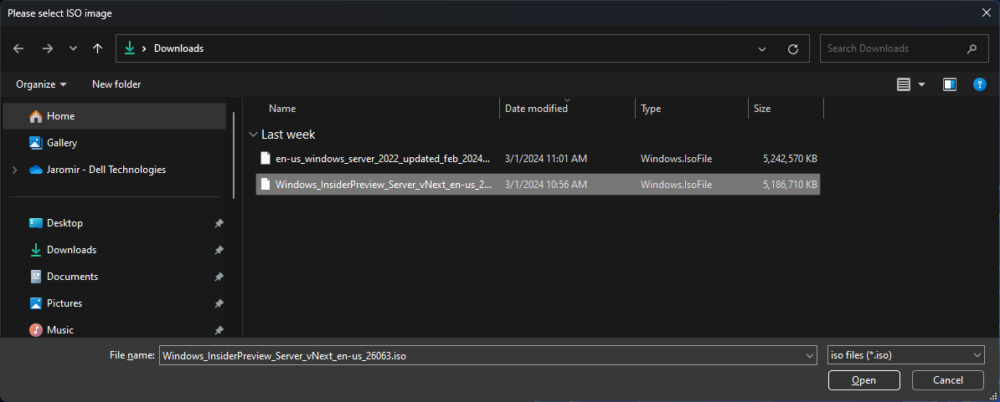
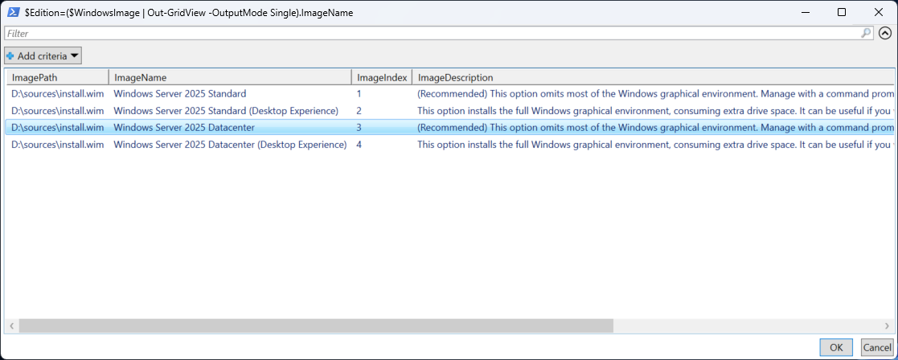
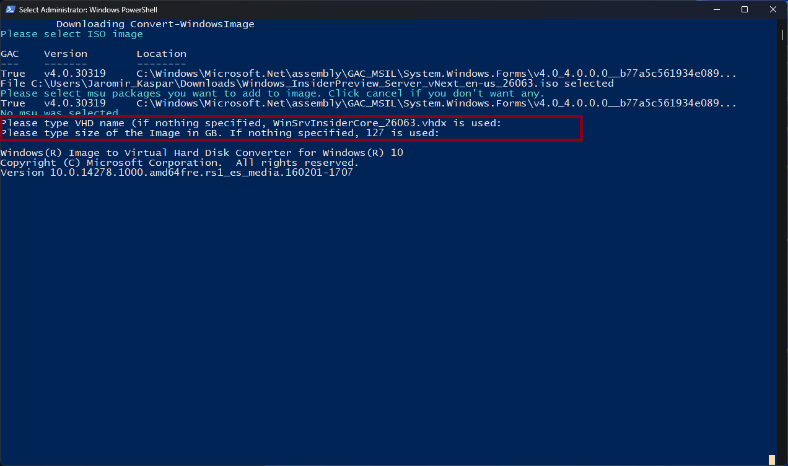
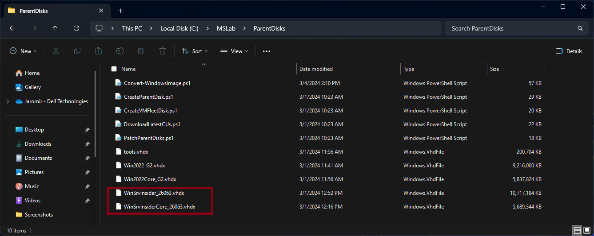
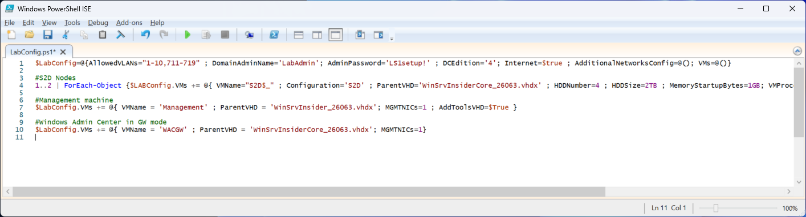

# Admin Lab 06 - How to create Windows Server Insider VHD

<!-- TOC -->

- [Admin Lab 06 - How to create Windows Server Insider VHD](#admin-lab-06---how-to-create-windows-server-insider-vhd)
    - [Prerequisites](#prerequisites)
    - [Understanding tools](#understanding-tools)
    - [Create Windows Server Insider VHDx](#create-windows-server-insider-vhdx)
    - [Modify LabConfig.ps1](#modify-labconfigps1)

<!-- /TOC -->

To create Windows Server 2025 Insider preview VHD you will need ISO file. Both ISO and VHD can be downloaded from [Windows Server Insider Preview landing page](https://www.microsoft.com/en-us/software-download/windowsinsiderpreviewserver), however I would recommend creating your own VHD as VHD contains only one version of four available in ISO, you cant specify size and it's larger as it's not compressed (unlike WIM file located in ISO).

To create parent disk, there's a tool in MSLab called "CreateParentDisk.ps1". It uses modified script to convert windows image [(convert-windowsimage.ps1) created by Artem Pronichkin](https://github.com/MicrosoftDocs/Virtualization-Documentation/tree/main/hyperv-tools/Convert-WindowsImage). This tool simply copies WIM content to newly created bootable VHD.

While you could already create entire lab from Windows Server 2025, in current version (26063) imported DC will never start (known bug).

## Create Windows Server Insider VHDx

To create VHD, simply navigate into ParentDisk folder located under your MSLab directory. Simply right-click on CreateParentDisk.ps1 and select "Run with Powershell"




PowerShell script will automatically download convert-windowsimage.ps1 from MSLab tools, and will ask you for ISO. Select Insider Preview ISO and click on Open.



You will be asked if you want to add MSU (windows server update package). Simply click on Cancel

Another window will pop up asking you to select Windows Server Image. Select image of your choice and click OK.



Last step is to provide image name and size. You can simply hit enter twice to use default names.



Once finished, you can repeat process to create additional images.

As result, you will have additional VHD images you can use in MSLab.



## Modify LabConfig.ps1

To deploy VMs using images create in step above, you need to modify MSLab Labconfig. Simply navigate to MSLab folder and edit LabConfig.ps1 in PowerShell ISE (right-click, edit)

> In Windows 11 you need to right-click on LabConfig.ps1, select "Show more options" and then "edit"



Notice Windows Server Insider VHD names in configuration. Following labconfig is just an example to create S2D Lab where is one extra VM for management and another one for Windows Admin Center Gateway.

```PowerShell
$LabConfig=@{AllowedVLANs="1-10,711-719" ; DomainAdminName='LabAdmin'; AdminPassword='LS1setup!' ; DCEdition='4'; Internet=$true ; AdditionalNetworksConfig=@(); VMs=@()}

#S2D Nodes
1..2 | ForEach-Object {$LABConfig.VMs += @{ VMName="S2D$_" ; Configuration='S2D' ; ParentVHD='WinSrvInsiderCore_26063.vhdx' ; HDDNumber=4 ; HDDSize=2TB ; MemoryStartupBytes=1GB; VMProcessorCount=4 ; vTPM=$true}}

#Management machine
$LabConfig.VMs += @{ VMName = 'Management' ; ParentVHD = 'WinSrvInsider_26063.vhdx'; MGMTNICs=1 ; AddToolsVHD=$True }

#Windows Admin Center in GW mode
$LabConfig.VMs += @{ VMName = 'WACGW' ; ParentVHD = 'WinSrvInsiderCore_26063.vhdx'; MGMTNICs=1}

```