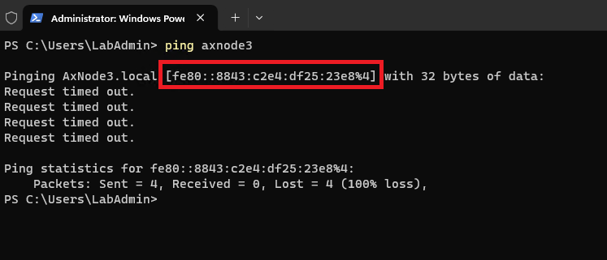
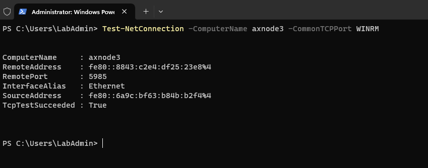
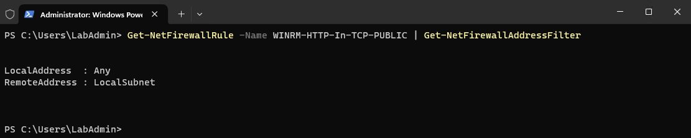
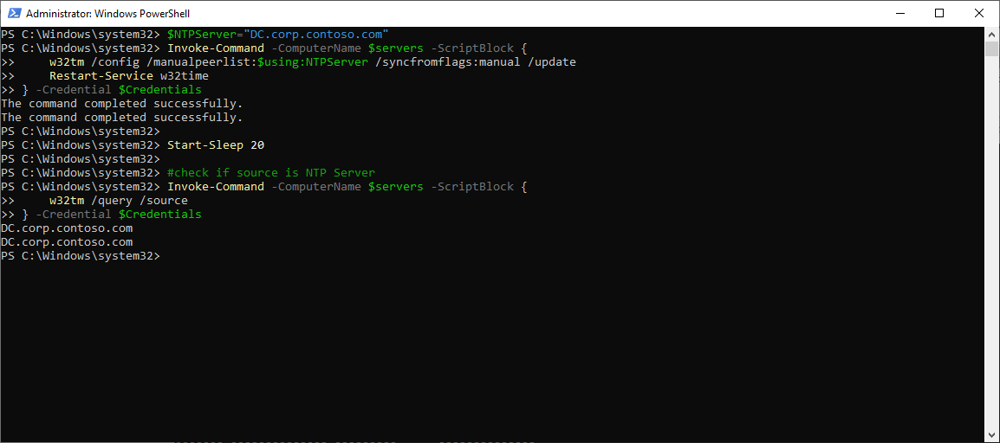
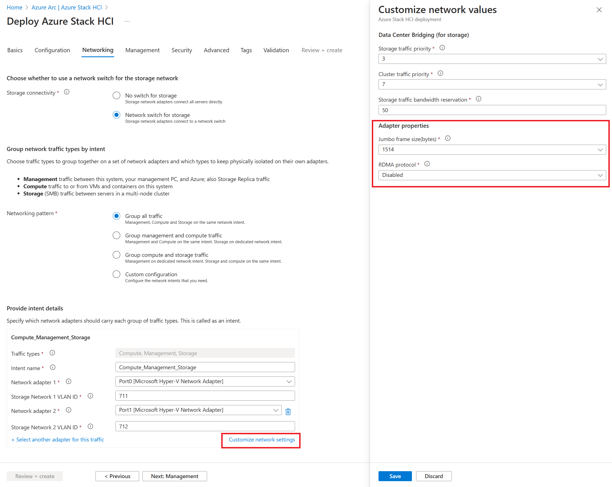

# Deploy Azure Stack HCI Cluster 23H2 using Cloud Based Deployment

<!-- TOC -->

- [Deploy Azure Stack HCI Cluster 23H2 using Cloud Based Deployment](#deploy-azure-stack-hci-cluster-23h2-using-cloud-based-deployment)
    - [About the lab](#about-the-lab)
    - [Prerequisites](#prerequisites)
    - [LabConfig](#labconfig)
    - [Task01 - Prepare Active Directory](#task01---prepare-active-directory)
    - [Task02 - Prepare Azure](#task02---prepare-azure)
    - [Task03 - Test Connectivity to Azure Stack HCI Nodes](#task03---test-connectivity-to-azure-stack-hci-nodes)
    - [Task04 - Prepare Azure Stack HCI nodes for Cloud Deployment](#task04---prepare-azure-stack-hci-nodes-for-cloud-deployment)
    - [Task03 - Add some final touches before launching cloud deployment from portal](#task03---add-some-final-touches-before-launching-cloud-deployment-from-portal)
    - [Task04 - Perform Azure Stack HCI deployment from Azure Portal](#task04---perform-azure-stack-hci-deployment-from-azure-portal)
    - [Task05 - Monitor Deployment Progress](#task05---monitor-deployment-progress)

<!-- /TOC -->
<!-- /TOC -->

## About the lab

In this lab you will deploy 2 node Azure Stack HCI cluster using [cloud deployment](https://learn.microsoft.com/en-us/azure-stack/hci/whats-new#cloud-based-deployment). Since this is public preview, the process will likely to change as there is room to improve.

The lab is based on [AzSHCI and Cloud Based Deployment](https://github.com/microsoft/MSLab/tree/master/Scenarios/AzSHCI%20and%20Cloud%20Based%20Deployment) MSLab scenario.

You can also deploy physical machines with [MDT](../../admin-guides/03-DeployPhysicalServersWithMSLab/readme.md). In this guide you will also see notes for physical environment.

You can deploy physical machines with simple click-next-next from ISO. Make sure correct OS disk is selected and if DHCP is not available, configure an IP address and rename computers.

> Cloud Deployment is now supported on AX nodes.

## Prerequisites

* Hydrated MSLab with LabConfig from [01-HydrateMSLab](../../admin-guides/01-HydrateMSLab/readme.md)

* Understand [how MSLab works](../../admin-guides/02-WorkingWithMSLab/readme.md)

* Make sure you hydrate Azure Stack HCI 23H2 VHD using CreateParentDisk.ps1 located in ParentDisks folder

* Note: this lab uses ~50GB RAM. To reduce amount of RAM, you would need to reduce number of nodes.

## LabConfig

Below LabConfig will deploy 4 nodes for Azure Stack HCI 23H2 that are not domain joined.

You can notice, that there are VLANs 711-719.

```PowerShell
$LabConfig=@{AllowedVLANs="1-10,711-719" ; DomainAdminName='LabAdmin'; AdminPassword='LS1setup!' ; DCEdition='4'; Internet=$true; TelemetryLevel='Full' ; TelemetryNickname='' ; AdditionalNetworksConfig=@(); VMs=@()}

#Azure Stack HCI 23H2
#labconfig will not domain join VMs
1..2 | ForEach-Object {$LABConfig.VMs += @{ VMName = "ASNode$_" ; Configuration = 'S2D' ; ParentVHD = 'AzSHCI23H2_G2.vhdx' ; HDDNumber = 4 ; HDDSize= 2TB ; MemoryStartupBytes= 20GB; VMProcessorCount="MAX" ; vTPM=$true ; Unattend="NoDjoin" ; NestedVirt=$true }}

#Windows Admin Center in GW mode
$LabConfig.VMs += @{ VMName = 'WACGW' ; ParentVHD = 'Win2022Core_G2.vhdx'; MGMTNICs=1}

#Management machine
$LabConfig.VMs += @{ VMName = 'Management' ; ParentVHD = 'Win2022_G2.vhdx'; MGMTNICs=1 ; AddToolsVHD=$True }
 
```

Deployment result


## Task01 - Prepare Active Directory

In this task you will create objects in Active Directory. Group Managed Service accounts are no longer created, KDC is no longer needed.

This task will be performed in elevated powershell window in Management machine


**Step 1** Login into Management machine and run following code in elevated PowerShell window to Provide variables and install required PowerShell modules

> as you can see, since there will be organization unit created and in current iteration is one OU per cluster, prefix and OU name will match cluster name

> you can also notice, that there is an account for deployment being created. It will be used once 

```PowerShell
$AsHCIOUName="OU=ASClus01,DC=Corp,DC=contoso,DC=com"
#$Servers="ASNode1","ASNode2"
#$DomainFQDN=$env:USERDNSDOMAIN
#$ClusterName="ASClus01"
#$Prefix="ASClus01"
$LCMUserName="ASClus01-LCMUser"
$LCMPassword="LS1setup!LS1setup!"
$SecuredPassword = ConvertTo-SecureString $LCMPassword -AsPlainText -Force
$LCMCredentials= New-Object System.Management.Automation.PSCredential ($LCMUserName,$SecuredPassword)

#install posh module for prestaging Active Directory
Install-PackageProvider -Name NuGet -Force
Install-Module AsHciADArtifactsPreCreationTool -Repository PSGallery -Force
 
```
**Step 2** Populate objects into Active Directory

> note: since 2402 release is just OU and LCM user deployed and GPO inheritance blocked on OU

```PowerShell
    #make sure active directory module and GPMC is installed
    Install-WindowsFeature -Name RSAT-AD-PowerShell,GPMC

    #populate objects
    New-HciAdObjectsPreCreation -AzureStackLCMUserCredential $LCMCredentials -AsHciOUName $AsHCIOUName
 
```


**Step 3** Install additional features to be able explore cluster and settings once it's created

```PowerShell
    #install management features to explore cluster,settings...
    Install-WindowsFeature -Name "RSAT-ADDS","RSAT-Clustering"
 
```

Keep the PowerShell window open for the next task

## Task02 - Prepare Azure

**Step 1** Populate variables, log in into azure using Device Authentication and select subscription

> You will be requested to enter code into the browser. I find this the most secure way to log in - as you can log in in another machine - your machine you trust.

> Note: you might need to disable WAM https://learn.microsoft.com/en-us/powershell/azure/authenticate-interactive?view=azps-12.0.0#disable-wam as tenantID has to be specified by default (Update-AzConfig -EnableLoginByWam $false)

```PowerShell
$ResourceGroupName="ASClus01-RG"
$Location="eastus"

#login to azure
    #download Azure module
    Install-PackageProvider -Name NuGet -MinimumVersion 2.8.5.201 -Force
    if (!(Get-InstalledModule -Name az.accounts -ErrorAction Ignore)){
        Install-Module -Name Az.Accounts -Force 
    }
    #login
    Connect-AzAccount -UseDeviceAuthentication

    #assuming new az.accounts module was used and it asked you what subscription to use - then correct subscription is selected for context
    $Subscription=(Get-AzContext).Subscription

```

**Step 2** Install PowerShell module and create Resource Group

```PowerShell
#install az resources module
    if (!(Get-InstalledModule -Name az.resources -ErrorAction Ignore)){
        Install-Module -Name az.resources -Force
    }

#create resource group
    if (-not(Get-AzResourceGroup -Name $ResourceGroupName -ErrorAction Ignore)){
        New-AzResourceGroup -Name $ResourceGroupName -Location $location
    }
 
```

## Task03 - Test Connectivity to Azure Stack HCI Nodes

**Step 1** Test name resulution works with simple ping

> If name resolution does not work, simply add IPs to hosts file  you can even use [Host File Editor](https://learn.microsoft.com/en-us/windows/powertoys/hosts-file-editor)



Notice, that host is not replying. That's normal as Windows Firewall does not allow ping. Important is that Name is translated into IP Address.

**Step 2** Test if WINRM works (for PowerShell remoting)



> If WINRM fails and if your management is in different subnet, Windows Firewall is by default configured to accept connections on localsubnet only



> you can modify it by running following code on every node (any, or just some IP address/range)

```Powershell
Get-NetFirewallRule -Name WINRM-HTTP-In-TCP-PUBLIC | Get-NetFirewallAddressFilter | Set-NetFirewallAddressFilter -RemoteAddress Any
 
```

## Task04 - Prepare Azure Stack HCI nodes for Cloud Deployment

This task will install Arc agent, Arc extensions and will set RBAC roles to ARC Objects. It will also install Environmental checker, so cloud deployment will be able to kick off validation

**Step 1** Populate variables and trusted hosts

> In this step we will also configure trusted hosts to be able to send credentials to non-domain joined machines

```PowerShell
$Servers="ASNode1","ASNode2"
$ResourceGroupName="ASClus01-RG"
$TenantID=(Get-AzContext).Tenant.ID
$SubscriptionID=(Get-AzContext).Subscription.ID
$Location="eastus"
$Cloud="AzureCloud"

#Since machines are not domain joined, let's do some preparation
$UserName="Administrator"
$Password="LS1setup!"
$SecuredPassword = ConvertTo-SecureString $password -AsPlainText -Force
$Credentials= New-Object System.Management.Automation.PSCredential ($UserName,$SecuredPassword)

#configure trusted hosts to be able to communicate with servers (not secure)
$TrustedHosts=@()
$TrustedHosts+=$Servers
Set-Item WSMan:\localhost\Client\TrustedHosts -Value $($TrustedHosts -join ',') -Force
 
```

**Step 1** Wipe existing data on Data disks (applicable to physical hardware only as MSLab deploys clean disks).

> If Disks are not wiped (contains spaces), validation will fail in "Azure Stack HCI Hardware" step.

```PowerShell
Invoke-Command -ComputerName $Servers -ScriptBlock {
    $disks=Get-Disk | Where-Object IsBoot -eq $false
    $disks | Set-Disk -IsReadOnly $false
    $disks | Set-Disk -IsOffline $false
    $disks | Clear-Disk -RemoveData -RemoveOEM -Confirm:0
    $disks | get-disk | Set-Disk -IsOffline $true
} -Credential $Credentials
 
```

**Step 2** Install features and cumulative updates

> In deployment guide was mentioned, that Hyper-V should be installed and also ICMP should be enabled. We will enable ICMP by simply installing failover clustering role (that would be installed later anyway). It will automatically enable all Cluster firewall rules, that will also allow ICMP firewall rule.

> Below code is using virtual account to kick off deployment of updates via COM. With virtual account it will be ran under with local system account instead of user account. If I would use user account remotely, it would fail.

> Cumulative updates are optional, but highly recommended. I saw some issues when enabling s2d.

```PowerShell
Invoke-Command -ComputerName $servers -ScriptBlock {
    Enable-WindowsOptionalFeature -FeatureName Microsoft-Hyper-V -Online -NoRestart
    Install-WindowsFeature -Name Failover-Clustering
} -Credential $Credentials

#region update all servers
    Invoke-Command -ComputerName $servers -ScriptBlock {
        New-PSSessionConfigurationFile -RunAsVirtualAccount -Path $env:TEMP\VirtualAccount.pssc
        Register-PSSessionConfiguration -Name 'VirtualAccount' -Path $env:TEMP\VirtualAccount.pssc -Force
    } -ErrorAction Ignore -Credential $Credentials
    #sleep a bit
    Start-Sleep 2
    # Run Windows Update via ComObject.
    Invoke-Command -ComputerName $servers -ConfigurationName 'VirtualAccount' -ScriptBlock {
        $Searcher = New-Object -ComObject Microsoft.Update.Searcher
        $SearchCriteriaAllUpdates = "IsInstalled=0 and DeploymentAction='Installation' or
                                IsInstalled=0 and DeploymentAction='OptionalInstallation' or
                                IsPresent=1 and DeploymentAction='Uninstallation' or
                                IsInstalled=1 and DeploymentAction='Installation' and RebootRequired=1 or
                                IsInstalled=0 and DeploymentAction='Uninstallation' and RebootRequired=1"
        $SearchResult = $Searcher.Search($SearchCriteriaAllUpdates).Updates
        if ($SearchResult.Count -gt 0){
            $Session = New-Object -ComObject Microsoft.Update.Session
            $Downloader = $Session.CreateUpdateDownloader()
            $Downloader.Updates = $SearchResult
            $Downloader.Download()
            $Installer = New-Object -ComObject Microsoft.Update.Installer
            $Installer.Updates = $SearchResult
            $Result = $Installer.Install()
            $Result
        }
    } -Credential $Credentials
    #remove temporary PSsession config
    Invoke-Command -ComputerName $servers -ScriptBlock {
        Unregister-PSSessionConfiguration -Name 'VirtualAccount'
        Remove-Item -Path $env:TEMP\VirtualAccount.pssc
    }  -Credential $Credentials
#endregion
 
```

**Step 3** Install Dell Drivers

```PowerShell
$DSUDownloadFolder="$env:USERPROFILE\Downloads\DSU"

#Set up web client to download files with autheticated web request
$WebClient = New-Object System.Net.WebClient
#$proxy = new-object System.Net.WebProxy
$proxy = [System.Net.WebRequest]::GetSystemWebProxy()
$proxy.Credentials = [System.Net.CredentialCache]::DefaultCredentials
#$proxy.Address = $proxyAdr
#$proxy.useDefaultCredentials = $true
$WebClient.proxy = $proxy

#Download DSU
#https://github.com/DellProSupportGse/Tools/blob/main/DART.ps1
#download latest DSU to Downloads
    $LatestDSU="https://dl.dell.com/FOLDER10889507M/1/Systems-Management_Application_RPW7K_WN64_2.0.2.3_A00.EXE"
    if (-not (Test-Path $DSUDownloadFolder -ErrorAction Ignore)){New-Item -Path $DSUDownloadFolder -ItemType Directory}
    #Start-BitsTransfer -Source $LatestDSU -Destination $DSUDownloadFolder\DSU.exe
    $WebClient.DownloadFile($LatestDSU,"$DSUDownloadFolder\DSU.exe")

#Download catalog and unpack
    #Start-BitsTransfer -Source "https://downloads.dell.com/catalog/ASHCI-Catalog.xml.gz" -Destination "$DSUDownloadFolder\ASHCI-Catalog.xml.gz"
    $WebClient.DownloadFile("https://downloads.dell.com/catalog/ASHCI-Catalog.xml.gz","$DSUDownloadFolder\ASHCI-Catalog.xml.gz")     

    #unzip gzip to a folder https://scatteredcode.net/download-and-extract-gzip-tar-with-powershell/
    Function Expand-GZipArchive{
        Param(
            $infile,
            $outfile = ($infile -replace '\.gz$','')
            )
        $input = New-Object System.IO.FileStream $inFile, ([IO.FileMode]::Open), ([IO.FileAccess]::Read), ([IO.FileShare]::Read)
        $output = New-Object System.IO.FileStream $outFile, ([IO.FileMode]::Create), ([IO.FileAccess]::Write), ([IO.FileShare]::None)
        $gzipStream = New-Object System.IO.Compression.GzipStream $input, ([IO.Compression.CompressionMode]::Decompress)
        $buffer = New-Object byte[](1024)
        while($true){
            $read = $gzipstream.Read($buffer, 0, 1024)
            if ($read -le 0){break}
            $output.Write($buffer, 0, $read)
            }
        $gzipStream.Close()
        $output.Close()
        $input.Close()
    }
    Expand-GZipArchive "$DSUDownloadFolder\ASHCI-Catalog.xml.gz" "$DSUDownloadFolder\ASHCI-Catalog.xml"

#upload DSU and catalog to servers
$Sessions=New-PSSession -ComputerName $Servers -Credential $Credentials
Invoke-Command -Session $Sessions -ScriptBlock {
    if (-not (Test-Path $using:DSUDownloadFolder -ErrorAction Ignore)){New-Item -Path $using:DSUDownloadFolder -ItemType Directory}
}
foreach ($Session in $Sessions){
    Copy-Item -Path "$DSUDownloadFolder\DSU.exe" -Destination "$DSUDownloadFolder" -ToSession $Session -Force -Recurse
    Copy-Item -Path "$DSUDownloadFolder\ASHCI-Catalog.xml" -Destination "$DSUDownloadFolder" -ToSession $Session -Force -Recurse
}

#install DSU
Invoke-Command -Session $Sessions -ScriptBlock {
    Start-Process -FilePath "$using:DSUDownloadFolder\DSU.exe" -ArgumentList "/silent" -Wait 
}

#Check compliance
Invoke-Command -Session $Sessions -ScriptBlock {
    & "C:\Program Files\Dell\DELL System Update\DSU.exe" --compliance --output-format="json" --output="$using:DSUDownloadFolder\Compliance.json" --catalog-location="$using:DSUDownloadFolder\ASHCI-Catalog.xml"
}

#collect results
$Compliance=@()
foreach ($Session in $Sessions){
    $json=Invoke-Command -Session $Session -ScriptBlock {Get-Content "$using:DSUDownloadFolder\Compliance.json"}
    $object = $json | ConvertFrom-Json 
    $components=$object.SystemUpdateCompliance.UpdateableComponent
    $components | Add-Member -MemberType NoteProperty -Name "ClusterName" -Value $ClusterName
    $components | Add-Member -MemberType NoteProperty -Name "ServerName" -Value $Session.ComputerName
    $Compliance+=$Components
}

#display results
$Compliance | Out-GridView

#Or just choose what updates to install
#$Compliance=$Compliance | Out-GridView -OutputMode Multiple

#or Select only NIC drivers/firmware (as the rest will be processed by SBE)
#$Compliance=$Compliance | Where-Object categoryType -eq "NI"

#Install Dell updates https://www.dell.com/support/home/en-us/product-support/product/system-update/docs
Invoke-Command -Session $Sessions -ScriptBlock {
    $Packages=(($using:Compliance | Where-Object {$_.ServerName -eq $env:computername -and $_.compliancestatus -eq $false}))
    if ($Packages){
        $UpdateNames=($packages.PackageFilePath | Split-Path -Leaf) -join ","
        & "C:\Program Files\Dell\DELL System Update\DSU.exe" --catalog-location="$using:DSUDownloadFolder\ASHCI-Catalog.xml" --update-list="$UpdateNames" --apply-upgrades --apply-downgrades
    }
}
$Sessions | Remove-PSSession
 
```

**Step 4** Restart servers to finish Features, Cumulative Updates and Drivers/Firmware installation

```PowerShell
#restart servers to finish Installation
Restart-Computer -ComputerName $Servers -Credential $Credentials -WsmanAuthentication Negotiate -Wait -For PowerShell
Start-Sleep 20 #Failsafe as Hyper-V needs 2 reboots and sometimes it happens, that during the first reboot the restart-computer evaluates the machine is up
#make sure computers are restarted
Foreach ($Server in $Servers){
    do{$Test= Test-NetConnection -ComputerName $Server -CommonTCPPort WINRM}while ($test.TcpTestSucceeded -eq $False)
}
 
```

**Step 5** Populate SBE Package on nodes (Dell AX Nodes)

Note: following is just an example. There might be newer version available https://www.dell.com/support/kbdoc/en-us/000224407 (currently it is [SBE_Dell_AS-HCI-AX_4.1.2406.3001.zip](https://dl.dell.com/protected/drivers/FOLDER11833185M/1/Bundle_SBE_Dell_AS-HCI-AX_4.1.2406.3001.zip)). Most up-to-date version information can be found here: https://aka.ms/AzureStackSBEUpdate/DellEMC

```PowerShell
        #download package to Downloads
        Invoke-WebRequest -Uri https://dl.dell.com/protected/drivers/FOLDER11833185M/1/Bundle_SBE_Dell_AS-HCI-AX_4.1.2406.3001.zip -OutFile $env:userprofile\Downloads\Bundle_SBE_Dell_AS-HCI-AX_4.1.2406.3001.zip -UserAgent "DellGEOS"
        #Transfer to servers
        $Sessions=New-PSSession -ComputerName $Servers -Credential $Credentials
        foreach ($Session in $Session){
            Copy-Item -Path $env:userprofile\Downloads\Bundle_SBE_Dell_AS-HCI-AX_4.1.2406.3001.zip -Destination c:\users\$UserName\downloads\ -ToSession $Session
        }

        Invoke-Command -ComputerName $Servers -scriptblock {
            #Invoke-WebRequest -Uri https://dl.dell.com/protected/drivers/FOLDER11833185M/1/Bundle_SBE_Dell_AS-HCI-AX_4.1.2406.3001.zip -OutFile $env:userprofile\Downloads\Bundle_SBE_Dell_AS-HCI-AX_4.1.2406.3001.zip -UserAgent "DellGEOS"
            #unzip to c:\SBE
            New-Item -Path c:\ -Name SBE -ItemType Directory -ErrorAction Ignore
            Expand-Archive -LiteralPath $env:userprofile\Downloads\Bundle_SBE_Dell_AS-HCI-AX_4.1.2406.3001.zip -DestinationPath C:\SBE
        } -Credential $Credentials

        $Sessions | Remove-PSSession
 
```

**Step 6** Exclude iDRAC usb NICs from cluster networks (Dell AX Nodes)

Note: cluster validation was failing in latest version

```Powershell
Invoke-Command -computername $Servers -scriptblock {
    New-Item -Path HKLM:\system\currentcontrolset\services\clussvc\parameters
    New-ItemProperty -Path HKLM:\system\currentcontrolset\services\clussvc\parameters -Name ExcludeAdaptersByDescription -Value "Remote NDIS Compatible Device"
    #Get-ItemProperty -Path HKLM:\system\currentcontrolset\services\clussvc\parameters -Name ExcludeAdaptersByDescription | Format-List ExcludeAdaptersByDescription
} -Credential $Credentials

```

**Step 7** Install PowerShell modules on nodes

> To push ARC agent, new PowerShell module AzSHCI.ArcInstaller is required. Az.Resources and Az.Accounts modules are then used by arcinstaller configure RBAC on azure resources.

> note: ARC requires specific version of modules https://learn.microsoft.com/en-us/azure-stack/hci/deploy/deployment-arc-register-server-permissions?tabs=powershell#register-servers-with-azure-arc


```PowerShell
#make sure nuget is installed on nodes
Invoke-Command -ComputerName $Servers -ScriptBlock {
    Install-PackageProvider -Name NuGet -MinimumVersion 2.8.5.201 -Force
} -Credential $Credentials

#make sure azshci.arcinstaller is installed on nodes
Invoke-Command -ComputerName $Servers -ScriptBlock {
    Install-Module -Name azshci.arcinstaller -Force
} -Credential $Credentials

#make sure Az.Resources module is installed on nodes
Invoke-Command -ComputerName $Servers -ScriptBlock {
    Install-Module -Name Az.Resources -RequiredVersion 6.12.0 -Force
} -Credential $Credentials

#make sure az.accounts module is installed on nodes
Invoke-Command -ComputerName $Servers -ScriptBlock {
    Install-Module -Name az.accounts -RequiredVersion 2.13.2 -Force
} -Credential $Credentials

#make sure az.accounts module is installed on nodes
Invoke-Command -ComputerName $Servers -ScriptBlock {
    Install-Module -Name Az.ConnectedMachine -RequiredVersion 0.5.2 -Force
} -Credential $Credentials

```

**Step 8** Make sure resource providers are registered

```PowerShell
Register-AzResourceProvider -ProviderNamespace "Microsoft.HybridCompute"
Register-AzResourceProvider -ProviderNamespace "Microsoft.GuestConfiguration"
Register-AzResourceProvider -ProviderNamespace "Microsoft.HybridConnectivity"
Register-AzResourceProvider -ProviderNamespace "Microsoft.AzureStackHCI"
 
```

**Step 9** Deploy ARC agent with Invoke-AzStackHCIarcInitialization

```PowerShell
#deploy ARC Agent
    $ARMtoken = (Get-AzAccessToken).Token
    $id = (Get-AzContext).Account.Id
    Invoke-Command -ComputerName $Servers -ScriptBlock {
        Invoke-AzStackHciArcInitialization -SubscriptionID $using:SubscriptionID -ResourceGroup $using:ResourceGroupName -TenantID $using:TenantID -Cloud $using:Cloud -Region $Using:Location -ArmAccessToken $using:ARMtoken -AccountID $using:id
    } -Credential $Credentials
 
```


> check if all arc extensions were installed. If one failed (sometimes LCM fails), it needs to be uninstalled (in azure portal) and rerun code above to attempt to redeploy extension.

> wait for extensions to be installed before continuing with lab! If you will connect to remote session, it might interrupt installing LCM extension and it will fail.


## Task03 - Add some final touches before launching cloud deployment from portal

**Step 1** Make sure there is only one NIC with gateway configured

```PowerShell
#make sure there is only one management NIC with IP address (setup is complaining about multiple gateways)
    Invoke-Command -ComputerName $servers -ScriptBlock {
        Get-NetIPConfiguration | Where-Object IPV4defaultGateway | Get-NetAdapter | Sort-Object Name | Select-Object -Skip 1 | Set-NetIPInterface -Dhcp Disabled
    } -Credential $Credentials
 
```

**Step 2** Configure NTP Server

First you need to disable Timesync from Hyper-V. Run following command on Hyper-V Host! (applies to nested environment only)

```PowerShell
Get-VM *ASNode* | Disable-VMIntegrationService -Name "Time Synchronization"

```

And after that you can run following command from management machine to configure NTP Server

```PowerShell
$NTPServer="DC.corp.contoso.com"
Invoke-Command -ComputerName $servers -ScriptBlock {
    w32tm /config /manualpeerlist:$using:NTPServer /syncfromflags:manual /update
    Restart-Service w32time
} -Credential $Credentials

Start-Sleep 20

#check if source is NTP Server
Invoke-Command -ComputerName $servers -ScriptBlock {
    w32tm /query /source
} -Credential $Credentials
 
```



**Step 3** Configure current user to be Key Vault Administrator on ASClus01 resource group

```PowerShell
#add key vault admin of current user to Resource Group (It can be also done in Deploy Azure Stack HCI wizard)
    $objectId = (Get-AzADUser -SignedIn).Id
    New-AzRoleAssignment -ObjectId $ObjectId -ResourceGroupName $ResourceGroupName -RoleDefinitionName "Key Vault Administrator"
 
```


**Step 4** Configure new admin password on nodes (as Cloud Deployment requires at least 12chars)

```PowerShell
#change password of local admin to be at least 12 chars
    Invoke-Command -ComputerName $servers -ScriptBlock {
        Set-LocalUser -Name Administrator -AccountNeverExpires -Password (ConvertTo-SecureString "LS1setup!LS1setup!" -AsPlainText -Force)
    } -Credential $Credentials
 
```

**Step 5** Optional - configure iDRAC IP adresses and make sure passthrough interface is enabled

```PowerShell
#$iDRACCredentials=Get-Credential #grab iDRAC credentials
$iDracUsername="LabAdmin"
$iDracPassword="LS1setup!"
$SecureStringPassword = ConvertTo-SecureString $iDracPassword -AsPlainText -Force
$iDRACCredentials = New-Object System.Management.Automation.PSCredential ($iDracUsername, $SecureStringPassword)
#IP = Idrac IP Address, USBNICIP = IP Address of  that will be configured in OS to iDRAC Pass-through USB interface
#You can configure all to be 169.254.0.1. Openmanage extension still recommends having each IP to be unique. on node 1 it would be 169.254.11.1 iDRAC and +1 in OS (169.254.11.2)
$iDRACs=@()
$iDRACs+=@{IP="192.168.100.139" ; USBNICIP="169.254.11.1"}
$iDRACs+=@{IP="192.168.100.140" ; USBNICIP="169.254.11.3"}

#ignoring cert is needed for posh5. In 6 and newer you can just add -SkipCertificateCheck to Invoke-WebRequest
function Ignore-SSLCertificates {
    $Provider = New-Object Microsoft.CSharp.CSharpCodeProvider
    $Compiler = $Provider.CreateCompiler()
    $Params = New-Object System.CodeDom.Compiler.CompilerParameters
    $Params.GenerateExecutable = $False
    $Params.GenerateInMemory = $true
    $Params.IncludeDebugInformation = $False
    $Params.ReferencedAssemblies.Add("System.DLL") > $null
    $TASource=@'
    namespace Local.ToolkitExtensions.Net.CertificatePolicy
    {
        public class TrustAll : System.Net.ICertificatePolicy
        {
            public bool CheckValidationResult(System.Net.ServicePoint sp,System.Security.Cryptography.X509Certificates.X509Certificate cert, System.Net.WebRequest req, int problem)
            {
                return true;
            }
        }
    }
'@ 
    $TAResults=$Provider.CompileAssemblyFromSource($Params,$TASource)
    $TAAssembly=$TAResults.CompiledAssembly
    $TrustAll = $TAAssembly.CreateInstance("Local.ToolkitExtensions.Net.CertificatePolicy.TrustAll")
    [System.Net.ServicePointManager]::CertificatePolicy = $TrustAll
}
Ignore-SSLCertificates

#Patch Enable OS to iDrac Pass-through and configure IP
$Headers=@{"Accept"="application/json"}
$ContentType='application/json'
foreach ($iDRAC in $iDRACs){
    $uri="https://$($idrac.IP)/redfish/v1/Managers/iDRAC.Embedded.1/Attributes"
    $JSONBody=@{"Attributes"=@{"OS-BMC.1.UsbNicIpAddress"="$($iDRAC.USBNICIP)";"OS-BMC.1.AdminState"="Enabled"}} | ConvertTo-Json -Compress
    Invoke-WebRequest -Body $JsonBody -Method Patch -ContentType $ContentType -Headers $Headers -Uri $uri -Credential $iDRACCredentials
}
 
```

## Task04 - Perform Azure Stack HCI deployment from Azure Portal

**Step 1** Navigate to Azure Portal and in Azure Stack HCI clusters, click on Create button


**Step 2** Continue with setup with following values

> In Security settings I removed Bitlocker for data volumes as it would expand VHDs when encryptiog volumes.

```
Basics:
    Resource Group: ASClus-01-RG
    ClusterName:    ASClus01
    Keyvaultname:   <Just generate new>

Configuration:
    New Configuration

Networking
    Network Switch for storage
    Group All traffic

    Network adapter 1:          Ethernet
    Network adapter 1 VLAN ID:  711 (default)
    Network adapter 2:          Ethernet 2
    Network adapter 2 VLAN ID:  712 (default)

    RDMA Protocol:              Disabled (in case you are running lab in VMs)
    Jumbo Frames:               1514 (in case you are running lab in VMs as hyper-v does not by default support Jumbo Frames)

    Starting IP:                10.0.0.111
    ENding IP:                  10.0.0.116
    Subnet mask:                255.255.255.0
    Default Gateway:            10.0.0.1
    DNS Server:                 10.0.0.1

Management
    Custom location name:       ASClus01CustomLocation (default)\
    Azure storage account name: <just generate new>

    Domain:                     corp.contoso.com
    Computer name prefix:       ASClus01
    OU:                         OU=ASClus01,DC=Corp,DC=contoso,DC=com

    Deployment account:
        Username:               ASClus01-LCMUser
        Password:               LS1setup!LS1setup!

    Local Administrator
        Username:               Administrator
    Password:                   LS1setup!LS1setup!

Security:
    Customized security settings
        Unselect Bitlocker for data volumes (would consume too much space)

Advanced:
    Create workload volumes (Default)

Tags:
    <keep default>
```


You also might need to disable RDMA as VM network adapters do not support RDMA and Jumbo Frames.




**Step 3** Validation process will take some time. And if all goes OK, it will succesfully validate cluster


## Task05 - Monitor Deployment Progress

**Step 1** Monitor deployment progress from Management machine

Paste following PowerShell to update credentials and pull information about the deployment progress

```PowerShell
    #Create new password credentials
    $UserName="Administrator"
    $Password="LS1setup!LS1setup!"
    $SecuredPassword = ConvertTo-SecureString $password -AsPlainText -Force
    $Credentials= New-Object System.Management.Automation.PSCredential ($UserName,$SecuredPassword)

    #before domain join
    Invoke-Command -ComputerName $Servers[0] -ScriptBlock {
        ([xml](Get-Content C:\ecestore\efb61d70-47ed-8f44-5d63-bed6adc0fb0f\086a22e3-ef1a-7b3a-dc9d-f407953b0f84)) | Select-Xml -XPath "//Action/Steps/Step" | ForEach-Object { $_.Node } | Select-Object FullStepIndex, Status, Name, StartTimeUtc, EndTimeUtc, @{Name="Duration";Expression={new-timespan -Start $_.StartTimeUtc -End $_.EndTimeUtc } } | Format-Table -AutoSize
    } -Credential $Credentials
 
```


> Once nodes are domain joined, it is no longer needed to provide credentials

```PowerShell
    #after domain join
    Invoke-Command -ComputerName $Servers[0] -ScriptBlock {
        ([xml](Get-Content C:\ecestore\efb61d70-47ed-8f44-5d63-bed6adc0fb0f\086a22e3-ef1a-7b3a-dc9d-f407953b0f84)) | Select-Xml -XPath "//Action/Steps/Step" | ForEach-Object { $_.Node } | Select-Object FullStepIndex, Status, Name, StartTimeUtc, EndTimeUtc, @{Name="Duration";Expression={new-timespan -Start $_.StartTimeUtc -End $_.EndTimeUtc } } | Format-Table -AutoSize
    }
 
```

**Step 2** In Azure Portal, navigate to your Azure Stack Cluster and you should see deployment progress there


**Step 3** To troubleshoot deployment you can explore deployment logs by navigating into first cluster node to c:\CloudDeployment\Logs


