# Deploy Azure Stack HCI Cluster 23H2 using Cloud Based Deployment (Preview)

<!-- TOC -->

- [Deploy Azure Stack HCI Cluster 23H2 using Cloud Based Deployment Preview](#deploy-azure-stack-hci-cluster-23h2-using-cloud-based-deployment-preview)
    - [About the lab](#about-the-lab)
    - [Prerequisites](#prerequisites)
    - [LabConfig](#labconfig)
    - [Task01 - Prepare Active Directory](#task01---prepare-active-directory)
    - [Task02 - Prepare Azure](#task02---prepare-azure)
    - [Task03 - Prepare Azure Stack HCI nodes for Cloud Deployment](#task03---prepare-azure-stack-hci-nodes-for-cloud-deployment)
    - [Task03 - Add some final touches before launching cloud deployment from portal](#task03---add-some-final-touches-before-launching-cloud-deployment-from-portal)
    - [Task04 - Perform Azure Stack HCI deployment from Azure Portal](#task04---perform-azure-stack-hci-deployment-from-azure-portal)
    - [Task05 - Monitor Deployment Progress](#task05---monitor-deployment-progress)

<!-- /TOC -->

## About the lab

**In virtual environment, AzureEdgeLifecycleManager fails to install (version 30.2402.0.8). It's a hard blocker and cloud deployment can't be initiated as validation will fail**


In this lab you will deploy 2 node Azure Stack HCI cluster using [cloud deployment](https://learn.microsoft.com/en-us/azure-stack/hci/whats-new#cloud-based-deployment) available now in Public Preview. Since this is public preview, the process will likely to change as there is room to improve.

The lab is based on [AzSHCI and Cloud Based Deployment](https://github.com/microsoft/MSLab/tree/master/Scenarios/AzSHCI%20and%20Cloud%20Based%20Deployment) MSLab scenario.

## Prerequisites

* Hydrated MSLab with LabConfig from [01-HydrateMSLab](../../admin-guides/01-HydrateMSLab/readme.md)

* Understand [how MSLab works](../../admin-guides/02-WorkingWithMSLab/readme.md)

* Make sure you hydrate Azure Stack HCI 23H2 VHD using CreateParentDisk.ps1 located in ParentDisks folder

* Note: this lab uses ~50GB RAM. To reduce amount of RAM, you would need to reduce number of nodes.

## LabConfig

Below LabConfig will deploy 4 nodes for Azure Stack HCI 23H2 that are not domain joined.

You can notice, that there are VLANs 711-719. Even these VLANs are configured in deploy config, NetATC will use VLAN 8 as it's hardcoded in the tool for virtual environments. You can later manually edit NetATC intent to use default 711 and 712.

```PowerShell
$LabConfig=@{AllowedVLANs="1-10,711-719" ; DomainAdminName='LabAdmin'; AdminPassword='LS1setup!' ; DCEdition='4'; Internet=$true; TelemetryLevel='Full' ; TelemetryNickname='' ; AdditionalNetworksConfig=@(); VMs=@()}

#Azure Stack HCI 23H2
#labconfig will not domain join VMs, will add "Tools disk" and will also execute powershell command to make this tools disk online.
1..2 | ForEach-Object {$LABConfig.VMs += @{ VMName = "ASNode$_" ; Configuration = 'S2D' ; ParentVHD = 'AzSHCI23H2_G2.vhdx' ; HDDNumber = 4 ; HDDSize= 2TB ; MemoryStartupBytes= 20GB; VMProcessorCount="MAX" ; vTPM=$true ; Unattend="NoDjoin" ; NestedVirt=$true }}

#Windows Admin Center in GW mode
$LabConfig.VMs += @{ VMName = 'WACGW' ; ParentVHD = 'Win2022Core_G2.vhdx'; MGMTNICs=1}

#Management machine
$LabConfig.VMs += @{ VMName = 'Management' ; ParentVHD = 'Win2022_G2.vhdx'; MGMTNICs=1 ; AddToolsVHD=$True }
 
```

Deployment result


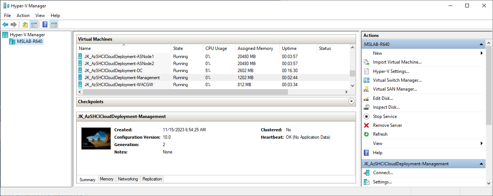

## Task01 - Prepare Active Directory

In this task you will create objects in Active Directory - groups and group managed service accounts. For Group Managed Service accounts you need KDS root key., so let's jump in.

This task will be performed in elevated powershell window in Management machine


**Step 1** Login into Management machine and run following code in elevated PowerShell window to Provide variables and install required PowerShell modules

> as you can see, since there will be organization unit created and in current iteration is one OU per cluster, prefix and OU name will match cluster name

> you can also notice, that there is an account for deployment being created. It will be used once 

```PowerShell
$AsHCIOUName="OU=ASClus01,DC=Corp,DC=contoso,DC=com"
$Servers="ASNode1","ASNode2"
$DomainFQDN=$env:USERDNSDOMAIN
$ClusterName="ASClus01"
$Prefix="ASClus01"
$UserName="ASClus01-DeployUser"
$Password="LS1setup!LS1setup!"
$SecuredPassword = ConvertTo-SecureString $password -AsPlainText -Force
$Credentials= New-Object System.Management.Automation.PSCredential ($UserName,$SecuredPassword)

#install posh module for prestaging Active Directory
Install-PackageProvider -Name NuGet -Force
Install-Module AsHciADArtifactsPreCreationTool -Repository PSGallery -Force
 
```

**Step 2** Add KDS root key (if there is not any)

```PowerShell
    #add KDS Root Key
    if (-not (Get-KdsRootKey)){
        Add-KdsRootKey -EffectiveTime ((Get-Date).addhours(-10))
    }
 
```

**Step 3** (Optional) Check KD root key with GUI tool

```PowerShell
    Install-WindowsFeature -Name "RSAT-ADDS"
    & dssite.msc
 
```


**Step 4** Populate objects into Active Directory

```PowerShell
    #make sure active directory module and GPMC is installed
    Install-WindowsFeature -Name RSAT-AD-PowerShell,GPMC

    #populate objects
    New-HciAdObjectsPreCreation -Deploy -AzureStackLCMUserCredential  $Credentials -AsHciOUName $AsHCIOUName -AsHciPhysicalNodeList $Servers -DomainFQDN $DomainFQDN -AsHciClusterName $ClusterName -AsHciDeploymentPrefix $Prefix
 
```

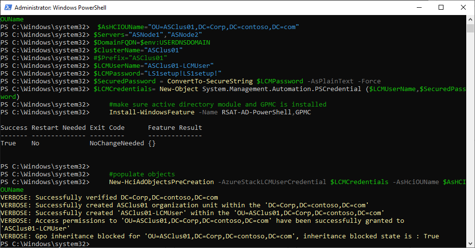

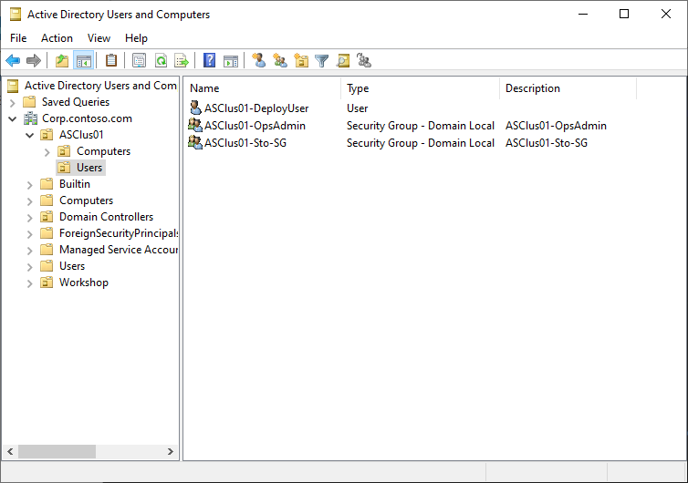


**Step 5** Install additional features to be able explore cluster and settings once it's created

```PowerShell
    #install management features to explore cluster,settings...
    Install-WindowsFeature -Name "RSAT-ADDS","RSAT-Clustering"
 
```

Keep the PowerShell window open for the next task

## Task02 - Prepare Azure

**Step 1** Populate variables, log in into azure using Device Authentication and select subscription

> You will be requested to enter code into the browser. I find this the most secure way to log in - as you can log in in another machine - your machine you trust.

```PowerShell
$ResourceGroupName="ASClus01-RG"
$Location="eastus"

#login to azure
    #download Azure module
    if (!(Get-InstalledModule -Name az.accounts -ErrorAction Ignore)){
        Install-Module -Name Az.Accounts -Force
    }
    if (-not (Get-AzContext)){
        Connect-AzAccount -UseDeviceAuthentication
    }

#select subscription if more available
    $subscriptions=Get-AzSubscription
    if (($subscriptions).count -gt 1){
        $SubscriptionID=($Subscriptions | Out-GridView -OutputMode Single -Title "Please Select Subscription").ID
        $Subscriptions | Where-Object ID -eq $SubscriptionID | Select-AzSubscription
    }else{
        $SubscriptionID=$subscriptions.id
    }
 
```

**Step 2** Install PowerShell module and create Resource Group

```PowerShell
#install az resources module
    if (!(Get-InstalledModule -Name "az.resources" -ErrorAction Ignore)){
        Install-Module -Name "az.resources" -Force
    }

#create resource group
    if (-not(Get-AzResourceGroup -Name $ResourceGroupName -ErrorAction Ignore)){
        New-AzResourceGroup -Name $ResourceGroupName -Location $location
    }
 
```

## Task03 - Prepare Azure Stack HCI nodes for Cloud Deployment

This task will install Arc agent, Arc extensions and will set RBAC roles to ARC Objects. It will also install Environmental checker, so cloud deployment will be able to kick off validation

**Step 1** Populate variables and trusted hosts

> In this step we will also configure trusted hosts to be able to send credentials to non-domain joined machines

```PowerShell
$Servers="ASNode1","ASNode2"
$ResourceGroupName="ASClus01-RG"
$TenantID=(Get-AzContext).Tenant.ID
$SubscriptionID=(Get-AzContext).Subscription.ID
$Location="eastus"
$Cloud="AzureCloud"
$ServicePrincipalName="Azure Stack HCI ARC Onboarding"

#Since machines are not domain joined, let's do some preparation
$UserName="Administrator"
$Password="LS1setup!"
$SecuredPassword = ConvertTo-SecureString $password -AsPlainText -Force
$Credentials= New-Object System.Management.Automation.PSCredential ($UserName,$SecuredPassword)

#configure trusted hosts to be able to communicate with servers (not secure)
$TrustedHosts=@()
$TrustedHosts+=$Servers
Set-Item WSMan:\localhost\Client\TrustedHosts -Value $($TrustedHosts -join ',') -Force
 
```

**Step 2** Install features and cumulative updates

> In deployment guide was mentioned, that Hyper-V should be installed and also ICMP should be enabled. We will enable ICMP by simply installing failover clustering role (that would be installed later anyway). It will automatically enable all Cluster firewall rules, that will also allow ICMP firewall rule.

> Below code is using virtual account to kick off deployment of updates via COM. With virtual account it will be ran under with local system account instead of user account. If I would use user account remotely, it would fail.

```PowerShell
Invoke-Command -ComputerName $servers -ScriptBlock {
    Enable-WindowsOptionalFeature -FeatureName Microsoft-Hyper-V -Online -NoRestart
    Install-WindowsFeature -Name Failover-Clustering
} -Credential $Credentials

#region update all servers
    Invoke-Command -ComputerName $servers -ScriptBlock {
        New-PSSessionConfigurationFile -RunAsVirtualAccount -Path $env:TEMP\VirtualAccount.pssc
        Register-PSSessionConfiguration -Name 'VirtualAccount' -Path $env:TEMP\VirtualAccount.pssc -Force
    } -ErrorAction Ignore -Credential $Credentials
    #sleep a bit
    Start-Sleep 2
    # Run Windows Update via ComObject.
    Invoke-Command -ComputerName $servers -ConfigurationName 'VirtualAccount' -ScriptBlock {
        $Searcher = New-Object -ComObject Microsoft.Update.Searcher
        $SearchCriteriaAllUpdates = "IsInstalled=0 and DeploymentAction='Installation' or
                                IsInstalled=0 and DeploymentAction='OptionalInstallation' or
                                IsPresent=1 and DeploymentAction='Uninstallation' or
                                IsInstalled=1 and DeploymentAction='Installation' and RebootRequired=1 or
                                IsInstalled=0 and DeploymentAction='Uninstallation' and RebootRequired=1"
        $SearchResult = $Searcher.Search($SearchCriteriaAllUpdates).Updates
        if ($SearchResult.Count -gt 0){
            $Session = New-Object -ComObject Microsoft.Update.Session
            $Downloader = $Session.CreateUpdateDownloader()
            $Downloader.Updates = $SearchResult
            $Downloader.Download()
            $Installer = New-Object -ComObject Microsoft.Update.Installer
            $Installer.Updates = $SearchResult
            $Result = $Installer.Install()
            $Result
        }
    } -Credential $Credentials
    #remove temporary PSsession config
    Invoke-Command -ComputerName $servers -ScriptBlock {
        Unregister-PSSessionConfiguration -Name 'VirtualAccount'
        Remove-Item -Path $env:TEMP\VirtualAccount.pssc
    }  -Credential $Credentials
#endregion
 
```

**Step 3** Restart servers to finish Features and Cumulative Updates installation

```PowerShell
#restart servers to finish Installation
Restart-Computer -ComputerName $Servers -Credential $Credentials -WsmanAuthentication Negotiate -Wait -For PowerShell
Start-Sleep 20 #Failsafe as Hyper-V needs 2 reboots and sometimes it happens, that during the first reboot the restart-computer evaluates the machine is up
#make sure computers are restarted
Foreach ($Server in $Servers){
    do{$Test= Test-NetConnection -ComputerName $Server -CommonTCPPort WINRM}while ($test.TcpTestSucceeded -eq $False)
}
 
```

**Step 4** Install PowerShell modules on nodes

> To push ARC agent, new PowerShell module AzSHCI.ArcInstaller is required. Az.Resources and Az.Accounts modules are then used by arcinstaller configure RBAC on azure resources.

```PowerShell
#make sure nuget is installed on nodes
Invoke-Command -ComputerName $Servers -ScriptBlock {
    Install-PackageProvider -Name NuGet -MinimumVersion 2.8.5.201 -Force
} -Credential $Credentials

#make sure azshci.arcinstaller is installed on nodes
Invoke-Command -ComputerName $Servers -ScriptBlock {
    Install-Module -Name azshci.arcinstaller -Force
} -Credential $Credentials

#make sure Az.Resources module is installed on nodes
Invoke-Command -ComputerName $Servers -ScriptBlock {
    Install-Module -Name Az.Resources -Force
} -Credential $Credentials

#make sure az.accounts module is installed on nodes
Invoke-Command -ComputerName $Servers -ScriptBlock {
    Install-Module -Name az.accounts -Force
} -Credential $Credentials
 
```

**Step 5** Deploy ARC agent with Invoke-AzStackHCIarcInitialization

```PowerShell
#deploy ARC Agent
    $ARMtoken = (Get-AzAccessToken).Token
    $id = (Get-AzContext).Account.Id
    Invoke-Command -ComputerName $Servers -ScriptBlock {
        Invoke-AzStackHciArcInitialization -SubscriptionID $using:SubscriptionID -ResourceGroup $using:ResourceGroupName -TenantID $using:TenantID -Cloud $using:Cloud -Region $Using:Location -ArmAccessToken $using:ARMtoken -AccountID $using:id
    } -Credential $Credentials
 
```


## Task03 - Add some final touches before launching cloud deployment from portal

**Step 1** Make sure there is only one NIC with gateway configured

```PowerShell
#make sure there is only one management NIC with IP address (setup is complaining about multiple gateways)
    Invoke-Command -ComputerName $servers -ScriptBlock {
        Get-NetIPConfiguration | Where-Object IPV4defaultGateway | Get-NetAdapter | Sort-Object Name | Select-Object -Skip 1 | Set-NetIPInterface -Dhcp Disabled
    } -Credential $Credentials
 
```

**Step 2** Configure current user to be Keay Vault Administrator on ASClus01 resource group

```PowerShell
#add key vault admin of current user to Resource Group
    $objectId = (Get-AzADUser -SignedIn).Id
    New-AzRoleAssignment -ObjectId $ObjectId -ResourceGroupName $ResourceGroupName -RoleDefinitionName "Key Vault Administrator"
 
```


**Step 3** Configure new admin password on nodes (as Cloud Deployment requires at least 12chars)

```PowerShell
#change password of local admin to be at least 12 chars
    Invoke-Command -ComputerName $servers -ScriptBlock {
        Set-LocalUser -Name Administrator -AccountNeverExpires -Password (ConvertTo-SecureString "LS1setup!LS1setup!" -AsPlainText -Force)
    } -Credential $Credentials
 
```

## Task04 - Perform Azure Stack HCI deployment from Azure Portal

**Step 1** Navigate to Azure Portal and in Azure Stack HCI clusters, click on Create button

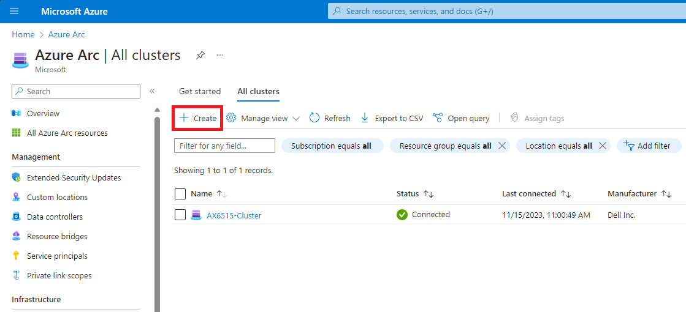

**Step 2** Continue with setup with following values

> In Security settings I removed Bitlocker for data volumes as it would expand VHDs when encryptiog volumes.

```
Basics:
    Resource Group: ASClus-01-RG
    ClusterName:    ASClus01
    Keyvaultname:   <Just generate new>

Configuration:
    New Configuration

Networking
    Network Switch for storage
    Group All traffic

    Network adapter 1:          Ethernet
    Network adapter 1 VLAN ID:  711 (default)
    Network adapter 2:          Ethernet 2
    Network adapter 2 VLAN ID:  712 (default)

    Starting IP:                10.0.0.100
    ENding IP:                  10.0.0.110
    Subnet mask:                255.255.255.0
    Default Gateway:            10.0.0.1
    DNS Server:                 10.0.0.1

Management
    Custom location name:       ASClus01CustomLocation (default)\
    Azure storage account name: <just generate new>

    Domain:                     corp.contoso.com
    Computer name prefix:       ASClus01
    OU:                         OU=ASClus01,DC=Corp,DC=contoso,DC=com

    Deployment account:
        Username:               ASClus01-DeployUser
        Password:               LS1setup!LS1setup!

    Local Administrator
        Username:               Administrator
    Password:                   LS1setup!LS1setup!

Security:
    Customized security settings
        Unselect Bitlocker for data volumes (would consume too much space)

Advanced:
    Create workload volumes (Default)

Tags:
    <keep default>
```


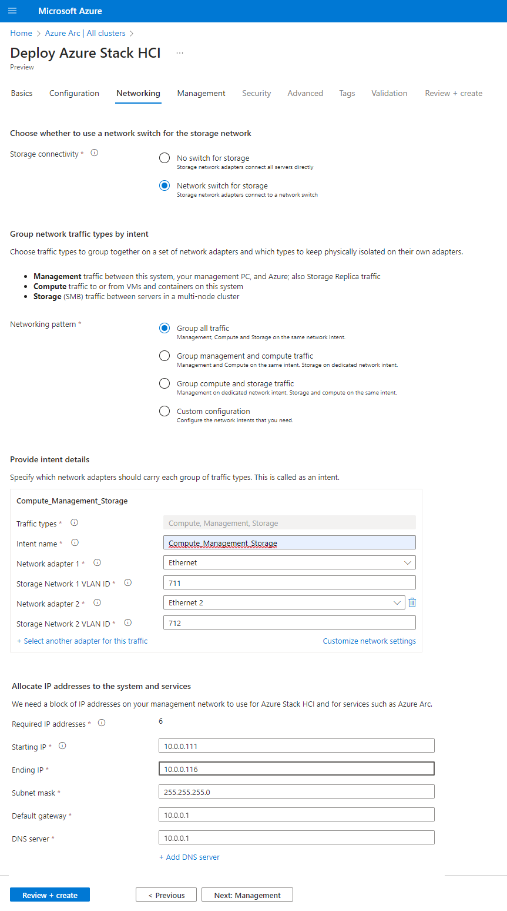

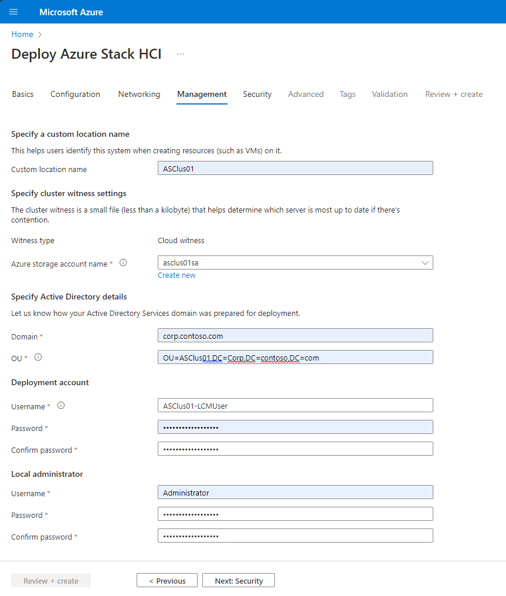

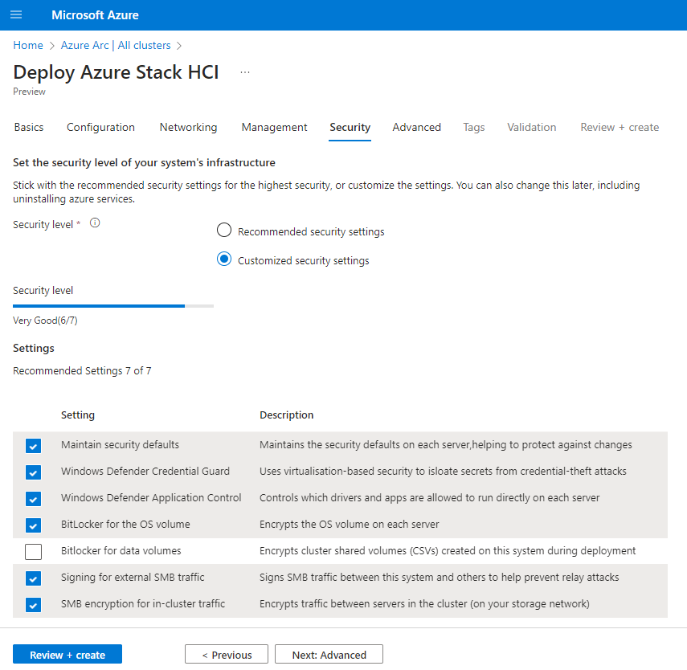

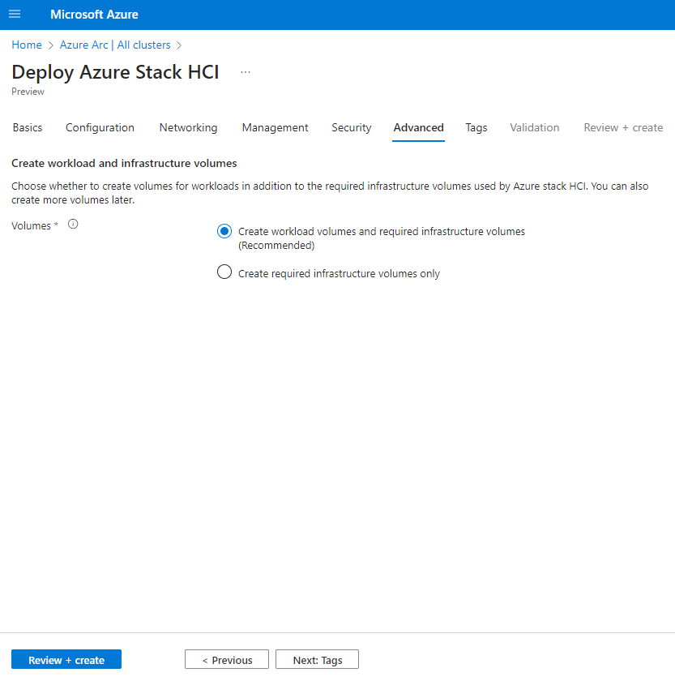


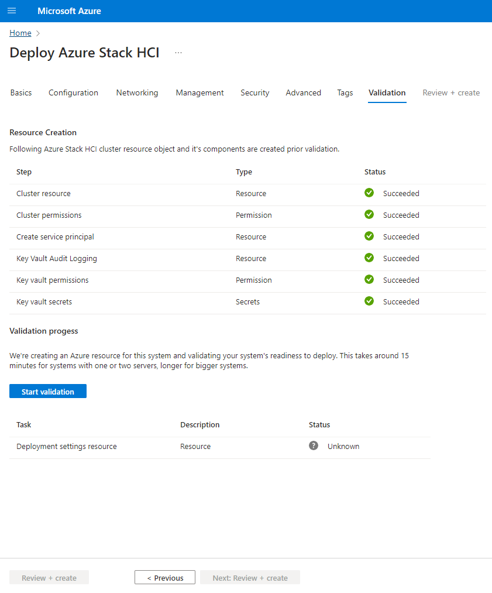

**Step 3** Validation process will take some time. And if all goes OK, it will succesfully review cluster

> If you repeat validation process for several times, it might fail on Key Vault Audit Logging. You would need to go to Key Vault Diagnostic and remove linked storage accounts from there.

> If Deployment Settings resource fails due to timeout, just try again. It will unfortunately create new storage account for key vault (we are still in preview phase). It also creates new service principal (with contributor rights) - again, something that will change.

> I did not have any of these issues when deploying physical nodes. This seems to be limitation on Virtual Machines only.

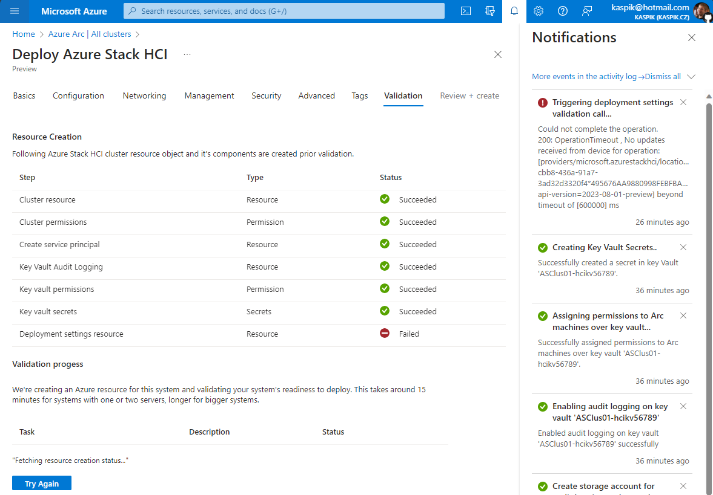

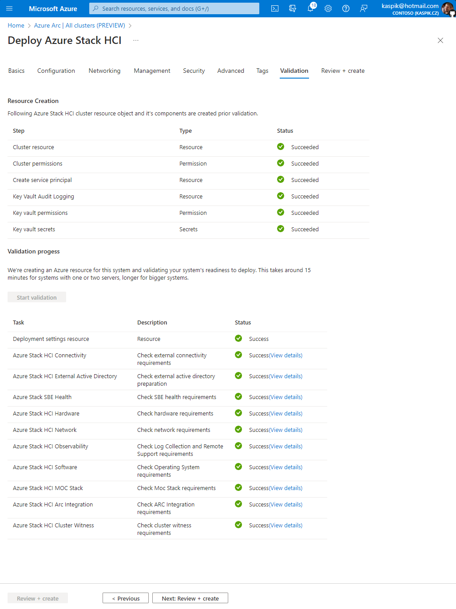


## Task05 - Monitor Deployment Progress

**Step 1** Monitor deployment progress from Management machine

Paste following PowerShell to update credentials and pull information about the deployment progress

```PowerShell
    #Create new password credentials
    $UserName="Administrator"
    $Password="LS1setup!LS1setup!"
    $SecuredPassword = ConvertTo-SecureString $password -AsPlainText -Force
    $Credentials= New-Object System.Management.Automation.PSCredential ($UserName,$SecuredPassword)

    #before domain join
    Invoke-Command -ComputerName $Servers[0] -ScriptBlock {
        ([xml](Get-Content C:\ecestore\efb61d70-47ed-8f44-5d63-bed6adc0fb0f\086a22e3-ef1a-7b3a-dc9d-f407953b0f84)) | Select-Xml -XPath "//Action/Steps/Step" | ForEach-Object { $_.Node } | Select-Object FullStepIndex, Status, Name, StartTimeUtc, EndTimeUtc, @{Name="Duration";Expression={new-timespan -Start $_.StartTimeUtc -End $_.EndTimeUtc } } | Format-Table -AutoSize
    } -Credential $Credentials
 
```


> Once nodes are domain joined, it is no longer needed to provide credentials

```PowerShell
    #after domain join
    Invoke-Command -ComputerName $Servers[0] -ScriptBlock {
        ([xml](Get-Content C:\ecestore\efb61d70-47ed-8f44-5d63-bed6adc0fb0f\086a22e3-ef1a-7b3a-dc9d-f407953b0f84)) | Select-Xml -XPath "//Action/Steps/Step" | ForEach-Object { $_.Node } | Select-Object FullStepIndex, Status, Name, StartTimeUtc, EndTimeUtc, @{Name="Duration";Expression={new-timespan -Start $_.StartTimeUtc -End $_.EndTimeUtc } } | Format-Table -AutoSize
    }
 
```

**Step 2** In Azure Portal, navigate to your Azure Stack Cluster and you should see deployment progress there


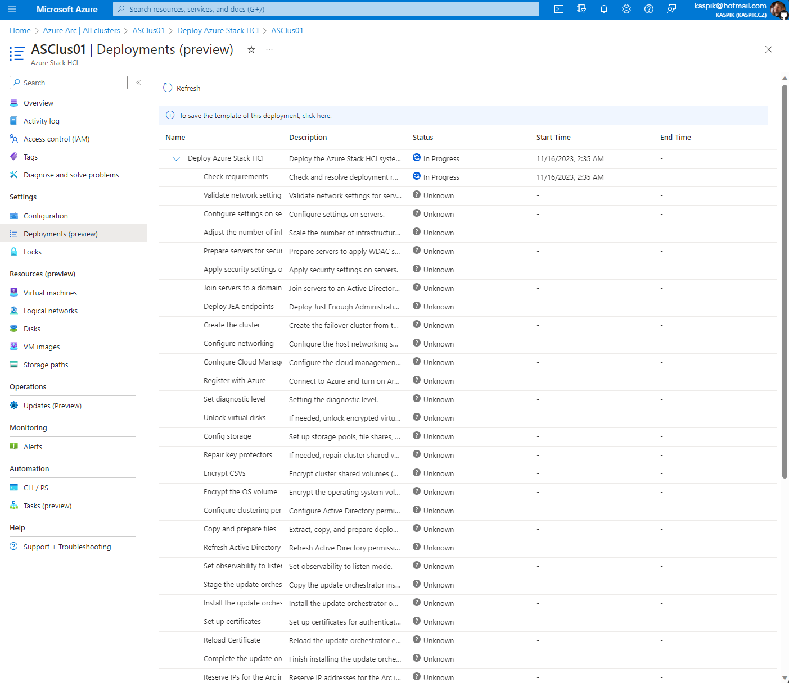

**Step 3** To troubleshoot deployment you can explore deployment logs by navigating into first cluster node to c:\CloudDeployment\Logs

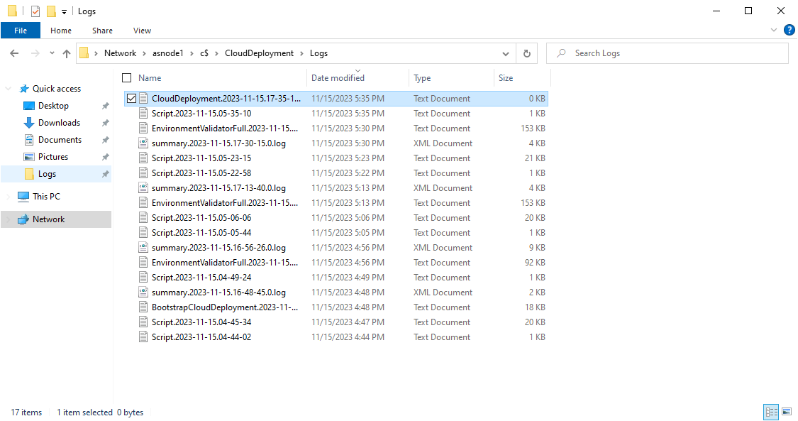
