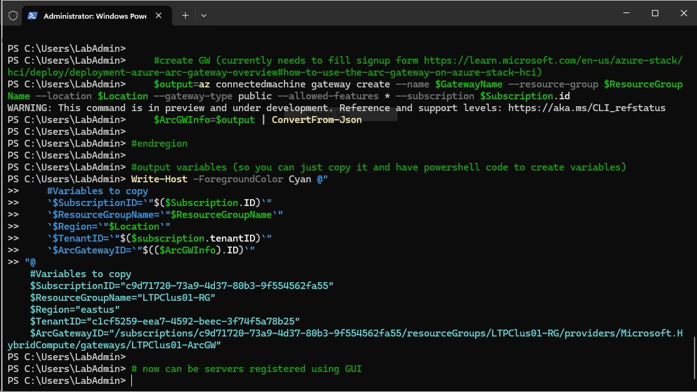
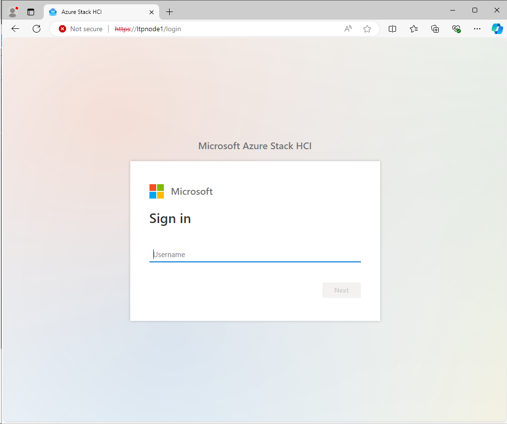
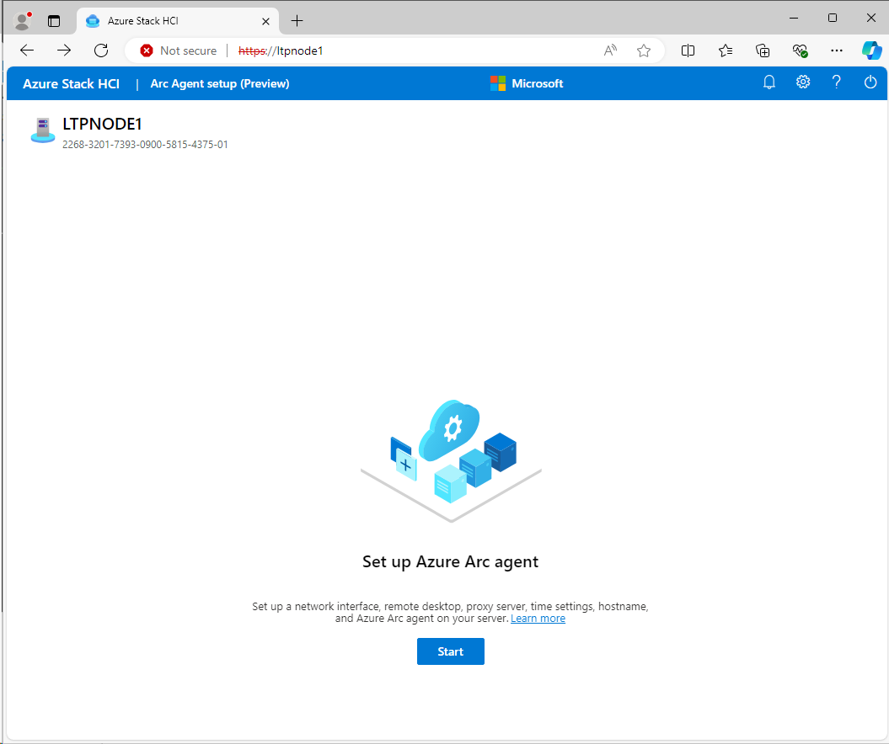
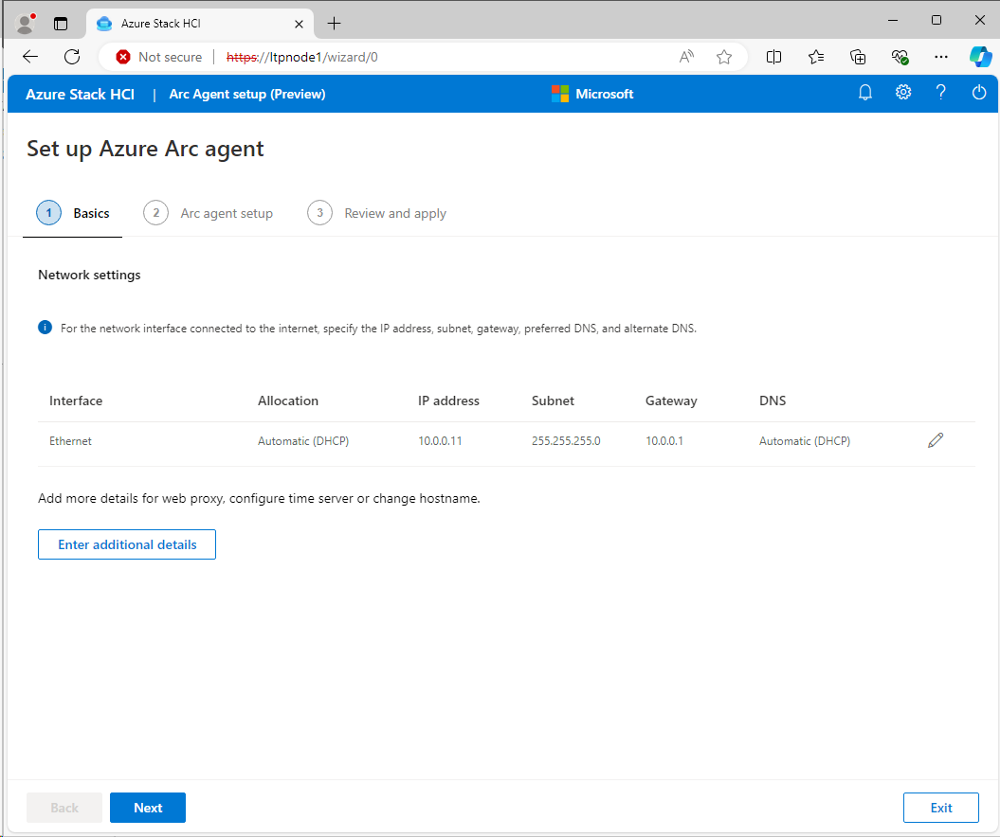
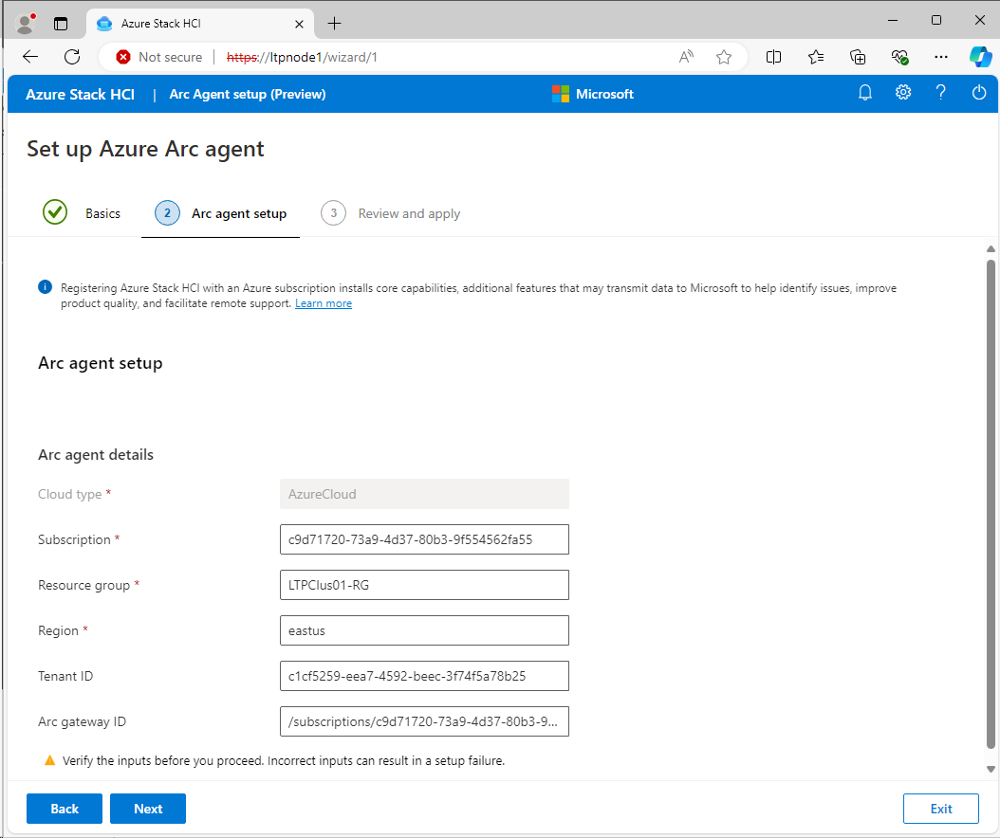
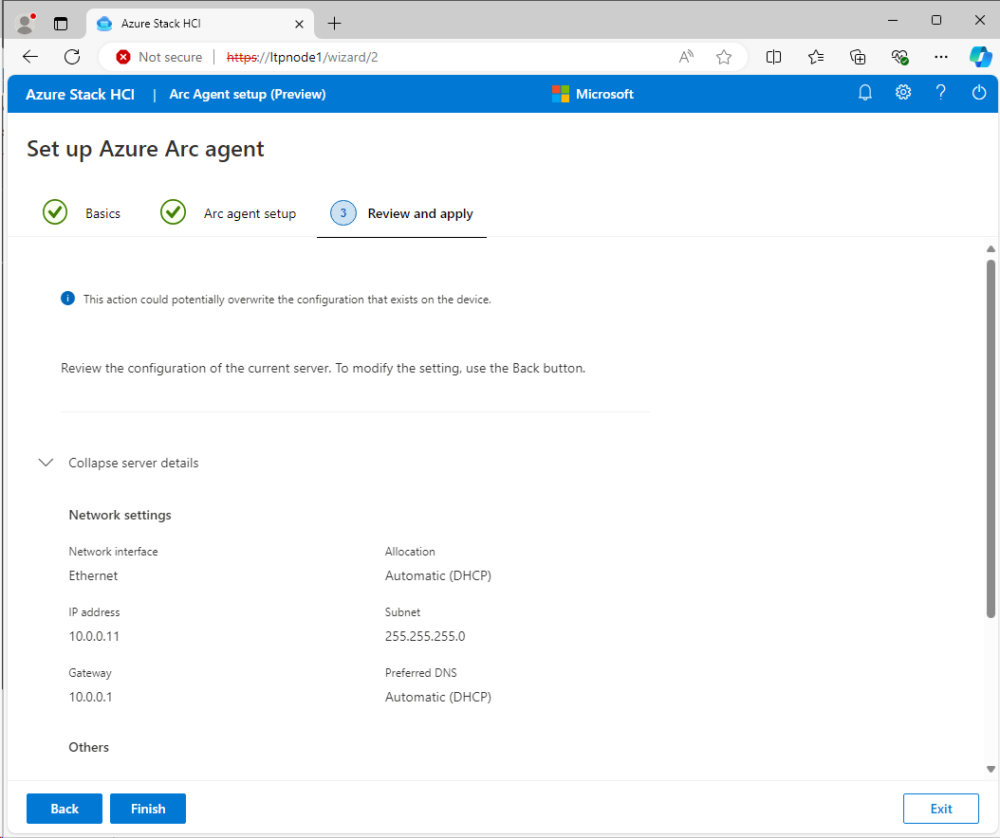
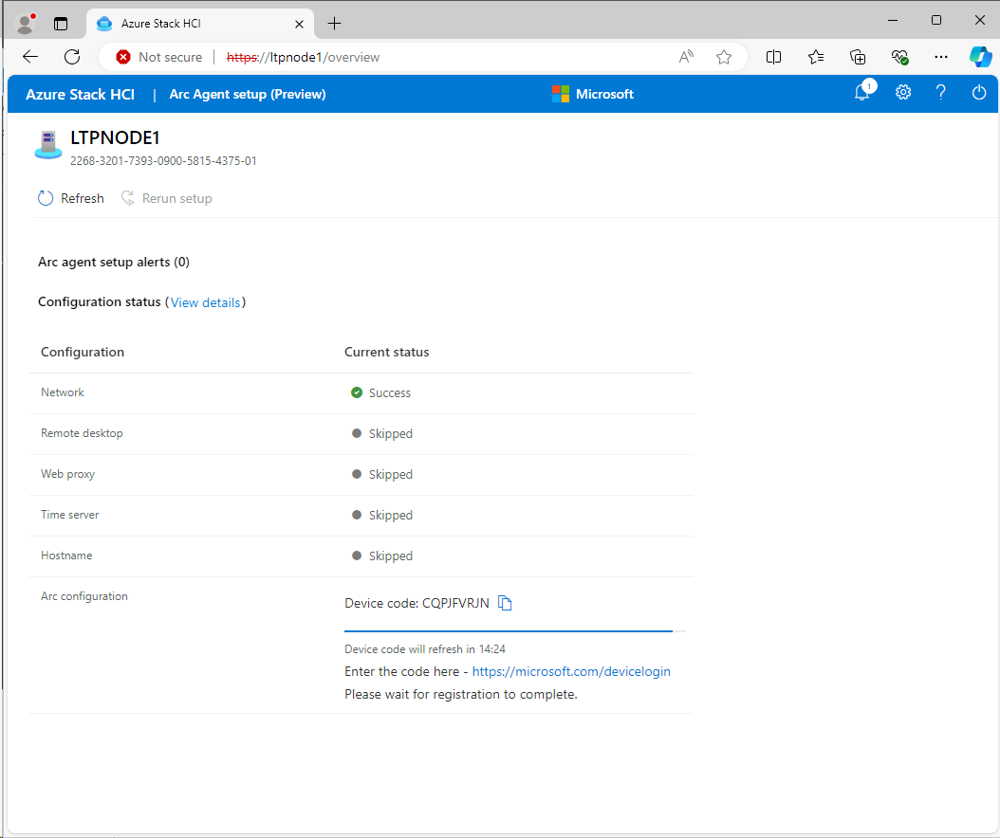
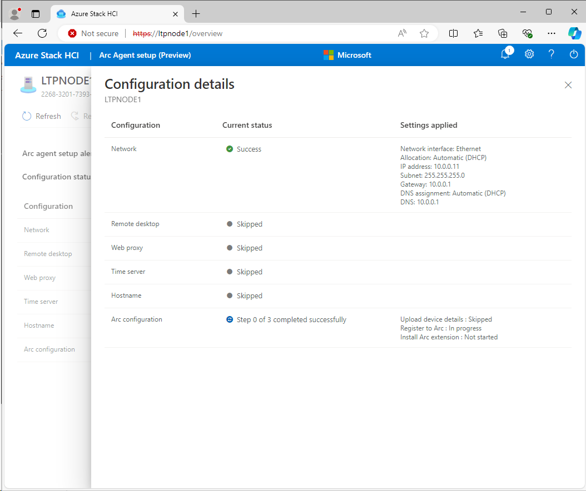
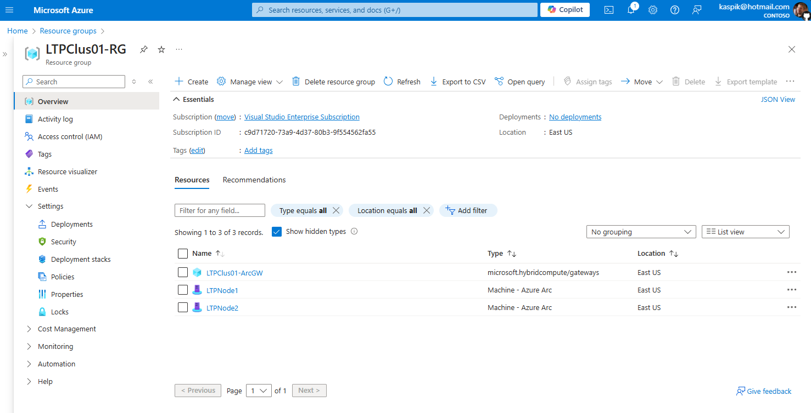

# Azure Stack HCI Light Touch Provisioning and Arc Gateway

<!-- TOC -->

- [Azure Stack HCI Light Touch Provisioning and Arc Gateway](#azure-stack-hci-light-touch-provisioning-and-arc-gateway)
    - [About the lab](#about-the-lab)
    - [Prerequisites](#prerequisites)
    - [LabConfig](#labconfig)
    - [NTP Prerequisite Virtual Lab](#ntp-prerequisite-virtual-lab)
    - [The Lab](#the-lab)
        - [WebUI Prerequisites](#webui-prerequisites)
        - [Validation Prerequisites](#validation-prerequisites)
        - [Configure iDRACs optional](#configure-idracs-optional)
        - [Deploy Azure Stack from Azure Portal](#deploy-azure-stack-from-azure-portal)

<!-- /TOC -->

## About the lab

[Light touch provisioning (preview)](https://learn.microsoft.com/en-us/azure-stack/hci/deploy/deployment-arc-register-local-ui) allows you to use local web UI on Azure Stack HCI to onboard Azure Stack HCI nodes to Azure Portal.

This process greatly simplifies the process, but still several steps are needed. The OS will automatically use SN of the server and will use it as a hostname. If you are on the same network, you can simply navigate to https://`<device-serial-number>`.local (it uses local discovery).

## Prerequisites

* Hydrated MSLab with LabConfig from [01-HydrateMSLab](../../admin-guides/01-HydrateMSLab/readme.md)

* Understand [how MSLab works](../../admin-guides/02-WorkingWithMSLab/readme.md)

* Make sure you hydrate [Azure Stack HCI 23H2 Preview](https://aka.ms/HCIReleaseImagePreview) using CreateParentDisk.ps1 located in ParentDisks folder as it contains [WebUI onboarding](https://learn.microsoft.com/en-us/azure-stack/hci/deploy/deployment-arc-register-local-ui)

* Note: this lab uses ~50GB RAM. To reduce amount of RAM, you would need to reduce number of nodes.

## LabConfig

```PowerShell
$LabConfig=@{AllowedVLANs="1-10,711-719" ; DomainAdminName='LabAdmin'; AdminPassword='LS1setup!' ; DCEdition='4'; Internet=$true; TelemetryLevel='Full' ; TelemetryNickname='' ; AdditionalNetworksConfig=@(); VMs=@()}

#Azure Stack HCI 23H2
#labconfig will not domain join VMs
1..2 | ForEach-Object {$LABConfig.VMs += @{ VMName = "LTPNode$_" ; Configuration = 'S2D' ; ParentVHD = 'AzSHCI23H2_G2_Preview.vhdx' ; HDDNumber = 4 ; HDDSize= 2TB ; MemoryStartupBytes= 20GB; VMProcessorCount="MAX" ; vTPM=$true ; Unattend="NoDjoin" ; NestedVirt=$true }}

#Windows Admin Center in GW mode
$LabConfig.VMs += @{ VMName = 'WACGW' ; ParentVHD = 'Win2025Core_G2.vhdx'; MGMTNICs=1}

#Management machine (windows server 2025, but can be 2022)
$LabConfig.VMs += @{ VMName = 'Management' ; ParentVHD = 'Win2025_G2.vhdx'; MGMTNICs=1 ; AddToolsVHD=$True }
 
```

## NTP Prerequisite (Virtual Lab)

To sucessfully configure NTP server it's necessary to disable time synchronization from Hyper-V host.

Run following code **from hyper-v host** to disable time sync

```PowerShell
Get-VM *LTPNode* | Disable-VMIntegrationService -Name "Time Synchronization"

```

## The Lab

### WebUI Prerequisites

These prerequisites are needed to successfully register server into the Azure. Following code will log in into the subscription, create Resource Group and Arc Gateway.

```PowerShell
$GatewayName="LTPClus01-ArcGW"
$ResourceGroupName="LTPClus01-RG"
$Location="eastus"

#login to azure
    #download Azure module
    Install-PackageProvider -Name NuGet -MinimumVersion 2.8.5.201 -Force
    if (!(Get-InstalledModule -Name az.accounts -ErrorAction Ignore)){
        Install-Module -Name Az.Accounts -Force 
    }
    #login
    Connect-AzAccount -UseDeviceAuthentication

    #assuming new az.accounts module was used and it asked you what subscription to use - then correct subscription is selected for context
    $Subscription=(Get-AzContext).Subscription

    #install az resources module
        if (!(Get-InstalledModule -Name az.resources -ErrorAction Ignore)){
            Install-Module -Name az.resources -Force
        }

    #create resource group
        if (-not(Get-AzResourceGroup -Name $ResourceGroupName -ErrorAction Ignore)){
            New-AzResourceGroup -Name $ResourceGroupName -Location $location
        }
#region (Optional) configure ARC Gateway
    #install az cli and log into az
        Start-BitsTransfer -Source https://aka.ms/installazurecliwindows -Destination $env:userprofile\Downloads\AzureCLI.msi
        Start-Process msiexec.exe -Wait -ArgumentList "/I  $env:userprofile\Downloads\AzureCLI.msi /quiet"
        #add az to enviromental variables so no posh restart is needed
        [System.Environment]::SetEnvironmentVariable('PATH',$Env:PATH+';C:\Program Files (x86)\Microsoft SDKs\Azure\CLI2\wbin')

        #login with device authentication
        az login --use-device-code

    #download WHL
    $AKA="https://aka.ms/ArcGatewayWhl"
    $URL=[System.Net.HttpWebRequest]::Create("$AKA").GetResponse().ResponseUri.AbsoluteUri
    $FileName=$url.Split("/") | Select-Object -Last 1
    Start-BitsTransfer -Source $URL -Destination $env:userprofile\Downloads\$FileName
    
    #add GW extension
    az extension add --allow-preview true --source $env:userprofile\Downloads\$FileName --yes

    #make sure "Microsoft.HybridCompute" is registered (and possibly other RPs)
        Register-AzResourceProvider -ProviderNamespace "Microsoft.HybridCompute"
        Register-AzResourceProvider -ProviderNamespace "Microsoft.GuestConfiguration"
        Register-AzResourceProvider -ProviderNamespace "Microsoft.HybridConnectivity"
        Register-AzResourceProvider -ProviderNamespace "Microsoft.AzureStackHCI"

    #create GW (currently needs to fill signup form https://learn.microsoft.com/en-us/azure-stack/hci/deploy/deployment-azure-arc-gateway-overview#how-to-use-the-arc-gateway-on-azure-stack-hci)
    $output=az connectedmachine gateway create --name $GatewayName --resource-group $ResourceGroupName --location $Location --gateway-type public --allowed-features * --subscription $Subscription.id
    $ArcGWInfo=$output | ConvertFrom-Json

#endregion

#output variables (so you can just copy it and have powershell code to create variables)
Write-Host -ForegroundColor Cyan @"
    #Variables to copy
    `$SubscriptionID=`"$($Subscription.ID)`"
    `$ResourceGroupName=`"$ResourceGroupName`"
    `$Region=`"$Location`"
    `$TenantID=`"$($subscription.tenantID)`"
    `$ArcGatewayID=`"$(($ArcGWInfo).ID)`"
"@ 

# now can be servers registered using GUI

```




As you now have all variables needed, you can proceed with navigating to WebUI on each node.

In MSLab you can simply navigate to https://LTPNode1 and https://LTPNode2. In production environment you can either navigate to https://<serialnumber> or simply configure an IP address and navigate there. The webUI takes ~15 minutes to start after booting the servers.

Log in with **Administrator/LS1setup!** and proceed with all three steps to register nodes to Azure.



















### Validation Prerequisites

```PowerShell
$Servers="LTPNode1","LTPNode2"
$AsHCIOUName="OU=LTPClus01,DC=Corp,DC=contoso,DC=com"
$LCMUserName="LTPClus01-LCMUser"
$LCMPassword="LS1setup!LS1setup!"

$NTPServer="DC.corp.contoso.com"

#Create new credentials
$UserName="Administrator"
$Password="LS1setup!"
$SecuredPassword = ConvertTo-SecureString $password -AsPlainText -Force
$Credentials= New-Object System.Management.Automation.PSCredential ($UserName,$SecuredPassword)
$SecuredPassword = ConvertTo-SecureString $LCMPassword -AsPlainText -Force
$LCMCredentials= New-Object System.Management.Automation.PSCredential ($LCMUserName,$SecuredPassword)

#configure trusted hosts to be able to communicate with servers (not secure as you send credentials over to remote host)
$TrustedHosts=@()
$TrustedHosts+=$Servers
Set-Item WSMan:\localhost\Client\TrustedHosts -Value $($TrustedHosts -join ',') -Force

# region to sucessfully validate you need make sure there's just one GW
    #make sure there is only one management NIC with IP address (setup is complaining about multiple gateways)
    Invoke-Command -ComputerName $servers -ScriptBlock {
        Get-NetIPConfiguration | Where-Object IPV4defaultGateway | Get-NetAdapter | Sort-Object Name | Select-Object -Skip 1 | Set-NetIPInterface -Dhcp Disabled
    } -Credential $Credentials
#endregion

#if servers are Dell AX Nodes, SBE Package needs to be populated and servers updated
#region update servers with latest hardware updates
    $DSUDownloadFolder="$env:USERPROFILE\Downloads\DSU"

    #Set up web client to download files with autheticated web request
    $WebClient = New-Object System.Net.WebClient
    #$proxy = new-object System.Net.WebProxy
    $proxy = [System.Net.WebRequest]::GetSystemWebProxy()
    $proxy.Credentials = [System.Net.CredentialCache]::DefaultCredentials
    #$proxy.Address = $proxyAdr
    #$proxy.useDefaultCredentials = $true
    $WebClient.proxy = $proxy

    #Download DSU
    #https://github.com/DellProSupportGse/Tools/blob/main/DART.ps1
    #download latest DSU to Downloads
        $LatestDSU="https://dl.dell.com/FOLDER10889507M/1/Systems-Management_Application_RPW7K_WN64_2.0.2.3_A00.EXE"
        if (-not (Test-Path $DSUDownloadFolder -ErrorAction Ignore)){New-Item -Path $DSUDownloadFolder -ItemType Directory}
        #Start-BitsTransfer -Source $LatestDSU -Destination $DSUDownloadFolder\DSU.exe
        $WebClient.DownloadFile($LatestDSU,"$DSUDownloadFolder\DSU.exe")

    #Download catalog and unpack
        #Start-BitsTransfer -Source "https://downloads.dell.com/catalog/ASHCI-Catalog.xml.gz" -Destination "$DSUDownloadFolder\ASHCI-Catalog.xml.gz"
        $WebClient.DownloadFile("https://downloads.dell.com/catalog/ASHCI-Catalog.xml.gz","$DSUDownloadFolder\ASHCI-Catalog.xml.gz")     

        #unzip gzip to a folder https://scatteredcode.net/download-and-extract-gzip-tar-with-powershell/
        Function Expand-GZipArchive{
            Param(
                $infile,
                $outfile = ($infile -replace '\.gz$','')
                )
            $input = New-Object System.IO.FileStream $inFile, ([IO.FileMode]::Open), ([IO.FileAccess]::Read), ([IO.FileShare]::Read)
            $output = New-Object System.IO.FileStream $outFile, ([IO.FileMode]::Create), ([IO.FileAccess]::Write), ([IO.FileShare]::None)
            $gzipStream = New-Object System.IO.Compression.GzipStream $input, ([IO.Compression.CompressionMode]::Decompress)
            $buffer = New-Object byte[](1024)
            while($true){
                $read = $gzipstream.Read($buffer, 0, 1024)
                if ($read -le 0){break}
                $output.Write($buffer, 0, $read)
                }
            $gzipStream.Close()
            $output.Close()
            $input.Close()
        }
        Expand-GZipArchive "$DSUDownloadFolder\ASHCI-Catalog.xml.gz" "$DSUDownloadFolder\ASHCI-Catalog.xml"

    #upload DSU and catalog to servers
    $Sessions=New-PSSession -ComputerName $Servers -Credential $Credentials
    Invoke-Command -Session $Sessions -ScriptBlock {
        if (-not (Test-Path $using:DSUDownloadFolder -ErrorAction Ignore)){New-Item -Path $using:DSUDownloadFolder -ItemType Directory}
    }
    foreach ($Session in $Sessions){
        Copy-Item -Path "$DSUDownloadFolder\DSU.exe" -Destination "$DSUDownloadFolder" -ToSession $Session -Force -Recurse
        Copy-Item -Path "$DSUDownloadFolder\ASHCI-Catalog.xml" -Destination "$DSUDownloadFolder" -ToSession $Session -Force -Recurse
    }

    #install DSU
    Invoke-Command -Session $Sessions -ScriptBlock {
        Start-Process -FilePath "$using:DSUDownloadFolder\DSU.exe" -ArgumentList "/silent" -Wait 
    }

    #Check compliance
    Invoke-Command -Session $Sessions -ScriptBlock {
        & "C:\Program Files\Dell\DELL System Update\DSU.exe" --compliance --output-format="json" --output="$using:DSUDownloadFolder\Compliance.json" --catalog-location="$using:DSUDownloadFolder\ASHCI-Catalog.xml"
    }

    #collect results
    $Compliance=@()
    foreach ($Session in $Sessions){
        $json=Invoke-Command -Session $Session -ScriptBlock {Get-Content "$using:DSUDownloadFolder\Compliance.json"}
        $object = $json | ConvertFrom-Json 
        $components=$object.SystemUpdateCompliance.UpdateableComponent
        $components | Add-Member -MemberType NoteProperty -Name "ClusterName" -Value $ClusterName
        $components | Add-Member -MemberType NoteProperty -Name "ServerName" -Value $Session.ComputerName
        $Compliance+=$Components
    }

    #display results
    $Compliance | Out-GridView

    #Or just choose what updates to install
    #$Compliance=$Compliance | Out-GridView -OutputMode Multiple

    #or Select only NIC drivers/firmware (as the rest will be processed by SBE)
    #$Compliance=$Compliance | Where-Object categoryType -eq "NI"

    #Install Dell updates https://www.dell.com/support/home/en-us/product-support/product/system-update/docs
    Invoke-Command -Session $Sessions -ScriptBlock {
        $Packages=(($using:Compliance | Where-Object {$_.ServerName -eq $env:computername -and $_.compliancestatus -eq $false}))
        if ($Packages){
            $UpdateNames=($packages.PackageFilePath | Split-Path -Leaf) -join ","
            & "C:\Program Files\Dell\DELL System Update\DSU.exe" --catalog-location="$using:DSUDownloadFolder\ASHCI-Catalog.xml" --update-list="$UpdateNames" --apply-upgrades --apply-downgrades
        }
    }
    $Sessions | Remove-PSSession

    #restart servers to finish Installation
        Restart-Computer -ComputerName $Servers -Credential $Credentials -WsmanAuthentication Negotiate -Wait -For PowerShell
        Start-Sleep 20 #Failsafe as Hyper-V needs 2 reboots and sometimes it happens, that during the first reboot the restart-computer evaluates the machine is up
        #make sure computers are restarted
        Foreach ($Server in $Servers){
            do{$Test= Test-NetConnection -ComputerName $Server -CommonTCPPort WINRM}while ($test.TcpTestSucceeded -eq $False)
        }

#endregion

#region populate SBE package
    #download package to Downloads
    Invoke-WebRequest -Uri https://dl.dell.com/protected/drivers/FOLDER11833185M/1/Bundle_SBE_Dell_AS-HCI-AX_4.1.2406.3001.zip -OutFile $env:userprofile\Downloads\Bundle_SBE_Dell_AS-HCI-AX_4.1.2406.3001.zip -UserAgent "DellGEOS"
    #Transfer to servers
    $Sessions=New-PSSession -ComputerName $Servers
    foreach ($Session in $Session){
        Copy-Item -Path $env:userprofile\Downloads\Bundle_SBE_Dell_AS-HCI-AX_4.1.2406.3001.zip -Destination c:\users\$UserName\downloads\ -ToSession $Session
    }

    Invoke-Command -ComputerName $Servers -scriptblock {
        #Invoke-WebRequest -Uri https://dl.dell.com/protected/drivers/FOLDER11833185M/1/Bundle_SBE_Dell_AS-HCI-AX_4.1.2406.3001.zip -OutFile $env:userprofile\Downloads\Bundle_SBE_Dell_AS-HCI-AX_4.1.2406.3001.zip -UserAgent "DellGEOS"
        #unzip to c:\SBE
        New-Item -Path c:\ -Name SBE -ItemType Directory -ErrorAction Ignore
        Expand-Archive -LiteralPath $env:userprofile\Downloads\Bundle_SBE_Dell_AS-HCI-AX_4.1.2406.3001.zip -DestinationPath C:\SBE
    } -Credential $Credentials
 
    $Sessions | Remove-PSSession
#endregion

#region exclude iDRAC adapters from cluster networks (as validation was failing in latest versions)
    Invoke-Command -computername $Servers -scriptblock {
        New-Item -Path HKLM:\system\currentcontrolset\services\clussvc\parameters
        New-ItemProperty -Path HKLM:\system\currentcontrolset\services\clussvc\parameters -Name ExcludeAdaptersByDescription -Value "Remote NDIS Compatible Device"
    }
    
#endregion

#region clean disks (if the servers are reporpused)
    Invoke-Command -ComputerName $Servers -ScriptBlock {
        $disks=Get-Disk | Where-Object IsBoot -eq $false
        $disks | Set-Disk -IsReadOnly $false
        $disks | Set-Disk -IsOffline $false
        $disks | Clear-Disk -RemoveData -RemoveOEM -Confirm:0
        $disks | get-disk | Set-Disk -IsOffline $true
    } -Credential $Credentials
#endregion

#region configure NTP server
    Invoke-Command -ComputerName $servers -ScriptBlock {
        w32tm /config /manualpeerlist:$using:NTPServer /syncfromflags:manual /update
        Restart-Service w32time
    } -Credential $Credentials

    Start-Sleep 20

    #check if source is NTP Server
    Invoke-Command -ComputerName $servers -ScriptBlock {
        w32tm /query /source
    } -Credential $Credentials
#endregion

#region and make sure password is long enough (12chars at least)
    $NewPassword="LS1setup!LS1setup!"
    Invoke-Command -ComputerName $servers -ScriptBlock {
        Set-LocalUser -Name Administrator -AccountNeverExpires -Password (ConvertTo-SecureString $Using:NewPassword -AsPlainText -Force)
    } -Credential $Credentials
    #create new credentials
    $UserName="Administrator"
    $SecuredPassword = ConvertTo-SecureString $NewPassword -AsPlainText -Force
    $Credentials= New-Object System.Management.Automation.PSCredential ($UserName,$SecuredPassword)
#endregion

#region create objects in Active Directory
    #install posh module for prestaging Active Directory
    Install-PackageProvider -Name NuGet -Force
    Install-Module AsHciADArtifactsPreCreationTool -Repository PSGallery -Force

    #make sure active directory module and GPMC is installed
    Install-WindowsFeature -Name RSAT-AD-PowerShell,GPMC

    #populate objects
    New-HciAdObjectsPreCreation -AzureStackLCMUserCredential $LCMCredentials -AsHciOUName $AsHCIOUName

    #to check OU (and future cluster) in GUI install management tools
    Install-WindowsFeature -Name "RSAT-ADDS","RSAT-Clustering"
#endregion

```

### Configure iDRACs (optional)

```PowerShell
#$iDRACCredentials=Get-Credential #grab iDRAC credentials
$iDracUsername="LabAdmin"
$iDracPassword="LS1setup!"
$SecureStringPassword = ConvertTo-SecureString $iDracPassword -AsPlainText -Force
$iDRACCredentials = New-Object System.Management.Automation.PSCredential ($iDracUsername, $SecureStringPassword)
#IP = Idrac IP Address, USBNICIP = IP Address of  that will be configured in OS to iDRAC Pass-through USB interface
#You can configure all to be 169.254.0.1. Openmanage extension still recommends having each IP to be unique. on node 1 it would be 169.254.11.1 iDRAC and +1 in OS (169.254.11.2)
$iDRACs=@()
$iDRACs+=@{IP="192.168.100.139" ; USBNICIP="169.254.11.1"}
$iDRACs+=@{IP="192.168.100.140" ; USBNICIP="169.254.11.3"}

#ignoring cert is needed for posh5. In 6 and newer you can just add -SkipCertificateCheck to Invoke-WebRequest
function Ignore-SSLCertificates {
    $Provider = New-Object Microsoft.CSharp.CSharpCodeProvider
    $Compiler = $Provider.CreateCompiler()
    $Params = New-Object System.CodeDom.Compiler.CompilerParameters
    $Params.GenerateExecutable = $False
    $Params.GenerateInMemory = $true
    $Params.IncludeDebugInformation = $False
    $Params.ReferencedAssemblies.Add("System.DLL") > $null
    $TASource=@'
    namespace Local.ToolkitExtensions.Net.CertificatePolicy
    {
        public class TrustAll : System.Net.ICertificatePolicy
        {
            public bool CheckValidationResult(System.Net.ServicePoint sp,System.Security.Cryptography.X509Certificates.X509Certificate cert, System.Net.WebRequest req, int problem)
            {
                return true;
            }
        }
    }
'@ 
    $TAResults=$Provider.CompileAssemblyFromSource($Params,$TASource)
    $TAAssembly=$TAResults.CompiledAssembly
    $TrustAll = $TAAssembly.CreateInstance("Local.ToolkitExtensions.Net.CertificatePolicy.TrustAll")
    [System.Net.ServicePointManager]::CertificatePolicy = $TrustAll
}
Ignore-SSLCertificates

#Patch Enable OS to iDrac Pass-through and configure IP
$Headers=@{"Accept"="application/json"}
$ContentType='application/json'
foreach ($iDRAC in $iDRACs){
    $uri="https://$($idrac.IP)/redfish/v1/Managers/iDRAC.Embedded.1/Attributes"
    $JSONBody=@{"Attributes"=@{"OS-BMC.1.UsbNicIpAddress"="$($iDRAC.USBNICIP)";"OS-BMC.1.AdminState"="Enabled"}} | ConvertTo-Json -Compress
    Invoke-WebRequest -Body $JsonBody -Method Patch -ContentType $ContentType -Headers $Headers -Uri $uri -Credential $iDRACCredentials
}
 
```

### Deploy Azure Stack from Azure Portal

```
Basics:
    Resource Group: LTPClus01-RG
    ClusterName:    LTPClus01
    Keyvaultname:   <Just generate new>

Configuration:
    New Configuration

Networking
    Network Switch for storage
    Group All traffic

    Network adapter 1:          Ethernet
    Network adapter 1 VLAN ID:  711 (default)
    Network adapter 2:          Ethernet 2
    Network adapter 2 VLAN ID:  712 (default)

    RDMA Protocol:              Disabled (in case you are running lab in VMs)
    Jumbo Frames:               1514 (in case you are running lab in VMs as hyper-v does not by default support Jumbo Frames)

    Starting IP:                10.0.0.111
    ENding IP:                  10.0.0.116
    Subnet mask:                255.255.255.0
    Default Gateway:            10.0.0.1
    DNS Server:                 10.0.0.1

Management
    Custom location name:       LTPClus01CustomLocation (default)\
    Azure storage account name: <just generate new>

    Domain:                     corp.contoso.com
    Computer name prefix:       LTPClus01
    OU:                         OU=LTPClus01,DC=Corp,DC=contoso,DC=com

    Deployment account:
        Username:               LTPClus01-LCMUser
        Password:               LS1setup!LS1setup!

    Local Administrator
        Username:               Administrator
    Password:                   LS1setup!LS1setup!

Security:
    Customized security settings
        Unselect Bitlocker for data volumes (would consume too much space)

Advanced:
    Create workload volumes (Default)

Tags:
    <keep default>
```

```