# Deploy Azure Stack HCI Cluster with PowerShell

<!-- TOC -->

- [Deploy Azure Stack HCI Cluster with PowerShell](#deploy-azure-stack-hci-cluster-with-powershell)
    - [About the lab](#about-the-lab)
    - [Prerequisites](#prerequisites)
    - [LabConfig](#labconfig)
    - [Task 01 - Install management tools](#task-01---install-management-tools)
    - [Task 02 - Perform Windows Update](#task-02---perform-windows-update)
    - [Task 03 - Configure basic settings on servers](#task-03---configure-basic-settings-on-servers)
    - [Task 04 - Configure Networking](#task-04---configure-networking)
    - [Task 05 - Validate Networking](#task-05---validate-networking)
    - [Task 06 - Create and configure Cluster](#task-06---create-and-configure-cluster)
    - [Task 08 - Enable Storage Spaces Direct and create Volumes](#task-08---enable-storage-spaces-direct-and-create-volumes)
    - [Task 09 - Register Azure Stack HCI cluster to Azure](#task-09---register-azure-stack-hci-cluster-to-azure)
    - [Task 10 - Install Windows Admin Center and explore Azure Stack HCI Cluster](#task-10---install-windows-admin-center-and-explore-azure-stack-hci-cluster)

<!-- /TOC -->

## About the lab

In this lab you will deploy 4 node Azure Stack HCI cluster using PowerShell. It will demonstrate end-to-end configuration including all details that are not covered by Windows Admin Center deployment. All steps are the same as you would do in production.

You can pratice this with Dell AX nodes or in Virtual Machines.

Lab is based on [MSLab Azure Stack HCI deployment scenario](https://github.com/microsoft/MSLab/tree/master/Scenarios/AzSHCI%20Deployment). You will find even more details there - it is very useful if you want to go in fine details such as 

## Prerequisites

* Hydrated MSLab with LabConfig from [01-HydrateMSLab](https://github.com/DellGEOS/AzureStackHOLs/tree/main/admin-guides/01-HydrateMSLab/readme.md)

* Understand [how MSLab works](admin-guides/02-WorkingWithMSLab/readme.md)

* Optional - [OS deployed on hardware](https://github.com/DellGEOS/AzureStackHOLs/tree/main/admin-guides/03-DeployPhysicalServersWithMSLab/readme.md)

## LabConfig

Below LabConfig will deploy 4 nodes for Azure Stack HCI 21H2. You can modify number of Virtual Machines by modyfing number. You can also modify Parent Disk Name by modifying ParentVHD property - so you can deploy Azure Stack HCI 21H2 or 22H2 that is currently in preview.

You can uncomment the code for using nested virtualization. By default there are 4 nodes with just 1GB RAM to conserve memory of the host if running in laptop. You can also re

```PowerShell
$LabConfig=@{ DomainAdminName='LabAdmin'; AdminPassword='LS1setup!'; DCEdition='4'; Internet=$true ; VMs=@()}

#with nested virtualization disabled
1..4 | ForEach-Object {$VMNames="AzSHCI" ; $LABConfig.VMs += @{ VMName = "$VMNames$_" ; Configuration = 'S2D' ; ParentVHD = 'AzSHCI21H2_G2.vhdx' ; HDDNumber = 12; HDDSize= 4TB ; MemoryStartupBytes= 1GB}}

#with nested virtualization enabled
#1..4 | ForEach-Object {$VMNames="AzSHCI" ; $LABConfig.VMs += @{ VMName = "$VMNames$_" ; Configuration = 'S2D' ; ParentVHD = 'AzSHCI21H2_G2.vhdx' ; HDDNumber = 12; HDDSize= 4TB ; MemoryStartupBytes= 4GB; NestedVirt=$true}}

#optional Windows Admin Center gateway
$LabConfig.VMs += @{ VMName = 'WACGW' ; ParentVHD = 'Win2022Core_G2.vhdx' ; MGMTNICs=1 }
 
```

Deployment result

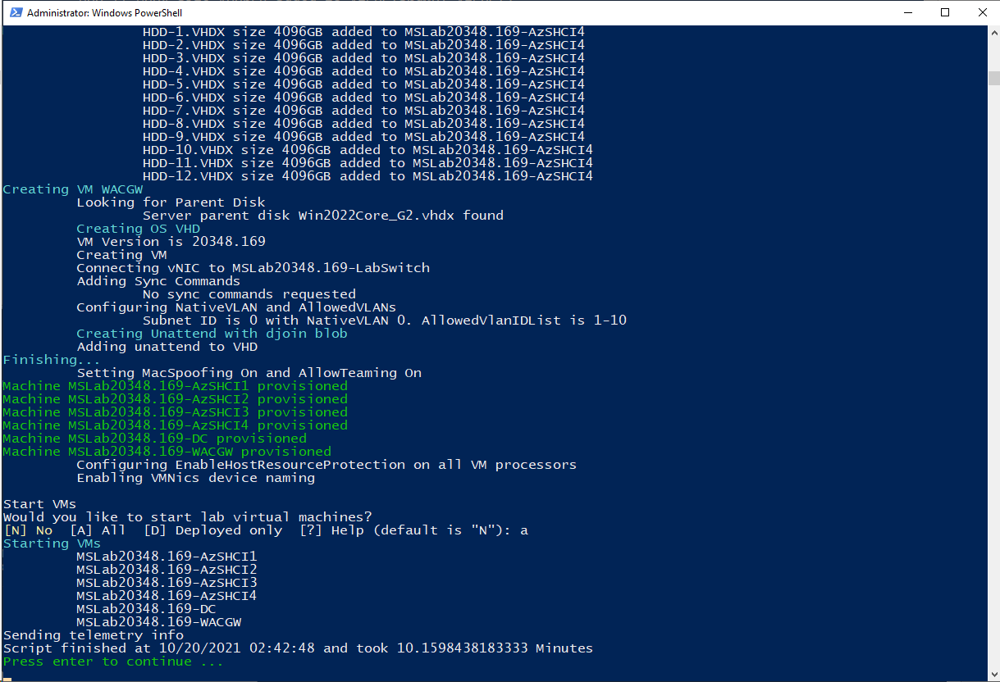


## Task 01 - Install management tools

Depending where you are running PowerShell from, you need to install management tools and PowerShell modules that will be used. It differs if management machine

**Step 1** Connect to DC virtual machine and open PowerShell from start menu (or by right-clicking on Start button, and selecting run PowerShell as Administrator)


**Step 2** In PowerShell paste following code to install management tools for Windows Server. Keep PowerShell open for next task.

```PowerShell
Install-WindowsFeature -Name RSAT-Clustering,RSAT-Clustering-Mgmt,RSAT-Clustering-PowerShell,RSAT-Hyper-V-Tools,RSAT-Feature-Tools-BitLocker-BdeAducExt,RSAT-Storage-Replica
 
```

## Task 02 - Perform Windows Update

**Step 1** Run following code to check minor os build number. Do not close PowerShell as same window should be used for entire lab.

```PowerShell
#Define servers as variable
$Servers="AzSHCI1","AzSHCI2","AzSHCI3","AzSHCI4"
#$Servers="AxNode1","AxNode2"

#check OS Build Number
$RegistryPath = 'HKLM:\SOFTWARE\Microsoft\Windows NT\CurrentVersion\'
$ComputersInfo  = Invoke-Command -ComputerName $servers -ScriptBlock {
    Get-ItemProperty -Path $using:RegistryPath
}
$ComputersInfo | Select-Object PSComputerName,CurrentBuildNumber,UBR
 
```

> Update level is determined by minor build number value. You can check it online [here](https://support.microsoft.com/en-us/topic/release-notes-for-azure-stack-hci-64c79b7f-d536-015d-b8dd-575f01090efd)

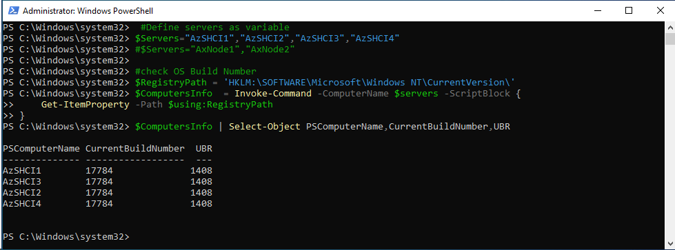

**Step 2** To update servers, you can run following PowerShell command. It will download and install patch tuesday updates.

```PowerShell
# create temporary virtual account to avoid double-hop issue while keeping secrets locally (unlike CredSSP)
Invoke-Command -ComputerName $servers -ScriptBlock {
    New-PSSessionConfigurationFile -RunAsVirtualAccount -Path $env:TEMP\VirtualAccount.pssc
    Register-PSSessionConfiguration -Name 'VirtualAccount' -Path $env:TEMP\VirtualAccount.pssc -Force
} -ErrorAction Ignore
# Run Windows Update via ComObject.
Invoke-Command -ComputerName $servers -ConfigurationName 'VirtualAccount' {
    $Searcher = New-Object -ComObject Microsoft.Update.Searcher
    $SearchCriteriaAllUpdates = "IsInstalled=0 and DeploymentAction='Installation' or
    IsPresent=1 and DeploymentAction='Uninstallation' or
    IsInstalled=1 and DeploymentAction='Installation' and RebootRequired=1 or
    IsInstalled=0 and DeploymentAction='Uninstallation' and RebootRequired=1"
    $SearchResult = $Searcher.Search($SearchCriteriaAllUpdates).Updates
    $Session = New-Object -ComObject Microsoft.Update.Session
    $Downloader = $Session.CreateUpdateDownloader()
    $Downloader.Updates = $SearchResult
    $Downloader.Download()
    $Installer = New-Object -ComObject Microsoft.Update.Installer
    $Installer.Updates = $SearchResult
    $Result = $Installer.Install()
    $Result
}
#remove temporary PSsession config
Invoke-Command -ComputerName $servers -ScriptBlock {
    Unregister-PSSessionConfiguration -Name 'VirtualAccount'
    Remove-Item -Path $env:TEMP\VirtualAccount.pssc
}
 
```


**Step 3** Optional - you can now reboot and validate version again. It is not necessary as reboot will be done later after installing features.

```PowerShell
#Restart servers
Restart-Computer -ComputerName $Servers -Protocol WSMan -Wait -For PowerShell -Force

#check OS Build Number
$RegistryPath = 'HKLM:\SOFTWARE\Microsoft\Windows NT\CurrentVersion\'
$ComputersInfo  = Invoke-Command -ComputerName $servers -ScriptBlock {
    Get-ItemProperty -Path $using:RegistryPath
}
$ComputersInfo | Select-Object PSComputerName,CurrentBuildNumber,UBR
 
```


## Task 03 - Configure basic settings on servers

**Step 1** Run following PowerShell script to configure Memory Dump settings and High Performance power plan.

> note: following script will configure High Performance power plan only on Physical Hardware (does not make sense on VMs)

```PowerShell
#Define servers as variable
$Servers="AzSHCI1","AzSHCI2","AzSHCI3","AzSHCI4"
#$Servers="AxNode1","AxNode2"

#Configure Active memory dump
Invoke-Command -ComputerName $servers -ScriptBlock {
    Set-ItemProperty -Path HKLM:\System\CurrentControlSet\Control\CrashControl -Name CrashDumpEnabled -value 1
    Set-ItemProperty -Path HKLM:\System\CurrentControlSet\Control\CrashControl -Name FilterPages -value 1
}

#Configure high performance power plan
    #set high performance if not VM
    Invoke-Command -ComputerName $servers -ScriptBlock {
        if ((Get-ComputerInfo).CsSystemFamily -ne "Virtual Machine"){
            powercfg /SetActive 8c5e7fda-e8bf-4a96-9a85-a6e23a8c635c
        }
    }
    #check settings
    Invoke-Command -ComputerName $servers -ScriptBlock {powercfg /list}
 
```

**Step 2** Run following script to install features and restart computers

> note: You can notice, that Hyper-V is installed with command "Enable-WindowsOptionalFeature". This will use DISM to push feature even it is not supported by hardware (in case it is nested, without exposing virtualization extensions)

```PowerShell
#install Hyper-V using DISM if Install-WindowsFeature fails (if nested virtualization is not enabled install-windowsfeature fails)
Invoke-Command -ComputerName $servers -ScriptBlock {
    $Result=Install-WindowsFeature -Name "Hyper-V" -ErrorAction SilentlyContinue
    if ($result.ExitCode -eq "failed"){
        Enable-WindowsOptionalFeature -FeatureName Microsoft-Hyper-V -Online -NoRestart 
    }
}

#define and install features
$features="Failover-Clustering","Hyper-V-PowerShell","Bitlocker","RSAT-Feature-Tools-BitLocker","Storage-Replica","RSAT-Storage-Replica","FS-Data-Deduplication","System-Insights","RSAT-System-Insights"
Invoke-Command -ComputerName $servers -ScriptBlock {Install-WindowsFeature -Name $using:features}

#restart and wait for computers
Restart-Computer $servers -Protocol WSMan -Wait -For PowerShell -Force
Start-Sleep 20 #Failsafe as Hyper-V needs 2 reboots and sometimes it happens, that during the first reboot the restart-computer evaluates the machine is up
#make sure computers are restarted
Foreach ($Server in $Servers){
    do{$Test= Test-NetConnection -ComputerName $Server -CommonTCPPort WINRM}while ($test.TcpTestSucceeded -eq $False)
}
 
```

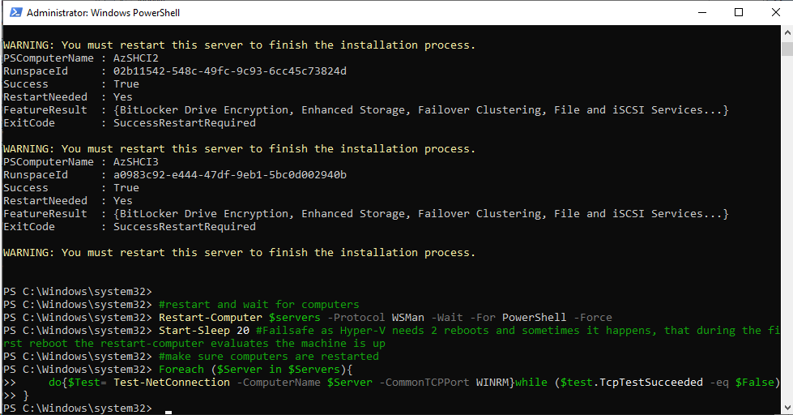

## Task 04 - Configure Networking

This lab assumes you have 2 or more network adapters converged. It means traffic for Management,Storage and VMs is using the same physical adapters and is splitted in logic defined in vSwitch.


Best practices are covered in Microsoft Documentation http://aka.ms/ConvergedRDMA 

You can also review deep dive into networking [MSLab scenario](https://github.com/microsoft/MSLab/tree/master/Scenarios/S2D%20and%20Networks%20deep%20dive) for more PowerShell examples.

**Step 1** Disable unused adapters - run following PowerShell code. In Virtual Environment there just two. In real systems, there might me multiple as you can see on screenshot below. It is useful to disable those as in Server Manager it will show with APIPA if not disabled

```PowerShell
#Define servers as variable
$Servers="AzSHCI1","AzSHCI2","AzSHCI3","AzSHCI4"
#$Servers="AxNode1","AxNode2"

Get-Netadapter -CimSession $Servers | Where-Object Status -ne "Up" | Disable-NetAdapter -Confirm:0
 
```

Before (physical server)


After (physical server)


> note: there is still one APIPA address on physical server. It is iDRAC USB network adapter that is used by OMIMSWAC extension.

**Step 2** First let's check if all fastest adapters support SR-IOV. If not, you can enable it in BIOS (not in iDRAC, has to be configured at interface level). If environment is virtual, script will return error as SRIOV is not available at all.

> to learn more about SR-IOV here: https://docs.microsoft.com/en-us/windows-hardware/drivers/network/overview-of-single-root-i-o-virtualization--sr-iov- and here https://www.youtube.com/watch?v=w-NBulzW_zE

> output will be empty in virtual environment

```PowerShell
$FastestLinkSpeed=(get-netadapter -cimsession $Servers | Where-Object Status -eq Up).Speed | Sort-Object -Descending | Select-Object -First 1
Get-NetAdapter -CimSession $Servers | Where-Object Status -eq Up | where-object Speed -eq $FastestLinkSpeed | Get-NetAdapterSRIOV -ErrorAction Ignore | Format-Table Name,Description,SriovSupport,Enabled,PSComputerName
 
```

Output on real servers

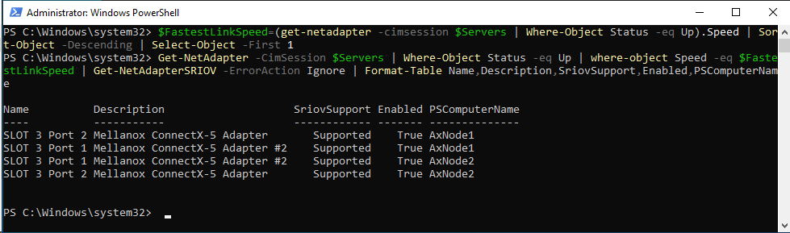


**Step 3** Grab fastest adapters and create virtual switch (you can notice $SRIOVSupport variable that can be adjusted). Script will attempt to create SR-IOV enabled vSwitch. If SR-IOV is not available, it will fail only enabling it (to enable you will need to recreate switch)

> note: we can safely assume, that NICs used in converged setup will be the ones that are connected and are the fastest.

```PowerShell
$SRIOVSupport=$True
#If SR-IOV is configured to $True, create vSwitch with SR-IOV
$vSwitchName="vSwitch"
Invoke-Command -ComputerName $servers -ScriptBlock {
    $FastestLinkSpeed=(get-netadapter | Where-Object Status -eq Up).Speed | Sort-Object -Descending | Select-Object -First 1
    $NetAdapters=Get-NetAdapter | Where-Object Status -eq Up | Where-Object Speed -eq $FastestLinkSpeed | Sort-Object Name
    if ($using:SRIOVSupport){
        New-VMSwitch -Name $using:vSwitchName -EnableEmbeddedTeaming $TRUE -EnableIov $true -NetAdapterName $NetAdapters.Name
    }else{
        New-VMSwitch -Name $using:vSwitchName -EnableEmbeddedTeaming $TRUE -NetAdapterName $NetAdapters.Name
    }
}
 
```

**Step 4** To validate vSwitch and SR-IOV support you can run following command

```PowerShell
Get-VMSwitch -CimSession $Servers | Select-Object Name,IOV*,ComputerName
 
```

Virtual Servers

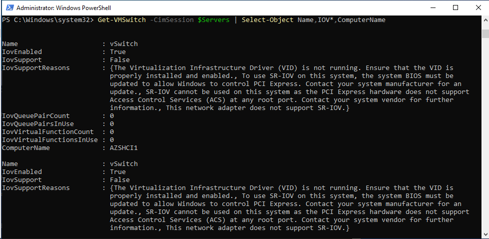

Physical servers with SR-IOV enabled in BIOS

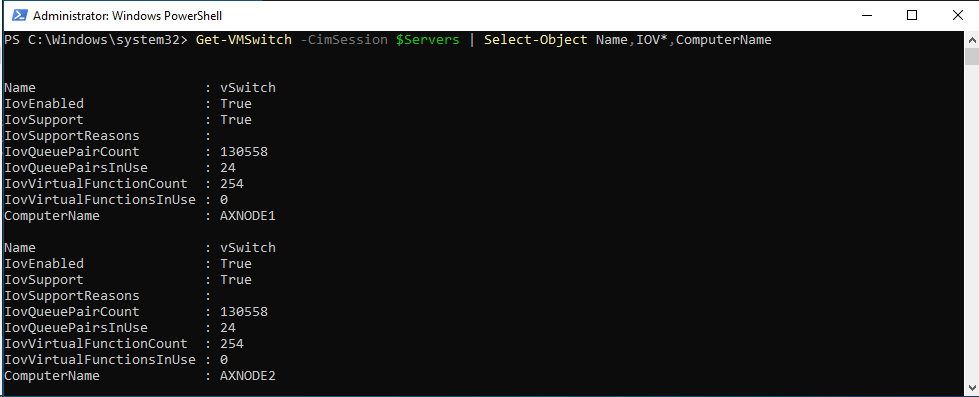

**Step 5** Configure vNICs. Each server should have vNIC for management and then NICs for SMB traffic (same amount of physical NICs to distribute traffic). So let's rename management vNIC and create SMB NICs.

```PowerShell
#rename Management vNIC first
Rename-VMNetworkAdapter -ManagementOS -Name $vSwitchName -NewName Management -CimSession $Servers


foreach ($Server in $Servers){
    #add SMB vNICs (number depends on how many NICs are connected to vSwitch)
    $SMBvNICsCount=(Get-VMSwitch -CimSession $Server -Name $vSwitchName).NetAdapterInterfaceDescriptions.Count
    foreach ($number in (1..$SMBvNICsCount)){
        $TwoDigitNumber="{0:D2}" -f $Number
        Add-VMNetworkAdapter -ManagementOS -Name "SMB$TwoDigitNumber" -SwitchName $vSwitchName -CimSession $Server
    }
}
 
```

**Step 6** Validate vNICs that were just created. You should see one Management and one SMB per physical NIC (in this case SMB01 and SMB02 on each server)

```PowerShell
Get-VMNetworkAdapter -CimSession $Servers -ManagementOS
 
```

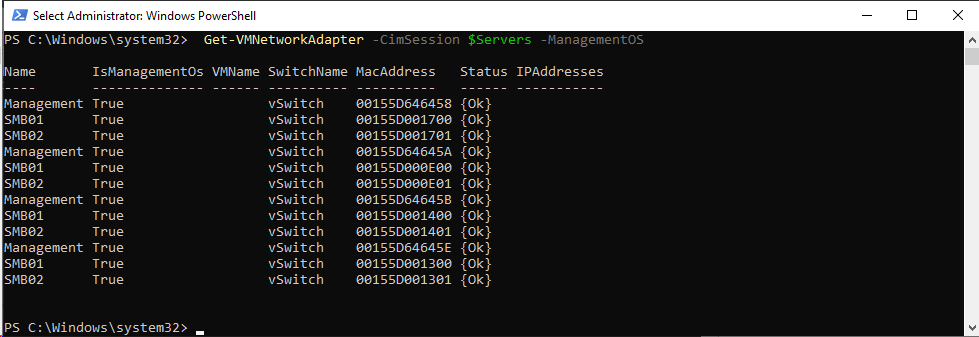

**Step 7** Configure IP Addresses.

> Let's assume that there will be two subnets. Each subnet will be used only in one switch. Same will apply for VLANs. Let's say VLAN 01, Subnet 172.16.1.0 for Switch 1 and VLAN 02, Subnet 172.16.2.0 for Switch 2

```PowerShell
$Stornet1="172.16.1."
$Stornet2="172.16.2."
$IP=1 #Start IP
foreach ($Server in $Servers){
    $SMBvNICsCount=(Get-VMSwitch -CimSession $Server -Name $vSwitchName).NetAdapterInterfaceDescriptions.Count
    foreach ($number in (1..$SMBvNICsCount)){
        $TwoDigitNumber="{0:D2}" -f $Number
        if ($number % 2 -eq 1){
            New-NetIPAddress -IPAddress ($StorNet1+$IP.ToString()) -InterfaceAlias "vEthernet (SMB$TwoDigitNumber)" -CimSession $Server -PrefixLength 24
        }else{
            New-NetIPAddress -IPAddress ($StorNet2+$IP.ToString()) -InterfaceAlias "vEthernet (SMB$TwoDigitNumber)" -CimSession $Server -PrefixLength 24
            $IP++
        }
    }
}
 
```

**Step 8** Validate IP Addresses

> As you can see, there are two subnets. Each odd and even adapter has it's own subnet.

```PowerShell
 Get-NetIPAddress -CimSession $Servers -InterfaceAlias vEthernet* -AddressFamily IPv4 |Sort-Object IPAddress | Select-Object IPAddress,InterfaceAlias,PSComputerName
 
```

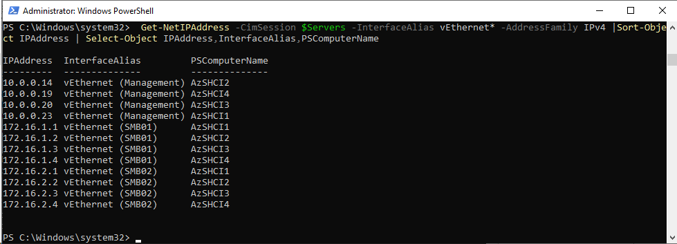

**Step 9** Configure VLANs.

> It is best practice to configure storage NICs to use VLANs as it is needed for QoS to work correctly.

```PowerShell
$StorVLAN1=1
$StorVLAN2=2

#configure Odds and Evens for VLAN1 and VLAN2
foreach ($Server in $Servers){
    $NetAdapters=Get-VMNetworkAdapter -CimSession $server -ManagementOS -Name *SMB* | Sort-Object Name
    $i=1
    foreach ($NetAdapter in $NetAdapters){
        if (($i % 2) -eq 1){
            Set-VMNetworkAdapterVlan -VMNetworkAdapterName $NetAdapter.Name -VlanId $StorVLAN1 -Access -ManagementOS -CimSession $Server
            $i++
        }else{
            Set-VMNetworkAdapterVlan -VMNetworkAdapterName $NetAdapter.Name -VlanId $StorVLAN2 -Access -ManagementOS -CimSession $Server
            $i++
        }
    }
}
#Restart each host vNIC adapter so that the Vlan is active.
Get-NetAdapter -CimSession $Servers -Name "vEthernet (SMB*)" | Restart-NetAdapter
 
```

**Step 10** Enable RDMA on vNICs

```PowerShell
#Enable RDMA on the host vNIC adapters
Enable-NetAdapterRDMA -Name "vEthernet (SMB*)" -CimSession $Servers
 
```

**Step 11** Configure vNICs to pNICs mapping

vNICs to pNICs mapping is important because of using both physical adapters. Without this, storage traffic could end up on one physical interface only.

```PowerShell
#Associate each of the vNICs configured for RDMA to a physical adapter that is up and is not virtual (to be sure that each RDMA enabled ManagementOS vNIC is mapped to separate RDMA pNIC)
Invoke-Command -ComputerName $servers -ScriptBlock {
    #grab adapter names
    $physicaladapternames=(get-vmswitch $using:vSwitchName).NetAdapterInterfaceDescriptions
    #map pNIC and vNICs
    $vmNetAdapters=Get-VMNetworkAdapter -Name "SMB*" -ManagementOS
    $i=0
    foreach ($vmNetAdapter in $vmNetAdapters){
        $TwoDigitNumber="{0:D2}" -f ($i+1)
        Set-VMNetworkAdapterTeamMapping -VMNetworkAdapterName "SMB$TwoDigitNumber" -ManagementOS -PhysicalNetAdapterName (get-netadapter -InterfaceDescription $physicaladapternames[$i]).name
        $i++
    }
}
 
```

**Step 12** Configure Datacenter Bridging (QoS)

> Following script is configuring best practices as recommended by Microsoft in Network ATC guide https://docs.microsoft.com/en-us/azure-stack/hci/deploy/network-atc#default-data-center-bridging-dcb-configurationw

```PowerShell
#Install DCB
Invoke-Command -ComputerName $Servers -ScriptBlock {Install-WindowsFeature -Name "Data-Center-Bridging"} 

##Configure QoS
New-NetQosPolicy "SMB"       -NetDirectPortMatchCondition 445 -PriorityValue8021Action 3 -CimSession $servers
New-NetQosPolicy "ClusterHB" -Cluster                         -PriorityValue8021Action 7 -CimSession $servers
New-NetQosPolicy "Default"   -Default                         -PriorityValue8021Action 0 -CimSession $servers

#Turn on Flow Control for SMB
Invoke-Command -ComputerName $servers -ScriptBlock {Enable-NetQosFlowControl -Priority 3}

#Disable flow control for other traffic than 3 (pause frames should go only from prio 3)
Invoke-Command -ComputerName $servers -ScriptBlock {Disable-NetQosFlowControl -Priority 0,1,2,4,5,6,7}

#Disable Data Center bridging exchange (disable accept data center bridging (DCB) configurations from a remote device via the DCBX protocol, which is specified in the IEEE data center bridging (DCB) standard.)
Invoke-Command -ComputerName $servers -ScriptBlock {Set-NetQosDcbxSetting -willing $false -confirm:$false}

#Configure IeeePriorityTag
#IeePriorityTag needs to be On if you want tag your nonRDMA traffic for QoS. Can be off if you use adapters that pass vSwitch (both SR-IOV and RDMA bypasses vSwitch)
Invoke-Command -ComputerName $servers -ScriptBlock {Set-VMNetworkAdapter -ManagementOS -Name "SMB*" -IeeePriorityTag on}

#Apply policy to the target adapters.  The target adapters are adapters connected to vSwitch
Invoke-Command -ComputerName $servers -ScriptBlock {Enable-NetAdapterQos -InterfaceDescription (Get-VMSwitch).NetAdapterInterfaceDescriptions}

#Create a Traffic class and give SMB Direct 50% of the bandwidth minimum. The name of the class will be "SMB".
#This value needs to match physical switch configuration. Value might vary based on your needs.
#If connected directly (in 2 node configuration) skip this step.
Invoke-Command -ComputerName $servers -ScriptBlock {New-NetQosTrafficClass "SMB"       -Priority 3 -BandwidthPercentage 50 -Algorithm ETS}
Invoke-Command -ComputerName $servers -ScriptBlock {New-NetQosTrafficClass "ClusterHB" -Priority 7 -BandwidthPercentage 1 -Algorithm ETS}
 
```

Result - VMs. You can notice error configuring NetAdapter QOS as Hyper-V Network adapter does not support it.


Result - Physical Servers


**Step 13** *If iWARP is used*, then Firewall Rule that allows iWARP traffic needs to be enabled

```PowerShell
Enable-NetFirewallRule -Name "FPSSMBD-iWARP-In-TCP" -CimSession $servers
 
```

## Task 05 - Validate Networking

**Step 1** Check Virtual Switches and virtual NICs

```PowerShell
#validate vSwitch
Get-VMSwitch -CimSession $servers
#validate vNICs
Get-VMNetworkAdapter -CimSession $servers -ManagementOS
 
```


**Step 2** Check vNICs to pNICs mapping

```PowerShell
#validate vNICs to pNICs mapping
Get-VMNetworkAdapterTeamMapping -CimSession $servers -ManagementOS | Format-Table ComputerName,NetAdapterName,ParentAdapter
 
```

Result - VMs

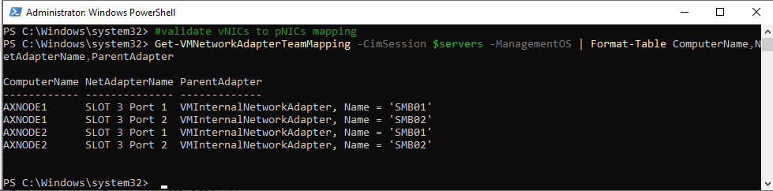

Result - Physical Servers


**Step 3** Check JumboFrames setting

> note: in this lab was default value used (1514).

```PowerShell
#validate JumboFrames setting
Get-NetAdapterAdvancedProperty -CimSession $servers -DisplayName "Jumbo Packet"
 
```

Result - VMs


Result - Physical Servers


**Step 4** Check RDMA Settings

```PowerShell
#verify RDMA settings
Get-NetAdapterRdma -CimSession $servers | Sort-Object -Property Systemname | Format-Table systemname,interfacedescription,name,enabled -AutoSize -GroupBy Systemname
 
```

Result - VMs (notice RDMA is disabled on "physical adapters" - Microsoft Hyper-V Network Adatper)


Result - real hardware


**Step 5** Check VLANs

```PowerShell
#validate if VLANs were set
Get-VMNetworkAdapterVlan -CimSession $Servers -ManagementOS
 
```

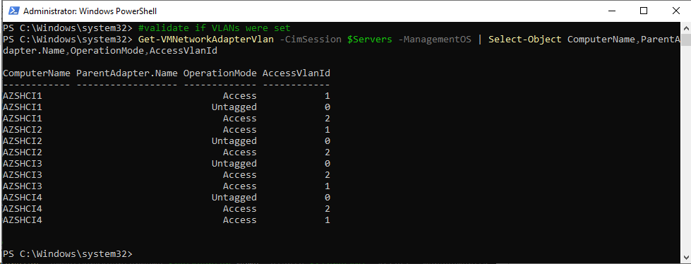

**Step 6** Check IP Config

```PowerShell
#verify ip config 
Get-NetIPAddress -CimSession $servers -InterfaceAlias vEthernet* -AddressFamily IPv4 | Sort-Object -Property PSComputerName | Format-Table PSComputerName,interfacealias,ipaddress -AutoSize -GroupBy pscomputername
 
```

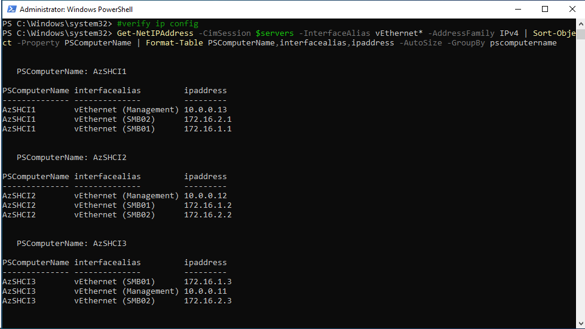


**Step 7** Check DCBX Settings

```PowerShell
#Validate DCBX setting
Invoke-Command -ComputerName $servers -ScriptBlock {Get-NetQosDcbxSetting} | Sort-Object PSComputerName | Format-Table Willing,PSComputerName
 
```


**Step 7** Check QoS Policy

> note: there will be no result in Virtual Machines

```PowerShell
#validate policy (no result in VMs since it's not available there)
Invoke-Command -ComputerName $servers -ScriptBlock {Get-NetAdapterQos | Where-Object enabled -eq true} | Sort-Object PSComputerName
 
```

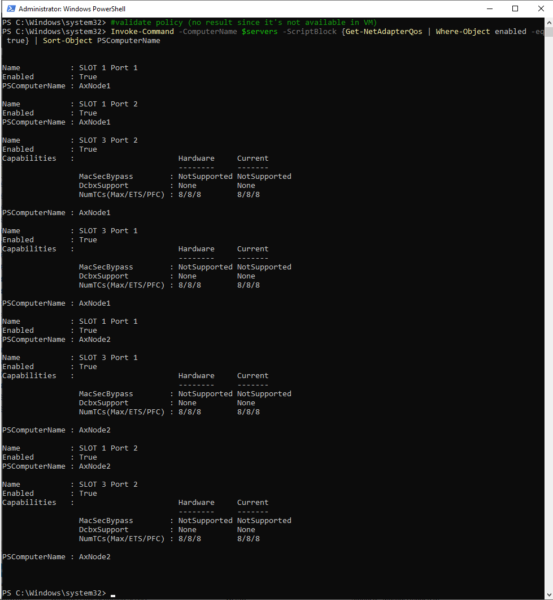

**Step 8** Check flow control settings

```PowerShell
#validate flow control setting
Invoke-Command -ComputerName $servers -ScriptBlock {Get-NetQosFlowControl} | Sort-Object  -Property PSComputername | Format-Table PSComputerName,Priority,Enabled -GroupBy PSComputerName
 
```


**Step 9** Check QoS Traffic Classes

```PowerShell
#validate QoS Traffic Classes
Invoke-Command -ComputerName $servers -ScriptBlock {Get-NetQosTrafficClass} |Sort-Object PSComputerName |Select-Object PSComputerName,Name,PriorityFriendly,Bandwidth
 
```

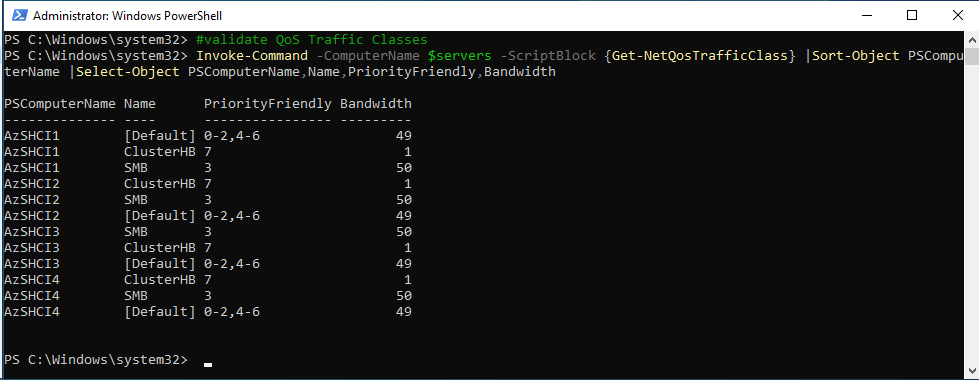

## Task 06 - Create and configure Cluster

**Step 1** Test if cluster is ready to be enabled and create cluster

> note: the PowerShell code below shows three examples how to create cluster. The most traditional way is to create cluster with static IP Address. The modern way is to use Distributed Domain Name. This way, there is no extra IP Needed and in DNS are each node IP addresses added to cluster name record.

> note: physical hardware - AX Nodes do have USB network adapters that are used by OpenManage Windows Admin Center extension to collect data from each node

```PowerShell
$ClusterName="AzSHCI-Cluster"
$Servers="AzSHCI1","AzSHCI2","AzSHCI3","AzSHCI4"
$ClusterIP="10.0.0.111"
#$ClusterName="Ax6515-Cluster"
#$Servers="AxNode1","AxNode2"

#Disable USB NIC used by iDRAC to communicate to host just for test-cluster (only applies to physical servers)
$USBNics=get-netadapter -CimSession $Servers -InterfaceDescription "Remote NDIS Compatible Device" -ErrorAction Ignore
if ($USBNics){
    Disable-NetAdapter -CimSession $Servers -InterfaceDescription "Remote NDIS Compatible Device" -Confirm:0
}

#Test cluster first
Test-Cluster -Node $servers -Include "Storage Spaces Direct","Inventory","Network","System Configuration","Hyper-V Configuration"

#Traditional Cluster with Static IP
New-Cluster -Name $ClusterName -Node $servers -StaticAddress $ClusterIP
#Cluster with IP from DHCP
#New-Cluster -Name $ClusterName -Node $servers
#Cluster with Distributed Domain Name
#New-Cluster -Name $ClusterName -Node $servers -ManagementPointNetworkType "Distributed"

#Enable USB NICs again
if ($USBNics){
    Enable-NetAdapter -CimSession $Servers -InterfaceDescription "Remote NDIS Compatible Device" -Confirm:0
}
 
```

* [Validation report - VMs](./media/ValidatinReportVMs.htm)

* [Validation report -Physical Servers](./media/ValidationReportAX6515.htm)

**Step 2** Configure witness

There are two options for witness - file share witness or Cloud Witness. Below you will find an example for both.

**Step 2.a** File Share Witness

```PowerShell
#Configure Witness
    $WitnessServer="DC"
    #Create new directory
        $WitnessName=$Clustername+"Witness"
        Invoke-Command -ComputerName $WitnessServer -ScriptBlock {new-item -Path c:\Shares -Name $using:WitnessName -ItemType Directory}
        $accounts=@()
        $accounts+="corp\$ClusterName$"
        $accounts+="corp\Domain Admins"
        New-SmbShare -Name $WitnessName -Path "c:\Shares\$WitnessName" -FullAccess $accounts -CimSession $WitnessServer
    #Set NTFS permissions 
        Invoke-Command -ComputerName $WitnessServer -ScriptBlock {(Get-SmbShare $using:WitnessName).PresetPathAcl | Set-Acl}
    #Set Quorum
        Set-ClusterQuorum -Cluster $ClusterName -FileShareWitness "\\$WitnessServer\$WitnessName"
 
```


**Step 2.b** or Configure Cloud Witness

```PowerShell
$ResourceGroupName="AzSHCICloudWitness"
$StorageAccountName="azshcicloudwitness$(Get-Random -Minimum 100000 -Maximum 999999)"

#make sure PowerShell modules are present
Install-PackageProvider -Name NuGet -MinimumVersion 2.8.5.201 -Force
$ModuleNames="Az.Accounts","Az.Resources","Az.Storage"
foreach ($ModuleName in $ModuleNames){
    Install-Module -Name $ModuleName -Force
}

#login to Azure
if (-not (Get-AzContext)){
    Connect-AzAccount -UseDeviceAuthentication
}
#select context if more available
$context=Get-AzContext -ListAvailable
if (($context).count -gt 1){
    $context | Out-GridView -OutputMode Single | Set-AzContext
}
#Create resource group
$Location=Get-AzLocation | Where-Object Providers -Contains "Microsoft.Storage" | Out-GridView -OutputMode Single
#create resource group first
if (-not(Get-AzResourceGroup -Name $ResourceGroupName -ErrorAction Ignore)){
    New-AzResourceGroup -Name $ResourceGroupName -Location $location.Location
}
#create Storage Account
If (-not(Get-AzStorageAccountKey -Name $StorageAccountName -ResourceGroupName $ResourceGroupName -ErrorAction Ignore)){
    New-AzStorageAccount -ResourceGroupName $ResourceGroupName -Name $StorageAccountName -SkuName Standard_LRS -Location $location.location -Kind StorageV2 -AccessTier Cool 
}
$StorageAccountAccessKey=(Get-AzStorageAccountKey -Name $StorageAccountName -ResourceGroupName $ResourceGroupName | Select-Object -First 1).Value

#Configure Witness
Set-ClusterQuorum -Cluster $ClusterName -CloudWitness -AccountName $StorageAccountName -AccessKey $StorageAccountAccessKey -Endpoint "core.windows.net"
 
```

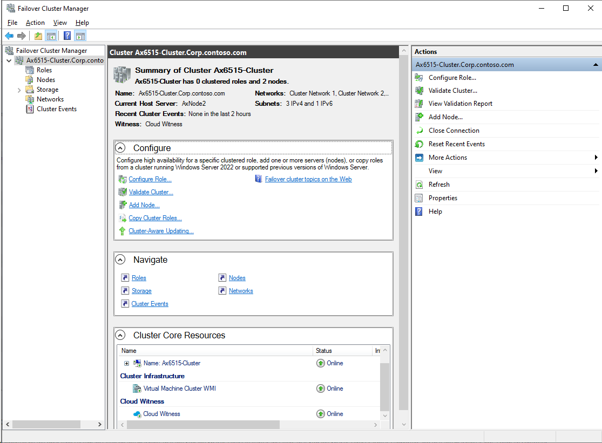

**Step 3** Configure cluster networks

```PowerShell
$Stornet1="172.16.1."
$Stornet2="172.16.2."
(Get-ClusterNetwork -Cluster $clustername | Where-Object Address -eq $StorNet1"0").Name="SMB01"
(Get-ClusterNetwork -Cluster $clustername | Where-Object Address -eq $StorNet2"0").Name="SMB02"¨

#Rename Management Network
(Get-ClusterNetwork -Cluster $clustername | Where-Object Role -eq "ClusterAndClient").Name="Management"

#Rename and Configure USB NICs
$USBNics=get-netadapter -CimSession $Servers -InterfaceDescription "Remote NDIS Compatible Device" -ErrorAction Ignore
if ($USBNics){
    $Network=(Get-ClusterNetworkInterface -Cluster $ClusterName | Where-Object Adapter -eq "Remote NDIS Compatible Device").Network | Select-Object -Unique
    $Network.Name="iDRAC"
    $Network.Role="none"
}
 
```

Before (physical server)

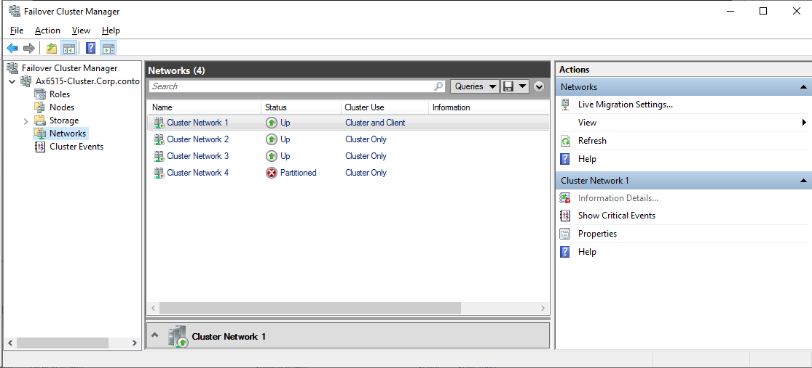

After (physical server)

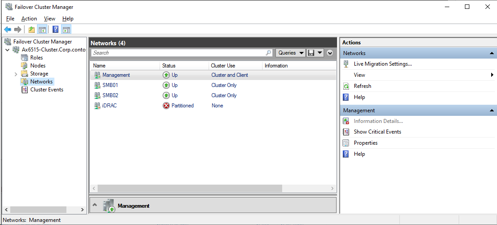

**Step 4** Configure Live Migration settings

Following Script will configure cluster network for Live Migration, configure this network to use SMB and will configure live migration limits - so live migration will not consume entire East-West bandwidth. And

```PowerShell
#configure Live Migration 
Get-ClusterResourceType -Cluster $clustername -Name "Virtual Machine" | Set-ClusterParameter -Name MigrationExcludeNetworks -Value ([String]::Join(";",(Get-ClusterNetwork -Cluster $clustername | Where-Object {$_.Role -ne "Cluster"}).ID))
Set-VMHost -VirtualMachineMigrationPerformanceOption SMB -cimsession $servers

#Configure SMB Bandwidth Limits for Live Migration https://techcommunity.microsoft.com/t5/Failover-Clustering/Optimizing-Hyper-V-Live-Migrations-on-an-Hyperconverged/ba-p/396609
    #install feature
    Invoke-Command -ComputerName $servers -ScriptBlock {Install-WindowsFeature -Name "FS-SMBBW"}
    #Calculate 40% of capacity of NICs in vSwitch (considering 2 NICs, if 1 fails, it will not consume all bandwith, therefore 40%)
    $Adapters=(Get-VMSwitch -CimSession $Servers[0]).NetAdapterInterfaceDescriptions
    $BytesPerSecond=((Get-NetAdapter -CimSession $Servers[0] -InterfaceDescription $adapters).TransmitLinkSpeed | Measure-Object -Sum).Sum/8
    Set-SmbBandwidthLimit -Category LiveMigration -BytesPerSecond ($BytesPerSecond*0.4) -CimSession $Servers
 
```

Before


After

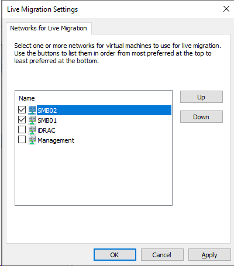

## Task 08 - Enable Storage Spaces Direct and create Volumes

**Step 1** Delete pool (if the same physical disks were used Azure Stack HCI).

> This code will wipe spaces metadata from all disks that were previously used for spaces and are available to pool

```PowerShell
$DeletePool=$false
#Wipe disks
if ($DeletePool){
    #Grab pool
    $StoragePool=Get-StoragePool -CimSession $ClusterName -IsPrimordial $False -ErrorAction Ignore
    #Wipe Virtual disks if any
    if ($StoragePool){
        $Clusterresource=Get-ClusterResource -Cluster $ClusterName | Where-Object ResourceType -eq "Storage Pool"
        if ($Clusterresource){
            $Clusterresource | Remove-ClusterResource -Force
        }
        $StoragePool | Set-StoragePool -IsReadOnly $False
        $VirtualDisks=$StoragePool | Get-VirtualDisk -ErrorAction Ignore
        #Remove Disks
        if ($VirtualDisks){
            $VirtualDisks | Remove-VirtualDisk -Confirm:0
        }
        #Remove Pool
        $StoragePool | Remove-StoragePool -Confirm:0
    }
    #Reset disks (to clear spaces metadata)
    Invoke-Command -ComputerName $Servers -ScriptBlock {
        Get-PhysicalDisk -CanPool $True | Reset-PhysicalDisk
    }
}
 
```

**Step 2** Enable Storage Spaces Direct

```PowerShell
#Enable-ClusterS2D
Enable-ClusterS2D -CimSession $ClusterName -confirm:0 -Verbose
 
```

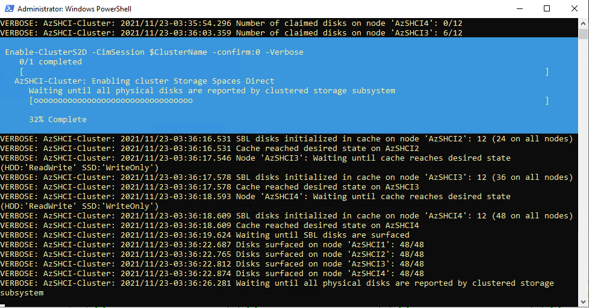

**Step 3** Explore Pool and Tiers created

```PowerShell
#display pool
    Get-StoragePool "S2D on $ClusterName" -CimSession $ClusterName

#Display disks
    Get-StoragePool "S2D on $ClusterName" -CimSession $ClusterName | Get-PhysicalDisk -CimSession $ClusterName

#Get Storage Tiers
    Get-StorageTier -CimSession $ClusterName
 
```


**Step 4** Calculate volume size first

> Following script will do calculation what maximum size volume can be assuming you will use just 4 three-way mirror volumes across 4 nodes. As you can see, it will make it slightly smaller to keep reserve for Performance History volume and metadata

```PowerShell
#calculate reserve
$pool=Get-StoragePool -CimSession $clustername -FriendlyName s2D*
$HDDCapacity= ($pool |Get-PhysicalDisk -CimSession $clustername | where-object mediatype -eq HDD | Measure-Object -Property Size -Sum).Sum
$HDDMaxSize=  ($pool |Get-PhysicalDisk -CimSession $clustername | where-object mediatype -eq HDD | Measure-Object -Property Size -Maximum).Maximum
$SSDCapacity= ($pool |Get-PhysicalDisk -CimSession $clustername | where-object mediatype -eq SSD | where-object usage -ne journal | Measure-Object -Property Size -Sum).Sum
$SSDMaxSize=  ($pool |Get-PhysicalDisk -CimSession $clustername | where-object mediatype -eq SSD | where-object usage -ne journal | Measure-Object -Property Size -Maximum).Maximum

$numberofNodes=(Get-ClusterNode -Cluster $clustername).count
if ($numberofNodes -eq 2){
    if ($SSDCapacity){
    $SSDCapacityToUse=$SSDCapacity-($numberofNodes*$SSDMaxSize)-100GB #100GB just some reserve (16*3 = perfhistory)+some spare capacity
    $sizeofvolumeonSSDs=$SSDCapacityToUse/2/$numberofNodes
    }
    if ($HDDCapacity){
    $HDDCapacityToUse=$HDDCapacity-($numberofNodes*$HDDMaxSize)-100GB #100GB just some reserve (16*3 = perfhistory)+some spare capacity
    $sizeofvolumeonHDDs=$HDDCapacityToUse/2/$numberofNodes
    }
}else{
    if ($SSDCapacity){
    $SSDCapacityToUse=$SSDCapacity-($numberofNodes*$SSDMaxSize)-100GB #100GB just some reserve (16*3 = perfhistory)+some spare capacity
    $sizeofvolumeonSSDs=$SSDCapacityToUse/3/$numberofNodes
    }
    if ($HDDCapacity){
    $HDDCapacityToUse=$HDDCapacity-($numberofNodes*$HDDMaxSize)-100GB #100GB just some reserve (16*3 = perfhistory)+some spare capacity
    $sizeofvolumeonHDDs=$HDDCapacityToUse/3/$numberofNodes
    }
}
$sizeofvolumeonSSDs/1TB
$sizeofvolumeonHDDs/1TB
 
```

> from screenshot below, you can see that in simulated environment is size of volume roughly 14.6TB

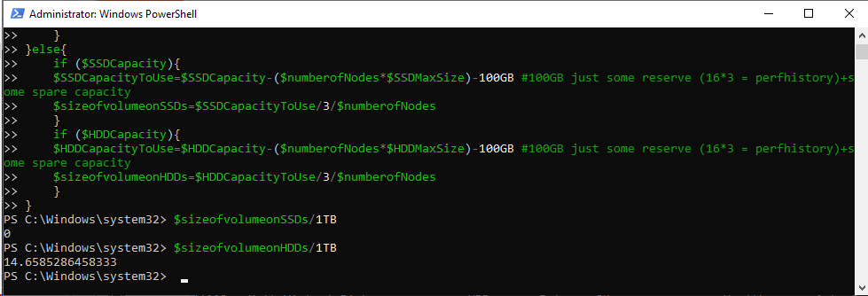

**Step 5** Create volumes

> You can notice this script is universal and will work for both SSDs and HDDs capacity.

> Thin provisioning is available in Azure Stack HCI version 21H2 and newer

> Note: it might be also useful to specify Mediatype perameter in New-Volume command (as per below example) in case you would have three-tier solution. It does not hurt, and in case both SSDs and HDDs are capacity devices, without this parameter the volume would span both tiers resulting in uneven performance

```PowerShell
$ThinVolumes=$True
#configure Pool to default to Thin Provisioning
if ($ThinVolumes){
    Set-StoragePool -CimSession $ClusterName -FriendlyName "S2D on $ClusterName" -ProvisioningTypeDefault Thin
}
#create volumes
1..$numberofNodes | ForEach-Object {
    if ($sizeofvolumeonHDDs){
        New-Volume -CimSession $ClusterName -FileSystem CSVFS_ReFS -StoragePoolFriendlyName S2D* -Size $sizeofvolumeonHDDs -FriendlyName "Volume$_" -MediaType HDD
    }
    if ($sizeofvolumeonSSDs){
        New-Volume -CimSession $ClusterName -FileSystem CSVFS_ReFS -StoragePoolFriendlyName S2D* -Size $sizeofvolumeonSSDs -FriendlyName "Volume$_" -MediaType SSD
    }
}
 
```


**Step 6** Check if volumes are thin provisioned

> There are two indicators that volumes are thin provisioned. With basic command get-virtualdisk you will notice much smaller footprint on pool

```PowerShell
Get-VirtualDisk -CimSession $ClusterName
 
```


> And with slightly more comlex command

```PowerShell
Get-VirtualDisk -CimSession $ClusterName | Select-Object FriendlyName,ProvisioningType
 
```


## Task 09 - Register Azure Stack HCI cluster to Azure

**Step 1** Download prerequisites and log in into Azure

> You can notice, that log in is using device authentication. This means you will not have to log in on the machine you are running script, but in another - like the one you trust.

```PowerShell
    $ClusterName="AzSHCI-Cluster"

    #download Azure module
    Install-PackageProvider -Name NuGet -MinimumVersion 2.8.5.201 -Force
    if (!(Get-InstalledModule -Name Az.StackHCI -ErrorAction Ignore)){
        Install-Module -Name Az.StackHCI -Force
    }

    #login to azure
    #download Azure module
    if (!(Get-InstalledModule -Name az.accounts -ErrorAction Ignore)){
        Install-Module -Name Az.Accounts -Force
    }
    Login-AzAccount -UseDeviceAuthentication

    #select context if more available
    $context=Get-AzContext -ListAvailable
    if (($context).count -gt 1){
        $context=$context | Out-GridView -OutputMode Single
        $context | Set-AzContext
    }
    #load subscription ID into variable
    $subscriptionID=$context.subscription.id
 
```

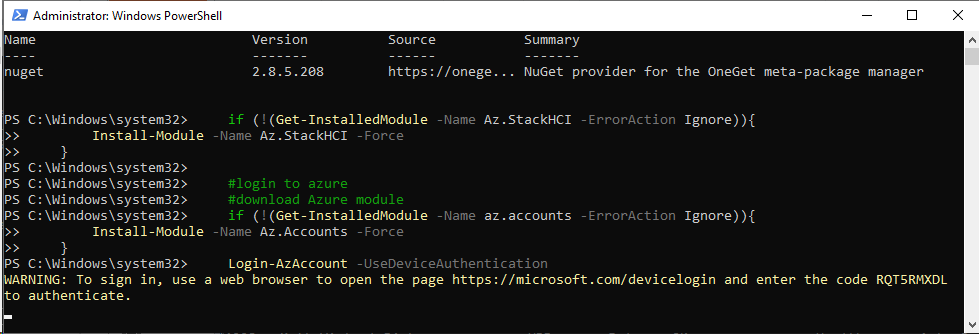


**Step 2** Register Azure Stack HCI without asking for credentials again and with Resource Group of your choice.

> Notice in following script, that you will be able to choose location for Azure Stack HCI based on availability.

```PowerShell
$ResourceGroupName="" #Optional, if not specified, default will be used
if (!(Get-InstalledModule -Name Az.Resources -ErrorAction Ignore)){
    Install-Module -Name Az.Resources -Force
}
#choose location for cluster (and RG)
$region=(Get-AzLocation | Where-Object Providers -Contains "Microsoft.AzureStackHCI" | Out-GridView -OutputMode Single -Title "Please select Location for AzureStackHCI metadata").Location
If (-not (Get-AzResourceGroup -Name $ResourceGroupName -ErrorAction Ignore)){
    New-AzResourceGroup -Name $ResourceGroupName -Location $region
}
#Register AZSHCi without prompting for creds
$armTokenItemResource = "https://management.core.windows.net/"
$graphTokenItemResource = "https://graph.windows.net/"
$azContext = Get-AzContext
$authFactory = [Microsoft.Azure.Commands.Common.Authentication.AzureSession]::Instance.AuthenticationFactory
$graphToken = $authFactory.Authenticate($azContext.Account, $azContext.Environment, $azContext.Tenant.Id, $null, [Microsoft.Azure.Commands.Common.Authentication.ShowDialog]::Never, $null, $graphTokenItemResource).AccessToken
$armToken = $authFactory.Authenticate($azContext.Account, $azContext.Environment, $azContext.Tenant.Id, $null, [Microsoft.Azure.Commands.Common.Authentication.ShowDialog]::Never, $null, $armTokenItemResource).AccessToken
$id = $azContext.Account.Id
#Register-AzStackHCI -SubscriptionID $subscriptionID -ComputerName $ClusterName -GraphAccessToken $graphToken -ArmAccessToken $armToken -AccountId $id
if ($ResourceGroupName){
    Register-AzStackHCI -Region $Region -SubscriptionID $subscriptionID -ComputerName  $ClusterName -GraphAccessToken $graphToken -ArmAccessToken $armToken -AccountId $id -ResourceName $ClusterName -ResourceGroupName $ResourceGroupName
}else{
    Register-AzStackHCI -Region $Region -SubscriptionID $subscriptionID -ComputerName  $ClusterName -GraphAccessToken $graphToken -ArmAccessToken $armToken -AccountId $id -ResourceName $ClusterName
}
 
```

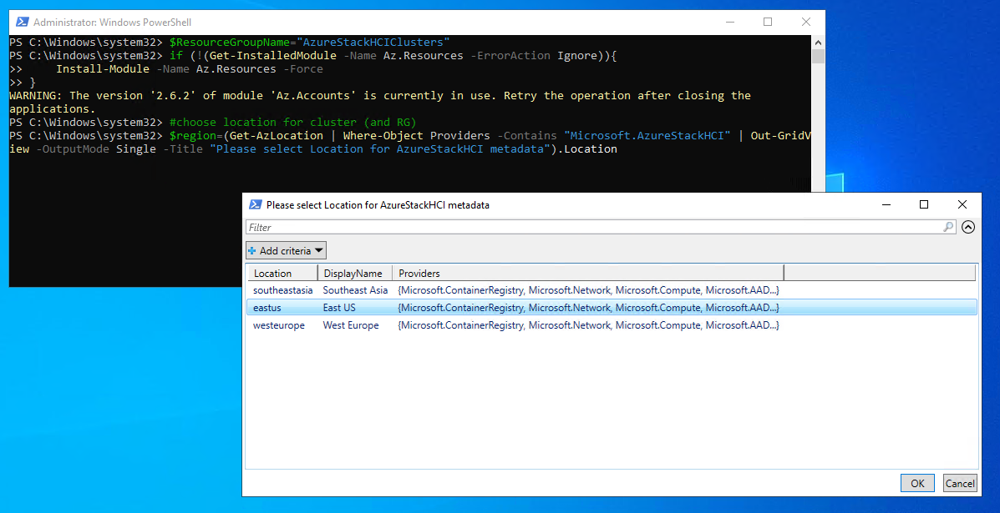

**Step 3** If arc registration fails - as per above example, you can explore logs with following PowerShell

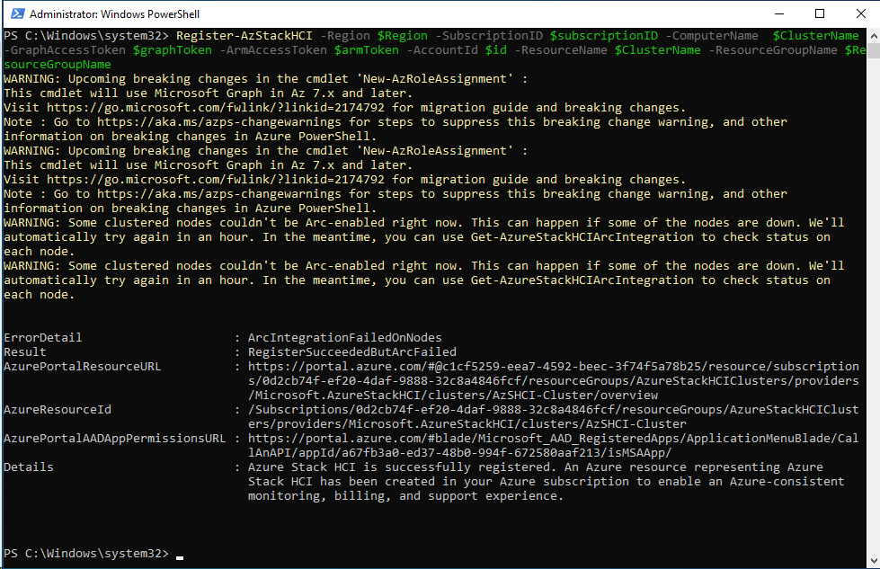

> Issue can be tracked here: https://github.com/Azure/azure-powershell/issues/16477

```PowerShell
#Validate task and start it
    $ArcRegistrationTaskName = "ArcRegistrationTask"
    Get-ClusteredScheduledTask -Cluster $ClusterName -TaskName $ArcRegistrationTaskName
    Get-ScheduledTask -CimSession (Get-ClusterNode -Cluster $ClusterName).Name -TaskName $ArcRegistrationTaskName | Start-ScheduledTask

#explore arc install logs
    Invoke-Command -ComputerName $ClusterName -Scriptblock {Get-ChildItem -Path c:\windows\Tasks\ArcForServers | Get-Content}
 
```
> Looks like the script attmpted to use different Resource Group than provided. 


**Step 4** To fix issue, let's provide initialize arc registration again

```PowerShell
if (-not (Get-AzContext)){
    Login-AzAccount -UseDeviceAuthentication
}
function Get-GraphAccessToken{
    param(
        [string] $TenantId,
        [string] $EnvironmentName
        )
    
        # Below commands ensure there is graph access token in cache
        Get-AzADApplication -DisplayName SomeApp1 -ErrorAction Ignore | Out-Null
    
        $graphTokenItemResource = (Get-AzContext).Environment.GraphUrl
    
        $authFactory = [Microsoft.Azure.Commands.Common.Authentication.AzureSession]::Instance.AuthenticationFactory
        $azContext = Get-AzContext
        $graphTokenItem = $authFactory.Authenticate($azContext.Account, $azContext.Environment, $azContext.Tenant.Id, $null, [Microsoft.Azure.Commands.Common.Authentication.ShowDialog]::Never, $null, $graphTokenItemResource)
        return $graphTokenItem.AccessToken
    }
    
$azContext = Get-AzContext
$TenantId = $azContext.Tenant.Id
$AccountId = $azContext.Account.Id
$GraphAccessToken = Get-GraphAccessToken -TenantId $TenantId -EnvironmentName $EnvironmentName

Connect-AzureAD -TenantId $TenantId -AadAccessToken $GraphAccessToken -AccountId $AccountId | Out-Null

$arcStatus = Invoke-Command -computername $ClusterName -ScriptBlock { Get-AzureStackHCIArcIntegration }
$arcAppId = $arcStatus.ApplicationId
$app=Get-AzureADApplication -Filter "AppId eq '$arcAppId'"
$sp=Get-AzureADServicePrincipal -Filter "AppId eq '$arcAppId'"
#create password
$start = Get-Date
$end = $start.AddYears(300)
$pw = New-AzureADServicePrincipalPasswordCredential -ObjectId $sp.ObjectId -StartDate $start -EndDate $end

$Region=(Get-AzLocation | Where-Object Providers -Contains "Microsoft.AzureStackHCI" | Out-GridView -Title "Please select Location" -OutputMode Single).Location
$ResourceGroupName="AzureStackHCIClusters"

$ArcRegistrationParams = @{
    AppId = $app.appid
    Secret = $pw.value
    TenantId = $TenantId
    SubscriptionId = $SubscriptionId
    Region = $Region
    ResourceGroup = $ResourceGroupName
}
Invoke-Command -ComputerName $ClusterName -ScriptBlock { Initialize-AzureStackHCIArcIntegration @Using:ArcRegistrationParams }

#Start registration task
    $ArcRegistrationTaskName = "ArcRegistrationTask"
    Get-ScheduledTask -CimSession (Get-ClusterNode -Cluster $ClusterName).Name -TaskName $ArcRegistrationTaskName | Start-ScheduledTask

Start-Sleep 20

#explore arc install logs
    Invoke-Command -ComputerName $ClusterName -Scriptblock {Get-ChildItem -Path c:\windows\Tasks\ArcForServers | Get-Content}
 
```


## Task 10 - Install Windows Admin Center and explore Azure Stack HCI Cluster


**Step 1** Download and Install Windows Admin Center

> Following example will use self-signed certificate. In production, you should use certificate from your certification authority. To learn more you can explore [Windows Admin Center MSLab Scenario](https://github.com/microsoft/MSLab/tree/master/Scenarios/Windows%20Admin%20Center%20and%20Enterprise%20CA)

```PowerShell
$GatewayServerName="WACGW"
#Download Windows Admin Center if not present
if (-not (Test-Path -Path "$env:USERPROFILE\Downloads\WindowsAdminCenter.msi")){
    Start-BitsTransfer -Source https://aka.ms/WACDownload -Destination "$env:USERPROFILE\Downloads\WindowsAdminCenter.msi"
}
#Create PS Session and copy install files to remote server
Invoke-Command -ComputerName $GatewayServerName -ScriptBlock {Set-Item -Path WSMan:\localhost\MaxEnvelopeSizekb -Value 4096}
$Session=New-PSSession -ComputerName $GatewayServerName
Copy-Item -Path "$env:USERPROFILE\Downloads\WindowsAdminCenter.msi" -Destination "$env:USERPROFILE\Downloads\WindowsAdminCenter.msi" -ToSession $Session

#Install Windows Admin Center
Invoke-Command -Session $session -ScriptBlock {
    Start-Process msiexec.exe -Wait -ArgumentList "/i $env:USERPROFILE\Downloads\WindowsAdminCenter.msi /qn /L*v log.txt REGISTRY_REDIRECT_PORT_80=1 SME_PORT=443 SSL_CERTIFICATE_OPTION=generate"
}

$Session | Remove-PSSession
 
```

> The error is expected as PSSession disconnected with Windows Admin Center being installed

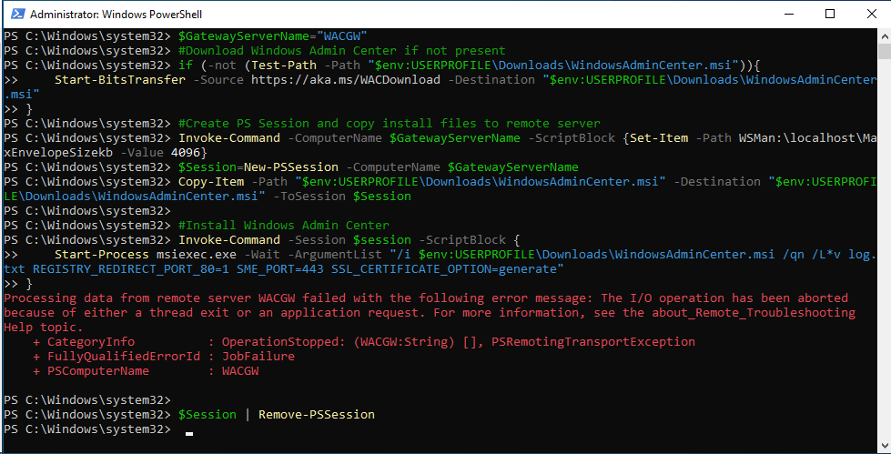

**Step 3** Make the self-signed certificate trusted

> Following script will download Windows Admin Certificate and will add it into trusted root certificates into local machine. In production you should use trusted certificates

```PowerShell
$cert = Invoke-Command -ComputerName $GatewayServerName -ScriptBlock {Get-ChildItem Cert:\LocalMachine\My\ |where subject -eq "CN=Windows Admin Center"}
$cert | Export-Certificate -FilePath $env:TEMP\WACCert.cer
Import-Certificate -FilePath $env:TEMP\WACCert.cer -CertStoreLocation Cert:\LocalMachine\Root\
 
```


**Step 4** Configure Kerberos Constrained Delegation (to avoid providing credentials in WAC)

```PowerShell
#Configure Resource-Based constrained delegation on all Azure Stack HCI server object in AD

$gatewayObject = Get-ADComputer -Identity $GatewayServerName
$computers = (Get-ADComputer -Filter {OperatingSystem -eq "Azure Stack HCI"}).Name

foreach ($computer in $computers){
    $computerObject = Get-ADComputer -Identity $computer
    Set-ADComputer -Identity $computerObject -PrincipalsAllowedToDelegateToAccount $gatewayObject
}
 
```
**Step 3** Open Edge browser and navigate to https://wacgw

> When prompted for credentials, use LabAdmin\LS1setup!

**Step 4** To add Azure Stack Cluster, click on **+ Add** button and in Server clusters category click on Add

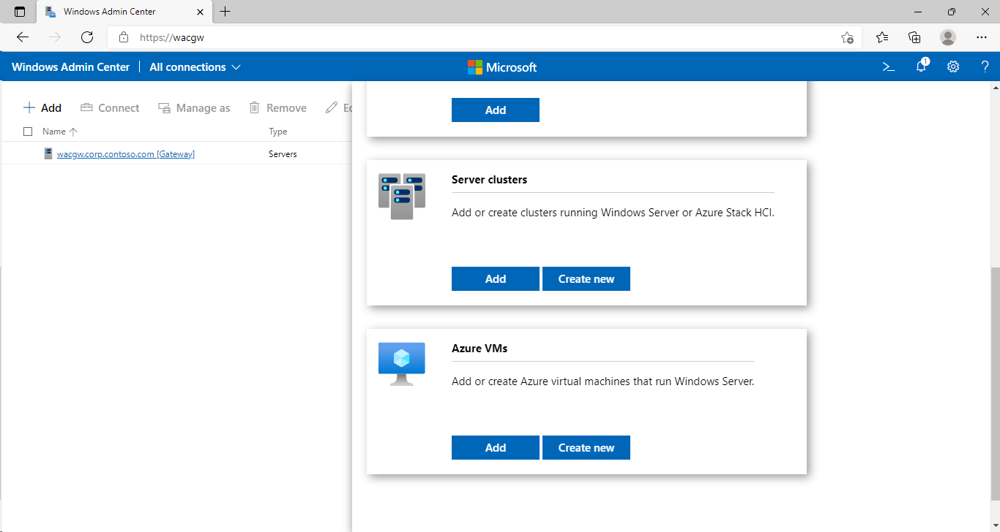

**Step 5** Specify AzSHCI-Cluster and click Add

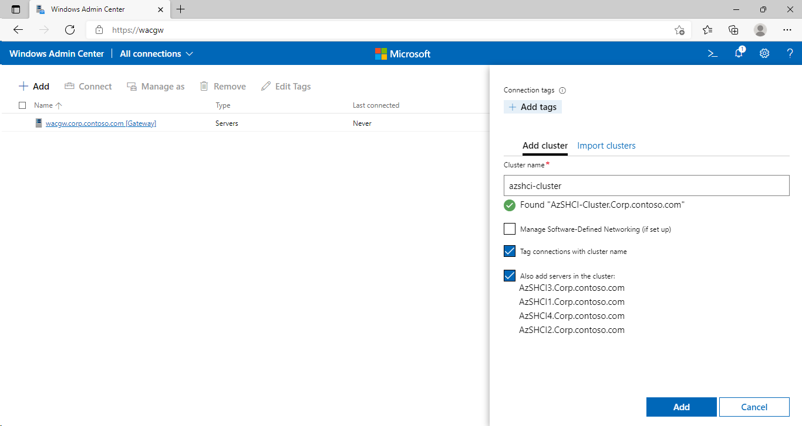

**Step 6** Explore cluster

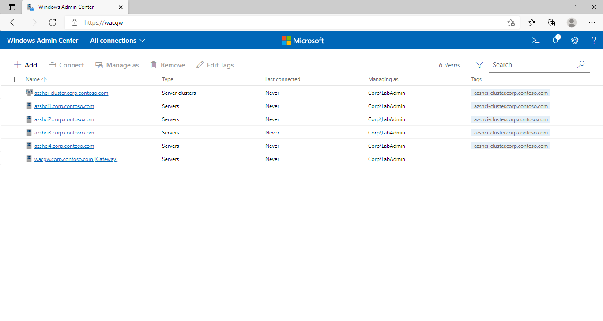


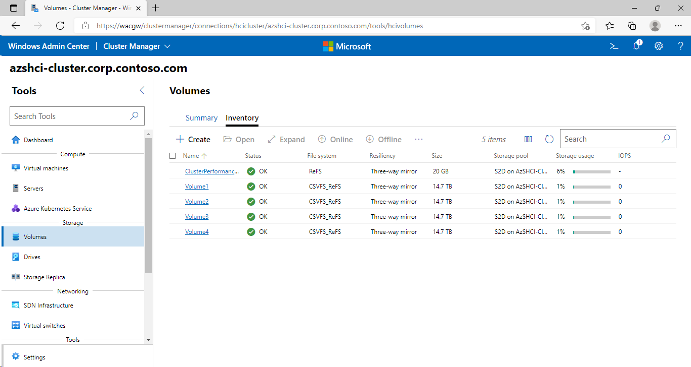