# Exploring Dell OpenManage integration with Windows Admin Center (OMIMWAC)

<!-- TOC -->

- [Exploring Dell OpenManage integration with Windows Admin Center OMIMWAC](#exploring-dell-openmanage-integration-with-windows-admin-center-omimwac)
    - [About the lab](#about-the-lab)
    - [Prerequsites](#prerequsites)
    - [Installing Extension](#installing-extension)
    - [Exploring extension features](#exploring-extension-features)
        - [Health](#health)
        - [Inventory](#inventory)
        - [iDRAC](#idrac)
        - [Security](#security)
        - [Configure](#configure)
    - [Updating nodes with access to internet](#updating-nodes-with-access-to-internet)
    - [Updating nodes with offline catalog](#updating-nodes-with-offline-catalog)
        - [Configure file share with DSU binaries](#configure-file-share-with-dsu-binaries)
        - [Upload drivers from catalog to fileshare](#upload-drivers-from-catalog-to-fileshare)
        - [Perform update](#perform-update)
    - [TBD: Deep dive](#tbd-deep-dive)
        - [TBD: Collecting logs](#tbd-collecting-logs)

<!-- /TOC -->

## About the lab

In this lab you will learn about Dell OpenManage integration for Windows Admin Center, how you can install it, what features are available and how to troubleshoot issues (if any) will happen.

Following lab will demonstrate OMIMWAC features on two clusters - Azure Stack HCI 21H2 and Windows Server 2022

## Prerequsites

Main prerequisite to have extension working is to have Azure Stack HCI cluster or Windows Server cluster with Dell hardware with proper OMIMWAC license. This lab also assumes Windows Admin Center was already installed (more info in [Azure Stack HCI deployment guide](lab-guides/02-DeployAzureStackHCICluster-PowerShell/readme.md))

To perform following lab you can setup cluster using guides below:

* Hydrate MSLab with LabConfig from [01-HydrateMSLab](admin-guides/01-HydrateMSLab/readme.md)

* [Learn How MSLab works](admin-guides/02-WorkingWithMSLab/readme.md)

* [Deploy OS on hardware](admin-guides/03-DeployPhysicalServersWithMSLab/readme.md)

* [Deploy Azure Stack HCI with PowerShell](lab-guides/02-DeployAzureStackHCICluster-PowerShell/readme.md)


## Installing Extension

**1.** In Windows Admin Center, navigate to settings (sprocket in top right corner).

**2.** In Settings, navigate to Extensions

**3.** In Extensions select Dell EMC OpenManage Integration and click on Install. Extension will be now installed

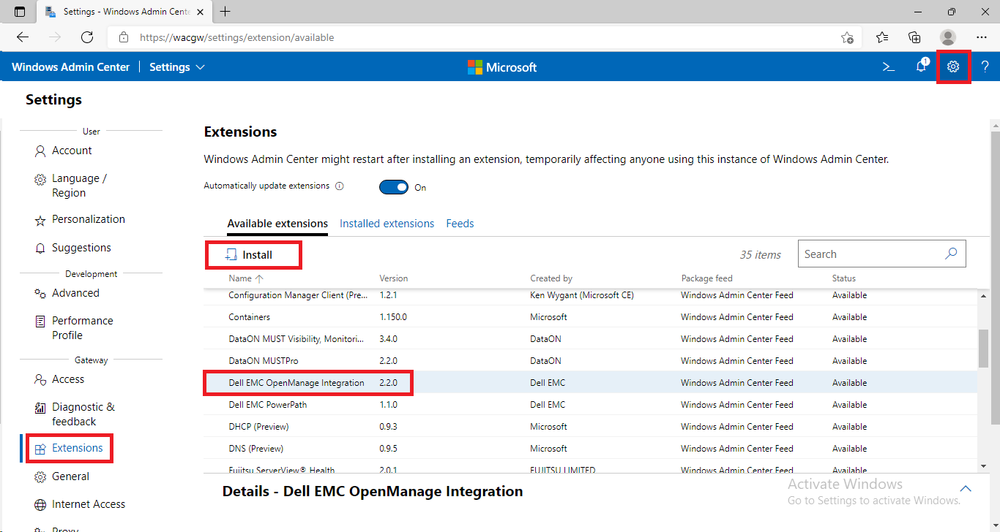

**4.** Once Extension is installed, it will be automatically available in Cluster view. You can navigate there and accept terms. 

Notice, that OMIMWAC is using iDRAC USB. It also uses temporary iDRAC account to collect inventory data.


**5.** You may receive error about collecting information about Secured-core. To fix it, you can navigate to Security tab and provide run-as credentials.

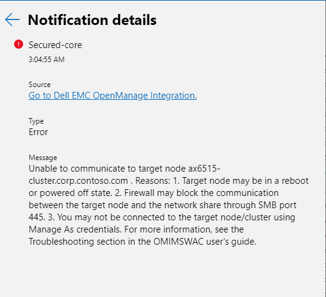

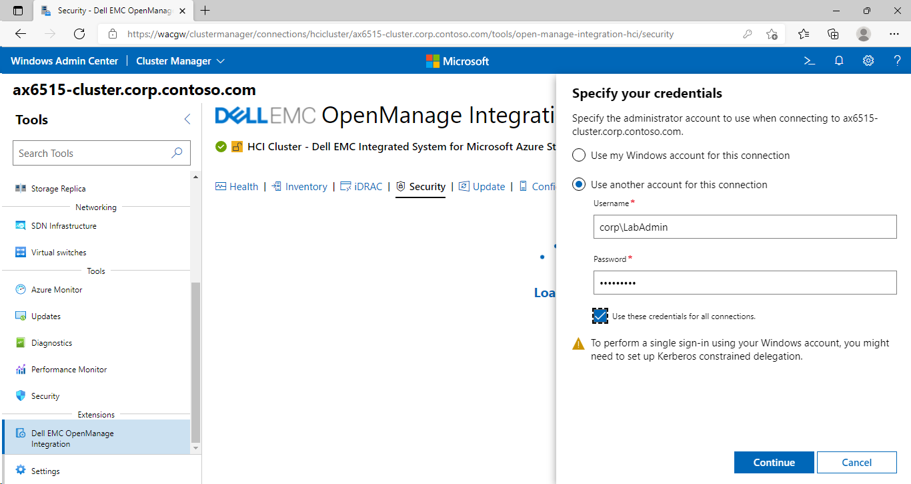

**6** You may also receive an error when running compliance report under update. To mitigate this one, you may need to increase MaxEvenlope size.

```PowerShell
$Servers="AxNode1","AxNode2"
Invoke-Command -ComputerName $Servers -ScriptBlock {
    Set-Item -Path WSMan:\localhost\MaxEnvelopeSizekb -Value 4096
}
 
```

before

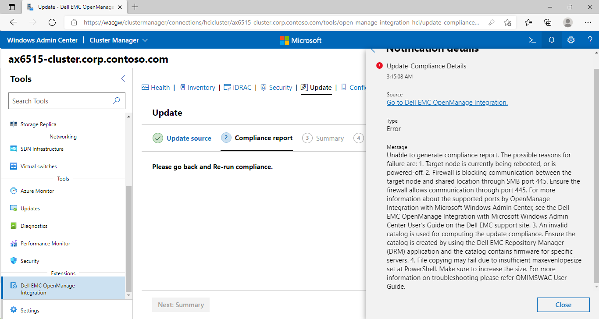

after


## Exploring extension features

[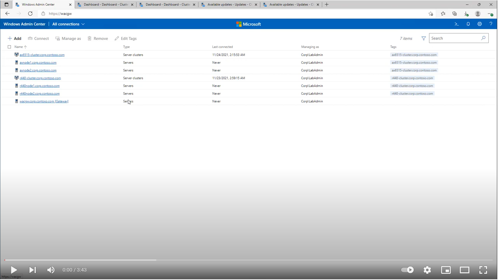](https://youtu.be/xFltFX_OJoo)

### Health

Health provides overview of all hardware components from all nodes. Information is collected using iDRAC USB NICs and RedFish that is running on iDRAC.

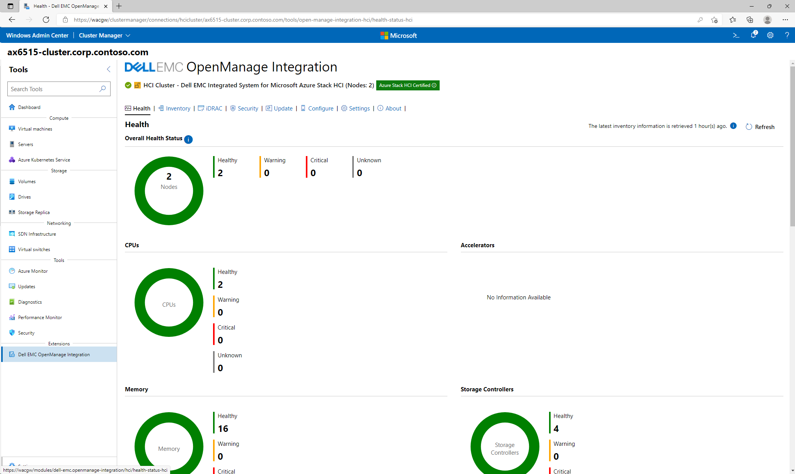

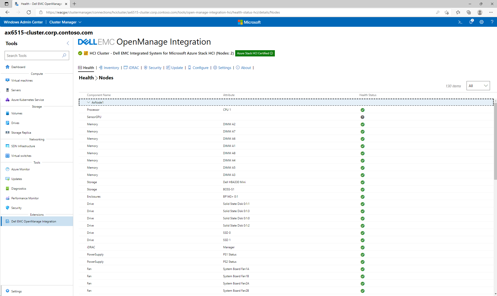

### Inventory


### iDRAC


### Security

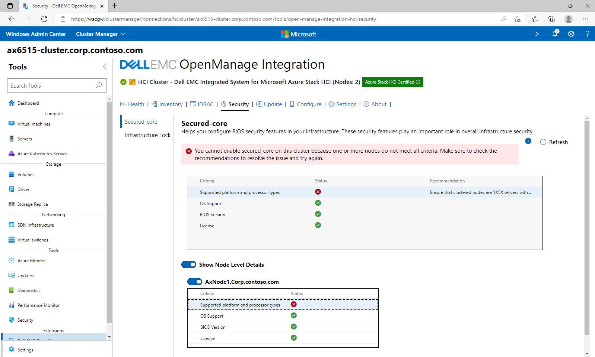

### Configure

As you can see, number of cores and CCDs (Core Chiplet Dies) can be configured.


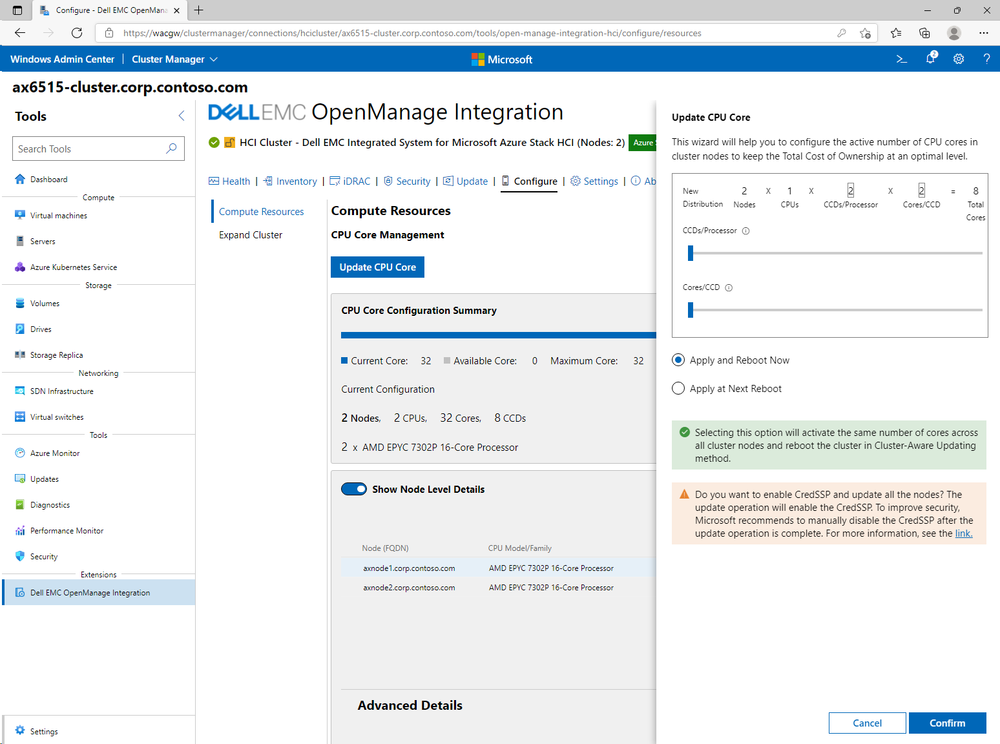

## Updating nodes with access to internet

## Updating nodes with offline catalog

In Settings tab you can see, that offline catalog can be used. But two components needs to be provided - Inventory Collector and Dell EMC System Update (DSU). Let's do that with PowerShell

### Configure file share with DSU binaries

**1.** Paste below script to PowerShell to create a File Share with latest DSU and IC.

```PowerShell
$FileServer="WACGW"
$FileShareName="DellUpdate"
$Account="Corp\LabAdmin"

#Create File Share
    Invoke-Command -ComputerName $FileServer -ScriptBlock {new-item -Path c:\Shares -Name $using:FileShareName -ItemType Directory}
    $accounts=@()
    $accounts+=$account
    New-SmbShare -Name $FileShareName -Path "c:\Shares\$FileShareName" -FullAccess $accounts -CimSession $FileServer
    #Set NTFS permissions 
    Invoke-Command -ComputerName $FileServer -ScriptBlock {(Get-SmbShare $using:FileShareName).PresetPathAcl | Set-Acl}

#Download latest IC to fileshare
    #grab IC links from Dell website
    $URL="https://downloads.dell.com/omimswac/ic/"
    $Results=Invoke-WebRequest $URL -UseDefaultCredentials
    $Links=$results.Links.href | Select-Object -Skip 1
    #create PSObject from results
    $ICs=@()
    foreach ($Link in $Links){
        $ICs+=[PSCustomObject]@{
            Link = "https://dl.dell.com$Link"
            Version = [int]($link -split "_" | Select-Object -Last 2 | Select-Object -First 1)
        }
    }
    #download latest to separate folder
    $LatestIC=$ICs | Sort-Object Version | Select-Object -Last 1
    Start-BitsTransfer -Source $LatestIC.Link -Destination \\$FileServer\$FileShareName\IC.exe

#Download latest DSU
    #grab DSU links from Dell website
    $URL="https://dl.dell.com/omimswac/dsu/"
    $Results=Invoke-WebRequest $URL -UseDefaultCredentials
    $Links=$results.Links.href | Select-Object -Skip 1
    #create PSObject from results
    $DSUs=@()
    foreach ($Link in $Links){
        $DSUs+=[PSCustomObject]@{
            Link = "https://dl.dell.com$Link"
            Version = ($link -split "_" | Select-Object -Last 2 | Select-Object -First 1)
        }
    }
    #download latest to separate folder
    $LatestDSU=$DSUs | Sort-Object Version | Select-Object -Last 1
    Start-BitsTransfer -Source $LatestDSU.Link -Destination \\$FileServer\$FileShareName\DSU.exe

#Download Azure Stack HCI Catalog
    #Dell Azure Stack HCI driver catalog https://downloads.dell.com/catalog/ASHCI-Catalog.xml.gz
    #Download catalog
    Start-BitsTransfer -Source "https://downloads.dell.com/catalog/ASHCI-Catalog.xml.gz" -Destination "$env:UserProfile\Downloads\ASHCI-Catalog.xml.gz"
    #unzip gzip to a folder https://scatteredcode.net/download-and-extract-gzip-tar-with-powershell/
    Function Expand-GZipArchive{
        Param(
            $infile,
            $outfile = ($infile -replace '\.gz$','')
            )
        $input = New-Object System.IO.FileStream $inFile, ([IO.FileMode]::Open), ([IO.FileAccess]::Read), ([IO.FileShare]::Read)
        $output = New-Object System.IO.FileStream $outFile, ([IO.FileMode]::Create), ([IO.FileAccess]::Write), ([IO.FileShare]::None)
        $gzipStream = New-Object System.IO.Compression.GzipStream $input, ([IO.Compression.CompressionMode]::Decompress)
        $buffer = New-Object byte[](1024)
        while($true){
            $read = $gzipstream.Read($buffer, 0, 1024)
            if ($read -le 0){break}
            $output.Write($buffer, 0, $read)
            }
        $gzipStream.Close()
        $output.Close()
        $input.Close()
    }
    Expand-GZipArchive "$env:UserProfile\Downloads\ASHCI-Catalog.xml.gz" "\\$FileServer\$FileShareName\ASHCI-Catalog.xml"
 
```

Result


**2.** You can now configure your fileshare in Windows Admin Center and click Save.


**3.** To configure catalog, navigate to Update tab and click on DRM settings under Offline - Dell EMC Repository Manager Catalog.


### Upload drivers from catalog to fileshare

**1.** Following script will simply let you download any component from catalog you select and upload it to fileshare. Script will let you select (filter, sort), or you can simply select all.

```PowerShell
$FileServer="WACGW"
$FileShareName="DellUpdate"
#load catalog file
[xml]$XML=Get-Content "\\$FileServer\$FileShareName\ASHCI-Catalog.xml"

#ask for what items should be downloaded to fileshare
$items=$xml.manifest.softwarecomponent | Out-GridView -OutputMode Multiple -Title "Please Select components you want to download"

#download
foreach ($item in $items){
    $Path=$item.path.replace("/","\")
    $Folder=$Path | Split-Path
    New-Item -Path \\$FileServer\$FileShareName\ -Name $Folder -ItemType Directory -Force
    Start-BitsTransfer -Source "https://downloads.dell.com/$($item.path)" -Destination "\\$FileServer\$FileShareName\$Path" -DisplayName "Downloading $Path releasedate $($item.releaseDate)"
}
 
```

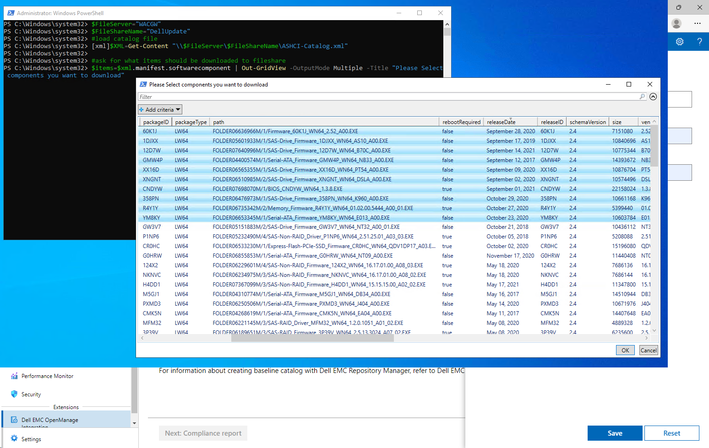

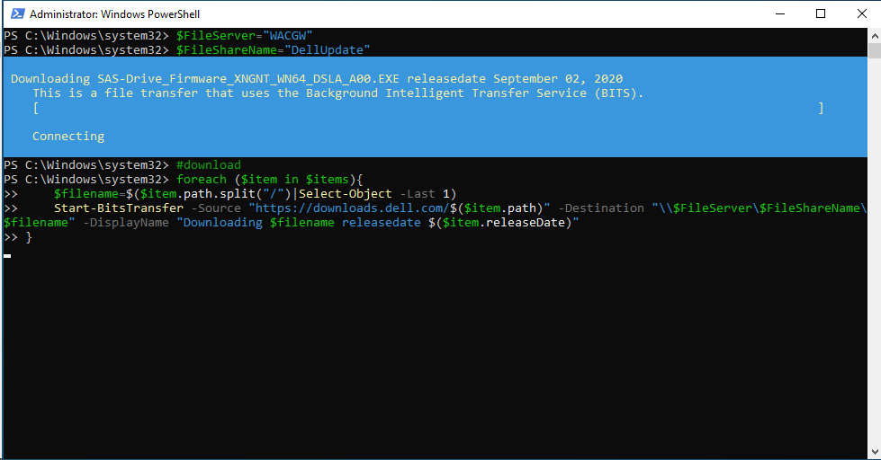

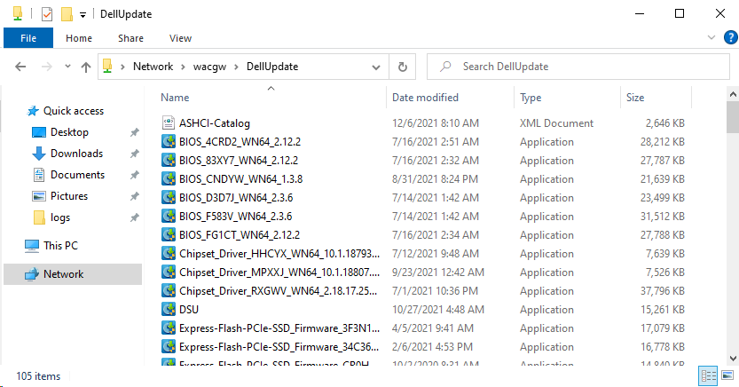

### Perform update

Once all tools, catalog and drivers were populated, DRM Settings configured, cluster can be now offline updated.

**1.** Navigate to Update Tab, and select Offline - Dell EMC Repository Manager Catalog and click on Next: Compliance Report

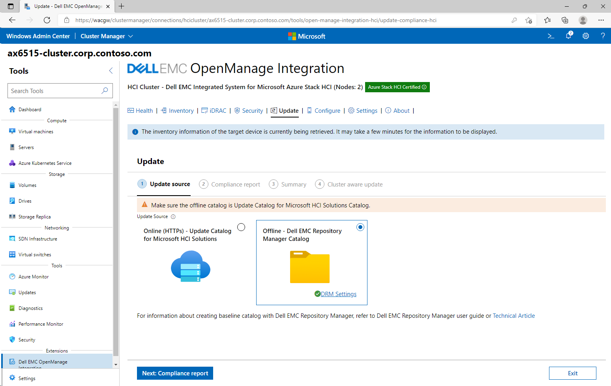

**2.** In compliance report, select updates you want to apply, and click Next: Summary


**3.** In Summary view, notice, that two options are available - Run now, or Schedule Update. Keep defaults and click Next: Cluster aware update


**4.** If you navigate out and then back to cluster view, you can navigate to Updates tool, and you will see, that there is a CAU run in progress


## TBD: Deep dive

### TBD: Collecting logs

```Notes
WACGW
C:\Windows\ServiceProfiles\NetworkService\AppData\Local\Temp\generated\logs
WAC Nodes
C:\Windows\Temp\OMIMSWAC
Browser HAR log [from browser dev tool, F12 -> Export]

### Exploring CAU components
\\axnode1\c$\Users\LabAdmin\AppData\Roaming\Update
```