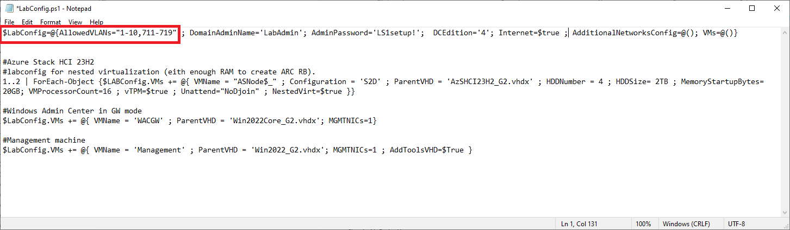
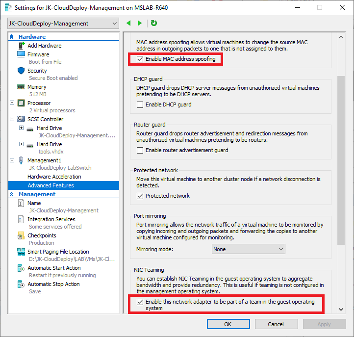
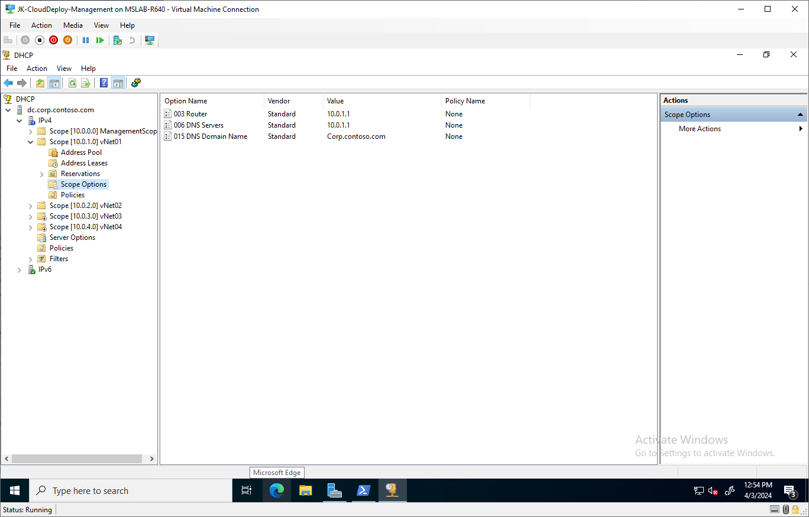
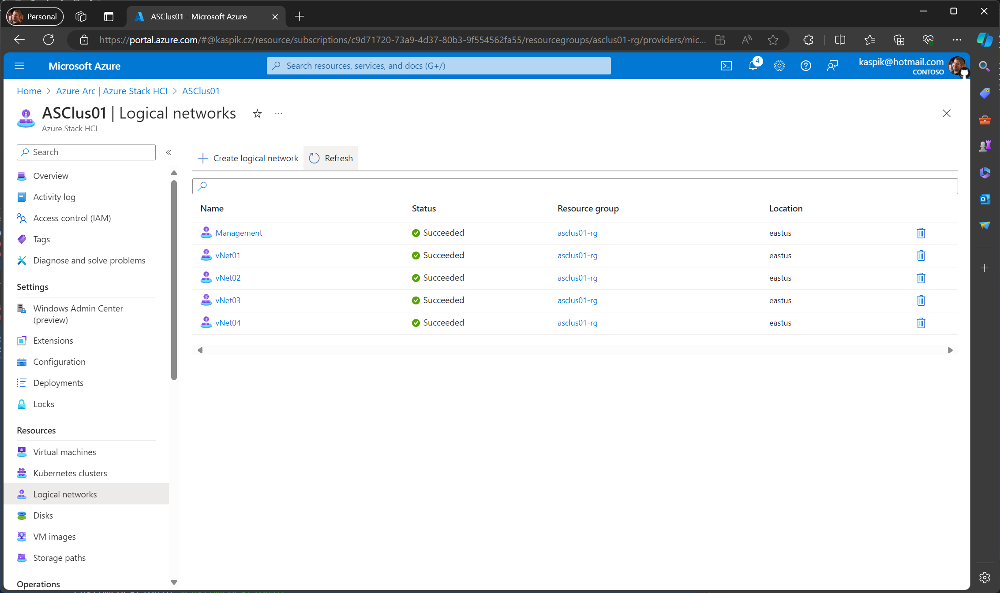

# Testing Logical Networks in Azure Stack HCI 23H2

<!-- TOC -->

- [Testing Logical Networks in Azure Stack HCI 23H2](#testing-logical-networks-in-azure-stack-hci-23h2)
    - [About the lab](#about-the-lab)
    - [Prerequisites](#prerequisites)
    - [Little bit more theory](#little-bit-more-theory)
    - [PowerShell Script](#powershell-script)
    - [Explore what was configured](#explore-what-was-configured)
    - [Testing if networking is working](#testing-if-networking-is-working)
    - [Configure Logical Networks in Azure with PowerShell](#configure-logical-networks-in-azure-with-powershell)

<!-- /TOC -->

## About the lab

In this lab you will learn how to create multiple subnets in existing MSLab deployment, so you can add [logical networks](https://learn.microsoft.com/en-us/azure-stack/hci/manage/tenant-logical-networks) via portal to your cluster.

Make sure you use latest MSLab (hydrate DC with version 24.06.2 and newer)

## Prerequisites

* Hydrated MSLab with LabConfig from [01-HydrateMSLab](../../admin-guides/01-HydrateMSLab/readme.md)

* Understand [how MSLab works](../../admin-guides/02-WorkingWithMSLab/readme.md)

* [Deploy Azure Stack HCI Cluster](../../lab-guides/01a-DeployAzureStackHCICluster-CloudBasedDeployment/readme.md)


## Little bit more theory

In MSLab is trunk on every management NIC created and VLANs assigned. In Labconfig is AllowedVLANs and in above Deploying Azure Stack HCI 23H2 scenario is configured "1-10,711-719".




To be able to play with VLANs, in DC we will need to create multiple vNICs, and each vNIC needs to point to different VLAN. To do this, there are few more settings needed on "host" VMNics. Namely MAC address spoofing and NIC Teaming. All this is already configured by MSLab.



To be able to create multiple NICs in multiple VLANs, virtual switch inside DC will be used. For this, Hyper-V will be installed, along with Routing and Remote Access role.

## PowerShell Script

You can run following script from Management machine. Notice, that there's a hash table, that defines all properties of newly created networks and scopes.

Following example will create 4 subnets, where 2 dhcp scopes will be activated and another two will be inactive.

```PowerShell

$Server="DC"
$vSwitchName="vSwitch"

#define networks
$Networks=@()
$Networks+= @{ Name='vNet01'; VLANID=1; NICIP='10.0.1.1'; PrefixLength=24; ScopeID = '10.0.1.0'; StartRange='10.0.1.10'; EndRange='10.0.1.254'; SubnetMask='255.255.255.0'; DomainName="Corp.contoso.com"; DHCPEnabled=$True }
$Networks+= @{ Name='vNet02'; VLANID=2; NICIP='10.0.2.1'; PrefixLength=24; ScopeID = '10.0.2.0'; StartRange='10.0.2.10'; EndRange='10.0.2.254'; SubnetMask='255.255.255.0'; DomainName="Corp.contoso.com"; DHCPEnabled=$True }
$Networks+= @{ Name='vNet03'; VLANID=3; NICIP='10.0.3.1'; PrefixLength=24; ScopeID = '10.0.3.0'; StartRange='10.0.3.10'; EndRange='10.0.3.254'; SubnetMask='255.255.255.0'; DomainName="Corp.contoso.com"; DHCPEnabled=$False }
$Networks+= @{ Name='vNet04'; VLANID=4; NICIP='10.0.4.1'; PrefixLength=24; ScopeID = '10.0.4.0'; StartRange='10.0.4.10'; EndRange='10.0.4.254'; SubnetMask='255.255.255.0'; DomainName="Corp.contoso.com"; DHCPEnabled=$False }

<#This has been already done in latest MSLab release 24.06.2 once you hydrate DC
Invoke-Command -ComputerName $Server -ScriptBlock {
    Enable-WindowsOptionalFeature -FeatureName Microsoft-Hyper-V -Online -NoRestart
}

#reboot DC
    Restart-Computer $Server -Protocol WSMan -Wait -For PowerShell -Force
    Start-Sleep 20 #Failsafe as Hyper-V needs 2 reboots and sometimes it happens, that during the first reboot the restart-computer evaluates the machine is up
    #make sure DC is restarted
    do{$Test= Test-NetConnection -ComputerName $Server -CommonTCPPort WINRM}while ($test.TcpTestSucceeded -eq $False)
#endregion

#create vSwitch
    #make sure hyper-v management tools are installed
    Install-WindowsFeature -Name Hyper-V-PowerShell
    #assuming there's just one NIC "ethernet"
    New-VMSwitch -CimSession $Server -Name $vSwitchName -NetAdapterName "Ethernet" -EnableEmbeddedTeaming $true
    #rename vNIC "management
    Rename-VMNetworkAdapter -Name $vSwitchName -NewName Management -CimSession $Server -ManagementOS

#>

#create networks
#make sure DHCP management tools are installed. To view routing on DC you can also install RSAT-RemoteAccess
Install-WindowsFeature -Name RSAT-DHCP,RSAT-RemoteAccess

foreach ($Network in $Networks){
    #create NIC
    if (-not (Get-VMNetworkAdapter -ManagementOS -Name $network.Name -CimSession $Server -ErrorAction Ignore)){
        Add-VMNetworkAdapter -CimSession $Server -ManagementOS -Name $network.name
    }
    #configure VLAN
    #Set-VMNetworkAdapterIsolation -CimSession $Server -ManagementOS -VMNetworkAdapterName $Network.name -IsolationMode Vlan -DefaultIsolationID $network.vlanID
    Set-VMNetworkAdapterVlan -CimSession $Server -ManagementOS -VMNetworkAdapterName $Network.name -Access -VlanId $network.vlanID

    #configure Static IP
    if ((Get-NetIPAddress -CimSession $Server -InterfaceAlias "vEthernet ($($Network.name))" -AddressFamily IPv4).IPAddress -ne $Network.NicIP){
        New-NetIPAddress -CimSession $Server -InterfaceAlias "vEthernet ($($Network.name))" -IPAddress $Network.NICIP -PrefixLength $Network.PrefixLength
    }
    #Add DHCP Scope
    if (-not (Get-DhcpServerv4Scope -CimSession $Server -ScopeId $network.ScopeID -ErrorAction Ignore)){
            Add-DhcpServerv4Scope -CimSession $Server -StartRange $Network.StartRange -EndRange $Network.EndRange -Name $Network.Name -State Active -SubnetMask $Network.SubnetMask
    }
    #disable/enable
    if ($Network.DHCPEnabled){
        Set-DhcpServerv4Scope -CimSession $Server -ScopeId $Network.ScopeID -State Active
    }else{
        Set-DhcpServerv4Scope -CimSession $Server -ScopeId $Network.ScopeID -State InActive
    }

    #Configure dhcp options
        #6 - Domain Name Server
        Set-DhcpServerv4OptionValue -CimSession $Server -OptionId 6 -Value $Network.NICIP -ScopeId $Network.ScopeID
        #3 - Gateway
        Set-DhcpServerv4OptionValue -CimSession $Server -OptionId 3 -Value $Network.NICIP -ScopeId $Network.ScopeID
        #15 - Domain Name
        Set-DhcpServerv4OptionValue -CimSession $Server -OptionId 15 -Value $Network.DomainName -ScopeId $Network.ScopeID
}

#make sure routing is enabled on DC
Invoke-Command -ComputerName $Server -ScriptBlock {
    #installRRAS
    Install-WindowsFeature -Name Routing,RSAT-RemoteAccess -IncludeAllSubFeature
    #enable routing
    Write-Output "`t`t  Making sure routing is enabled"
    $routingEnabled = (Get-ItemProperty HKLM:\SYSTEM\CurrentControlSet\Services\Tcpip\Parameters -Name IPEnableRouter).IPEnableRouter
    if ($routingEnabled -match "0") {
        New-ItemProperty HKLM:\SYSTEM\CurrentControlSet\Services\Tcpip\Parameters -Name IPEnableRouter -value 1 -Force
    }
    #restart routing... just to make sure
    Restart-Service RemoteAccess
}
 
```

## Explore what was configured

DHCP Scopes were created. The ones where DHCPEnabled was $False were disabled. You can also notice, that Scope Options were configured



You can also verify, that routing is enabled and interfaces are present


To verify vSwitch and VMNics created, you can run following powershell

```Powershell
#Grab Switch
Get-VMSwitch -CimSession dc
#Grab VNICs (Management OS)
Get-VMNetworkAdapter -CimSession dc -ManagementOS
#Check VLANs configured
Get-VMNetworkAdapterVLAN -CimSession dc -ManagementOS
 
```


## Testing if networking is working

* Note: Make sure you use latest MSLab, as previous versions were not configuring trunk on Management NIC in DC VM.

To test if networking works, simply add a NIC into Management VM and add VLAN 1


if all works, vNIC will receive IP from correct subnet.


## Configure Logical Networks in Azure with PowerShell

Following code will simpy create multiple networks in Azure Portal. You can either use PowerShell to deploy it, or you can click it in Portal.

```PowerShell
#Make sure failover clustering and Hyper-V PowerShell is installed
Install-WindowsFeature -Name RSAT-Clustering,Hyper-V-PowerShell

#download Azure modules
$Modules="az.resources","Az.CustomLocation","Az.Accounts"
foreach ($Module in $Modules){
    if (!(Get-InstalledModule -Name $Module -ErrorAction Ignore)){
        Install-Module -Name $Module -Force
    }
}

#login to azure
if (-not (Get-AzContext)){
    Connect-AzAccount -UseDeviceAuthentication
}

#select subscription
#$SubscriptionID=(Get-AzContext).subscription.id

#define variables

$ClusterName="ASClus01"
$ClusterNodes=(Get-ClusterNode -Cluster $ClusterName).Name
$VirtualSwitchName=(Get-VMSwitch -CimSession $ClusterNodes[0]).Name
$Location="EastUS"
$ResourceGroupName="asclus01-rg"
$CustomLocationID=(Get-AzCustomLocation -ResourceGroupName $ResourceGroupName).ID


$Networks=@()
$Networks+= @{ Name='Management'; ipAllocationMethod="Dynamic"; vlan=0 ; tags=[PSCustomObject]@{}}
$Networks+= @{ Name='vNet01'; ipAllocationMethod="Dynamic"; vlan=1 ; tags=[PSCustomObject]@{}}
$Networks+= @{ Name='vNet02'; ipAllocationMethod="Dynamic"; vlan=2 ; tags=[PSCustomObject]@{}}
$Networks+= @{ Name='vNet03'; ipAllocationMethod="Static"; addressPrefix="10.0.3.0/24" ; vlan=3 ; ipPools=@("10.0.3.10","10.0.3.255") ; dnsServers=@("10.0.3.1") ; defaultGateway="10.0.3.1" ; tags=[PSCustomObject]@{}}
$Networks+= @{ Name='vNet04'; ipAllocationMethod="Static"; addressPrefix="10.0.4.0/24" ; vlan=4 ; ipPools=@("10.0.4.10","10.0.4.255") ;dnsServers=@("10.0.4.1") ; defaultGateway="10.0.4.1" ; tags=[PSCustomObject]@{}}


#create templates
$staticTemplate = @"
{
    "`$schema": "https://schema.management.azure.com/schemas/2019-04-01/deploymentTemplate.json#",
    "contentVersion": "1.0.0.0",
    "parameters": {
        "name": {
            "type": "String"
        },
        "ipAllocationMethod": {
            "type": "String"
        },
        "addressPrefix": {
            "type": "String"
        },
        "vlan": {
            "type": "Int"
        },
        "location": {
            "type": "String"
        },
        "customLocationId": {
            "type": "String"
        },
        "vmSwitchName": {
            "type": "String"
        },
        "tags": {
            "type": "Object"
        },
        "ipPools": {
            "type": "Array"
        },
        "dnsServers": {
            "type": "Array"
        },
        "defaultGateway": {
            "type": "String"
        }
    },
    "resources": [
        {
            "type": "microsoft.azurestackhci/logicalnetworks",
            "apiVersion": "2023-09-01-preview",
            "name": "[parameters('name')]",
            "location": "[parameters('location')]",
            "extendedLocation": {
                "type": "CustomLocation",
                "name": "[parameters('customLocationId')]"
            },
            "tags": {},
            "properties": {
                "subnets": [
                    {
                        "name": "[parameters('name')]",
                        "properties": {
                            "ipAllocationMethod": "[parameters('ipAllocationMethod')]",
                            "addressPrefix": "[parameters('addressPrefix')]",
                            "vlan": "[parameters('vlan')]",
                            "ipPools": "[parameters('ipPools')]",
                            "routeTable": {
                                "properties": {
                                    "routes": [
                                        {
                                            "name": "[parameters('name')]",
                                            "properties": {
                                                "addressPrefix": "0.0.0.0/0",
                                                "nextHopIpAddress": "[parameters('defaultGateway')]"
                                            }
                                        }
                                    ]
                                }
                            }
                        }
                    }
                ],
                "vmSwitchName": "[parameters('vmSwitchName')]",
                "dhcpOptions": {
                    "dnsServers": "[parameters('dnsServers')]"
                }
            }
        }
    ],
    "outputs": {}
}
"@

$DynamicTemplate=@"
{
    "`$schema": "https://schema.management.azure.com/schemas/2019-04-01/deploymentTemplate.json#",
    "contentVersion": "1.0.0.0",
    "parameters": {
        "name": {
            "type": "String"
        },
        "ipAllocationMethod": {
            "type": "String"
        },
        "vlan": {
            "type": "Int"
        },
        "location": {
            "type": "String"
        },
        "customLocationId": {
            "type": "String"
        },
        "vmSwitchName": {
            "type": "String"
        },
        "tags": {
            "type": "Object"
        }
    },
    "resources": [
        {
            "type": "microsoft.azurestackhci/logicalnetworks",
            "apiVersion": "2023-09-01-preview",
            "name": "[parameters('name')]",
            "location": "[parameters('location')]",
            "extendedLocation": {
                "type": "CustomLocation",
                "name": "[parameters('customLocationId')]"
            },
            "tags": {},
            "properties": {
                "subnets": [
                    {
                        "name": "[parameters('name')]",
                        "properties": {
                            "ipAllocationMethod": "[parameters('ipAllocationMethod')]",
                            "vlan": "[parameters('vlan')]"
                        }
                    }
                ],
                "vmSwitchName": "[parameters('vmSwitchName')]"
            }
        }
    ],
    "outputs": {}
}

"@

$templateFileStatic = New-TemporaryFile
Set-Content -Path $templateFileStatic.FullName -Value $staticTemplate

$templateFileDynamic = New-TemporaryFile
Set-Content -Path $templateFileDynamic.FullName -Value $DynamicTemplate

$ExistingNetworks=Get-AzResource -ResourceGroupName $ResourceGroupName -ResourceType microsoft.azurestackhci/logicalNetworks

foreach ($Network in $Networks){
    if (-not ($ExistingNetworks.Name -Contains $Network.Name)){
        if ($Network.ipAllocationMethod -eq "Dynamic"){
            $templateParameterObject = @{
                name = $network.name
                ipAllocationMethod = "Dynamic"
                vlan=$Network.VLAN
                location=$Location
                customLocationId=$CustomLocationID
                vmSwitchName=$VirtualSwitchName
                tags=$Network.Tags
            }
            New-AzResourceGroupDeployment -ResourceGroupName $ResourceGroupName -TemplateFile $templateFileDynamic.FullName -TemplateParameterObject $templateParameterObject
        }else{
            #this dows not work
            <#
            $TemplateParameterObject = @{
                name = $network.name
                ipAllocationMethod = "Static"
                addressPrefix = $Network.addressPrefix
                vlan=$Network.VLAN
                location=$Location
                customLocationId=$CustomLocationID
                vmSwitchName=$VirtualSwitchName
                ipPools=$Network.IPPools
                dnsServers=$Network.DNSServers
                defaultGateway=$Network.DefaultGateway
                tags=$Network.Tags
            }
            New-AzResourceGroupDeployment -ResourceGroupName $ResourceGroupName -TemplateFile $templateFileStatic.FullName -TemplateParameterObject $templateParameterObject
            #>
            #Create parameter file
            $ParamFile=@"
{
    "`$schema": "https://schema.management.azure.com/schemas/2015-01-01/deploymentParameters.json#",
    "contentVersion": "1.0.0.0",
    "parameters": {
        "name": {
            "value": "$($network.name)"
        },
        "ipAllocationMethod": {
            "value": "Static"
        },
        "addressPrefix": {
            "value": "$($Network.addressPrefix)"
        },
        "vlan": {
            "value": $($Network.VLAN)
        },
        "location": {
            "value": "$Location"
        },
        "customLocationId": {
            "value": "$CustomLocationID"
        },
        "vmSwitchName": {
            "value": "$VirtualSwitchName"
        },
        "tags": {
            "value": {}
        },
        "ipPools": {
            "value": [
                {
                    "start": "$($Network.IPPools[0])",
                    "end": "$($Network.IPPools[1])"
                }
            ]
        },
        "dnsServers": {
            "value": [
                "$($Network.DNSServers)"
            ]
        },
        "defaultGateway": {
            "value": "$($Network.DefaultGateway)"
        }
    }
}
"@
        $parameterfile = New-TemporaryFile
        Set-Content -Path $parameterfile.FullName -Value $ParamFile
        New-AzResourceGroupDeployment -ResourceGroupName $ResourceGroupName -TemplateFile $templateFileStatic.FullName -TemplateParameterFile $parameterfile.FullName
        Remove-Item $parameterfile.FullName
        }

    }else{
        Write-Output "$($Network.Name) network already exists"
    }
}
Remove-Item $templateFileStatic.FullName
Remove-Item $templateFileDynamic.FullName
 
```


