# Azure Stack HCI 23H2 Lifecycle Manager Deep Dive
<!-- TOC -->

- [Azure Stack HCI 23H2 Lifecycle Manager Deep Dive](#azure-stack-hci-23h2-lifecycle-manager-deep-dive)
    - [About the lab](#about-the-lab)
    - [SBE Packages](#sbe-packages)
    - [Getting into Azure Stack PowerShell modules](#getting-into-azure-stack-powershell-modules)
    - [Sideload SBE package](#sideload-sbe-package)
    - [Check versions and status](#check-versions-and-status)
- [Exploring Enterprise Cloud Engine ECE Client](#exploring-enterprise-cloud-engine-ece-client)
    - [Exploring available actions](#exploring-available-actions)
    - [Display cluster information](#display-cluster-information)
    - [Explore Action Plans](#explore-action-plans)
- [Deleting failed Action Plans](#deleting-failed-action-plans)

<!-- /TOC -->

## About the lab

In this lab you will learn about SBE packages and how to sideload them using Azure Stack HCI PowerShell modules.

## SBE Packages

SBE package is a package provided by OEM to consistently update Azure Stack HCI solutions.

**Minimal**
    Package, that contains only WDAC Policy. OEM can select the minimal level and keep using WAC Extension to update Azure Stack HCI Nodes (HPE).

**Standard**
    Package contains both WDAC policy and Firmware/Drivers/Other software that is updated with CAU.
    This path was selected by DataON (only latest models), Lenovo (MX455 V3, MX450) and Dell (Both AX and MC nodes). Therefore Dell is the only OEM that provides SBE (with drivers and firmware) for N-1 Generation.

For more information about SBE visit https://learn.microsoft.com/en-us/azure-stack/hci/update/solution-builder-extension

## Getting into Azure Stack PowerShell modules

Let's list all posh modules related to Azure Stack

```PowerShell
$ClusterName="AXClus02"
Invoke-Command -ComputerName $ClusterName -ScriptBlock {
    Get-Command -Module Microsoft.a*
}
 
```

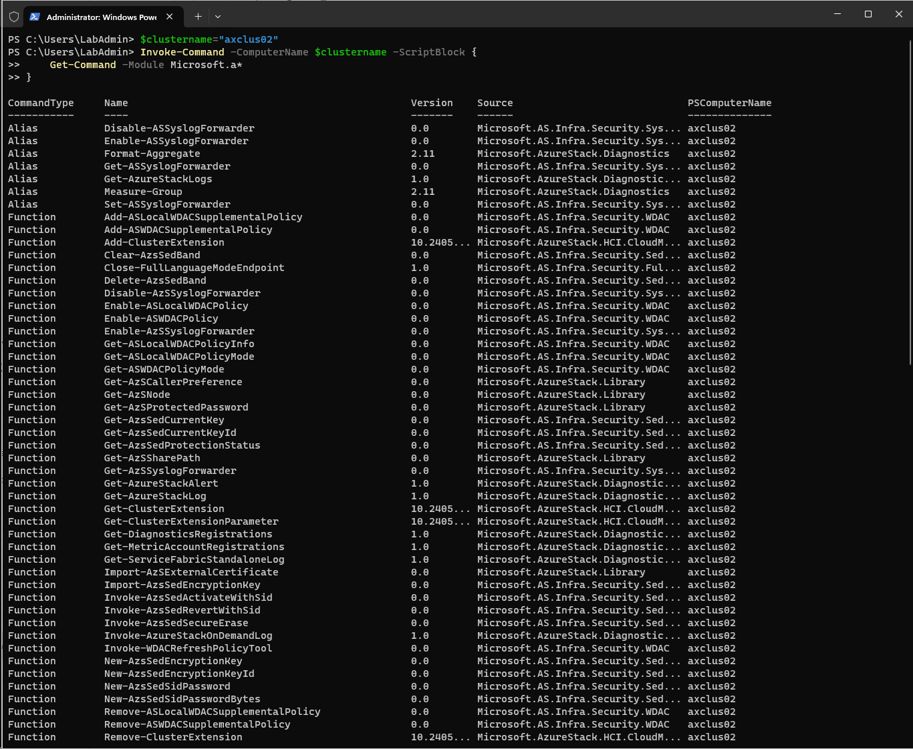

As you can see, there are Microsoft.AS.* and Microsoft.AzureStack* modules. Related to Lifecycle Management is Microsoft.AzureStack.Lcm.PowerShell

```PowerShell
Invoke-Command -ComputerName $ClusterName -ScriptBlock {
    Get-Command -Module Microsoft.AzureStack.Lcm.PowerShell
}
 
```

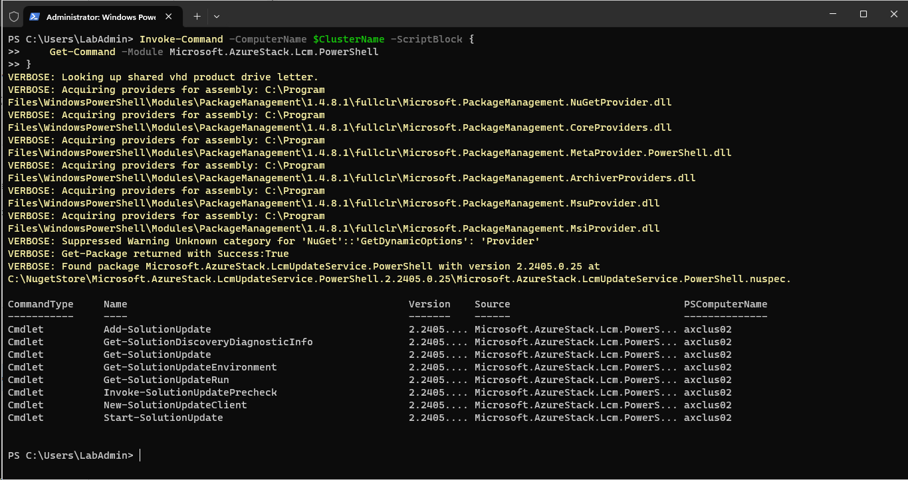

There is one interesting command that gives you more insight on how SBE and updating works - Get-SolutionDiscoveryDiagnosticInfo

```PowerShell
Invoke-Command -ComputerName $ClusterName -ScriptBlock {
Get-SolutionDiscoveryDiagnosticInfo | Format-List
}

```

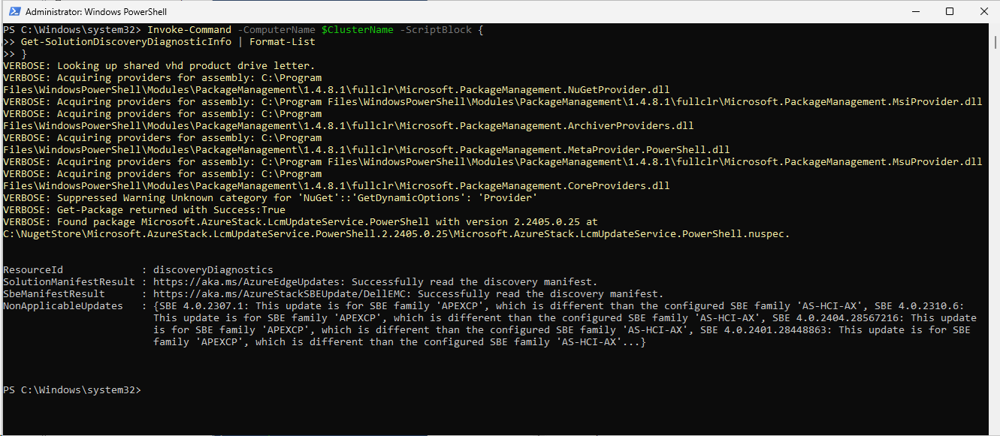


As you can see, there is Solution and SBE manifest

    Solution    https://aka.ms/AzureEdgeUpdates
    SBE         https://aka.ms/AzureStackSBEUpdate/DellEMC

Each OEM has it's own URL for SBE:
    
    Dell        https://aka.ms/AzureStackSBEUpdate/DellEMC
    DataOn      https://aka.ms/AzureStackSBEUpdate/DataOn
    Lenovo      https://aka.ms/AzureStackSBEUpdate/Lenovo
    HPE         https://aka.ms/AzureStackSBEUpdate/HPE

## Sideload SBE package

https://aka.ms/AzureStackHci/SBE/Sideload


Download and copy to Azure Stack HCI cluster

```PowerShell
#download SBE
Start-BitsTransfer -Source https://dl.dell.com/FOLDER12137689M/1/Bundle_SBE_Dell_AS-HCI-AX-15G_4.1.2409.1901.zip -Destination $env:userprofile\Downloads\Bundle_SBE_Dell_AS-HCI-AX-15G_4.1.2409.1901.zip

#or 16G
#Start-BitsTransfer -Source https://dl.dell.com/FOLDER12137723M/1/Bundle_SBE_Dell_AS-HCI-AX-16G_4.1.2409.1501.zip -Destination $env:userprofile\Downloads\Bundle_SBE_Dell_AS-HCI-AX-16G_4.1.2409.1501.zip

#expand archive
Expand-Archive -Path $env:userprofile\Downloads\Bundle_SBE_Dell_AS-HCI-AX-15G_4.1.2409.1901.zip -DestinationPath $env:userprofile\Downloads\SBE

#(optional) replace metadata file with latest metadata from SBEUpdate address
#Invoke-WebRequest -Uri https://aka.ms/AzureStackSBEUpdate/DellEMC -OutFIle $env:userprofile\Downloads\SBE\SBE_Discovery_Dell.xml

#transfer into the cluster
New-Item -Path "\\$ClusterName\ClusterStorage$\Infrastructure_1\Shares\SU1_Infrastructure_1" -Name sideload -ItemType Directory -ErrorAction Ignore
Copy-Item -Path $env:userprofile\Downloads\SBE\*.* -Destination "\\$ClusterName\ClusterStorage$\Infrastructure_1\Shares\SU1_Infrastructure_1\sideload"
 
```

Add Solution Update

```PowerShell
Invoke-Command -ComputerName $ClusterName -ScriptBlock {
    Add-SolutionUpdate -SourceFolder C:\ClusterStorage\Infrastructure_1\Shares\SU1_Infrastructure_1\sideload
    Get-SolutionUpdate | Format-Table DisplayName, Version, State 
}
 
```

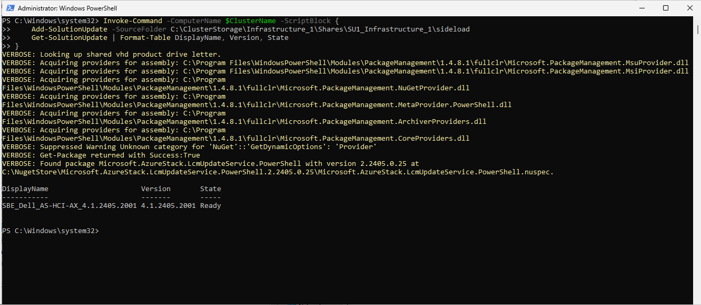

Note: after executiong Add-Solution update, package is transfered into C:\ClusterStorage\Infrastructure_1\Shares\SU1_Infrastructure_1\Updates\Packages. To remove it, you can simply delete package from packages folder as there's no "Remove-SolutinUpdate" command

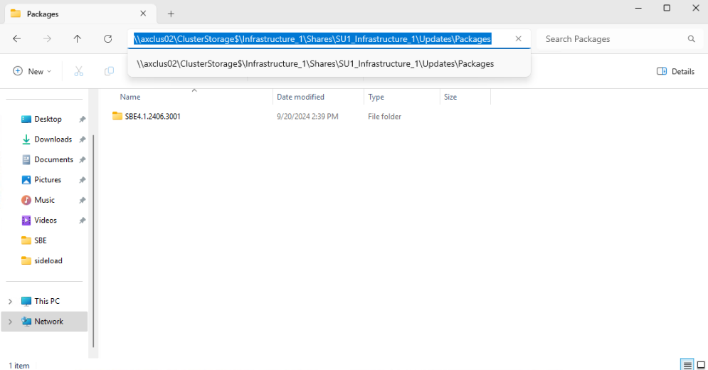

Let's check all details versions

```PowerShell
Invoke-Command -ComputerName $ClusterName -ScriptBlock {
    Get-SolutionUpdate | ConvertTo-Json -Depth 4
}
 
```

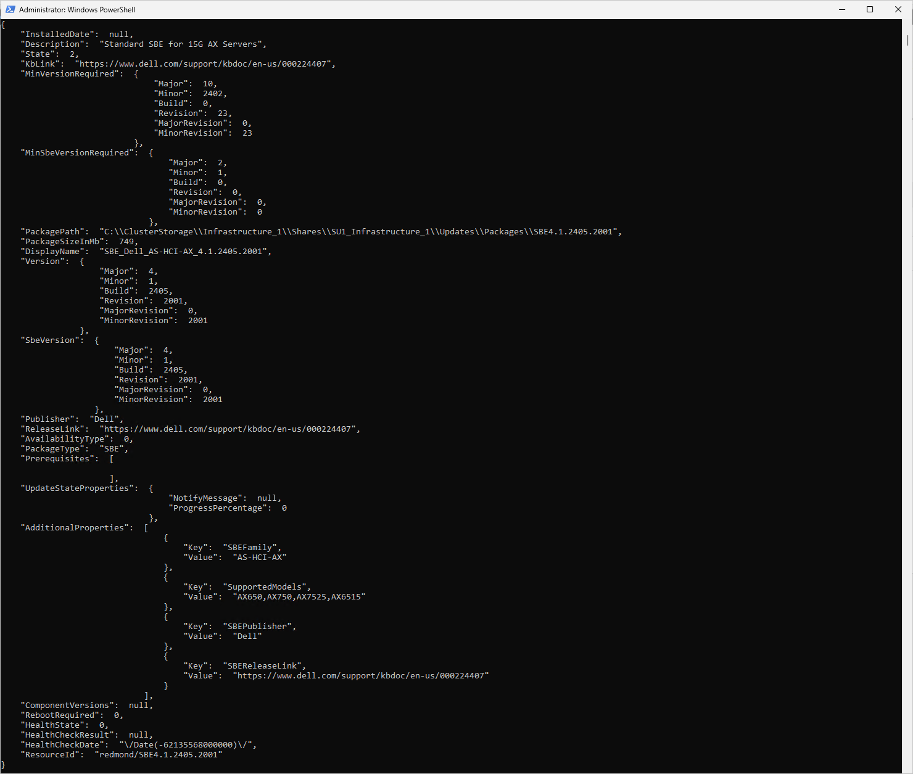

You can also check, if system is ready for update (HealthCheck Result)


```PowerShell
Invoke-Command -ComputerName $ClusterName -ScriptBlock {
    Get-SolutionUpdateEnvironment | Select-Object -ExpandProperty HealthCheckResult
} | Out-Gridview
 
```

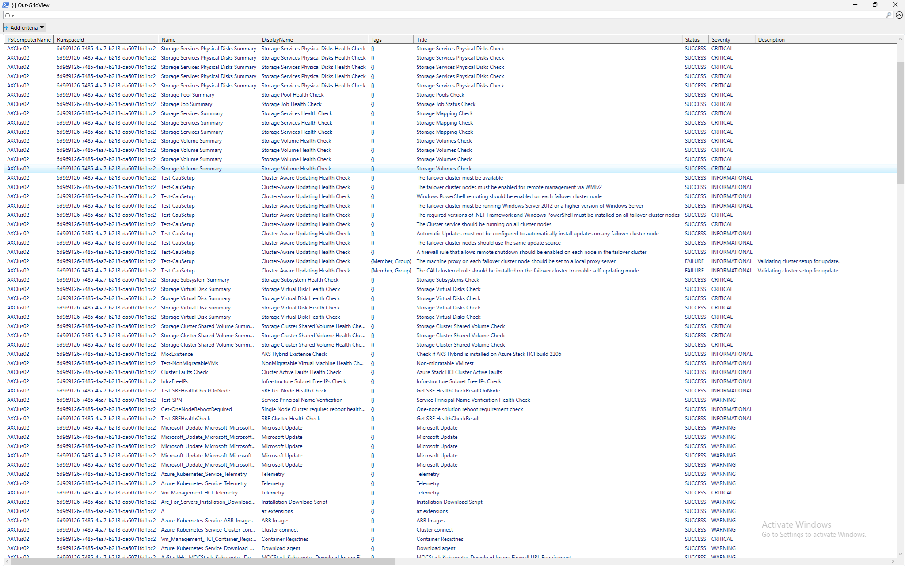


Let's initiate installation

```PowerShell
Invoke-Command -ComputerName $ClusterName -ScriptBlock {
    Get-SolutionUpdate | Start-SolutionUpdate
}
 
```

Note: if this is the first time and you run it from powershell, you might need to add CAU role to your cluster

```PowerShell
    if (-not (Get-CAUClusterRole -ClusterName $ClusterName -ErrorAction Ignore)){
        Add-CauClusterRole -ClusterName $ClusterName -MaxFailedNodes 0 -RequireAllNodesOnline -EnableFirewallRules -GroupName "$ClusterName-CAU" -VirtualComputerObjectName "$ClusterName-CAU" -Force -CauPluginName Microsoft.WindowsUpdatePlugin -MaxRetriesPerNode 3 -CauPluginArguments @{ 'IncludeRecommendedUpdates' = 'False' } -StartDate "3/2/2017 3:00:00 AM" -DaysOfWeek 4 -WeeksOfMonth @(3) -verbose
    #disable self-updating
        Disable-CauClusterRole -ClusterName $ClusterName -Force
    }
 
```

To check status you can run following code

```PowerShell
Invoke-Command -ComputerName $ClusterName -ScriptBlock {
    Get-SolutionUpdate | Format-Table Version,State,UpdateStateProperties,HealthState
}
 
```

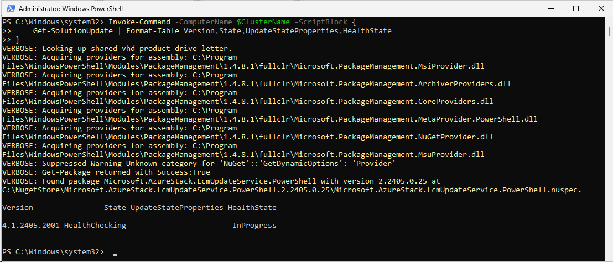

Or to have detailed status you can query Get-SolutionUpdateRun

```PowerShell
Invoke-Command -ComputerName $ClusterName -ScriptBlock {
    Get-SolutionUpdate | Get-SolutionUpdateRun  | ConvertTo-Json -Depth 8
}
 
```

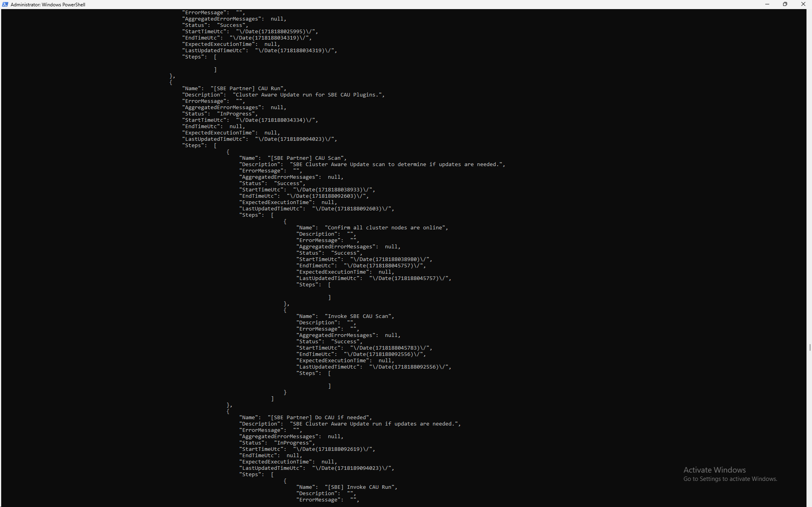

Or check in portal

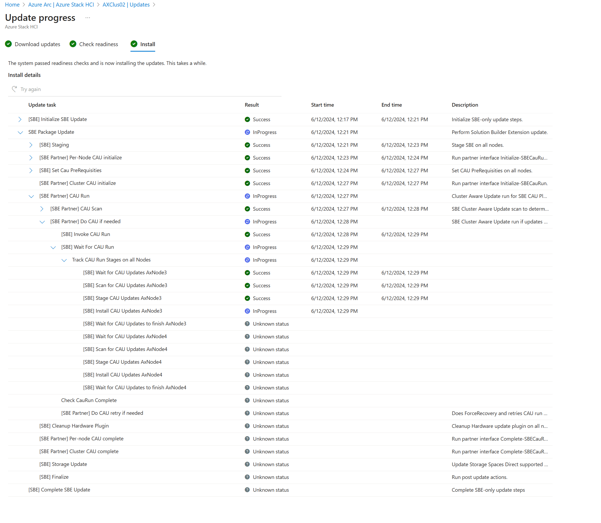

## Check versions and status


```PowerShell
Invoke-Command -ComputerName $ClusterName -ScriptBlock {
    Get-SolutionUpdateEnvironment | Select Current*,*State,Package*
}
 
```

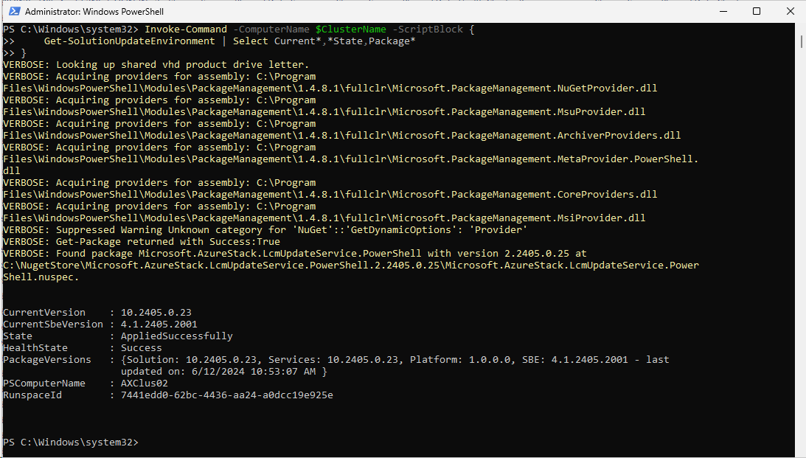

# Exploring Enterprise Cloud Engine (ECE) Client

ECE installs and configure Azure Stack HCI fabric infrastructure on all Azure Stack HCI scale unit servers. This includes actions like installing updates or adding cluster node. Sounds familiar? Yes, this component comes from Azure Stack HUB.

## Exploring available actions

```PowerShell
$ClusterName="AXClus02"

#Grab all available commands in ECE PowerShell module
Invoke-Command -ComputerName $ClusterName -ScriptBlock {
    Get-Command -Module ECEClient
}

```

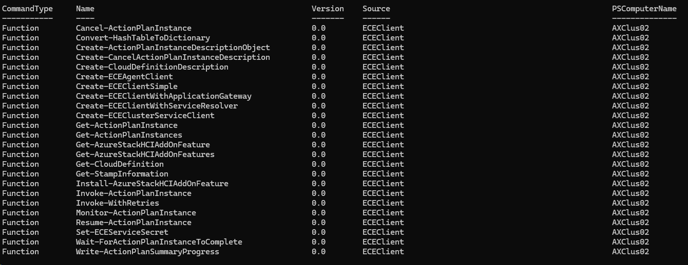


## Display cluster information

You can simply run Get-StampInformation to learn more about Azure Stack HCI cluster

This is helpful as you can collect information about all versions (OEMVersion,StampVersion,ServicesVersion...) from cluster or multiple clusters.

```PowerShell
Invoke-Command -ComputerName $ClusterName -ScriptBlock {
    Get-StampInformation
}

```

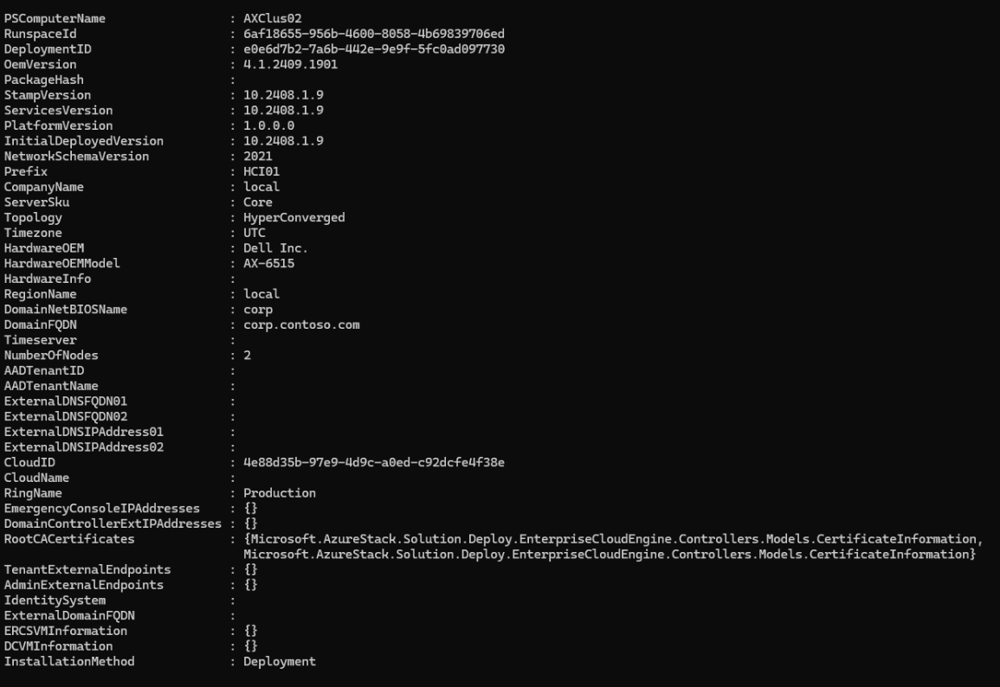


## Explore Action Plans

Action plans is a task that was created by ECE to perform maintenance tasks. You can explore history of the execution by querying action plan instances. 

```PowerShell
$ActionPlans=Invoke-Command -ComputerName $ClusterName -ScriptBlock {
    Get-ActionPlanInstances
}

$ActionPlans | Select-Object InstanceID,Action*,Status,StartDateTime,EndDateTime | Format-Table -AutoSize
 
```

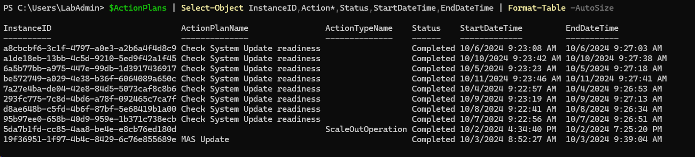

As you can see, I simply updated stamp in the past (ActionPlanName MAS Update) and added a node (ScaleOutOperation) (see [Expanding Azure Stack HCI Lab](https://github.com/DellGEOS/AzureStackHOLs/tree/main/lab-guides/06-ExpandingAzureStackHCI))

Let's take a look at what last action MAS Update did

```PowerShell
[xml]$Progress=($ActionPlans | Where-Object ActionPlanName -eq "MAS Update" | Sort-Object -Property LastModifiedDateTime | Select-Object -Last 1).ProgressAsXml

$Progress.Action
$Progress.Action.Steps.Step | Format-Table -AutoSize
 
```

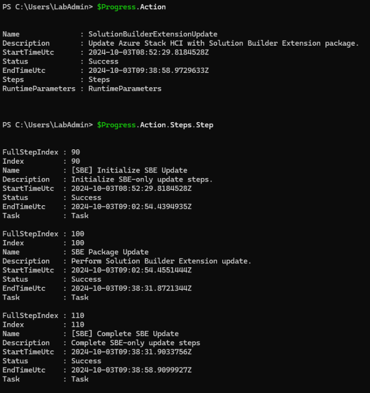

Or you can simply select action plan you want (in this case I selected Action Plan for adding node - ScaleOutOperation)

```PowerShell
[xml]$Progress=($ActionPlans | Out-GridView -OutputMode Single -Title "Please Select Action plan you want to explore").ProgressAsXml

$Progress.Action
$Progress.Action.Steps.Step | Format-Table -AutoSize

```

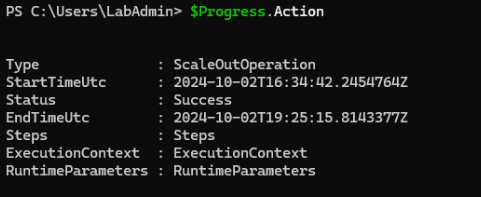


# Deleting failed Action Plans

When update is stuck in GUI and won't let you attempt another run, it's important for Microsoft understand what happened.
This operation should only be performed for development clusters (such as a lab environment) for getting familiar with Azure stack HCI where it is a considered reasonable to redeploy the cluster in the event a cluster issue is observed. 

Microsoft recommends contacting support for issues related to failed updates if the issue cannot be resolved through retries or other remediation. **Proceed at your own risk.**

**WARNING:  Deleting action plan instances:**
1.	**Abandons the update at the point of failure. This can leave the cluster in an inconsistent state.**
2.	**Deletes history of the action plan execution (meaning you are deleting the best record of how the cluster got into the inconsistent state).**
3.	**Prevents Microsoft support from being able to use telemetry to pinpoint the history of events on the cluster should you require assistance to repair your cluster.**

Following code has the deletion itself commented out, to just make sure you understand above.

```PowerShell
$ClusterName="AXClus02"

Invoke-Command -ComputerName $ClusterName -ScriptBlock {
    $FailedSolutionUpdates=Get-SolutionUpdate | Where-Object State -eq InstallationFailed
    foreach ($FailedSolutionUpdate in $FailedSolutionUpdates){
        $RunResourceIDs=(Get-SolutionUpdate -ID $FailedSolutionUpdate.ResourceID | Get-SolutionUpdateRun).ResourceID

        #Create ececlient
        $eceClient=Create-ECEClientSimple
        #create description object
        $description=New-Object Microsoft.AzureStack.Solution.Deploy.EnterpriseCloudEngine.Controllers.Models.DeleteActionPlanInstanceDescription

        #Let's delete it
        foreach ($RunResourceID in $RunResourceIDs){
            $ActionPlanInstanceID=$RunResourceID.Split("/") | Select-Object -Last 1
            $description.ActionPlanInstanceID=$ActionPlanInstanceID
            #uncomment - so you understand you know what you are doing, and understand you might get into unsupported state
            #$eceClient.DeleteActionPlanInstance($description)
        }
    }
}
```