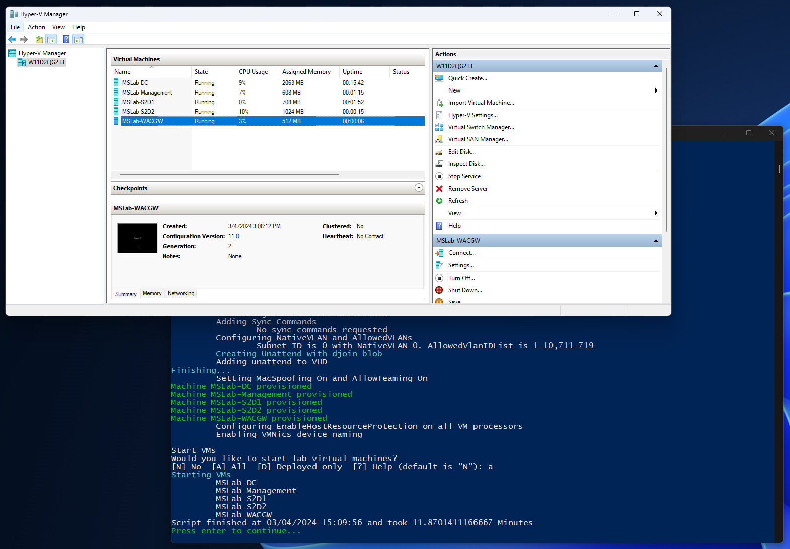
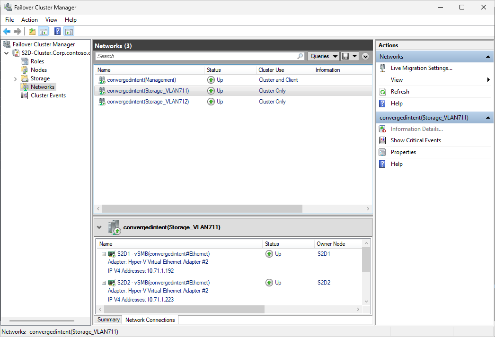

# Testing Windows Server 2025 Insider Preview

<!-- TOC -->

- [Testing Windows Server 2025 Insider Preview](#testing-windows-server-2025-insider-preview)
    - [About the lab](#about-the-lab)
    - [Prerequisites](#prerequisites)
    - [LabConfig](#labconfig)
    - [Explore the lab](#explore-the-lab)
- [Option 1 - Deploy S2D Cluster - PowerShell ISE](#option-1---deploy-s2d-cluster---powershell-ise)
- [Option 2 - Deploy S2D Cluster Step-by-Step](#option-2---deploy-s2d-cluster-step-by-step)
    - [Task 1 - Install Features](#task-1---install-features)
        - [Step 1 - Install features for management](#step-1---install-features-for-management)
        - [Step 2 - Install features on servers](#step-2---install-features-on-servers)
    - [Task 2 - Configure OS Settings](#task-2---configure-os-settings)
        - [Step 1 - Configure Memory Dump and Power Plan](#step-1---configure-memory-dump-and-power-plan)
        - [Step 2 - Configure Max Evenlope size and max timeout value](#step-2---configure-max-evenlope-size-and-max-timeout-value)
        - [Step 3 - Optional Delete existing storage pool](#step-3---optional-delete-existing-storage-pool)
        - [Step 4 - Configure OS Security](#step-4---configure-os-security)
    - [Task 3 - Optional Install Dell Drivers](#task-3---optional-install-dell-drivers)
    - [Task 4 - Restart servers](#task-4---restart-servers)
    - [Task 5 - Create Cluster](#task-5---create-cluster)
        - [Step 1 - Test Cluster](#step-1---test-cluster)
        - [Step 2 - Create cluster](#step-2---create-cluster)
        - [Step 3 - Configure CSV Cache](#step-3---configure-csv-cache)
        - [Step 4 - Configure Witness](#step-4---configure-witness)
    - [Task 6 - Configure Network using Network ATC](#task-6---configure-network-using-network-atc)
        - [Step 1 - Create Cluster Network Intent](#step-1---create-cluster-network-intent)
        - [Step 2 - Wait for intent to finish configuration](#step-2---wait-for-intent-to-finish-configuration)
        - [Step 3 - Optional Validate global settings and modify if needed](#step-3---optional-validate-global-settings-and-modify-if-needed)
    - [Task 7 - Enable Storage Spaces Direct and Create Volumes](#task-7---enable-storage-spaces-direct-and-create-volumes)
        - [Step 1 - Enable S2D](#step-1---enable-s2d)
        - [Step 2 - Create Volumes](#step-2---create-volumes)

<!-- /TOC -->

## About the lab

In this lab you will deploy 2 node Windows Server 2025 S2D cluster using 

The lab is based on [MSLab Azure Stack HCI deployment scenario 22H2 edition](https://github.com/microsoft/MSLab/tree/master/Scenarios/AzSHCI%20Deployment%2022H2%20Edition). However there are some differences as Azure Stack HCI is bit different. Namely Azure Stack has NetworkHUD, registers to Azure, supports thin provisioned volumes...

You can also deploy physical servers (just change the image in task sequence) [using MDT](../../admin-guides/03-DeployPhysicalServersWithMSLab/readme.md)

## Prerequisites

* Hydrated MSLab with LabConfig from [01-HydrateMSLab](../../admin-guides/01-HydrateMSLab/readme.md)

* Understand [how MSLab works](../../admin-guides/02-WorkingWithMSLab/readme.md)

* [Create Windows Server Insider VHDs](../../admin-guides/06-HowToCreateWindowsServerInsiderVHD/readme.md)) (GUI and Core)

## LabConfig

Below LabConfig will deploy 2 cluster nodes (you can simply increase number), also nodes are small, without nested virtualization. To use nested virtualization, simply uncomment lines with nestedvirt VMs and adjust memory/CPUs.

You can notice, that there are VLANs 711-719 as lab will use default NetATC VLANs

```PowerShell
$LabConfig=@{AllowedVLANs="1-10,711-719" ; DomainAdminName='LabAdmin'; AdminPassword='LS1setup!' ; DCEdition='4'; Internet=$true ; AdditionalNetworksConfig=@(); VMs=@()}

#S2D Nodes
1..2 | ForEach-Object {$LABConfig.VMs += @{ VMName="S2D$_" ; Configuration='S2D' ; ParentVHD='WinSrvInsiderCore_26063.vhdx' ; HDDNumber=4 ; HDDSize=2TB ; MemoryStartupBytes=1GB; VMProcessorCount=4 ; vTPM=$true}}

#S2D Nodes (nested virt)
#1..2 | ForEach-Object {$LABConfig.VMs += @{ VMName="S2D$_" ; Configuration='S2D' ; ParentVHD='WinSrvInsiderCore_26063.vhdx' ; HDDNumber=4 ; HDDSize=2TB ; MemoryStartupBytes=8GB ; VMProcessorCount=4 ; vTPM=$true ; NestedVirt=$true}}

#Management machine
$LabConfig.VMs += @{ VMName = 'Management' ; ParentVHD = 'WinSrvInsider_26063.vhdx'; MGMTNICs=1 ; AddToolsVHD=$True }

#Windows Admin Center in GW mode
$LabConfig.VMs += @{ VMName = 'WACGW' ; ParentVHD = 'WinSrvInsiderCore_26063.vhdx'; MGMTNICs=1}

```

Deployment result



## Explore the lab

In Hyper-V Manager, connect to MSLab-Management VM and log in using LabAdmin/LS1setup! credentials.


In management VM, Server Manager will be opened automatially. Right-click on "All Servers" and select Add Servers


Click on "Find Now" and all Windows Servers 2025 should be displayed. Simply add it to selected machines and click OK.


Servers will be added. You can notice that all servers are domain joined and S2D1 and S2D2 have multiple NICs.

# Option 1 - Deploy S2D Cluster - PowerShell ISE

As a shortcut, you can simply follow [this script](./scenario.ps1) in PowerShell ISE. However we will use simplified deployment in this guide. All steps are organized in regions, that you can collapse with ctrl+m shortcut.


# Option 2 - Deploy S2D Cluster Step-by-Step

## Task 1 - Install Features

### Step 1 - Install features for management

Open elevated PowerShell and paste code from each step. Keep the same window open during the lab.

Following code will install all possible RSAT tools that you might need during the lab to manage the environment.

```PowerShell
    #install features for management (assuming you are running these commands on Windows Server with GUI)
    Install-WindowsFeature -Name NetworkATC,RSAT-Clustering,RSAT-Clustering-Mgmt,RSAT-Clustering-PowerShell,RSAT-Hyper-V-Tools,RSAT-Feature-Tools-BitLocker-BdeAducExt,RSAT-AD-PowerShell,RSAT-AD-AdminCenter,RSAT-DHCP,RSAT-DNS-Server
 
```

### Step 2 - Install features on servers

Notice, that there is a list of variables that you can modify on top.

You can also notice, that in virtual environment is Hyper-V installed using DISM powershell module. The script will simply try to install it traditional install-windowsfeature and will fail back to DISM commandlet if it will fail.

Notice also variable $using:features in invoke command. This way you can "smuggle" $feature variable into the invoked command. As result all required features will be installed on nodes.

You can also modify number of servers and populate variable like this: $Servers=1..16 | ForEach-Object {"S2D$_"}

```PowerShell
    #servers list
    $Servers="S2D1","S2D2"
    #alternatively you can generate server names
        #$Servers=1..2 | ForEach-Object {"S2D$_"}

    #install roles and features on servers
    #install Hyper-V using DISM if Install-WindowsFeature fails (if nested virtualization is not enabled install-windowsfeature fails)
    Invoke-Command -ComputerName $servers -ScriptBlock {
        $Result=Install-WindowsFeature -Name "Hyper-V" -ErrorAction SilentlyContinue
        if ($result.ExitCode -eq "failed"){
            Enable-WindowsOptionalFeature -FeatureName Microsoft-Hyper-V -Online -NoRestart 
        }
    }
    #define and install other features
    $features="Failover-Clustering","RSAT-Clustering-PowerShell","Hyper-V-PowerShell","NetworkATC","Data-Center-Bridging","RSAT-DataCenterBridging-LLDP-Tools","FS-SMBBW","System-Insights","RSAT-System-Insights"
    #optional - affects perf even if not enabled on volumes as filter driver is attached (SR,Dedup) and also Bitlocker, that affects a little bit
    #$features+="Storage-Replica","RSAT-Storage-Replica","FS-Data-Deduplication","BitLocker","RSAT-Feature-Tools-BitLocker"
    Invoke-Command -ComputerName $servers -ScriptBlock {Install-WindowsFeature -Name $using:features}
 
```

## Task 2 - Configure OS Settings

### Step 1 - Configure Memory Dump and Power Plan

Active memory dump will create full memory dump and will filter the VMs data.

Default power plan is Balanced. Configuring high performance power plan is recommended. Does not make sense to configure it in VM, therefore script is checking if it's VM or real system before configuring it.

```PowerShell
#region configure OS settings
    #Configure Active memory dump https://docs.microsoft.com/en-us/windows-hardware/drivers/debugger/varieties-of-kernel-mode-dump-files
    Invoke-Command -ComputerName $servers -ScriptBlock {
        Set-ItemProperty -Path HKLM:\System\CurrentControlSet\Control\CrashControl -Name CrashDumpEnabled -value 1
        Set-ItemProperty -Path HKLM:\System\CurrentControlSet\Control\CrashControl -Name FilterPages -value 1
    }

    #Configure high performance power plan
    #set high performance if not VM
    Invoke-Command -ComputerName $servers -ScriptBlock {
        if ((Get-ComputerInfo).CsSystemFamily -ne "Virtual Machine"){
            powercfg /SetActive 8c5e7fda-e8bf-4a96-9a85-a6e23a8c635c
        }
    }
    #check settings
    Invoke-Command -ComputerName $servers -ScriptBlock {powercfg /list}
 
```

### Step 2 - Configure Max Evenlope size and max timeout value

Max Evenlope size is useful if you need to copy data from/to PSSession. It's useful if SMB firewall rule is not enabled and you need to transfer data. However it's much slower than plain SMB.

MaxTimeout is by default 6s. Dell recommends extending this timeout to 10s. In virutal environments it's recommended to extend it to 30s as per Microsoft recommendation

```PowerShell
    #Configure max evenlope size to be 8kb to be able to copy files using PSSession (useful for dell drivers update region and Windows Admin Center)
    Invoke-Command -ComputerName $servers -ScriptBlock {Set-Item -Path WSMan:\localhost\MaxEnvelopeSizekb -Value 8192}

    #Configure MaxTimeout (10s for Dell hardware - especially if you have HDDs, 30s for Virtual environment https://learn.microsoft.com/en-us/windows-server/storage/storage-spaces/storage-spaces-direct-in-vm)
    if ((Get-CimInstance -ClassName win32_computersystem -CimSession $servers[0]).Manufacturer -like "*Dell Inc."){
        Invoke-Command -ComputerName $servers -ScriptBlock {Set-ItemProperty -Path HKLM:\SYSTEM\CurrentControlSet\Services\spaceport\Parameters -Name HwTimeout -Value 0x00002710}
    }
    if ((Get-CimInstance -ClassName win32_computersystem -CimSession $servers[0]).Model -eq "Virtual Machine"){
        Invoke-Command -ComputerName $servers -ScriptBlock {Set-ItemProperty -Path HKLM:\SYSTEM\CurrentControlSet\Services\spaceport\Parameters -Name HwTimeout -Value 0x00007530}
    }
 
```

### Step 3 - (Optional) Delete existing storage pool

If disks were already member of Storage Pool, it's necessary to clean data (except when you want to keep data and pool in case of failover cluster recovery). Following script identifies all disks except the one that is boot and will wipe it.

```PowerShell
    #Delete Storage Pool if there is any from last install
        #Grab pools
        $StoragePools=Get-StoragePool -CimSession $Servers -IsPrimordial $False -ErrorAction Ignore
        #remove pools if any
        if ($StoragePools){
            $StoragePools | Remove-StoragePool -Confirm:0
        }
        #Reset disks (to clear spaces metadata)
        Invoke-Command -ComputerName $Servers -ScriptBlock {
            Get-PhysicalDisk -CanPool $True | Reset-PhysicalDisk
            $disks=Get-Disk | Where-Object IsBoot -eq $false
            $disks | Set-Disk -IsReadOnly $false
            $disks | Set-Disk -IsOffline $false
            $disks | Clear-Disk -RemoveData -RemoveOEM -Confirm:0
            $disks | get-disk | Set-Disk -IsOffline $true
        }
 
```

### Step 4 - Configure OS Security

Configuring device guard is documented here https://learn.microsoft.com/en-us/windows/security/identity-protection/credential-guard/configure?tabs=reg

Notice that several line are commented. Such as HypervisoerEnforcedCodeIntegrity lock and deviceguard lock. This means, that every time you will need to disable it, it will prompt you during the boot to confirm it (needs to press a key during POST)

```PowerShell
    #Enable secured core
    Invoke-Command -ComputerName $servers -ScriptBlock {
        #Device Guard
        #REG ADD "HKLM\SYSTEM\CurrentControlSet\Control\DeviceGuard" /v "Locked" /t REG_DWORD /d 1 /f 
        REG ADD "HKLM\SYSTEM\CurrentControlSet\Control\DeviceGuard" /v "EnableVirtualizationBasedSecurity" /t REG_DWORD /d 1 /f
        #there s different setting for VM and Bare metal
        if ((Get-CimInstance -ClassName win32_computersystem).Model -eq "Virtual Machine"){
            REG ADD "HKLM\SYSTEM\CurrentControlSet\Control\DeviceGuard" /v "RequirePlatformSecurityFeatures" /t REG_DWORD /d 1 /f
        }else{
            REG ADD "HKLM\SYSTEM\CurrentControlSet\Control\DeviceGuard" /v "RequirePlatformSecurityFeatures" /t REG_DWORD /d 3 /f
        }
        REG ADD "HKLM\SYSTEM\CurrentControlSet\Control\DeviceGuard" /v "RequireMicrosoftSignedBootChain" /t REG_DWORD /d 1 /f

        #Cred Guard
        REG ADD "HKLM\SYSTEM\CurrentControlSet\Control\Lsa" /v "LsaCfgFlags" /t REG_DWORD /d 1 /f

        #System Guard Secure Launch (bare meta only)
        #https://docs.microsoft.com/en-us/windows/security/threat-protection/windows-defender-system-guard/system-guard-secure-launch-and-smm-protection
        REG ADD "HKLM\SYSTEM\CurrentControlSet\Control\DeviceGuard\Scenarios\SystemGuard" /v "Enabled" /t REG_DWORD /d 1 /f

        #HVCI
        REG ADD "HKLM\SYSTEM\CurrentControlSet\Control\DeviceGuard\Scenarios\HypervisorEnforcedCodeIntegrity" /v "Enabled" /t REG_DWORD /d 1 /f
        #REG ADD "HKLM\SYSTEM\CurrentControlSet\Control\DeviceGuard\Scenarios\HypervisorEnforcedCodeIntegrity" /v "Locked" /t REG_DWORD /d 1 /f
        REG ADD "HKLM\SYSTEM\CurrentControlSet\Control\DeviceGuard\Scenarios\HypervisorEnforcedCodeIntegrity" /v "HVCIMATRequired" /t REG_DWORD /d 1 /f
    }
 
```

## Task 3 - (Optional) Install Dell Drivers

If this system is based on Physical servers, you can simply download DSU tool, copy it to nodes and then install all available updates. You can slightly modify code and simply choose updates you want to install. 


```PowerShell
    $DSUDownloadFolder="$env:USERPROFILE\Downloads\DSU"

    #Download DSU
    #https://github.com/DellProSupportGse/Tools/blob/main/DART.ps1
    #download latest DSU to Downloads
    $LatestDSU="https://dl.dell.com/FOLDER10889507M/1/Systems-Management_Application_RPW7K_WN64_2.0.2.3_A00.EXE"
    if (-not (Test-Path $DSUDownloadFolder -ErrorAction Ignore)){New-Item -Path $DSUDownloadFolder -ItemType Directory}
    Start-BitsTransfer -Source $LatestDSU -Destination $DSUDownloadFolder\DSU.exe

    #upload DSU to servers
    $Sessions=New-PSSession -ComputerName $Servers
    Invoke-Command -Session $Sessions -ScriptBlock {
        if (-not (Test-Path $using:DSUDownloadFolder -ErrorAction Ignore)){New-Item -Path $using:DSUDownloadFolder -ItemType Directory}
    }
    foreach ($Session in $Sessions){
        Copy-Item -Path "$DSUDownloadFolder\DSU.exe" -Destination "$DSUDownloadFolder" -ToSession $Session -Force -Recurse
    }
    $Sessions | Remove-PSSession
    #install DSU
    Invoke-Command -ComputerName $Servers -ScriptBlock {
        Start-Process -FilePath "$using:DSUDownloadFolder\DSU.exe" -ArgumentList "/silent" -Wait 
    }

    #Check compliance
    Invoke-Command -ComputerName $Servers -ScriptBlock {
        & "C:\Program Files\Dell\DELL System Update\DSU.exe" --compliance --output-format="json" --output="$using:DSUDownloadFolder\Compliance.json"
    }         
    #collect results
    $Compliance=@()
    foreach ($Server in $Servers){
        $json=Invoke-Command -ComputerName $server -ScriptBlock {Get-Content "$using:DSUDownloadFolder\Compliance.json"}
        $object = $json | ConvertFrom-Json 
        $components=$object.SystemUpdateCompliance.UpdateableComponent
        $components | Add-Member -MemberType NoteProperty -Name "ClusterName" -Value $ClusterName
        $components | Add-Member -MemberType NoteProperty -Name "ServerName" -Value $Server
        $Compliance+=$Components
    }

    #display results
    $Compliance | Out-GridView

    #Or just choose what updates to install
    #$Compliance=$Compliance | Out-GridView -OutputMode Multiple

    #Install Dell updates https://www.dell.com/support/home/en-us/product-support/product/system-update/docs
    $UpdateNames=(($Compliance | Where-Object {$_.NodeName -eq $Node -and $_.compliancestatus -eq $false}).PackageFilePath | Split-Path -Leaf) -join ","
    Invoke-Command -ComputerName $servers -ScriptBlock {
        & "C:\Program Files\Dell\DELL System Update\DSU.exe" --update-list="$using:UpdateNames" --apply-upgrades --apply-downgrades
    }
 
```

## Task 4 - Restart servers

To reboot servers use below code. If you are using PowerShell 7 to reboot, then you need to wait for WinRM as waiting for PowerShell does not work for some odd reason.

There are two reboots when installing Hyper-V, therefore there's added a line to wait a bit and then again wait for connectivity.

```PowerShell
    Restart-Computer $servers -Protocol WSMan -Wait -For PowerShell -Force
    Start-Sleep 20 #Failsafe as Hyper-V needs 2 reboots and sometimes it happens, that during the first reboot the restart-computer evaluates the machine is up
    #make sure computers are restarted
    Foreach ($Server in $Servers){
        do{$Test= Test-NetConnection -ComputerName $Server -CommonTCPPort WINRM}while ($test.TcpTestSucceeded -eq $False)
    }
 
```

## Task 5 - Create Cluster

### Step 1 - Test Cluster

Before cluster creation you can validate cluster configuration. However the network was not yet configured as it will be confgured once cluster is created (with cluster intent)

You can list of available tests using "Test-Cluster -List -Node $Servers"

```PowerShell
Test-Cluster -Node $Servers -Verbose
 
```

### Step 2 - Create cluster

THere are multiple ways CNO can use IP Address. Either it can have dedicated IP (static or from DHCP), or it can use Distributed Management Point. To use Distributed Management Point it will need to create DNS record (CNO) for each node IP Address. Distributed Management Point does not need any extra IP.

Notice that there are some new variables configuring the cluster name/IP or if you want DMP

```PowerShell
$CLusterName="S2D-Cluster"
$ClusterIP=""
$DistributedManagementPoint=$false


#region Create cluster
    #Create Cluster
    If ($DistributedManagementPoint){
        New-Cluster -Name $ClusterName -Node $servers -ManagementPointNetworkType "Distributed"
    }else{
        if ($ClusterIP){
            New-Cluster -Name $ClusterName -Node $servers -StaticAddress $ClusterIP
        }else{
            New-Cluster -Name $ClusterName -Node $servers
        }
    }
    Start-Sleep 5
    Clear-DnsClientCache
    if ((Get-CimInstance -ClassName win32_computersystem -CimSession $Servers[0]).Manufacturer -like "*Dell Inc."){
        #Enable USB NIC used by iDRAC
        Enable-NetAdapter -CimSession $Servers -InterfaceDescription "Remote NDIS Compatible Device"
    }

    Start-Sleep 5
    Clear-DnsClientCache
 
```

You can validate cluster running by opening cluadmin.msc and connecting to cluster


### Step 3 - Configure CSV Cache

By default is CSV cache 512MB. It is not recommended to use CSV cache if you use Storage Class Memory (anyone remembers what is that? :) or if you have VM, it will just allocate more ram, so it will be disabled for VM too.

```PowerShell
    #Configure CSV Cache (value is in MB) - disable if SCM or VM is used. For VM it's just for labs - to save some RAM.
    if (Get-PhysicalDisk -cimsession $servers[0] | Where-Object bustype -eq SCM){
        #disable CSV cache if SCM storage is used
        (Get-Cluster $ClusterName).BlockCacheSize = 0
    }elseif ((Invoke-Command -ComputerName $servers[0] -ScriptBlock {(get-wmiobject win32_computersystem).Model}) -eq "Virtual Machine"){
        #disable CSV cache for virtual environments
        (Get-Cluster $ClusterName).BlockCacheSize = 0
    }
 
```

### Step 4 - Configure Witness

In this case we will use DC as a witness host. In real world scenario it should be independent machine that will guarantee enough votes available in case your cluster node/nodes will go down.

Below example also contains example on how to configure cloud witness.

Disk witness is not available in storage spaces world (it also does not make sense as disk would go offline together with storage pool)

```PowerShell
    $WitnessType="FileShare" #or Cloud
    $WitnessServer="DC" #name of server where witness will be configured
    #if cloud then configure following (use your own, these are just examples)
    <#
    $CloudWitnessStorageAccountName="MyStorageAccountName"
    $CloudWitnessStorageKey="qi8QB/VSHHiA9lSvz1kEIEt0JxIucPL3l99nRHhkp+n1Lpabu4Ydi7Ih192A4VW42vccIgUnrXxxxxxxxxxxxx=="
    $CloudWitnessEndpoint="core.windows.net"
    #>

    #ConfigureWitness
    if ($WitnessType -eq "FileShare"){
        ##Configure Witness on WitnessServer
        #Create new directory
            $WitnessName=$Clustername+"Witness"
            Invoke-Command -ComputerName $WitnessServer -ScriptBlock {new-item -Path c:\Shares -Name $using:WitnessName -ItemType Directory -ErrorAction Ignore}
            $accounts=@()
            $accounts+="$env:userdomain\$ClusterName$"
            $accounts+="$env:userdomain\$env:USERNAME"
            #$accounts+="$env:userdomain\Domain Admins"
            New-SmbShare -Name $WitnessName -Path "c:\Shares\$WitnessName" -FullAccess $accounts -CimSession $WitnessServer
        #Set NTFS permissions 
            Invoke-Command -ComputerName $WitnessServer -ScriptBlock {(Get-SmbShare $using:WitnessName).PresetPathAcl | Set-Acl}
        #Set Quorum
            Set-ClusterQuorum -Cluster $ClusterName -FileShareWitness "\\$WitnessServer\$WitnessName"
    }elseif($WitnessType -eq $Cloud){
        Set-ClusterQuorum -Cluster $ClusterName -CloudWitness -AccountName $CloudWitnessStorageAccountName -AccessKey $CloudWitnessStorageKey -Endpoint $CloudWitnessEndpoint 
    }
#endregion
 
```

You can validate if witness was configured in cluadmin.msc

## Task 6 - Configure Network using Network ATC

### Step 1 - Create Cluster Network Intent

In following example notice how network adapter are picked up. For this instance we will use "Ethernet" and "Ethernet 2" (virtual environment). In Virtual Environment you also need to disable RDMA (create an override to disable Network Direct).

In case this would be real hardware, the script will create converged intent and it will grab fastest adapters that are up.

Note that there is commented "-StorageVlans 1,2" - just an example if you want to use other VLANs than 711-718

```PowerShell
    #make sure NetATC,FS-SMBBW and other required features are installed on servers
    Invoke-Command -ComputerName $Servers -ScriptBlock {
        Install-WindowsFeature -Name NetworkATC,Data-Center-Bridging,RSAT-Clustering-PowerShell,RSAT-Hyper-V-Tools,FS-SMBBW
    }
    #make sure NetATC (and other management tools) is installed on Management Machine (note: DCB does not have separate RSAT, therefore it needs to be installed to have posh module)
    Install-WindowsFeature -Name NetworkATC,Data-Center-Bridging,RSAT-Clustering-PowerShell,RSAT-Hyper-V-Tools,FS-SMBBW

    #if virtual environment, then skip RDMA config
    if ((Get-CimInstance -ClassName win32_computersystem -CimSession $servers[0]).Model -eq "Virtual Machine"){
        #virtual environment (skipping RDMA config)
        $AdapterOverride = New-NetIntentAdapterPropertyOverrides
        $AdapterOverride.NetworkDirect = 0
        Add-NetIntent -ClusterName $ClusterName -Name ConvergedIntent -Management -Compute -Storage -AdapterName "Ethernet","Ethernet 2" -AdapterPropertyOverrides $AdapterOverride -Verbose #-StorageVlans 1,2
    }else{
    #on real hardware you can configure RDMA
        #grab fastest adapters names (assuming that we are deploying converged intent with just Mellanox or Intel E810)
        $FastestLinkSpeed=(get-netadapter -CimSession $Servers | Where-Object {$_.Status -eq "up" -and $_.HardwareInterface -eq $True}).Speed | Sort-Object -Descending | Select-Object -First 1
        #grab adapters
        $AdapterNames=(Get-NetAdapter -CimSession $Servers[0] | Where-Object {$_.Status -eq "up" -and $_.HardwareInterface -eq $True} | where-object Speed -eq $FastestLinkSpeed | Sort-Object Name).Name
        #$AdapterNames="SLOT 3 Port 1","SLOT 3 Port 2"
        Add-NetIntent -ClusterName $ClusterName -Name ConvergedIntent -Management -Compute -Storage -AdapterName $AdapterNames -Verbose #-StorageVlans 1,2
    }
 
```


### Step 2 - Wait for intent to finish configuration

```PowerShell
    #check
    Start-Sleep 20 #let intent propagate a bit
    Write-Output "applying intent"
    do {
        $status=Get-NetIntentStatus -ClusterName $ClusterName
        Write-Host "." -NoNewline
        Start-Sleep 5
    } while ($status.ConfigurationStatus -contains "Provisioning" -or $status.ConfigurationStatus -contains "Retrying")
 
```

to check status you can simply run:

```PowerShell
Get-NetIntentStatus -ClusterName $ClusterName
 
```

Or view networks in cluadmin.msc



### Step 3 - (Optional) Validate global settings and modify if needed


Following code explains what other values can be adjusted to fine tune NetATC global intent settings. It might be valuable increasing number of live migrations (default 1), allow Management network for Live Migration (to allow cluster to cluster LM)...

```PowerShell
        #region Check settings before applying NetATC
            #Check what networks were excluded from Live Migration
            $Networks=(Get-ClusterResourceType -Cluster $clustername -Name "Virtual Machine" | Get-ClusterParameter -Name MigrationExcludeNetworks).Value -split ";"
            foreach ($Network in $Networks){Get-ClusterNetwork -Cluster $ClusterName | Where-Object ID -Match $Network}

            #check Live Migration option (probably bug, because it should default to SMB - version tested 1366)
            Get-VMHost -CimSession $Servers | Select-Object *Migration*

            #Check smbbandwith limit cluster settings (notice for some reason is SetSMBBandwidthLimit=1)
            Get-Cluster -Name $ClusterName | Select-Object *SMB*

            #check SMBBandwidthLimit settings (should be pouplated already with defaults on physical cluster - it calculated 1562500000 bytes per second on 2x25Gbps NICs)
            Get-SmbBandwidthLimit -CimSession $Servers

            #check VLAN settings (notice it's using Adapter Isolation, not VLAN)
            Get-VMNetworkAdapterIsolation -CimSession $Servers -ManagementOS

            #check number of live migrations (default is 1)
            get-vmhost -CimSession $Servers | Select-Object Name,MaximumVirtualMachineMigrations
        #endregion

        #region Adjust NetATC global overrides (assuming there is one vSwitch) (just an example, default settings are fine)
            $vSwitchNics=(Get-VMSwitch -CimSession $Servers[0]).NetAdapterInterfaceDescriptions
            $LinkCapacityInGbps=(Get-NetAdapter -CimSession $Servers[0] -InterfaceDescription $vSwitchNics | Measure-Object Speed -Sum).sum/1000000000

            $overrides=New-NetIntentGlobalClusterOverrides
            $overrides.MaximumVirtualMachineMigrations=4
            $overrides.MaximumSMBMigrationBandwidthInGbps=$LinkCapacityInGbps*0.4 #40%, if one switch is down, LM will not saturate bandwidth
            $overrides.VirtualMachineMigrationPerformanceOption="SMB" #in VMs is Compression selected.
            Set-NetIntent -GlobalClusterOverrides $overrides -Cluster $CLusterName

            Start-Sleep 20 #let intent propagate a bit
            Write-Output "applying overrides intent"
            do {
                $status=Get-NetIntentStatus -Globaloverrides -Cluster $CLusterName
                Write-Host "." -NoNewline
                Start-Sleep 5
            } while ($status.ConfigurationStatus -contains "Provisioning" -or $status.ConfigurationStatus -contains "Retrying")
        #endregion

        #region verify settings again
            #Check Cluster Global overrides
            $GlobalOverrides=Get-Netintent -GlobalOverrides -Cluster $CLusterName
            $GlobalOverrides.ClusterOverride

            #check Live Migration option
            Get-VMHost -CimSession $Servers | Select-Object *Migration*

            #Check LiveMigrationPerf option and Limit (SetSMBBandwidthLimit was 1, now is 0)
            Get-Cluster -Name $ClusterName | Select-Object *SMB*

            #check SMBBandwidthLimit settings
            Get-SmbBandwidthLimit -CimSession $Servers

            #check number of live migrations
            get-vmhost -CimSession $Servers | Select-Object Name,MaximumVirtualMachineMigrations

            #check it in cluster (is only 1 - expected)
            get-cluster -Name $ClusterName | Select-Object Name,MaximumParallelMigrations

        #endregion
 
```

## Task 7 - Enable Storage Spaces Direct and Create Volumes

### Step 1 - Enable S2D

```PowerShell
    #Enable-ClusterS2D
    Enable-ClusterS2D -CimSession $ClusterName -confirm:0 -Verbose
 
```


### Step 2 - Create Volumes

```PowerShell
    #create 1TB volume on each node
    foreach ($Server in $Servers){
        New-Volume -StoragePoolFriendlyName  "S2D on $ClusterName" -FriendlyName $Server -Size 1TB -CimSession $ClusterName
    }

    #align volumes ownership to with servers
    foreach ($Server in $Servers){
        Move-ClusterSharedVolume -Name "Cluster Virtual Disk ($Server)" -Node $Server -Cluster $ClusterName
    }
 
```

