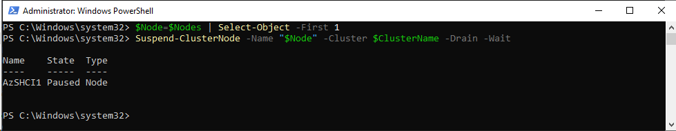
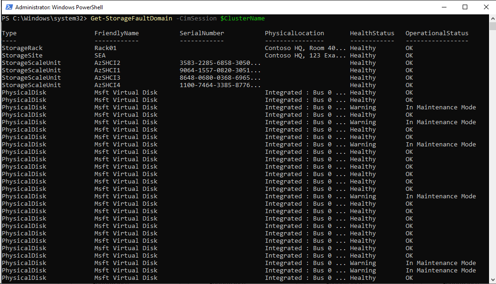
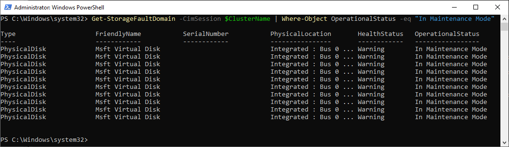
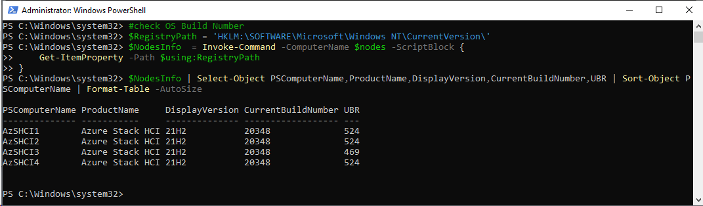
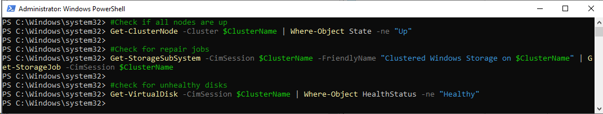
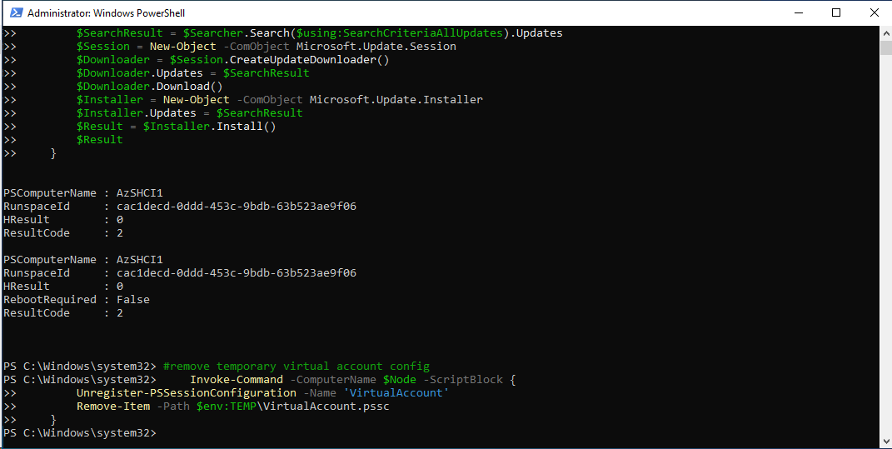

# Azure Stack HCI Cluster maintenance deep dive

<!-- TOC -->

- [Azure Stack HCI Cluster maintenance deep dive](#azure-stack-hci-cluster-maintenance-deep-dive)
    - [About the lab](#about-the-lab)
    - [Prerequisites](#prerequisites)
    - [Task 01 - Explore status of the Azure Stack HCI cluster](#task-01---explore-status-of-the-azure-stack-hci-cluster)
    - [Task 02 - Explore Microsoft update level of Azure Stack HCI Cluster](#task-02---explore-microsoft-update-level-of-azure-stack-hci-cluster)
    - [Task 03 - Explore missing Dell updates](#task-03---explore-missing-dell-updates)
    - [Task 04 - Perform "manual" update of Azure Stack HCI Cluster node](#task-04---perform-manual-update-of-azure-stack-hci-cluster-node)
    - [Task 05 - Perform scripted update of Azure Stack HCI Cluster](#task-05---perform-scripted-update-of-azure-stack-hci-cluster)

<!-- /TOC -->

## About the lab

This lab will help you understand cluster maintenance - both how to expore cluster status and how to perform cluster maintenance. This lab is not intended to replace [Dell OpenManage integration with Windows Admin Center](https://github.com/DellGEOS/AzureStackHOLs/blob/main/lab-guides/03-OpenManageExtensionForWAC/readme.md), it just helps explaining entire process in detail.

The lab is based on [AzSHCI and Dell Servers Update](https://github.com/microsoft/MSLab/tree/master/Scenarios/AzSHCI%20and%20Dell%20Servers%20Update) MSLab scenario.

If using virtual environment, dell DSU will obviously not work.

## Prerequisites

To perform following lab you can setup cluster using guides below:

* Hydrate MSLab with LabConfig from [01-HydrateMSLab](admin-guides/01-HydrateMSLab/readme.md)

* [Learn How MSLab works](admin-guides/02-WorkingWithMSLab/readme.md)

* [Deploy OS on hardware](admin-guides/03-DeployPhysicalServersWithMSLab/readme.md)

* [Deploy Azure Stack HCI with PowerShell](lab-guides/02-DeployAzureStackHCICluster-PowerShell/readme.md)

Or you can Azure Stack HCI cluster in VMs as demonstrated in [Azure Stack HCI Deployment MSLab Scenario](https://github.com/microsoft/MSLab/tree/master/Scenarios/AzSHCI%20Deployment).

## Task 01 - Explore status of the Azure Stack HCI cluster

> Note: Run all PowerShell code from DC or Management machine

**Step 1** Run PowerShell to fill variables and make sure all management tools are installed

```PowerShell
$ClusterName="AzSHCI-Cluster"
$Nodes=(Get-ClusterNode -Cluster $ClusterName).Name
Install-WindowsFeature -Name RSAT-Clustering,RSAT-Clustering-PowerShell
 
```

**Step 2** Run PowerShell suspend one of the nodes, so we can explore what suspending one node will do to the cluster itself.

```PowerShell
$Node=$Nodes | Select-Object -First 1
Suspend-ClusterNode -Name "$Node" -Cluster $ClusterName -Drain -Wait
 
```



**Step 3** Explore Cluster Nodes status

```PowerShell
Get-ClusterNode -Cluster $ClusterName
 
```


**Step 4** Explore Virtual Disk status

> Note: If everything is OK, all Virtual disks HealthStatus will report as Healthy and OperationalStatus as OK

>Note: In this case, cluster node is suspended. The Virtual Disk HealthStatus reports Warning and OperationalStatus reports Degraded.

```PowerShell
Get-VirtualDisk -CimSession $ClusterName
 
```


**Step 5** Explore Storage Subsystem Status

```PowerShell
Get-StorageSubSystem -CimSession $ClusterName -FriendlyName "Clustered Windows Storage on $ClusterName"
 
```


**Step 6** Explore Repair Jobs

```PowerShell
Get-StorageSubSystem -CimSession $ClusterName -FriendlyName "Clustered Windows Storage on $ClusterName" | Get-StorageJob -CimSession $ClusterName
 
```


**Step 7** Explore Fault Domains

```PowerShell
Get-StorageFaultDomain -CimSession $ClusterName
 
```



**Step 8** Explore Storage Maintenance mode

```PowerShell
Get-StorageFaultDomain -CimSession $ClusterName | Where-Object OperationalStatus -eq "In Maintenance Mode"
 
```



**Step 9** Resume Cluster node again

```PowerShell
$Node=$Nodes | Select-Object -First 1
Resume-ClusterNode -Name "$Node" -Cluster $ClusterName -Failback Immediate
 
```


## Task 02 - Explore Microsoft update level of Azure Stack HCI Cluster

**Step 1** Populate variables if PowerShell window was closed

```PowerShell
$ClusterName="AzSHCI-Cluster"
$Nodes=(Get-ClusterNode -Cluster $ClusterName).Name
Install-WindowsFeature -Name RSAT-Clustering,RSAT-Clustering-PowerShell
 
```

**Step 2** Explore Microsoft Update level

```PowerShell
#check OS Build Number
$RegistryPath = 'HKLM:\SOFTWARE\Microsoft\Windows NT\CurrentVersion\'
$NodesInfo  = Invoke-Command -ComputerName $nodes -ScriptBlock {
    Get-ItemProperty -Path $using:RegistryPath
}
$NodesInfo | Select-Object PSComputerName,ProductName,DisplayVersion,CurrentBuildNumber,UBR | Sort-Object PSComputerName | Format-Table -AutoSize
 
```



> Note: As you can see, registry CurrentVersion contains multiple interesting information, such as version of Azure Stack HCI (21H2), build number and more interestingly UBR (Update Build Revision). UBR directly translates to update level. For example UBR 524 is [February 8 Security Update](https://support.microsoft.com/en-us/topic/february-8-2022-security-update-kb5010354-bc5de80a-8b86-4828-b10f-a4e81dbae329). Release information can be also found in [Microsoft Docs](https://docs.microsoft.com/en-us/azure-stack/hci/release-information#azure-stack-hci-version-21h2-os-build-20348).

## Task 03 - Explore missing Dell updates

> Note: To explore missing hardware/firmware updates command [Dell System Update](https://www.dell.com/support/home/en-us/product-support/product/system-update/docs) can be used.

> Note: You can give it a try in virtual environment, but tool will obviously fail to find any applicable update

**Step 1** Populate variables if PowerShell window was closed

```PowerShell
$ClusterName="AzSHCI-Cluster"
$Nodes=(Get-ClusterNode -Cluster $ClusterName).Name
Install-WindowsFeature -Name RSAT-Clustering,RSAT-Clustering-PowerShell
 
```

**Step 2** Download DSU tool together with Azure Stack HCI catalog to Downloads folder

```PowerShell
#grab DSU links from Dell website
$URL="https://dl.dell.com/omimswac/dsu/"
$Results=Invoke-WebRequest $URL -UseDefaultCredentials
$Links=$results.Links.href | Select-Object -Skip 1
#create PSObject from results
$DSUs=@()
foreach ($Link in $Links){
    $DSUs+=[PSCustomObject]@{
        Link = "https://dl.dell.com$Link"
        Version = $link -split "_" | Select-Object -Last 2 | Select-Object -First 1
    }
}
#download latest DSU to Downloads
$LatestDSU=$DSUs | Sort-Object Version | Select-Object -Last 1
Start-BitsTransfer -Source $LatestDSU.Link -Destination $env:UserProfile\Downloads\DSU.exe

#Download AzureStackHCI Catalog to Downloads
Start-BitsTransfer -Source "https://downloads.dell.com/catalog/ASHCI-Catalog.xml.gz" -Destination "$env:UserProfile\Downloads\ASHCI-Catalog.xml.gz"
 
```


**Step 3** Unpack Azure Stack HCI catalog

```PowerShell
Function Expand-GZipArchive{
    Param(
        $infile,
        $outfile = ($infile -replace '\.gz$','')
        )
    $input = New-Object System.IO.FileStream $inFile, ([IO.FileMode]::Open), ([IO.FileAccess]::Read), ([IO.FileShare]::Read)
    $output = New-Object System.IO.FileStream $outFile, ([IO.FileMode]::Create), ([IO.FileAccess]::Write), ([IO.FileShare]::None)
    $gzipStream = New-Object System.IO.Compression.GzipStream $input, ([IO.Compression.CompressionMode]::Decompress)
    $buffer = New-Object byte[](1024)
    while($true){
        $read = $gzipstream.Read($buffer, 0, 1024)
        if ($read -le 0){break}
        $output.Write($buffer, 0, $read)
        }
    $gzipStream.Close()
    $output.Close()
    $input.Close()
}
Expand-GZipArchive "$env:UserProfile\Downloads\ASHCI-Catalog.xml.gz" "$env:UserProfile\Downloads\ASHCI-Catalog.xml"
 
```

**Step 4** Distribute DSU and catalog to nodes

```PowerShell
$Sessions=New-PSSession -ComputerName $Nodes
$files="$env:UserProfile\Downloads\ASHCI-Catalog.xml","$env:UserProfile\Downloads\DSU.exe"
foreach ($Session in $Sessions){
    foreach ($file in $files){
        Copy-Item -Path $file -Destination $file -ToSession $Session -Recurse -Force
    }
}
$Sessions | Remove-PSSession
 
```

**Step 5** Install DSU into nodes

```PowerShell
Invoke-Command -ComputerName $Nodes -ScriptBlock {
    Start-Process -FilePath "$env:UserProfile\Downloads\DSU.exe" -ArgumentList "/silent" -Wait 
}
 
```

**Step 6** Perform update scan

```PowerShell
Invoke-Command -ComputerName $Nodes -ScriptBlock {
    & "C:\Program Files\Dell\DELL EMC System Update\DSU.exe" --catalog-location="$env:UserProfile\Downloads\ASHCI-Catalog.xml" --preview
}
 
```

**Step 7** Display update scan results

```PowerShell
$ScanResult=Invoke-Command -ComputerName $Nodes -ScriptBlock {
(Get-content "C:\ProgramData\Dell\DELL EMC System Update\dell_dup\DSU_STATUS.json" | ConvertFrom-JSon).systemUpdateStatus.InvokerInfo
}
$ScanResult | Select-Object PSComputerName,StatusMessage
 
```


## Task 04 - Perform "manual" update of Azure Stack HCI Cluster node

**Step 1** Populate variables if PowerShell window was closed

```PowerShell
$ClusterName="AzSHCI-Cluster"
$Nodes=(Get-ClusterNode -Cluster $ClusterName).Name
Install-WindowsFeature -Name RSAT-Clustering,RSAT-Clustering-PowerShell
 
```

**Step 2** Check if Cluster is ready for patching

> Note: Output will be empty if all is OK

```PowerShell
#Check if all nodes are up
Get-ClusterNode -Cluster $ClusterName | Where-Object State -ne "Up"

#Check for repair jobs
Get-StorageSubSystem -CimSession $ClusterName -FriendlyName "Clustered Windows Storage on $ClusterName" | Get-StorageJob -CimSession $ClusterName

#check for unhealthy disks
Get-VirtualDisk -CimSession $ClusterName | Where-Object HealthStatus -ne "Healthy"
 
```



**Step 3** If all checks are ok, we can select node to work with

```PowerShell
$Node=$Nodes | Out-GridView -OutputMode Single -Title "Select cluster node to suspend and patch"
 
```


**Step 4** Make sure Dell binaries are present on server (these steps were already performed in Task 3)

```PowerShell
#grab DSU links from Dell website
$URL="https://dl.dell.com/omimswac/dsu/"
$Results=Invoke-WebRequest $URL -UseDefaultCredentials
$Links=$results.Links.href | Select-Object -Skip 1
#create PSObject from results
$DSUs=@()
foreach ($Link in $Links){
    $DSUs+=[PSCustomObject]@{
        Link = "https://dl.dell.com$Link"
        Version = $link -split "_" | Select-Object -Last 2 | Select-Object -First 1
    }
}
#download latest DSU to Downloads
$LatestDSU=$DSUs | Sort-Object Version | Select-Object -Last 1
Start-BitsTransfer -Source $LatestDSU.Link -Destination $env:UserProfile\Downloads\DSU.exe

#Download AzureStackHCI Catalog to Downloads
Start-BitsTransfer -Source "https://downloads.dell.com/catalog/ASHCI-Catalog.xml.gz" -Destination "$env:UserProfile\Downloads\ASHCI-Catalog.xml.gz"

#Expand Catalog
Function Expand-GZipArchive{
    Param(
        $infile,
        $outfile = ($infile -replace '\.gz$','')
        )
    $input = New-Object System.IO.FileStream $inFile, ([IO.FileMode]::Open), ([IO.FileAccess]::Read), ([IO.FileShare]::Read)
    $output = New-Object System.IO.FileStream $outFile, ([IO.FileMode]::Create), ([IO.FileAccess]::Write), ([IO.FileShare]::None)
    $gzipStream = New-Object System.IO.Compression.GzipStream $input, ([IO.Compression.CompressionMode]::Decompress)
    $buffer = New-Object byte[](1024)
    while($true){
        $read = $gzipstream.Read($buffer, 0, 1024)
        if ($read -le 0){break}
        $output.Write($buffer, 0, $read)
        }
    $gzipStream.Close()
    $output.Close()
    $input.Close()
}
Expand-GZipArchive "$env:UserProfile\Downloads\ASHCI-Catalog.xml.gz" "$env:UserProfile\Downloads\ASHCI-Catalog.xml"
 
#Copy files to node
$Session=New-PSSession -ComputerName $Node
$files="$env:UserProfile\Downloads\ASHCI-Catalog.xml","$env:UserProfile\Downloads\DSU.exe"
foreach ($file in $files){
        Copy-Item -Path $file -Destination $file -ToSession $Session -Recurse -Force
}
$Session | Remove-PSSession

#Install DSU
Invoke-Command -ComputerName $Node -ScriptBlock {
    Start-Process -FilePath "$env:UserProfile\Downloads\DSU.exe" -ArgumentList "/silent" -Wait 
}
 
```

**Step 4** Install all Dell updates

```PowerShell
Invoke-Command -ComputerName $Node -ScriptBlock {
    #create answerfile for DU
    $content='@
    a
    c
    @'
    Set-Content -Path "$env:UserProfile\Downloads\answer.txt" -Value $content -NoNewline
    #Create CMD to install updates
    $content='"C:\Program Files\Dell\DELL EMC System Update\DSU.exe" --catalog-location=ASHCI-Catalog.xml --apply-upgrades <answer.txt'
    Set-Content -Path "$env:UserProfile\Downloads\install.cmd" -Value $content -NoNewline
    #install DSU updates
    Start-Process -FilePath "install.cmd" -Wait -WorkingDirectory "$env:UserProfile\Downloads"
    #display result
    Get-Content "C:\ProgramData\Dell\DELL EMC System Update\dell_dup\DSU_STATUS.json"
}
 
```


**Step 5** Install all available Microsoft updates

```PowerShell
#Configure virtual account to be able to deploy updates on node
    Invoke-Command -ComputerName $node -ScriptBlock {
        New-PSSessionConfigurationFile -RunAsVirtualAccount -Path $env:TEMP\VirtualAccount.pssc
        Register-PSSessionConfiguration -Name 'VirtualAccount' -Path $env:TEMP\VirtualAccount.pssc -Force
    } -ErrorAction Ignore

#install Microsoft updates
    #configure what updates will be applied
    $SearchCriteriaAllUpdates = "IsInstalled=0 and DeploymentAction='Installation' or
        IsPresent=1 and DeploymentAction='Uninstallation' or
        IsInstalled=1 and DeploymentAction='Installation' and RebootRequired=1 or
        IsInstalled=0 and DeploymentAction='Uninstallation' and RebootRequired=1"
    Write-Output "$($Node):Installing Microsoft $Updates Updates"
    #perform update
    Invoke-Command -ComputerName $Node -ConfigurationName 'VirtualAccount' {
        $Searcher = New-Object -ComObject Microsoft.Update.Searcher
        $SearchResult = $Searcher.Search($using:SearchCriteriaAllUpdates).Updates
        $Session = New-Object -ComObject Microsoft.Update.Session
        $Downloader = $Session.CreateUpdateDownloader()
        $Downloader.Updates = $SearchResult
        $Downloader.Download()
        $Installer = New-Object -ComObject Microsoft.Update.Installer
        $Installer.Updates = $SearchResult
        $Result = $Installer.Install()
        $Result
    }
#remove temporary virtual account config
    Invoke-Command -ComputerName $Node -ScriptBlock {
        Unregister-PSSessionConfiguration -Name 'VirtualAccount'
        Remove-Item -Path $env:TEMP\VirtualAccount.pssc
    }
 
```



**Step 6** Suspend cluster node and enable storage maintenance mode

```PowerShell
#Suspend node
Suspend-ClusterNode -Name "$Node" -Cluster $ClusterName -Drain -Wait | Out-Null

#enable storage maintenance mode
Get-StorageFaultDomain -CimSession $ClusterName -FriendlyName $Node | Enable-StorageMaintenanceMode -CimSession $ClusterName
 
```

**Step 7** Restart node, and wait for the node to come up

```PowerShell
Restart-Computer -ComputerName $Node -Protocol WSMan -Wait -For PowerShell
 
```

**Step 8** Resume cluster node and disable storage maintenance mode

```PowerShell
#disable storage maintenance mode
Get-StorageFaultDomain -CimSession $ClusterName -FriendlyName $Node | Disable-StorageMaintenanceMode -CimSession $ClusterName

#resume cluster node
Resume-ClusterNode -Name "$Node" -Cluster $ClusterName -Failback Immediate | Out-Null
 
```

## Task 05 - Perform scripted update of Azure Stack HCI Cluster

> Note: This script is 1:1 to what is published [in MSLab Scenario](https://github.com/microsoft/MSLab/blob/master/Scenarios/AzSHCI%20and%20Dell%20Servers%20Update/Scenario.ps1)

**Step 1** Paste following code into PowerShell window. Make sure you are using right $ClusterName.

```PowerShell
#region Variables
    $ClusterName="AzSHCI-Cluster"
    $Nodes=(Get-ClusterNode -Cluster $ClusterName).Name

    $DSUDownloadFolder="$env:USERPROFILE\Downloads\DSU"
    $DSUPackageDownloadFolder="$env:USERPROFILE\Downloads\DSUPackage"

    $Updates="Recommended" #or "All"

    $ForceReboot=$false #or $true, to reboot even if there were no updates applied

    # Configure Search Criteria for windows update
        if ($Updates -eq "Recommended"){
            $SearchCriteriaAllUpdates = "IsInstalled=0 and DeploymentAction='Installation' or
                IsPresent=1 and DeploymentAction='Uninstallation' or
                IsInstalled=1 and DeploymentAction='Installation' and RebootRequired=1 or
                IsInstalled=0 and DeploymentAction='Uninstallation' and RebootRequired=1"
        }elseif ($Updates -eq "All"){
            $SearchCriteriaAllUpdates = "IsInstalled=0 and DeploymentAction='Installation' or
                IsInstalled=0 and DeploymentAction='OptionalInstallation' or
                IsPresent=1 and DeploymentAction='Uninstallation' or
                IsInstalled=1 and DeploymentAction='Installation' and RebootRequired=1 or
                IsInstalled=0 and DeploymentAction='Uninstallation' and RebootRequired=1"
        }
#endregion

#region prepare DSU binaries
    #Download DSU
        #https://github.com/DellProSupportGse/Tools/blob/main/DART.ps1

        #grab DSU links from Dell website
        $URL="https://dl.dell.com/omimswac/dsu/"
        $Results=Invoke-WebRequest $URL -UseDefaultCredentials
        $Links=$results.Links.href | Select-Object -Skip 1
        #create PSObject from results
        $DSUs=@()
        foreach ($Link in $Links){
            $DSUs+=[PSCustomObject]@{
                Link = "https://dl.dell.com$Link"
                Version = $link -split "_" | Select-Object -Last 2 | Select-Object -First 1
            }
        }
        #download latest to separate folder
        $LatestDSU=$DSUs | Sort-Object Version | Select-Object -Last 1
        if (-not (Test-Path $DSUDownloadFolder -ErrorAction Ignore)){New-Item -Path $DSUDownloadFolder -ItemType Directory}
        Start-BitsTransfer -Source $LatestDSU.Link -Destination $DSUDownloadFolder\DSU.exe

        #upload DSU to servers
        $Sessions=New-PSSession -ComputerName $Nodes
        foreach ($Session in $Sessions){
            Copy-Item -Path $DSUDownloadFolder -Destination $DSUDownloadFolder -ToSession $Session -Recurse -Force
        }
        $Sessions | Remove-PSSession
        #install DSU
        Invoke-Command -ComputerName $Nodes -ScriptBlock {
            Start-Process -FilePath "$using:DSUDownloadFolder\DSU.exe" -ArgumentList "/silent" -Wait 
        }

    #download catalog and copy DSU Package to servers
        #Dell Azure Stack HCI driver catalog https://downloads.dell.com/catalog/ASHCI-Catalog.xml.gz
        #Download catalog
        Start-BitsTransfer -Source "https://downloads.dell.com/catalog/ASHCI-Catalog.xml.gz" -Destination "$env:UserProfile\Downloads\ASHCI-Catalog.xml.gz"
        #unzip gzip to a folder https://scatteredcode.net/download-and-extract-gzip-tar-with-powershell/
        if (-not (Test-Path $DSUPackageDownloadFolder -ErrorAction Ignore)){New-Item -Path $DSUPackageDownloadFolder -ItemType Directory}
        Function Expand-GZipArchive{
            Param(
                $infile,
                $outfile = ($infile -replace '\.gz$','')
                )
            $input = New-Object System.IO.FileStream $inFile, ([IO.FileMode]::Open), ([IO.FileAccess]::Read), ([IO.FileShare]::Read)
            $output = New-Object System.IO.FileStream $outFile, ([IO.FileMode]::Create), ([IO.FileAccess]::Write), ([IO.FileShare]::None)
            $gzipStream = New-Object System.IO.Compression.GzipStream $input, ([IO.Compression.CompressionMode]::Decompress)
            $buffer = New-Object byte[](1024)
            while($true){
                $read = $gzipstream.Read($buffer, 0, 1024)
                if ($read -le 0){break}
                $output.Write($buffer, 0, $read)
                }
            $gzipStream.Close()
            $output.Close()
            $input.Close()
        }
        Expand-GZipArchive "$env:UserProfile\Downloads\ASHCI-Catalog.xml.gz" "$DSUPackageDownloadFolder\ASHCI-Catalog.xml"
        #create answerfile for DU
        $content='@
        a
        c
        @'
        Set-Content -Path "$DSUPackageDownloadFolder\answer.txt" -Value $content -NoNewline
        $content='"C:\Program Files\Dell\DELL EMC System Update\DSU.exe" --catalog-location=ASHCI-Catalog.xml --apply-upgrades <answer.txt'
        Set-Content -Path "$DSUPackageDownloadFolder\install.cmd" -Value $content -NoNewline

        #upload DSU package to servers
        $Sessions=New-PSSession -ComputerName $Nodes
        foreach ($Session in $Sessions){
            Copy-Item -Path $DSUPackageDownloadFolder -Destination $DSUPackageDownloadFolder -ToSession $Session -Recurse -Force
        }
        $Sessions | Remove-PSSession
#endregion

#region check if there are any updates needed
$ScanResult=Invoke-Command -ComputerName $Nodes -ScriptBlock {
    & "C:\Program Files\Dell\DELL EMC System Update\DSU.exe" --catalog-location="$using:DSUPackageDownloadFolder\ASHCI-Catalog.xml" --preview | Out-Null
    $Result=(Get-content "C:\ProgramData\Dell\DELL EMC System Update\dell_dup\DSU_STATUS.json" | ConvertFrom-JSon).systemupdatestatus.invokerinfo.statusmessage
    if ($Result -like "No Applicable Update*" ){
        $DellUpdateRequired=$false
    }else{
        $DellUpdateRequired=$true
    }

    #scan for microsoft updates
    $Searcher = New-Object -ComObject Microsoft.Update.Searcher
    $SearchResult = $Searcher.Search($using:SearchCriteriaAllUpdates).Updates
    if ($SearchResult.Count -gt 0){
        $MicrosoftUpdateRequired=$True
    }else{
        $MicrosoftUpdateRequired=$False
    }

    #grab windows version
    $ComputersInfo  = Get-ItemProperty -Path 'HKLM:\SOFTWARE\Microsoft\Windows NT\CurrentVersion\'

    $Output=@()
    $Output += [PSCustomObject]@{
            "DellUpdateRequired"      = $DellUpdateRequired
            "MicrosoftUpdateRequired" = $MicrosoftUpdateRequired
            "MicrosoftUpdates"        = $SearchResult
            "ComputerName"            = $env:COMPUTERNAME
            "CurrentBuildNumber"      = $ComputersInfo.CurrentBuildNumber
            "UBR"                     = $ComputersInfo.UBR
    }
    return $Output
}
$ScanResult
#endregion

#region install DSU and Microsoft updates and restart
    #Configure virtual account
    Invoke-Command -ComputerName $nodes -ScriptBlock {
        New-PSSessionConfigurationFile -RunAsVirtualAccount -Path $env:TEMP\VirtualAccount.pssc
        Register-PSSessionConfiguration -Name 'VirtualAccount' -Path $env:TEMP\VirtualAccount.pssc -Force
    } -ErrorAction Ignore
    

    #let's update do node by node (in case something goes wrong). It would be definitely faster if we would install both updates at once. But if something would go wrong on one node, it's easier to roll back
    foreach ($Node in $Nodes){
        #Install Dell updates https://dl.dell.com/content/manual36290092-dell-emc-system-update-version-1-9-3-0-user-s-guide.pdf?language=en-us&ps=true
        if (($ScanResult | Where-Object ComputerName -eq $node).DellUpdateRequired){
            Write-Output "$($Node):Installing Dell System Updates"
            Invoke-Command -ComputerName $Node -ScriptBlock {
                #install DSU updates
                Start-Process -FilePath "install.cmd" -Wait -WorkingDirectory $using:DSUPackageDownloadFolder
                #display result
                Get-Content "C:\ProgramData\Dell\DELL EMC System Update\dell_dup\DSU_STATUS.json"
            }
        }

        #install Microsoft updates
        if (($ScanResult | Where-Object ComputerName -eq $node).MicrosoftUpdateRequired){
            Write-Output "$($Node):Installing Microsoft $Updates Updates"
            $MSUpdateInstallResult=Invoke-Command -ComputerName $Node -ConfigurationName 'VirtualAccount' {
                $Searcher = New-Object -ComObject Microsoft.Update.Searcher
                $SearchResult = $Searcher.Search($using:SearchCriteriaAllUpdates).Updates
                $Session = New-Object -ComObject Microsoft.Update.Session
                $Downloader = $Session.CreateUpdateDownloader()
                $Downloader.Updates = $SearchResult
                $Downloader.Download()
                $Installer = New-Object -ComObject Microsoft.Update.Installer
                $Installer.Updates = $SearchResult
                $Result = $Installer.Install()
                $Result
            }
        }

        #Check if reboot is required
        if (($ScanResult | Where-Object ComputerName -eq $node).DellUpdateRequired -or $MSUpdateInstallResult.RebootRequired -or $ForceReboot){
            Write-Output "$($Node): Reboot is required"
            #check for repair jobs, if found, wait until finished
            Write-Output "$($Node): Waiting for Storage jobs to finish"
            if ((Get-StorageSubSystem -CimSession $ClusterName -FriendlyName Clus* | Get-StorageJob -CimSession $ClusterName | Where-Object Name -eq Repair) -ne $Null){
                do{
                    $jobs=(Get-StorageSubSystem -CimSession $ClusterName -FriendlyName Clus* | Get-StorageJob -CimSession $ClusterName)
                    if ($jobs | Where-Object Name -eq Repair){
                        $count=($jobs | Measure-Object).count
                        $BytesTotal=($jobs | Measure-Object BytesTotal -Sum).Sum
                        $BytesProcessed=($jobs | Measure-Object BytesProcessed -Sum).Sum
                        [System.Console]::Write("$count Repair Storage Job(s) Running. GBytes Processed: $($BytesProcessed/1GB) GBytes Total: $($BytesTotal/1GB)               `r")
                        #Check for Suspended jobs (if there are no running repair jobs, only suspended and still unhealthy disks). Kick the repair with Repair-Virtual disk if so... 
                        if ((($jobs | where-Object Name -eq Repair | where-Object JobState -eq "Running") -eq $Null) -and ($jobs | where-Object Name -eq Repair | where-Object JobState -eq "Suspended") -and (Get-VirtualDisk -CimSession $ClusterName | where healthstatus -ne Healthy)){
                            Write-Output "Suspended repair job and Degraded virtual disk found. Invoking Virtual Disk repair"
                            Get-VirtualDisk -CimSession $ClusterName | where-Object HealthStatus -ne "Healthy" | Repair-VirtualDisk
                        }
                        Start-Sleep 5
                    }
                }until (($jobs | Where-Object Name -eq Repair) -eq $null)
            }

            #Check if all disks are healthy. Wait if not
            Write-Output "$($Node): Checking if all disks are healthy"
            if (Get-VirtualDisk -CimSession $ClusterName | Where-Object HealthStatus -ne "Healthy"){
                Write-Output "$($Node): Waiting for virtual disks to become healthy"
                do{Start-Sleep 5}while(Get-VirtualDisk -CimSession $ClusterName | Where-Object HealthStatus -ne "Healthy")
            }
            #Check if all fault domains are healthy. Wait if not
            Write-Output "$($Node): Checking if all fault domains are healthy"
            if (Get-StorageFaultDomain -CimSession $ClusterName | Where-Object HealthStatus -ne "Healthy"){
                Write-Output "$($Node): Waiting for fault domains to become healthy"
                do{Start-Sleep 5}while(Get-StorageFaultDomain -CimSession $ClusterName | Where-Object HealthStatus -ne "Healthy")
            }

            #Suspend node
            Write-Output "$($Node): Suspending Cluster Node"
            Suspend-ClusterNode -Name "$Node" -Cluster $ClusterName -Drain -Wait | Out-Null

            #enable storage maintenance mode
            Write-Output "$($Node): Enabling Storage Maintenance mode"
            Get-StorageFaultDomain -CimSession $ClusterName -FriendlyName $Node | Enable-StorageMaintenanceMode -CimSession $ClusterName

            #restart node and wait for PowerShell to come up
            Write-Output "$($Node): Restarting Cluster Node"
            Restart-Computer -ComputerName $Node -Protocol WSMan -Wait -For PowerShell

            #disable storage maintenance mode
            Write-Output "$($Node): Disabling Storage Maintenance mode"
            Get-StorageFaultDomain -CimSession $ClusterName -FriendlyName $Node | Disable-StorageMaintenanceMode -CimSession $ClusterName

            #resume cluster node
            Write-Output "$($Node): Resuming Cluster Node"
            Resume-ClusterNode -Name "$Node" -Cluster $ClusterName -Failback Immediate | Out-Null

            #wait for machines to finish live migration
            Write-Output "$($Node): Waiting for Live migrations to finish"
            do {Start-Sleep 5}while(
                Invoke-Command -ComputerName $Nodes -ScriptBlock {Get-CimInstance -Namespace root\virtualization\v2 -ClassName Msvm_MigrationJob} | Where-Object StatusDescriptions -eq "Job is running"
            )
        }else{
            Write-Output "$($Node): Reboot is not required"
        }
    }

    #remove temporary virtual account config
    Invoke-Command -ComputerName $Nodes -ScriptBlock {
        Unregister-PSSessionConfiguration -Name 'VirtualAccount'
        Remove-Item -Path $env:TEMP\VirtualAccount.pssc
    }

#endregion

#region check Microsoft Update Levels
    #check OS Build Number on all cluster nodes
    $RegistryPath = 'HKLM:\SOFTWARE\Microsoft\Windows NT\CurrentVersion\'
    $ComputersInfo  = Invoke-Command -ComputerName (Get-ClusterNode -Cluster $ClusterName).Name -ScriptBlock {
        Get-ItemProperty -Path $using:RegistryPath
    }
    $ComputersInfo | Select-Object PSComputerName,CurrentBuildNumber,UBR
 
#endregion
 
```