# Expanding Azure Stack HCI

<!-- TOC -->

- [Expanding Azure Stack HCI](#expanding-azure-stack-hci)
    - [About the lab](#about-the-lab)
    - [Prepare server](#prepare-server)
    - [Add server](#add-server)
    - [Synchronize changes with Azure](#synchronize-changes-with-azure)

<!-- /TOC -->

## About the lab

In this Hands-on lab you will expand one-node solution to two nodes. Just to illustrate rebuilding volumes, adding witness and more.

You can simply follow [Cloud-based deployment HOL](https://github.com/DellGEOS/AzureStackHOLs/tree/main/lab-guides/01a-DeployAzureStackHCICluster-CloudBasedDeployment) and simply deploying one node.

[Official documentation](https://learn.microsoft.com/en-us/azure-stack/hci/manage/add-server)

## Prepare server

Following code is more or less same as in cloud-based deployment HOL. I kept it almost the same, I just commented out all sections that are not needed when adding node

You can copy code into PowerShellISE or Visual Studio Code and collapse all regions (in PSISE it's ctrl+m)

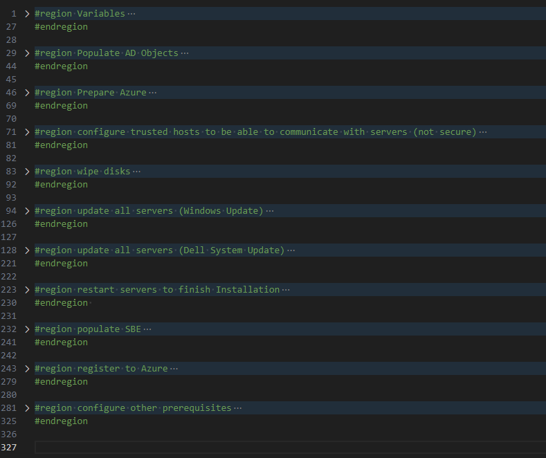

```PowerShell
#region Variables
    #$AsHCIOUName="OU=ASClus01,DC=Corp,DC=contoso,DC=com"
    #$LCMUserName="ASClus01-LCMUser"
    #$LCMPassword="LS1setup!LS1setup!"
    #$SecuredPassword = ConvertTo-SecureString $LCMPassword -AsPlainText -Force
    #$LCMCredentials= New-Object System.Management.Automation.PSCredential ($LCMUserName,$SecuredPassword)

    $ResourceGroupName="ASClus01-RG"
    $Location="eastus"

    $Servers="ASNode2"
    $ResourceGroupName="ASClus01-RG"

    $Cloud="AzureCloud"

    #Since machines are not domain joined, let's do some preparation
    $UserName="Administrator"
    $Password="LS1setup!"
    $SecuredPassword = ConvertTo-SecureString $password -AsPlainText -Force
    $Credentials= New-Object System.Management.Automation.PSCredential ($UserName,$SecuredPassword)

    #new local admin creds
    $NewLocalAdminCreds="LS1setup!LS1setup!"

    #NTP Server
    $NTPServer="DC.corp.contoso.com"
#endregion

#region Populate AD Objects
<#
#install posh module for prestaging Active Directory
Install-PackageProvider -Name NuGet -Force
Install-Module AsHciADArtifactsPreCreationTool -Repository PSGallery -Force

#make sure active directory module and GPMC is installed
Install-WindowsFeature -Name RSAT-AD-PowerShell,GPMC

#populate objects
New-HciAdObjectsPreCreation -AzureStackLCMUserCredential $LCMCredentials -AsHciOUName $AsHCIOUName

#install management features to explore cluster,settings...
Install-WindowsFeature -Name "RSAT-ADDS","RSAT-Clustering"
#>
#endregion

#region Prepare Azure
#login to azure
    #download Azure module
    Install-PackageProvider -Name NuGet -MinimumVersion 2.8.5.201 -Force
    if (!(Get-InstalledModule -Name az.accounts -ErrorAction Ignore)){
        Install-Module -Name Az.Accounts -Force 
    }
    #login
    Connect-AzAccount -UseDeviceAuthentication

    #assuming new az.accounts module was used and it asked you what subscription to use - then correct subscription is selected for context
    $SubscriptionID=(Get-AzContext).Subscription

 #install az resources module
    if (!(Get-InstalledModule -Name "az.resources" -ErrorAction Ignore)){
        Install-Module -Name "az.resources" -Force
    }
<#
#create resource group
    if (-not(Get-AzResourceGroup -Name $ResourceGroupName -ErrorAction Ignore)){
        New-AzResourceGroup -Name $ResourceGroupName -Location $location
    }
#>
#endregion

#region configure trusted hosts to be able to communicate with servers (not secure)
$TrustedHosts=@()
$TrustedHosts+=$Servers
Set-Item WSMan:\localhost\Client\TrustedHosts -Value $($TrustedHosts -join ',') -Force

Invoke-Command -ComputerName $servers -ScriptBlock {
    Enable-WindowsOptionalFeature -FeatureName Microsoft-Hyper-V -Online -NoRestart
    Install-WindowsFeature -Name Failover-Clustering
} -Credential $Credentials

#endregion

#region wipe disks
Invoke-Command -ComputerName $Servers -ScriptBlock {
    $disks=Get-Disk | Where-Object IsBoot -eq $false
    $disks | Set-Disk -IsReadOnly $false
    $disks | Set-Disk -IsOffline $false
    $disks | Clear-Disk -RemoveData -RemoveOEM -Confirm:0
    $disks | get-disk | Set-Disk -IsOffline $true
} -Credential $Credentials

#endregion

#region update all servers (Windows Update)
    Invoke-Command -ComputerName $servers -ScriptBlock {
        New-PSSessionConfigurationFile -RunAsVirtualAccount -Path $env:TEMP\VirtualAccount.pssc
        Register-PSSessionConfiguration -Name 'VirtualAccount' -Path $env:TEMP\VirtualAccount.pssc -Force
    } -ErrorAction Ignore -Credential $Credentials
    #sleep a bit
    Start-Sleep 2
    # Run Windows Update via ComObject.
    Invoke-Command -ComputerName $servers -ConfigurationName 'VirtualAccount' -ScriptBlock {
        $Searcher = New-Object -ComObject Microsoft.Update.Searcher
        $SearchCriteriaAllUpdates = "IsInstalled=0 and DeploymentAction='Installation' or
                                IsInstalled=0 and DeploymentAction='OptionalInstallation' or
                                IsPresent=1 and DeploymentAction='Uninstallation' or
                                IsInstalled=1 and DeploymentAction='Installation' and RebootRequired=1 or
                                IsInstalled=0 and DeploymentAction='Uninstallation' and RebootRequired=1"
        $SearchResult = $Searcher.Search($SearchCriteriaAllUpdates).Updates
        if ($SearchResult.Count -gt 0){
            $Session = New-Object -ComObject Microsoft.Update.Session
            $Downloader = $Session.CreateUpdateDownloader()
            $Downloader.Updates = $SearchResult
            $Downloader.Download()
            $Installer = New-Object -ComObject Microsoft.Update.Installer
            $Installer.Updates = $SearchResult
            $Result = $Installer.Install()
            $Result
        }
    } -Credential $Credentials
    #remove temporary PSsession config
    Invoke-Command -ComputerName $servers -ScriptBlock {
        Unregister-PSSessionConfiguration -Name 'VirtualAccount'
        Remove-Item -Path $env:TEMP\VirtualAccount.pssc
    }  -Credential $Credentials
#endregion

#region update all servers (Dell System Update)
    $DSUDownloadFolder="c:\Temp\DSU"

    #Set up web client to download files with autheticated web request
    $WebClient = New-Object System.Net.WebClient
    #$proxy = new-object System.Net.WebProxy
    $proxy = [System.Net.WebRequest]::GetSystemWebProxy()
    $proxy.Credentials = [System.Net.CredentialCache]::DefaultCredentials
    #$proxy.Address = $proxyAdr
    #$proxy.useDefaultCredentials = $true
    $WebClient.proxy = $proxy

    #Download DSU
    #https://github.com/DellProSupportGse/Tools/blob/main/DART.ps1
    #download latest DSU to Downloads
        $LatestDSU="https://dl.dell.com/FOLDER10889507M/1/Systems-Management_Application_RPW7K_WN64_2.0.2.3_A00.EXE"
        if (-not (Test-Path $DSUDownloadFolder -ErrorAction Ignore)){New-Item -Path $DSUDownloadFolder -ItemType Directory}
        #Start-BitsTransfer -Source $LatestDSU -Destination $DSUDownloadFolder\DSU.exe
        $WebClient.DownloadFile($LatestDSU,"$DSUDownloadFolder\DSU.exe")

    #Download catalog and unpack
        #Start-BitsTransfer -Source "https://downloads.dell.com/catalog/ASHCI-Catalog.xml.gz" -Destination "$DSUDownloadFolder\ASHCI-Catalog.xml.gz"
        $WebClient.DownloadFile("https://downloads.dell.com/catalog/ASHCI-Catalog.xml.gz","$DSUDownloadFolder\ASHCI-Catalog.xml.gz")            
        #unzip gzip to a folder https://scatteredcode.net/download-and-extract-gzip-tar-with-powershell/
        Function Expand-GZipArchive{
            Param(
                $infile,
                $outfile = ($infile -replace '\.gz$','')
                )
            $input = New-Object System.IO.FileStream $inFile, ([IO.FileMode]::Open), ([IO.FileAccess]::Read), ([IO.FileShare]::Read)
            $output = New-Object System.IO.FileStream $outFile, ([IO.FileMode]::Create), ([IO.FileAccess]::Write), ([IO.FileShare]::None)
            $gzipStream = New-Object System.IO.Compression.GzipStream $input, ([IO.Compression.CompressionMode]::Decompress)
            $buffer = New-Object byte[](1024)
            while($true){
                $read = $gzipstream.Read($buffer, 0, 1024)
                if ($read -le 0){break}
                $output.Write($buffer, 0, $read)
                }
            $gzipStream.Close()
            $output.Close()
            $input.Close()
        }
        Expand-GZipArchive "$DSUDownloadFolder\ASHCI-Catalog.xml.gz" "$DSUDownloadFolder\ASHCI-Catalog.xml"

    #upload DSU and catalog to servers
    $Sessions=New-PSSession -ComputerName $Servers -Credential $Credentials
    Invoke-Command -Session $Sessions -ScriptBlock {
        if (-not (Test-Path $using:DSUDownloadFolder -ErrorAction Ignore)){New-Item -Path $using:DSUDownloadFolder -ItemType Directory}
    }
    foreach ($Session in $Sessions){
        Copy-Item -Path "$DSUDownloadFolder\DSU.exe" -Destination "$DSUDownloadFolder" -ToSession $Session -Force -Recurse
        Copy-Item -Path "$DSUDownloadFolder\ASHCI-Catalog.xml" -Destination "$DSUDownloadFolder" -ToSession $Session -Force -Recurse
    }

    #install DSU
    Invoke-Command -Session $Sessions -ScriptBlock {
        Start-Process -FilePath "$using:DSUDownloadFolder\DSU.exe" -ArgumentList "/silent" -Wait 
    }

    #Check compliance
    Invoke-Command -Session $Sessions -ScriptBlock {
        & "C:\Program Files\Dell\DELL System Update\DSU.exe" --compliance --output-format="json" --output="$using:DSUDownloadFolder\Compliance.json" --catalog-location="$using:DSUDownloadFolder\ASHCI-Catalog.xml"
    }

    #collect results
    $Compliance=@()
    foreach ($Session in $Sessions){
        $json=Invoke-Command -Session $Session -ScriptBlock {Get-Content "$using:DSUDownloadFolder\Compliance.json"}
        $object = $json | ConvertFrom-Json 
        $components=$object.SystemUpdateCompliance.UpdateableComponent
        $components | Add-Member -MemberType NoteProperty -Name "ClusterName" -Value $ClusterName
        $components | Add-Member -MemberType NoteProperty -Name "ServerName" -Value $Session.ComputerName
        $Compliance+=$Components
    }

    #display results
    $Compliance | Out-GridView

    #Or just choose what updates to install
    #$Compliance=$Compliance | Out-GridView -OutputMode Multiple

    #or Select only NIC drivers/firmware (as the rest will be processed by SBE)
    #$Compliance=$Compliance | Where-Object categoryType -eq "NI"

    #Install Dell updates https://www.dell.com/support/home/en-us/product-support/product/system-update/docs
    Invoke-Command -Session $Sessions -ScriptBlock {
        $Packages=(($using:Compliance | Where-Object {$_.ServerName -eq $env:computername -and $_.compliancestatus -eq $false}))
        if ($Packages){
            $UpdateNames=($packages.PackageFilePath | Split-Path -Leaf) -join ","
            & "C:\Program Files\Dell\DELL System Update\DSU.exe" --catalog-location="$using:DSUDownloadFolder\ASHCI-Catalog.xml" --update-list="$UpdateNames" --apply-upgrades --apply-downgrades
        }
    }
    $Sessions | Remove-PSSession
#endregion

#region restart servers to finish Installation
    Restart-Computer -ComputerName $Servers -Credential $Credentials -WsmanAuthentication Negotiate -Wait -For PowerShell
    Start-Sleep 20 #Failsafe as Hyper-V needs 2 reboots and sometimes it happens, that during the first reboot the restart-computer evaluates the machine is up
    #make sure computers are restarted
    Foreach ($Server in $Servers){
    do{$Test= Test-NetConnection -ComputerName $Server -CommonTCPPort WINRM}while ($test.TcpTestSucceeded -eq $False)
}
#endregion 

#region populate SBE
    #download SBE
    Invoke-Command -computername $Servers -scriptblock {
        Start-BitsTransfer -Source https://dl.dell.com/FOLDER12137689M/1/Bundle_SBE_Dell_AS-HCI-AX-15G_4.1.2409.1901.zip -Destination $env:userprofile\Downloads\Bundle_SBE_Dell_AS-HCI-AX-15G_4.1.2409.1901.zip
        #unzip to c:\SBE
        New-Item -Path c:\ -Name SBE -ItemType Directory -ErrorAction Ignore
        #expand archive
        Expand-Archive -Path $env:userprofile\Downloads\Bundle_SBE_Dell_AS-HCI-AX-15G_4.1.2409.1901.zip -DestinationPath $env:userprofile\Downloads\SBE
    } -Credential $Credentials
#endregion

#region register to Azure
    #make sure nuget is installed on nodes
    Invoke-Command -ComputerName $Servers -ScriptBlock {
        Install-PackageProvider -Name NuGet -MinimumVersion 2.8.5.201 -Force
    } -Credential $Credentials

    #make sure azshci.arcinstaller is installed on nodes
    Invoke-Command -ComputerName $Servers -ScriptBlock {
        Install-Module -Name azshci.arcinstaller -Force
    } -Credential $Credentials

    #make sure Az.Resources module is installed on nodes
    Invoke-Command -ComputerName $Servers -ScriptBlock {
        Install-Module -Name Az.Resources -Force
    } -Credential $Credentials

    #make sure az.accounts module is installed on nodes
    Invoke-Command -ComputerName $Servers -ScriptBlock {
        Install-Module -Name az.accounts -Force
    } -Credential $Credentials


    Register-AzResourceProvider -ProviderNamespace "Microsoft.HybridCompute"
    Register-AzResourceProvider -ProviderNamespace "Microsoft.GuestConfiguration"
    Register-AzResourceProvider -ProviderNamespace "Microsoft.HybridConnectivity"
    Register-AzResourceProvider -ProviderNamespace "Microsoft.AzureStackHCI"

    #deploy ARC Agent
    $TenantID=(Get-AzContext).Tenant.ID
    $SubscriptionID=(Get-AzContext).Subscription.ID

    $ARMtoken = (Get-AzAccessToken).Token
    $id = (Get-AzContext).Account.Id
    Invoke-Command -ComputerName $Servers -ScriptBlock {
        Invoke-AzStackHciArcInitialization -SubscriptionID $using:SubscriptionID -ResourceGroup $using:ResourceGroupName -TenantID $using:TenantID -Cloud $using:Cloud -Region $Using:Location -ArmAccessToken $using:ARMtoken -AccountID $using:id
    } -Credential $Credentials
#endregion

#region configure other prerequisites
    #make sure there is only one management NIC with IP address (setup is complaining about multiple gateways)
        Invoke-Command -ComputerName $servers -ScriptBlock {
            Get-NetIPConfiguration | Where-Object IPV4defaultGateway | Get-NetAdapter | Sort-Object Name | Select-Object -Skip 1 | Set-NetIPInterface -Dhcp Disabled
        } -Credential $Credentials

    #add key vault admin of current user to Resource Group (It can be also done in Deploy Azure Stack HCI wizard)
        $objectId = (Get-AzADUser -SignedIn).Id
        New-AzRoleAssignment -ObjectId $ObjectId -ResourceGroupName $ResourceGroupName -RoleDefinitionName "Key Vault Administrator"


    #Configure NTP Server
    Invoke-Command -ComputerName $servers -ScriptBlock {
     <!-- TOC -->

- [Expanding Azure Stack HCI](#expanding-azure-stack-hci)
    - [About the lab](#about-the-lab)
    - [Prepare server](#prepare-server)
    - [Add server](#add-server)
    - [Synchronize changes with Azure](#synchronize-changes-with-azure)

<!-- /TOC -->   w32tm /config /manualpeerlist:$using:NTPServer /syncfromflags:manual /update
        Restart-Service w32time
    } -Credential $Credentials

    Start-Sleep 20

    #check if source is NTP Server
    Invoke-Command -ComputerName $servers -ScriptBlock {
        w32tm /query /source
    } -Credential $Credentials

    #in case NIC naming is wrong, you can fix it with following code
    #In latest build all adapter sare renamed to "PortX". If you want original naming scheme, you can use code below.
    <#
    Invoke-Command -ComputerName $Servers -ScriptBlock {
        $AdaptersHWInfo=Get-NetAdapterHardwareInfo
        foreach ($Adapter in $AdaptersHWInfo){
            if ($adapter.Slot){
                $NewName="Slot $($Adapter.Slot) Port $($Adapter.Function +1)"
            }else{
                $NewName="NIC$($Adapter.Function +1)"
            }
            $adapter | Rename-NetAdapter -NewName $NewName
        }
    } -Credential $Credentials
    #>

    #change password of local admin to be at least 12 chars
        Invoke-Command -ComputerName $servers -ScriptBlock {
            Set-LocalUser -Name Administrator -AccountNeverExpires -Password (ConvertTo-SecureString $using:NewLocalAdminCreds -AsPlainText -Force)
        } -Credential $Credentials
#endregion
```

## Add server

```PowerShell

$ClusterName="ASClus01"

$Hostname="ASNode2"
$HostIPv4="10.0.0.12"
$Username="Administrator"
$Password="LS1setup!LS1setup!"

$SecuredPassword = ConvertTo-SecureString $password -AsPlainText -Force
$Credentials= New-Object System.Management.Automation.PSCredential ($UserName,$SecuredPassword)

Invoke-Command -ComputerName $ClusterName -ScriptBlock {
    Add-Server -Name $Using:Hostname -HostIPv4 $using:HostIPv4 -LocalAdminCredential  $using:Credentials
}

```

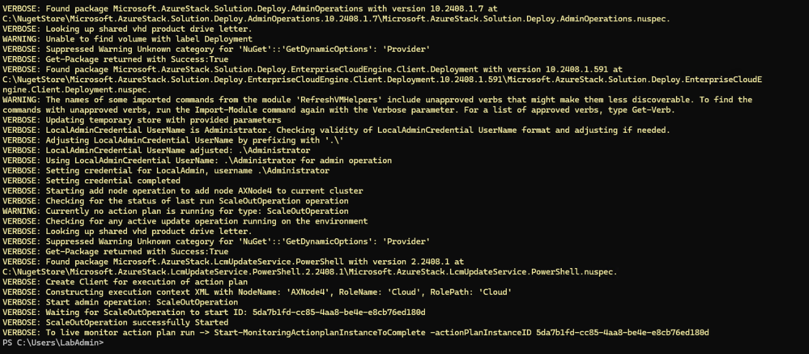

You can notice, that there is ActionPlanInstanceID on the last line.

Since I was updating from one node to 2 nodes, there was no witness configured and adding server failed.

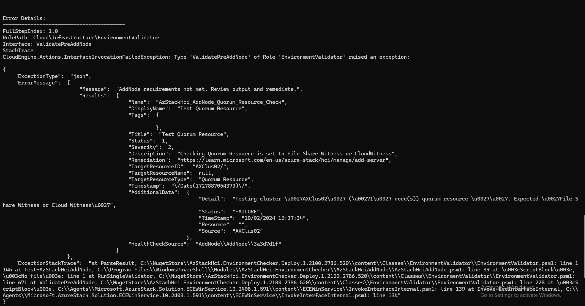

Let's configure witness first

```PowerShell
    $ClusterName="ASClus01"
    $ResourceGroupName="ASClus01-RG"
    $Location="eastus"

    #generate name with random number
    $StorageAccountName="$($ClusterName.ToLower())witness$(Get-Random -Minimum 100000 -Maximum 999999)"

    if (-not ((Get-ClusterQuorum -Cluster $ClusterName).QuorumResource)){
        #let's configure qorum
        #first let's create storage account
            #install AZ Modules
                Install-PackageProvider -Name NuGet -MinimumVersion 2.8.5.201 -Force
                $ModuleNames="Az.Accounts","Az.Resources","Az.Storage"
                foreach ($ModuleName in $ModuleNames){
                    if (-not (Get-Module $ModuleName -ErrorAction Ignore)){
                        Install-Module $ModuleName
                    }
                }
            #login to Azure
            if (-not (Get-AzAccessToken -ErrorAction SilentlyContinue)){
                Connect-AzAccount -UseDeviceAuthentication
            }

            #create resource group first (if not exist)
            if (-not(Get-AzResourceGroup -Name $ResourceGroupName -ErrorAction Ignore)){
                New-AzResourceGroup -Name $ResourceGroupName -Location $Location
            }
            #create Storage Account
            If (-not(Get-AzStorageAccountKey -Name $StorageAccountName -ResourceGroupName $ResourceGroupName -ErrorAction Ignore)){
                New-AzStorageAccount -ResourceGroupName $ResourceGroupName -Name $StorageAccountName -SkuName Standard_LRS -Location $Location -Kind StorageV2 -AccessTier Cool 
            }
            $StorageAccountAccessKey=(Get-AzStorageAccountKey -Name $StorageAccountName -ResourceGroupName $ResourceGroupName | Select-Object -First 1).Value

            #Configure quorum
            Set-ClusterQuorum -Cluster $ClusterName -CloudWitness -AccountName $StorageAccountName -AccessKey $StorageAccountAccessKey -Endpoint "core.windows.net"
    }
```

Since it failed, we need to run the operation again. Now with -Rerun flag

```PowerShell
Invoke-Command -ComputerName $ClusterName -ScriptBlock {
    Add-Server -Rerun
}

```

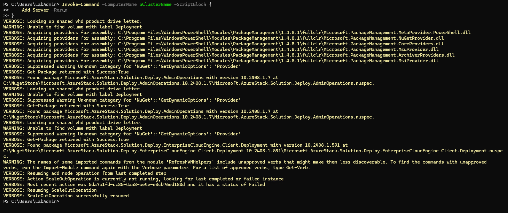

After running Start-MonitoringActionplanInstanceToComplete, I was able to see the progress

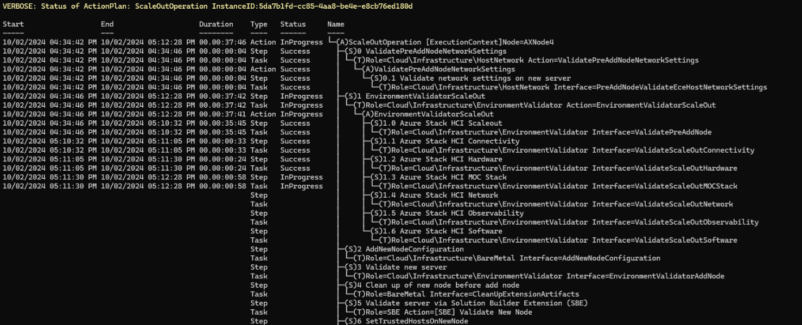

As you can see, since SBE was populated, process is updating node with the provided SBE

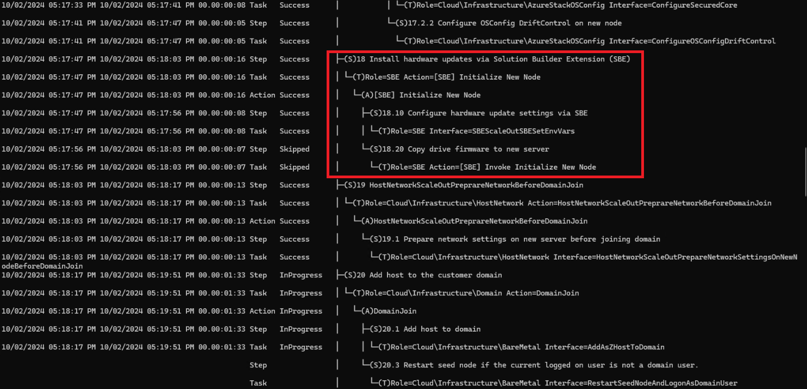

Meanwhile we can check existing volumes (assuming before expanding this was one-node cluster). As you can see, this is two-way mirror (as you see from the capacity)

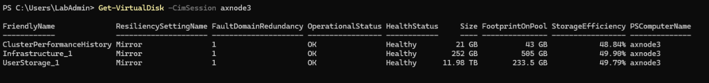

Additionally you can notice, that column isolation is physical disk (as it's one node only). After expanding we should see isolation to be StorageScaleUnit (so the volume will be mirrored across multiple servers)

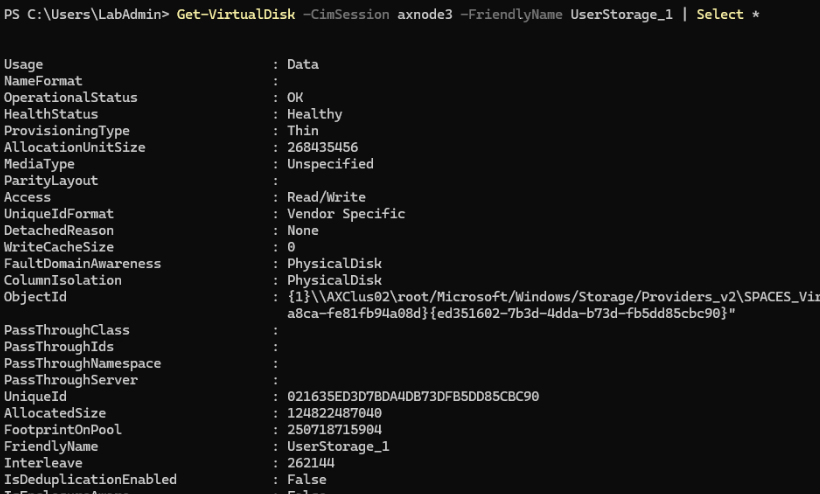

When checking pool, you can see the same - FaultDomainAwarenessDefault set to PhysicalDisk

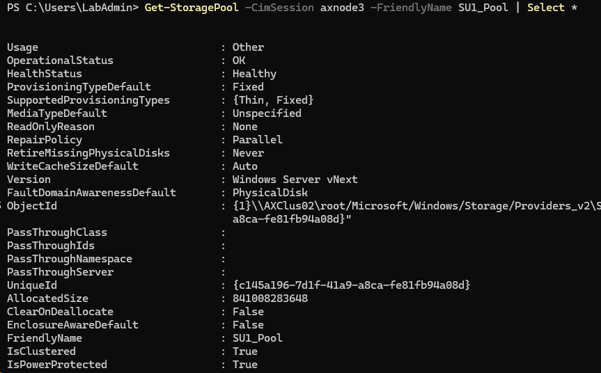

After deployment was complete, both Pool and Volume converted to StorageScaleUnit FaultDomainAwareness

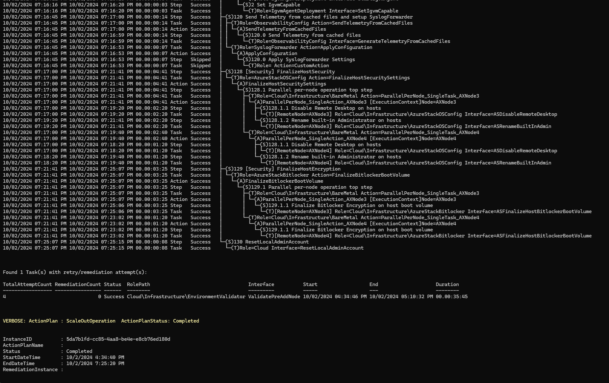


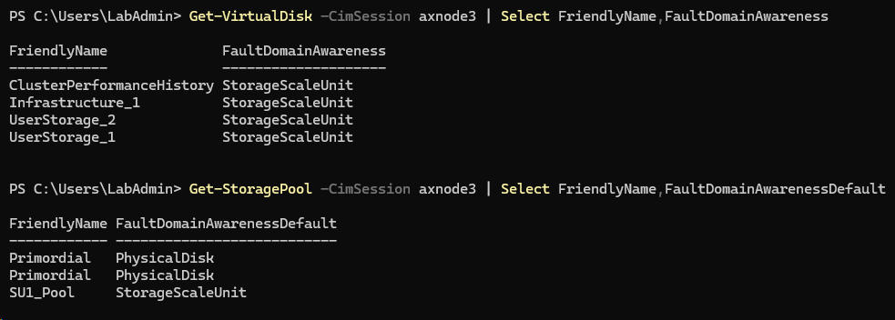


## Synchronize changes with Azure

Since it can take several hours for the new server to appear in Azure Portal, let's force the synchronization.

```PowerShell
Invoke-Command -ComputerName $ClusterName -ScriptBlock {
    Sync-AzureStackHCI
}

```
before

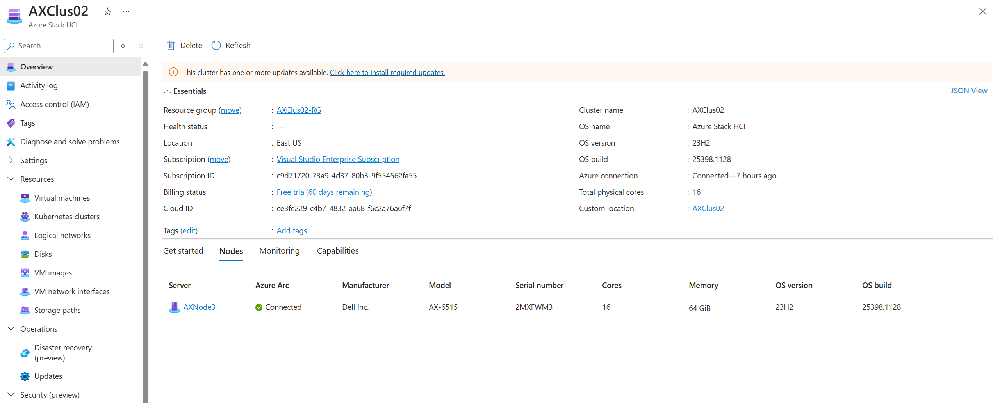

after

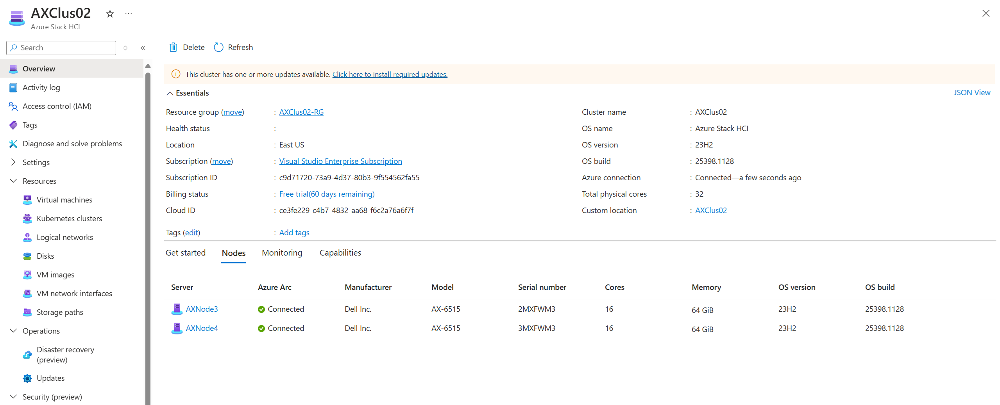