# Bitlocker Deep Dive
<!-- TOC -->

- [Bitlocker Deep Dive](#bitlocker-deep-dive)
    - [About the lab](#about-the-lab)
    - [Running "traditional" Bitlocker commands](#running-traditional-bitlocker-commands)
    - [Exploring Azure Stack Bitlocker Commands](#exploring-azure-stack-bitlocker-commands)
    - [Finding Bitlocker Recovery key in Active Directory](#finding-bitlocker-recovery-key-in-active-directory)
    - [Backing up Recovery key to other AD objects](#backing-up-recovery-key-to-other-ad-objects)
    - [Encrypting Volume](#encrypting-volume)

<!-- /TOC -->

## About the lab

In this lab you will learn about Bitlocker, how it evolved and how is controlled in Azure Stack HCI. You will also learn how to encrypt volume and how to back up recovery key to other cluster nodes AD objects.

[Official documentation](https://learn.microsoft.com/en-us/azure-stack/hci/manage/manage-bitlocker)

## Running "traditional" Bitlocker commands

All "traditional" PowerShell commands are under Bitlocker PowerShell module

```PowerShell
$ClusterName="AXClus02"

Invoke-Command -ComputerName $ClusterName -ScriptBlock {Get-Command -Module Bitlocker}

```
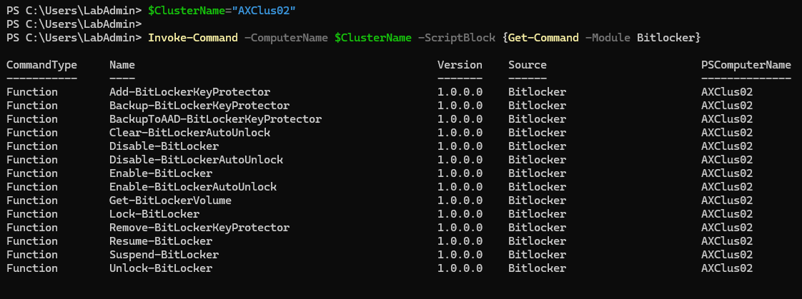

Listing a bitlocker volume will show you some information, but not really useful as mountpoints are listed using GUID

```PowerShell
Invoke-Command -ComputerName $ClusterName -ScriptBlock {Get-BitlockerVolume}

```

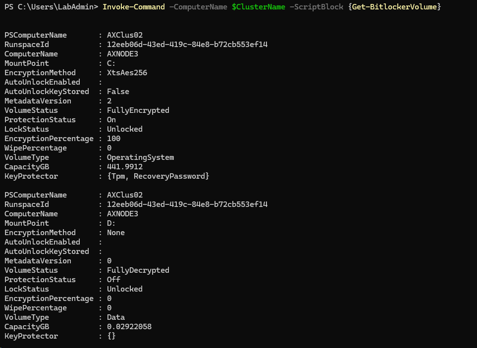

To come up with some useful information with traditional commands you have to populate your own variable with various information

```PowerShell
#Install failover cluster powershell
Install-WindowsFeature -Name RSAT-Clustering-PowerShell

$Output=@()
$CSVs=Get-ClusterSharedVolume -Cluster $clustername
foreach ($CSV in $CSVs){
    $owner=$csv.ownernode.name
    $CsvPath = ($CSV).SharedVolumeInfo.FriendlyVolumeName
    $Status=Invoke-Command -ComputerName $owner -ScriptBlock {Get-BitLockerVolume -MountPoint $using:CSVPath}
    $KeyProtectorID=Invoke-Command -ComputerName $owner -ScriptBlock {((Get-BitLockerVolume -MountPoint $using:CSVPath).KeyProtector | Where-Object KeyProtectorType -eq RecoveryPassword).KeyProtectorId}
    $Output += [PSCustomObject]@{
        "CSVPath"              = $CSVPath
        "VolumeStatus"         = $Status.VolumeStatus
        "KeyProtectorID"         = $KeyProtectorID
        "EncryptionPercentage" = $Status.EncryptionPercentage
        "EncryptionMethod"     = $Status.EncryptionMethod
        "MountPoint"           = $Status.MountPoint
        "ProtectionStatus"     = $Status.ProtectionStatus
    }
}
$Output

```

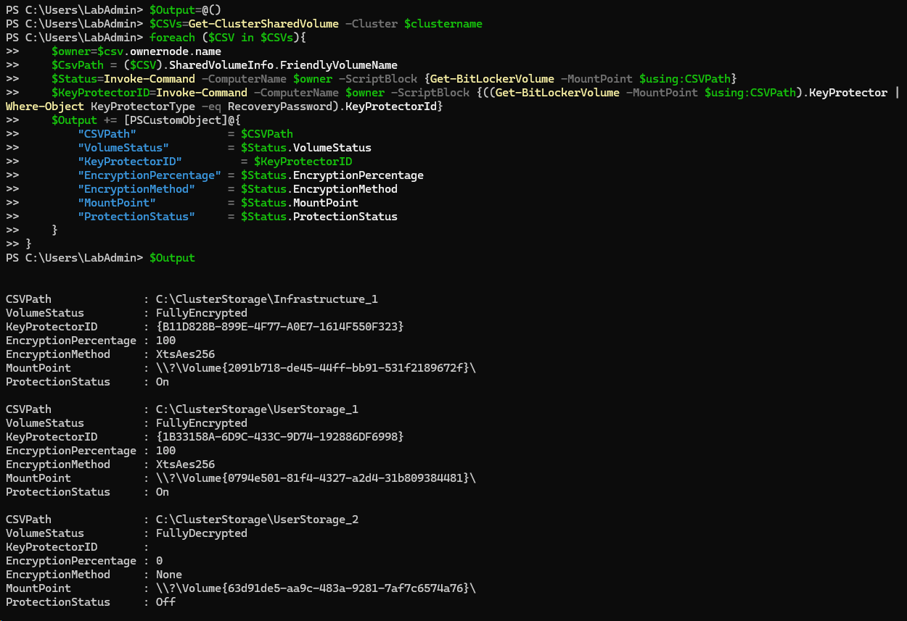

Encrypting volume is another level of complexity. I documented it a while ago in this [MSLab Scenario](https://github.com/microsoft/MSLab/tree/master/Scenarios/BitLocker%20on%20S2D%20cluster). You can avoid it as Azure Stack HCI has it's own set of commands.

## Exploring Azure Stack Bitlocker Commands

Azure Stack introduces it's own Bitlocker commands, that should make your life bit easier

```PowerShell
$ClusterName="AXClus02"

Invoke-Command -ComputerName $ClusterName -ScriptBlock {
    Get-Command -module AzureStackBitlockerAgent
}

```

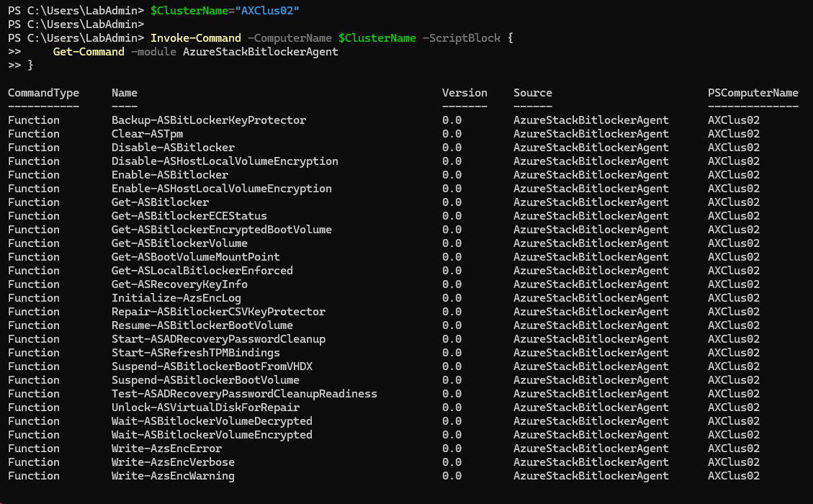


To list volumes you can use following command. VolumeType can be either BootVolume or ClusterSharedVolume
Note: you need to run command against all nodes as it pulls only volumes owned on that particular node

```PowerShell
#Install failover cluster powershell
Install-WindowsFeature -Name RSAT-Clustering-PowerShell

#Grab cluster nodes
$ClusterNodes=(Get-ClusterNode -Cluster $ClusterName).Name

Invoke-Command -ComputerName $ClusterNodes -ScriptBlock {
    Get-ASBitlocker -VolumeType ClusterSharedVolume
}

```

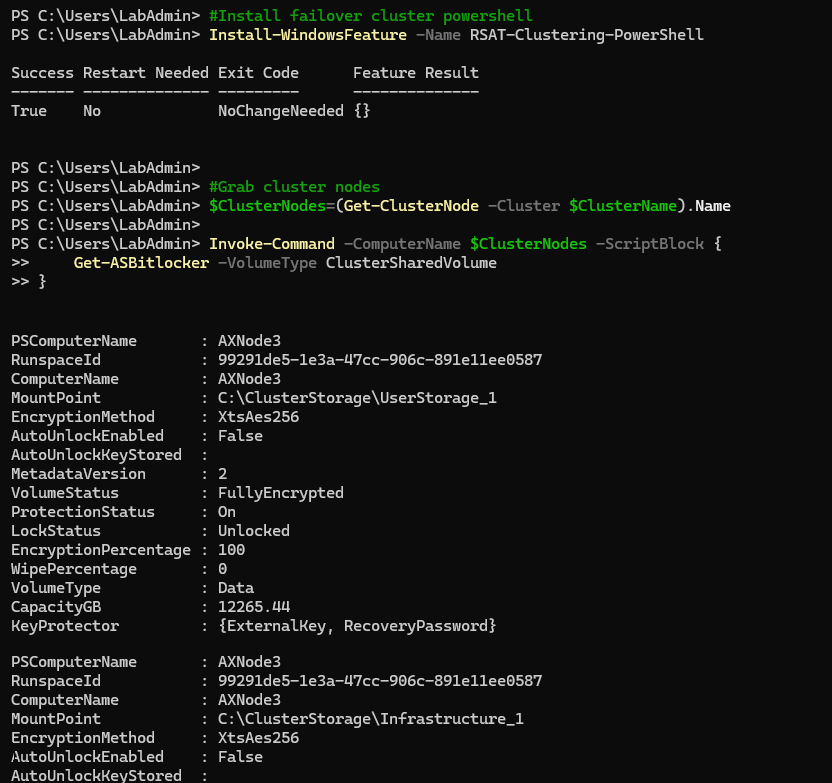

You can also list by it's mountpoint

```PowerShell
Invoke-Command -ComputerName $ClusterName -ScriptBlock {
    $MountPoints=(Get-ClusterSharedVolume).SharedVolumeInfo.FriendlyVolumeName
    foreach ($MountPoint in $MountPoints){
        Get-ASBitlockerVolume -MountPoint $MountPoint
    }
}

```

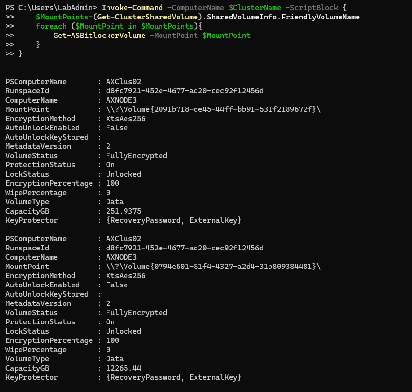

The most tricky part is to grab Recovery Password without logging into the node itsef. For that we'll need to pass credentials into the node using CredSSP. CredSSP slightly changed in Windows Server 2025, therefore we'll use registry to allow delegate credentials into the remote machine

```PowerShell
    $ClusterName="AXClus02"

    $CredSSPUserName="Corp\LabAdmin"
    $CredSSPPassword="LS1setup!"

    #Create Credentials
        $SecureStringPassword = ConvertTo-SecureString $CredSSPPassword -AsPlainText -Force
        $Credentials = New-Object System.Management.Automation.PSCredential ($CredSSPUserName, $SecureStringPassword)

    #or just 
    #Credentials=Get-Credential

    #Configure CredSSP First
        #since just Enable-WSMANCredSSP no longer works in WS2025, let's configure it via registry
            $CredSSPServers=$ClusterName

            $key = 'hklm:\SOFTWARE\Policies\Microsoft\Windows\CredentialsDelegation'
            if (!(Test-Path $key)) {
                New-Item $key
            }
        
            #New-ItemProperty -Path $key -Name AllowFreshCredentialsWhenNTLMOnly -Value 1 -PropertyType Dword -Force
            #New-ItemProperty -Path $key -Name AllowFreshCredentials -Value 1 -PropertyType Dword -Force
        
            $keys = 'hklm:\SOFTWARE\Policies\Microsoft\Windows\CredentialsDelegation\AllowFreshCredentialsWhenNTLMOnly','hklm:\SOFTWARE\Policies\Microsoft\Windows\CredentialsDelegation\AllowFreshCredentials'
            foreach ($Key in $keys){
                if (!(Test-Path $key)) {
                    New-Item $key
                }
        
                $i=1
                foreach ($Server in $CredSSPServers){
                    New-ItemProperty -Path $key -Name $i -Value "WSMAN/$Server" -PropertyType String -Force
                    $i++
                }
            }

        #Enable CredSSP Server on remote machine
        Invoke-Command -ComputerName $CredSSPServers -ScriptBlock { Enable-WSManCredSSP Server -Force }

    #Send command to remote server
    Invoke-Command -ComputerName $ClusterName -Credential $Credentials -Authentication Credssp -ScriptBlock {
        Get-ASRecoveryKeyInfo
    }

    #Disable CredSSP
        #Disable-WSManCredSSP -Role Client
        Remove-Item -Path 'hklm:\SOFTWARE\Policies\Microsoft\Windows\CredentialsDelegation' -Recurse
        Invoke-Command -ComputerName $CredSSPServers -ScriptBlock {Disable-WSManCredSSP Server}

```

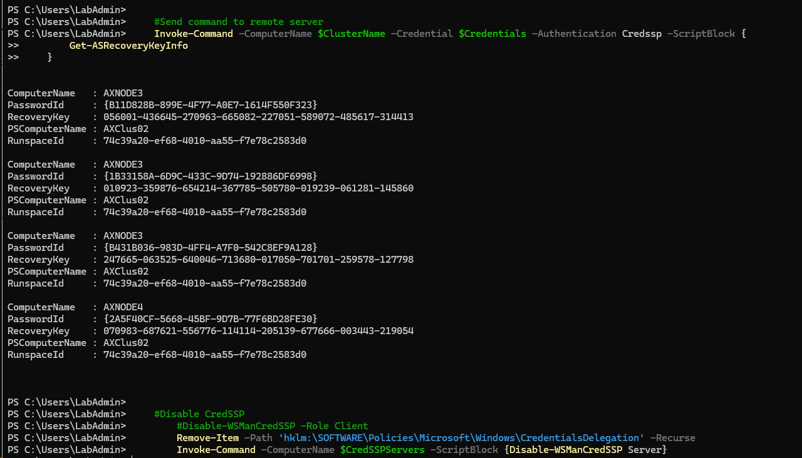

What happened is, that the information was pulled from Active Directory. That's why CredSSP was needed as these credentials were used to communicate with DC.

## Finding Bitlocker Recovery key in Active Directory

You can also view these keys in AD itself (once you install management tools)

```PowerShell
Install-WindowsFeature -Name RSAT-Feature-Tools-BitLocker-BdeAducExt

```

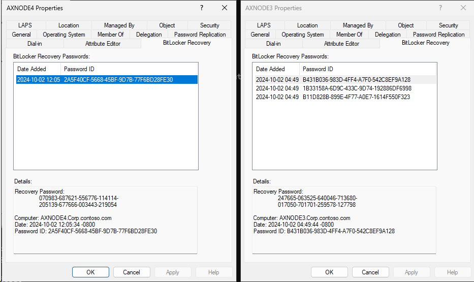

So the easiest way to grab the recovery info is to pull it directly from Active Directory

```PowerShell
Install-WindowsFeature -Name RSAT-AD-PowerShell

Get-ADObject -Filter 'objectClass -eq "msFVE-RecoveryInformation"' -Properties whencreated,msFVE-RecoveryPassword | Select-Object WhenCreated,DistinguishedName,msFVE-RecoveryPassword | Out-GridView
 
```


## Backing up Recovery key to other AD objects

As you might noticed, the bitlocker recovery key is present only in one AD computer object. It's because it's backed up to Computer AD object that was owning the volume when the volume was encrypted. It might be bit dangerous to deprovision one node as you might loose recovery keys. Let's redistribute keys to other nodes with this simple script

```PowerShell
$ClusterName="AXClus02"

#Install failover cluster powershell
Install-WindowsFeature -Name RSAT-Clustering-PowerShell

#Grab CSVs
$CSVs=Get-ClusterSharedVolume -Cluster $clustername

#Grab cluster nodes
$ClusterNodes=(Get-ClusterNode -Cluster $ClusterName).Name

Foreach ($CSV in $CSVs){
    $owner=$csv.ownernode.name
    $CsvPath = ($CSV).SharedVolumeInfo.FriendlyVolumeName
    Write-Output "Backing up Recovery key to another Nodes AD Objects"
    foreach ($ClusterNode in $ClusterNodes){
        if ($Clusternode -ne $owner){
            Write-Output "Moving ownership to $ClusterNode and initializing backup"
            $CSV | Move-ClusterSharedVolume -Node $ClusterNode
            Invoke-Command -ComputerName $ClusterNode -ScriptBlock {
                $KeyProtectorId=((Get-BitLockerVolume $using:CsvPath).KeyProtector | Where-Object KeyProtectorType -Eq "RecoveryPassword").KeyProtectorId
                if ($KeyProtectorId){
                    Backup-BitLockerKeyProtector -MountPoint $using:CsvPath -KeyProtectorId $KeyProtectorId
                }
            } 
        }
    }
}
```

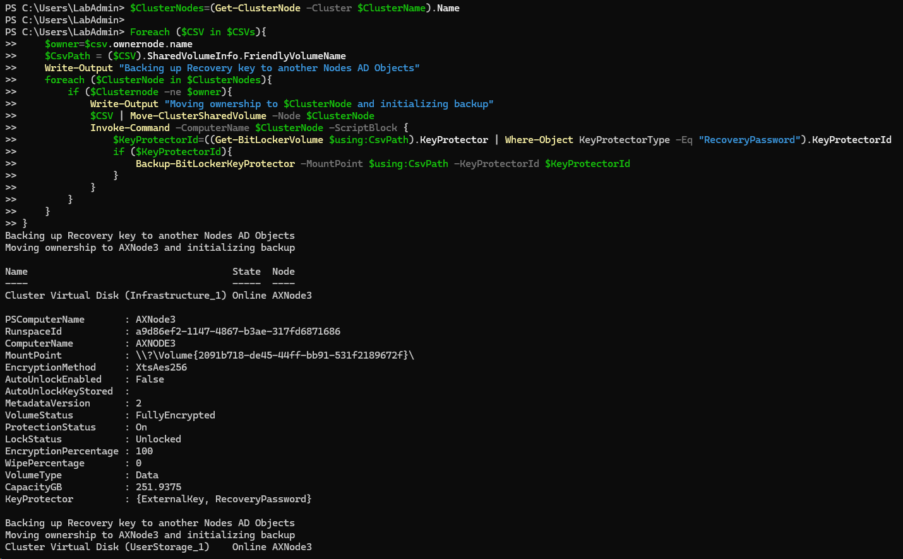

As you can see, recovery information is now distributed across all AD computer objects now

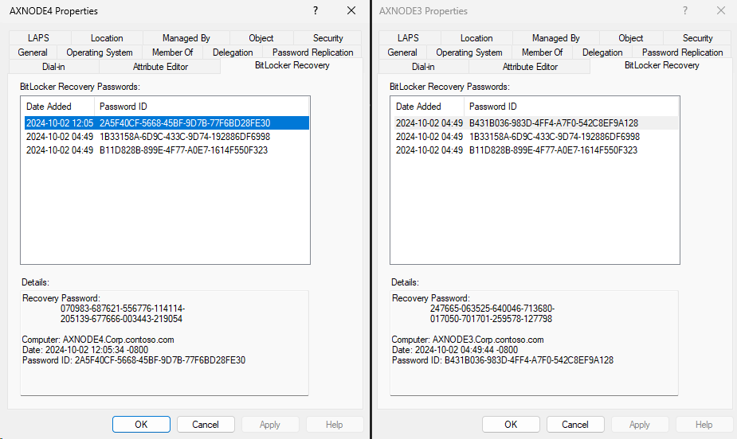

## Encrypting Volume

For some reason one of the volumes was not encrypted. Let's fix it

```PowerShell
$ClusterName="AXClus02"

#Install failover cluster powershell
Install-WindowsFeature -Name RSAT-Clustering-PowerShell

#grab cluster nodes
$ClusterNodes=(Get-ClusterNode -Cluster $ClusterName).Name

#select volume you want to encrypt
$CSV=Invoke-Command -ComputerName $ClusterNodes -ScriptBlock {Get-ASBitlocker -VolumeType ClusterSharedVolume} | Out-GridView -OutputMode Single -Title "Please Select CSV"

#check what VMs are running on that volume
$VHDs=Get-VMHardDiskDrive -CimSession $ClusterNodes -VMName * | Where-Object Path -Like "$($CSV.MountPoint)*"

#in case there are some VMs running, make sure these VMs are down!
$VMNames=$VHDs.VMName | Select-Object -Unique
if ($VMNames){
    $RunningVMs=Get-VM -CimSession $ClusterNodes -Name $VMNames | Where-Object State -eq Running 
    $RunningVMs
}

#if there are some running VMs, you should suspend it
if ($RunningVMs){
    $RunningVMs | Stop-VM -Save
}

#encrypt the volume
Invoke-Command -ComputerName $CSV.PSComputerName -ScriptBlock {
    Enable-ASBitlocker -VolumeType ClusterSharedVolume -MountPoint $using:CSV.MountPoint
}

#Start VMs again
if ($RunningVMs){
    $RunningVMs | Start-VM
}

#and backup keys to other objects
    $CSV=Get-ClusterSharedVolume -Cluster $ClusterName | Where-Object {$_.SharedVolumeInfo.FriendlyVolumeName -eq $CSV.MountPoint}
    $owner=$csv.ownernode.name
    $CsvPath = ($CSV).SharedVolumeInfo.FriendlyVolumeName
    Write-Output "Backing up Recovery key to another Nodes AD Objects"
    foreach ($ClusterNode in $ClusterNodes){
        if ($Clusternode -ne $owner){
            Write-Output "Moving ownership to $ClusterNode and initializing backup"
            $CSV | Move-ClusterSharedVolume -Node $ClusterNode
            Invoke-Command -ComputerName $ClusterNode -ScriptBlock {
                $KeyProtectorId=((Get-BitLockerVolume $using:CsvPath).KeyProtector | Where-Object KeyProtectorType -Eq "RecoveryPassword").KeyProtectorId
                if ($KeyProtectorId){
                    Backup-BitLockerKeyProtector -MountPoint $using:CsvPath -KeyProtectorId $KeyProtectorId
                }
            } 
        }
    }

```

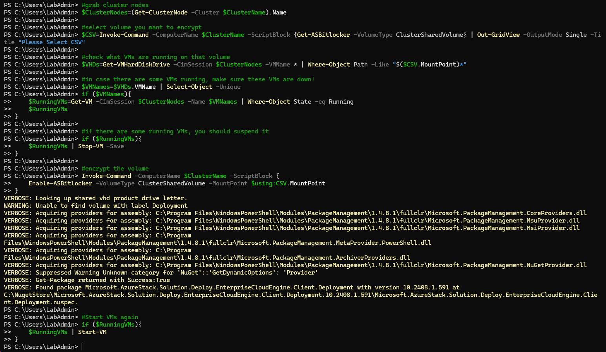

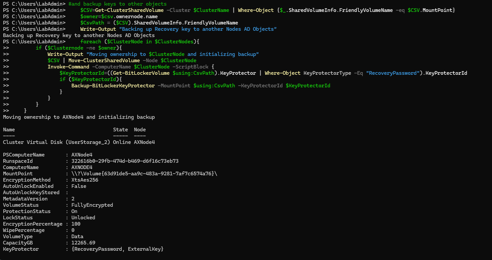