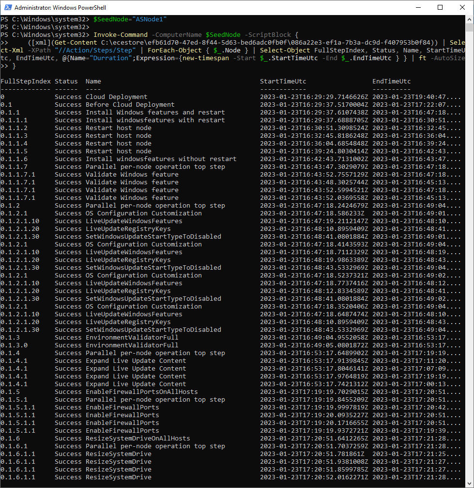

# Deploy Azure Stack HCI Cluster using Deployment Tool (Preview)

<!-- TOC -->

- [Deploy Azure Stack HCI Cluster using Deployment Tool Preview](#deploy-azure-stack-hci-cluster-using-deployment-tool-preview)
    - [About the lab](#about-the-lab)
    - [Prerequisites](#prerequisites)
    - [LabConfig](#labconfig)
    - [Task01 - Prepare Active Directory](#task01---prepare-active-directory)
    - [Task02 - Prepare Azure Prerequisites](#task02---prepare-azure-prerequisites)
    - [Task03 - Bootstrap Seed Node](#task03---bootstrap-seed-node)
    - [Task04 - Explore deployment options](#task04---explore-deployment-options)
    - [Task05 - Deploy Azure Stack HCI cluster from Seed Node](#task05---deploy-azure-stack-hci-cluster-from-seed-node)
    - [Task06 - Monitor and validate deployment](#task06---monitor-and-validate-deployment)
    - [Task07 - Explore what was configured](#task07---explore-what-was-configured)

<!-- /TOC -->

## About the lab

In this lab you will deploy 4 node Azure Stack HCI cluster using [new tool](https://learn.microsoft.com/en-us/azure-stack/hci/manage/whats-new-2306-preview) available now in Preview.

The lab is based on [AzSHCI and Deployment tool](https://github.com/microsoft/MSLab/tree/master/Scenarios/AzSHCI%20and%20Deployment%20tool) MSLab scenario.

## Prerequisites

* Hydrated MSLab with LabConfig from [01-HydrateMSLab](../../admin-guides/01-HydrateMSLab/readme.md)

* Understand [how MSLab works](../../admin-guides/02-WorkingWithMSLab/readme.md)

* Make sure you hydrate Azure Stack HCI 22H2 VHD using CreateParentDisk.ps1 located in ParentDisks folder (note that it 22H2 is detected as 21H2, so you need to edit the name)

* Make sure 22H2 VHD is 127GB (CreateParentDisk was recently updated to create 127GB disks instead of 60GB)

## LabConfig

Below LabConfig will deploy 4 nodes for Azure Stack HCI 22H2 that are not domain joined. 

There is also commented line that will deploy nodes with more memory and with nested virtualization enabled.

You can notice, that there are VLANs 711-719. Even these VLANs are configured in deploy config, NetATC will use VLAN 8 as it's hardcoded in the tool for virtual environments. You can later manually edit NetATC intent to use default 711 and 712.

```PowerShell
$LabConfig=@{AllowedVLANs="1-10,711-719" ; DomainAdminName='LabAdmin'; AdminPassword='LS1setup!' ; DCEdition='4'; Internet=$true; TelemetryLevel='Full' ; TelemetryNickname='' ; AdditionalNetworksConfig=@(); VMs=@()}

#Azure Stack HCI 22H2
#labconfig will not domain join VMs, will add "Tools disk" and will also execute powershell command to make this tools disk online.
1..4 | ForEach-Object {$LABConfig.VMs += @{ VMName = "ASNode$_" ; Configuration = 'S2D' ; ParentVHD = 'AzSHCI22H2_G2.vhdx' ; HDDNumber = 4 ; HDDSize= 2TB ; MemoryStartupBytes= 1GB; VMProcessorCount=4 ; vTPM=$true ; Unattend="NoDjoin" }}
#labconfig for nested virtualization
#1..4 | ForEach-Object {$LABConfig.VMs += @{ VMName = "ASNode$_" ; Configuration = 'S2D' ; ParentVHD = 'AzSHCI22H2_G2.vhdx' ; HDDNumber = 4 ; HDDSize= 2TB ; MemoryStartupBytes= 6GB; VMProcessorCount=4 ; vTPM=$true ; Unattend="NoDjoin" ; NestedVirt=$true }}

#Windows Admin Center in GW mode
$LabConfig.VMs += @{ VMName = 'WACGW' ; ParentVHD = 'Win2022Core_G2.vhdx'; MGMTNICs=1}

#Management machine
$LabConfig.VMs += @{ VMName = 'Management' ; ParentVHD = 'Win2022_G2.vhdx'; MGMTNICs=1 ; AddToolsVHD=$True }
 
```

Deployment result


## Task01 - Prepare Active Directory

In this task you will create objects in Active Directory - groups and group managed service accounts. For Group Managed Service accounts you need KDS root key., so let's jump in.

This task will be performed in elevated powershell window in Management machine


**Step 1** Login into Management machine and run following code in elevated PowerShell window to Provide variables and install required PowerShell modules

> as you can see, since there will be organization unit created and in current iteration is one OU per cluster, prefix and OU name will match cluster name

> you can also notice, that there is an account for deployment being created. It will be used once 

```PowerShell
$AsHCIOUName="OU=ASClus01,DC=Corp,DC=contoso,DC=com"
$Servers="ASNode1","ASNode2","ASNode3","ASNode4"
$DomainFQDN=$env:USERDNSDOMAIN
$ClusterName="ASClus01"
$Prefix="ASClus01"
$UserName="ASClus01-DeployUser"
$Password="LS1setup!"
$SecuredPassword = ConvertTo-SecureString $password -AsPlainText -Force
$Credentials= New-Object System.Management.Automation.PSCredential ($UserName,$SecuredPassword)


#install posh module for prestaging Active Directory
Install-PackageProvider -Name NuGet -Force
Install-Module AsHciADArtifactsPreCreationTool -Repository PSGallery -Force
 
```

**Step 2** Add KDS root key (if there is not any)

```PowerShell
    #add KDS Root Key
    if (-not (Get-KdsRootKey)){
        Add-KdsRootKey -EffectiveTime ((Get-Date).addhours(-10))
    }
 
```

**Step 3** (Optional) Check KD root key with GUI tool

```PowerShell
    Install-WindowsFeature -Name "RSAT-ADDS"
    & dssite.msc
 
```


**Step 4** Populate objects into Active Directory

```PowerShell
    #make sure active directory module and GPMC is installed
    Install-WindowsFeature -Name RSAT-AD-PowerShell,GPMC

    #populate objects
    New-HciAdObjectsPreCreation -Deploy -AzureStackLCMUserCredential  $Credentials -AsHciOUName $AsHCIOUName -AsHciPhysicalNodeList $Servers -DomainFQDN $DomainFQDN -AsHciClusterName $ClusterName -AsHciDeploymentPrefix $Prefix
 
```


**Step 5** Install additional features to be able explore cluster and settings once it's created

```PowerShell
    #install management features to explore cluster,settings...
    Install-WindowsFeature -Name "RSAT-ADDS","RSAT-Clustering"
 
```

## Task02 - Prepare Azure Prerequisites

> You can continue running this script on management machine, or you can run it on ASNode1 (seed node). If running on Management machine, you will need to copy variables that will be created.

**Step 1** Populate Variables

> There are two kinds of authentication when you will be deploying cluster from seed node. Using Service Principal or with MFA. Service principal is very useful if someone else in the organization wants to delegate exact rights to someone who will be deploying cluster. The admin will create service principal and will just share AppID and Secret.

> Storage account name (all chars has to be lowercase) has to be unique in Azure. Therefore random number is added

```PowerShell
    $StorageAccountName="asclus01$(Get-Random -Minimum 100000 -Maximum 999999)"
    $ServicePrincipal=$True #or false if you want to use MFA (and skip SP creation)
    $ServicePrincipalName="Azure-Stack-Registration"
    $ResourceGroupName="ASClus01-RG"
    $Location="EastUS"
 
```

**Step 2** Log in into azure and select subscription

> You will be requested to enter code into the browser. I find this the most secure way to log in - as you can log in in another machine - your machine you trust.

```PowerShell
    #login to azure
        #download Azure module
        if (!(Get-InstalledModule -Name az.accounts -ErrorAction Ignore)){
            Install-Module -Name Az.Accounts -Force
        }
        if (-not (Get-AzContext)){
            Connect-AzAccount -UseDeviceAuthentication
        }

    #select subscription if more available
        $subscriptions=Get-AzSubscription
        #list subscriptions
        $subscriptions
        if (($subscriptions).count -gt 1){
            $SubscriptionID=Read-Host "Please give me subscription ID"
        }else{
            $SubscriptionID=$subscriptions.id
        }
 
```


**Step 3** Make sure required resource providers are registered

> I'm not sure if this is final list. Please PR if you will find something missing.

```PowerShell
    #make sure resource providers are registered
        if (!(Get-InstalledModule -Name "az.resources" -ErrorAction Ignore)){
            Install-Module -Name "az.resources" -Force
        }
        $Providers="Microsoft.ResourceConnector","Microsoft.Authorization","Microsoft.AzureStackHCI","Microsoft.HybridCompute","Microsoft.GuestConfiguration"
        foreach ($Provider in $Providers){
            Register-AzResourceProvider -ProviderNamespace $Provider
            #wait for provider to finish registration
            do {
                $Status=Get-AzResourceProvider -ProviderNamespace $Provider
                Write-Output "Registration Status - $Provider : $(($status.RegistrationState -match 'Registered').Count)/$($Status.Count)"
                Start-Sleep 1
            } while (($status.RegistrationState -match "Registered").Count -ne ($Status.Count))
        }
 
```

**Step 4** Create Storage Account

> Storage account will be used as cloud witness. You can see that script is using location you selected and it's using Standard, Local Redundant Storage on cool tier (as there is almost no IO)

```PowerShell
    #Create Storage Account
    if (!(Get-InstalledModule -Name "az.storage"-ErrorAction Ignore)){
            Install-Module -Name "az.storage" -Force
        }

    #create resource group first
    if (-not(Get-AzResourceGroup -Name $ResourceGroupName -ErrorAction Ignore)){
        New-AzResourceGroup -Name $ResourceGroupName -Location $location
    }
    #create Storage Account
    If (-not(Get-AzStorageAccountKey -Name $StorageAccountName -ResourceGroupName $ResourceGroupName -ErrorAction Ignore)){
        New-AzStorageAccount -ResourceGroupName $ResourceGroupName -Name $StorageAccountName -SkuName Standard_LRS -Location $location -Kind StorageV2 -AccessTier Cool 
    }
    $StorageAccountAccessKey=(Get-AzStorageAccountKey -Name $StorageAccountName -ResourceGroupName $ResourceGroupName | Select-Object -First 1).Value
 
```

**Step 5** If MFA is not used, Create Service Principal

> In following code you can see all permissions that are required to successfully create cluster. The list is not final. It's just what I was able to "glue" together just to make it work.

```PowerShell
    #create service principal if requested
    if ($ServicePrincipal){
        #Create Azure Stack HCI registration role https://learn.microsoft.com/en-us/azure-stack/hci/deploy/register-with-azure#assign-permissions-from-azure-portal
        #https://learn.microsoft.com/en-us/azure/role-based-access-control/built-in-roles#azure-connected-machine-onboarding
        if (-not (Get-AzRoleDefinition -Name "Azure Stack HCI registration role - Custom" -ErrorAction Ignore)){
            $Content=@"
{
    "Name": "Azure Stack HCI registration role - Custom",
    "Id": null,
    "IsCustom": true,
    "Description": "Custom Azure role to allow subscription-level access to register Azure Stack HCI",
    "Actions": [
        "Microsoft.Resources/subscriptions/resourceGroups/read",
        "Microsoft.Resources/subscriptions/resourceGroups/write",
        "Microsoft.Resources/subscriptions/resourceGroups/delete", 
        "Microsoft.AzureStackHCI/register/action",
        "Microsoft.AzureStackHCI/Unregister/Action",
        "Microsoft.AzureStackHCI/clusters/*",
        "Microsoft.Authorization/roleAssignments/write",
        "Microsoft.Authorization/roleAssignments/read",
        "Microsoft.HybridCompute/register/action",
        "Microsoft.GuestConfiguration/register/action",
        "Microsoft.HybridConnectivity/register/action",
        "Microsoft.HybridCompute/machines/extensions/write",
        "Microsoft.HybridCompute/machines/extensions/read",
        "Microsoft.HybridCompute/machines/read",
        "Microsoft.HybridCompute/machines/write",
        "Microsoft.HybridCompute/privateLinkScopes/read",
        "Microsoft.GuestConfiguration/guestConfigurationAssignments/read",
        "Microsoft.ResourceConnector/register/action",
        "Microsoft.Kubernetes/register/action",
        "Microsoft.KubernetesConfiguration/register/action",
        "Microsoft.ExtendedLocation/register/action",
        "Microsoft.HybridContainerService/register/action",
        "Microsoft.ResourceConnector/appliances/write"
    ],
    "NotActions": [
    ],
    "AssignableScopes": [
        "/subscriptions/$SubscriptionID"
    ]
    }
"@
            $Content | Out-File "$env:USERPROFILE\Downloads\customHCIRole.json"
            New-AzRoleDefinition -InputFile "$env:USERPROFILE\Downloads\customHCIRole.json"
        }

        #Create AzADServicePrincipal for Azure Stack HCI registration (if it does not exist)
            $SP=Get-AZADServicePrincipal -DisplayName $ServicePrincipalName
            if (-not $SP){
                $SP=New-AzADServicePrincipal -DisplayName $ServicePrincipalName -Role "Azure Stack HCI registration role - Custom"
                #remove default cred
                Remove-AzADAppCredential -ApplicationId $SP.AppId
            }

        #Create new SPN password
            $credential = New-Object -TypeName "Microsoft.Azure.PowerShell.Cmdlets.Resources.MSGraph.Models.ApiV10.MicrosoftGraphPasswordCredential" -Property @{
                "KeyID"         = (new-guid).Guid ;
                "EndDateTime" = [DateTime]::UtcNow.AddYears(1)
            }
            $Creds=New-AzADAppCredential -PasswordCredentials $credential -ApplicationID $SP.AppID
            $SPNSecret=$Creds.SecretText
            $SPAppID=$SP.AppID
    }
 
```

> you can see new Service Principal in "App Registrations" in Azure Portal


> custom role that was created is visible in Access control (IAM) 


**Step 6** Disconnect and show all variables

> If running on ASNode1, if not disconnected, MFA authentication would fail. If Running on Management, code will output code you can copy and run on ASNode1 to populate variables

```PowerShell
    Disconnect-AzAccount
    #output variables
    Write-Host -ForegroundColor Cyan @"
        #Variables to copy
        `$SubscriptionID=`"$SubscriptionID`"
        `$SPAppID=`"$SPAppID`"
        `$SPNSecret=`"$SPNSecret`"
        `$ResourceGroupName=`"$ResourceGroupName`"
        `$StorageAccountName=`"$StorageAccountName`"
        `$StorageAccountAccessKey=`"$StorageAccountAccessKey`"
        `$Location=`"$Location`"
"@ 
 
```


## Task03 - Bootstrap Seed Node

Cluster deployment will be done from "Seed Node" - one cluster node that has access to other nodes

**Step 1** Log in into ASNode1

> Simply use credentials Administrator/LS1setup!

> Once logged in, press 15 to exit to command line (PowerShell)


**Step 2** Populate Variables

> Don't forget to copy variables if you did not run previous task from Seed node (in this case ASNode1)

```PowerShell
    #variables
        #create deployment credentials
        $UserName="ASClus01-DeployUser"
        $Password="LS1setup!"
        $SecuredPassword = ConvertTo-SecureString $password -AsPlainText -Force
        $AzureStackLCMUserCredential = New-Object System.Management.Automation.PSCredential ($UserName,$SecuredPassword)
        $UserName="Administrator"
        $Password="LS1setup!"
        $SecuredPassword = ConvertTo-SecureString $password -AsPlainText -Force
        $LocalAdminCred = New-Object System.Management.Automation.PSCredential ($UserName,$SecuredPassword)

        #the one you have to populate if you did not run above region from Seed node
        <#
        $SubscriptionID=""
        $SPAppID="" #not needed if you use MFA
        $SPNSecret="" #not needed if you use MFA
        $ResourceGroupName=""
        $StorageAccountName=""
        $StorageAccountAccessKey=""
        $Location=""
        #>

        #download folder
        $downloadfolder="c:\temp"

        $Servers="ASNode1","ASNode2","ASNode3","ASNode4"
 
```

**Step 3** Download all required files and bootstrap

> Bootstrap will create "special" instance of Windows Admin Center where you can create config or provide config to deploy Azure Stack HCI.

> keep powershell window open for next steps

```PowerShell
    #Download files
        #create folder
        if (-not (Test-Path $downloadfolder)){New-Item -Path $downloadfolder -ItemType Directory}
        $files=@()
        $Files+=@{Uri="https://go.microsoft.com/fwlink/?linkid=2210545" ; FileName="BootstrapCloudDeploymentTool.ps1" ; Description="Bootstrap PowerShell"}
        $Files+=@{Uri="https://go.microsoft.com/fwlink/?linkid=2210546" ; FileName="CloudDeployment_10.2306.0.47.zip" ; Description="Cloud Deployment Package"}
        $Files+=@{Uri="https://go.microsoft.com/fwlink/?linkid=2210608" ; FileName="Verify-CloudDeployment.zip_Hash.ps1" ; Description="Verify Cloud Deployment PowerShell"}

        foreach ($file in $files){
            if (-not (Test-Path "$downloadfolder\$($file.filename)")){
                Start-BitsTransfer -Source $file.uri -Destination "$downloadfolder\$($file.filename)" -DisplayName "Downloading: $($file.filename)"
            }
        }

    #Start bootstrap (script is looking for file "CloudDeployment_*.zip"
    & $downloadfolder\BootstrapCloudDeploymentTool.ps1
 
```


## Task04 - Explore deployment options

**Step 1** Log in into Management machine and Open Edge. In Edge open https://asnode1

> When prompted for credentials, use following: user: .\administrator pass: LS1setup!


> you can see, that you can create a config file, or you can use an existing. For sake of simplicity, let's use PowerShell


## Task05 - Deploy Azure Stack HCI cluster from Seed Node

> all steps will be performed from Seed node - **ASNode1**

> make sure same powershell window is used as in task 03

**Step 1** Create authentication token

> MFA (if $SPAppID is empty) will ask you to authenticate using code

```PowerShell
    #create authentication token (Service Principal or MFA)
    if ($SPAppID){
        $SPNsecStringPassword = ConvertTo-SecureString $SPNSecret -AsPlainText -Force
        $SPNCred=New-Object System.Management.Automation.PSCredential ($SPAppID, $SPNsecStringPassword)
    }else{
        Set-AuthenticationToken -RegistrationCloudName AzureCloud -RegistrationSubscriptionID $SubscriptionID
    }
 
```


**Step 2** Create config.json

> Notice, that there are several parameters inside that config that are specific for this lab. Also IP Addresses are dynamically added as each "host" has it's DNS name registered and the host names are set during MSLab deploy.

```PowerShell
    #create config.json
    #add servers to trusted hosts so you can query IP address dynamically (in the lab we dont exactly now which adapter is first and what IP was assigned
    $TrustedHosts=@()
    $TrustedHosts+=$Servers
    Set-Item WSMan:\localhost\Client\TrustedHosts -Value $($TrustedHosts -join ',') -Force

    $Content=@"
{
    "Version": "10.0.0.0",
    "ScaleUnits": [
        {
            "DeploymentData": {
                "SecuritySettings": {
                    "HVCIProtection": true,
                    "DRTMProtection": true,
                    "DriftControlEnforced": true,
                    "CredentialGuardEnforced": true,
                    "SMBSigningEnforced": true,
                    "SMBClusterEncryption": false,
                    "SideChannelMitigationEnforced": true,
                    "BitlockerBootVolume": true,
                    "BitlockerDataVolumes": false,
                    "WDACEnforced": true
                },
                "Observability": {
                    "StreamingDataClient": true,
                    "EULocation": true,
                    "EpisodicDataUpload": true
                },
                "Cluster": {
                    "Name": "ASClus01",
                    "WitnessType": "Cloud",
                    "WitnessPath": "",
                    "CloudAccountName": "$StorageAccountName",
                    "AzureServiceEndpoint": "core.windows.net",
                    "StaticAddress": [
                        ""
                    ]
                },
                "Storage": {
                    "ConfigurationMode": "Express"
                },
                "TimeZone": "Pacific Standard Time",
                "NamingPrefix": "ASClus01",
                "DomainFQDN": "corp.contoso.com",
                "InfrastructureNetwork": [
                    {
                        "VlanId": "0",
                        "SubnetMask": "255.255.255.0",
                        "Gateway": "10.0.0.1",
                        "IPPools": [
                            {
                                "StartingAddress": "10.0.0.100",
                                "EndingAddress": "10.0.0.110"
                            }
                        ],
                        "DNSServers": [
                            "10.0.0.1"
                        ]
                    }
                ],
                "PhysicalNodes": [
                    {
                        "Name": "ASNode1",
                        "IPv4Address": "$((Get-NetIPAddress -InterfaceAlias ethernet -AddressFamily ipv4 -CimSession ASNode1).IPAddress)"
                    },
                    {
                        "Name": "ASNode2",
                        "IPv4Address": "$((Get-NetIPAddress -InterfaceAlias ethernet -AddressFamily ipv4 -CimSession ASNode2).IPAddress)"
                    },
                    {
                        "Name": "ASNode3",
                        "IPv4Address": "$((Get-NetIPAddress -InterfaceAlias ethernet -AddressFamily ipv4 -CimSession ASNode3).IPAddress)"
                    },
                    {
                        "Name": "ASNode4",
                        "IPv4Address": "$((Get-NetIPAddress -InterfaceAlias ethernet -AddressFamily ipv4 -CimSession ASNode4).IPAddress)"
                    }
                ],
                "HostNetwork": {
                    "Intents": [
                        {
                            "Name": "Compute_Management_Storage",
                            "TrafficType": [
                                "Compute",
                                "Management",
                                "Storage"
                            ],
                            "Adapter": [
                                "Ethernet",
                                "Ethernet 2"
                            ],
                            "OverrideVirtualSwitchConfiguration": false,
                            "VirtualSwitchConfigurationOverrides": {
                                "EnableIov": "",
                                "LoadBalancingAlgorithm": ""
                            },
                            "OverrideQoSPolicy": false,
                            "QoSPolicyOverrides": {
                                "PriorityValue8021Action_Cluster": "",
                                "PriorityValue8021Action_SMB": "",
                                "BandwidthPercentage_SMB": ""
                            },
                            "OverrideAdapterProperty": false,
                            "AdapterPropertyOverrides": {
                                "JumboPacket": "",
                                "NetworkDirect": "",
                                "NetworkDirectTechnology": ""
                            }
                        }
                    ],
                    "StorageNetworks": [
                        {
                            "Name": "Storage1Network",
                            "NetworkAdapterName": "Ethernet",
                            "VlanId": 711
                        },
                        {
                            "Name": "Storage2Network",
                            "NetworkAdapterName": "Ethernet 2",
                            "VlanId": 712
                        }
                    ]
                },
                "ADOUPath": "OU=ASClus01,DC=Corp,DC=contoso,DC=com",
                "DNSForwarder": [
                    "10.0.0.1"
                ]
            }
        }
    ]
}
"@
$Content | Out-File -FilePath c:\config.json

#set trusted hosts back
Set-Item WSMan:\localhost\Client\TrustedHosts -Value "" -Force
 
```

**Step 3** Start deployment

> In this release it seems like MFA is not yet working as it's still asking for SP Credentials


```PowerShell
#create secured storage access key
$StorageAccountAccessKeySecured = ConvertTo-SecureString $StorageAccountAccessKey -AsPlainText -Force

#deploy
if ($SPAppID){
    .\Invoke-CloudDeployment -JSONFilePath c:\config.json -AzureStackLCMUserCredential $AzureStackLCMUserCredential -LocalAdminCredential $LocalAdminCred -RegistrationSPCredential $SPNCred -RegistrationCloudName AzureCloud -RegistrationSubscriptionID $SubscriptionID -RegistrationResourceGroupName $ResourceGroupName -WitnessStorageKey $StorageAccountAccessKeySecured -RegistrationRegion $Location
}else{
    .\Invoke-CloudDeployment -JSONFilePath c:\config.json -AzureStackLCMUserCredential $AzureStackLCMUserCredential -LocalAdminCredential $LocalAdminCred -RegistrationCloudName AzureCloud -RegistrationSubscriptionID $SubscriptionID -RegistrationResourceGroupName $ResourceGroupName -WitnessStorageKey $StorageAccountAccessKeySecured -RegistrationRegion $Location 
}
 
```

## Task06 - Monitor and validate deployment

**Step 1** From Management machine open Edge and navigate to Asnode1

> you should see deployment progress as on picture below


**Step 2** You can also validate deployment running following PowerShell command from Management machine (once seed node is domain joined)

```PowerShell
$SeedNode="ASNode1"

Invoke-Command -ComputerName $SeedNode -ScriptBlock {
    ([xml](Get-Content C:\ecestore\efb61d70-47ed-8f44-5d63-bed6adc0fb0f\086a22e3-ef1a-7b3a-dc9d-f407953b0f84)) | Select-Xml -XPath "//Action/Steps/Step" | ForEach-Object { $_.Node } | Select-Object FullStepIndex, Status, Name, StartTimeUtc, EndTimeUtc, @{Name="Duration";Expression={new-timespan -Start $_.StartTimeUtc -End $_.EndTimeUtc } } | ft -AutoSize
}
 
```



**Step 3** Explore other logs - navigate to \\ASNode1\C$\CloudDeployment\Logs


## Task07 - Explore what was configured

**Step 1** Install management tools on Management machine

```PowerShell
#install management features to explore cluster,settings...
Install-WindowsFeature -Name RSAT-Clustering,RSAT-Clustering-Mgmt,RSAT-Clustering-PowerShell,RSAT-Hyper-V-Tools,RSAT-Feature-Tools-BitLocker-BdeAducExt
 
```

**Step 2** Install Windows Admin Center on WACGW

```PowerShell
$GatewayServerName="WACGW"
#Download Windows Admin Center if not present
if (-not (Test-Path -Path "$env:USERPROFILE\Downloads\WindowsAdminCenter.msi")){
    Start-BitsTransfer -Source https://aka.ms/WACDownload -Destination "$env:USERPROFILE\Downloads\WindowsAdminCenter.msi"
    #Or preview (not updated for some time)
    #Start-BitsTransfer -Source https://aka.ms/WACInsiderDownload -Destination "$env:USERPROFILE\Downloads\WindowsAdminCenter.msi"
}
#Create PS Session and copy install files to remote server
#make sure maxevenlope is 8k
Invoke-Command -ComputerName $GatewayServerName -ScriptBlock {Set-Item -Path WSMan:\localhost\MaxEnvelopeSizekb -Value 8192}
$Session=New-PSSession -ComputerName $GatewayServerName
Copy-Item -Path "$env:USERPROFILE\Downloads\WindowsAdminCenter.msi" -Destination "$env:USERPROFILE\Downloads\WindowsAdminCenter.msi" -ToSession $Session

#Install Windows Admin Center
Invoke-Command -Session $session -ScriptBlock {
    Start-Process msiexec.exe -Wait -ArgumentList "/i $env:USERPROFILE\Downloads\WindowsAdminCenter.msi /qn /L*v log.txt REGISTRY_REDIRECT_PORT_80=1 SME_PORT=443 SSL_CERTIFICATE_OPTION=generate"
} -ErrorAction Ignore

$Session | Remove-PSSession

#Configure Resource-Based constrained delegation
Install-WindowsFeature -Name RSAT-AD-PowerShell
$gatewayObject = Get-ADComputer -Identity $GatewayServerName
$computers = (Get-ADComputer -Filter {OperatingSystem -eq "Azure Stack HCI"}).Name

foreach ($computer in $computers){
    $computerObject = Get-ADComputer -Identity $computer
    Set-ADComputer -Identity $computerObject -PrincipalsAllowedToDelegateToAccount $gatewayObject
}

#update installed extensions
#https://docs.microsoft.com/en-us/windows-server/manage/windows-admin-center/configure/use-powershell
    #Copy Posh Modules from wacgw
    $Session=New-PSSession -ComputerName $GatewayServerName
    Copy-Item -Path "C:\Program Files\Windows Admin Center\PowerShell\" -Destination "C:\Program Files\Windows Admin Center\PowerShell\" -Recurse -FromSession $Session
    $Session | Remove-PSSession

    #Import Posh Modules
    $Items=Get-ChildItem -Path "C:\Program Files\Windows Admin Center\PowerShell\Modules" -Recurse | Where-Object Extension -eq ".psm1"
    foreach ($Item in $Items){
        Import-Module $Item.fullName
    }

    #list commands
    Get-Command -Module ExtensionTools

    #grab installed extensions 
    $InstalledExtensions=Get-Extension -GatewayEndpoint https://$GatewayServerName  | Where-Object status -eq Installed
    $ExtensionsToUpdate=$InstalledExtensions | Where-Object IsLatestVersion -eq $False

    foreach ($Extension in $ExtensionsToUpdate){
        Update-Extension -GatewayEndpoint https://$GatewayServerName -ExtensionId $Extension.ID
    }
 
```

**Step 3** After WAC was installed, you can navigate to https://wacgw and add your Azure Stack HCI cluster

> notice, that Windows Defender Application Control is enforced


**Step 4** Explore cluster with cluadmin.msc


> NetIntent (NetATC) was configured to use just one VLAN (number 8) as deployment scripts detected a VM. Also you can notice, that cluster networks were not renamed.

