# Deploy Azure Stack HCI Cluster using Deployment Tool (Preview)

<!-- TOC -->

- [Deploy Azure Stack HCI Cluster using Deployment Tool Preview](#deploy-azure-stack-hci-cluster-using-deployment-tool-preview)
    - [About the lab](#about-the-lab)
    - [Prerequisites](#prerequisites)
    - [LabConfig](#labconfig)
    - [Task01 - Prepare Active Directory](#task01---prepare-active-directory)
    - [Task02 - Bootstrap Seed Node](#task02---bootstrap-seed-node)
    - [Task03 - Explore deployment options](#task03---explore-deployment-options)
    - [Task04 - Deploy Azure Stack HCI cluster from Seed Node](#task04---deploy-azure-stack-hci-cluster-from-seed-node)
    - [Task05 - Monitor and validate deployment](#task05---monitor-and-validate-deployment)
    - [Task06 - Explore what was configured](#task06---explore-what-was-configured)

<!-- /TOC -->

## About the lab

In this lab you will deploy 4 node Azure Stack HCI cluster using [new tool](https://learn.microsoft.com/en-us/azure-stack/hci/manage/whats-new-preview#new-deployment-tool) available now in Preview.

Optionally you can deploy Windows 11 machine, and test Azure Stack HCI deployment from there

The new deployment tool requires another drive (it can be another partition or another disk) and it requires hosts that are not yet domain joined. The lab is based on [AzSHCI and Deployment tool](https://github.com/microsoft/MSLab/tree/master/Scenarios/AzSHCI%20and%20Deployment%20tool) MSLab scenario.

## Prerequisites

* Hydrated MSLab with LabConfig from [01-HydrateMSLab](../../admin-guides/01-HydrateMSLab/readme.md)

* Understand [how MSLab works](../../admin-guides/02-WorkingWithMSLab/readme.md)

* Make sure you hydrate Azure Stack HCI 22H2 VHD using CreateParentDisk.ps1 located in ParentDisks folder (note that it 22H2 is detected as 21H2, so you need to edit the name)

## LabConfig

Below LabConfig will deploy 4 nodes for Azure Stack HCI 22H2 that are not domain joined with extra disk (tools.vhdx). MSLab scripts were recently updated to create 300GB tools disk (as original 30GB was not enough). If using MSLab hydrated some time ago, you can simply expand tools.vhdx using hyper-v manager (there is a tool to expand vhd) nad then mount and expand partition.

There is also commented line that will deploy nodes with more memory and with nested virtualization enabled.

You can notice, that there are VLANs 711-719. Even these VLANs are configured in deploy config, NetATC will use VLAN 8 as it's hardcoded in the tool for virtual environments. You can later manually edit NetATC intent to use default 711 and 712.

```PowerShell
$LabConfig=@{AllowedVLANs="1-10,711-719" ; DomainAdminName='LabAdmin'; AdminPassword='LS1setup!' ; DCEdition='4'; Internet=$true; TelemetryLevel='Full' ; TelemetryNickname='' ; AdditionalNetworksConfig=@(); VMs=@()}

#Azure Stack HCI 22H2
#labconfig will not domain join VMs, will add "Tools disk" and will also execute powershell command to make this tools disk online.
1..4 | ForEach-Object {$LABConfig.VMs += @{ VMName = "ASNode$_" ; Configuration = 'S2D' ; ParentVHD = 'AzSHCI22H2_G2.vhdx' ; HDDNumber = 4 ; HDDSize= 2TB ; MemoryStartupBytes= 1GB; VMProcessorCount=4 ; vTPM=$true ; AddToolsVHD=$True ; Unattend="NoDjoin" }}
#labconfig for nested virtualization
#1..4 | ForEach-Object {$LABConfig.VMs += @{ VMName = "ASNode$_" ; Configuration = 'S2D' ; ParentVHD = 'AzSHCI22H2_G2.vhdx' ; HDDNumber = 4 ; HDDSize= 2TB ; MemoryStartupBytes= 6GB; VMProcessorCount=4 ; vTPM=$true ; AddToolsVHD=$True ; Unattend="NoDjoin" ; NestedVirt=$true }}

#Windows Admin Center in GW mode
$LabConfig.VMs += @{ VMName = 'WACGW' ; ParentVHD = 'Win2022Core_G2.vhdx'; MGMTNICs=1}

#Management machine
$LabConfig.VMs += @{ VMName = 'Management' ; ParentVHD = 'Win2022_G2.vhdx'; MGMTNICs=1 ; AddToolsVHD=$True }
 
```

Deployment result

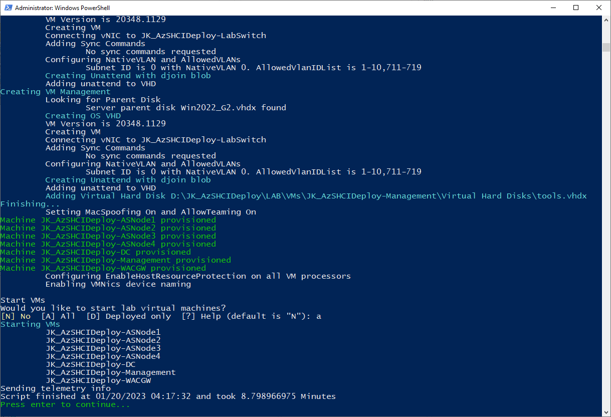

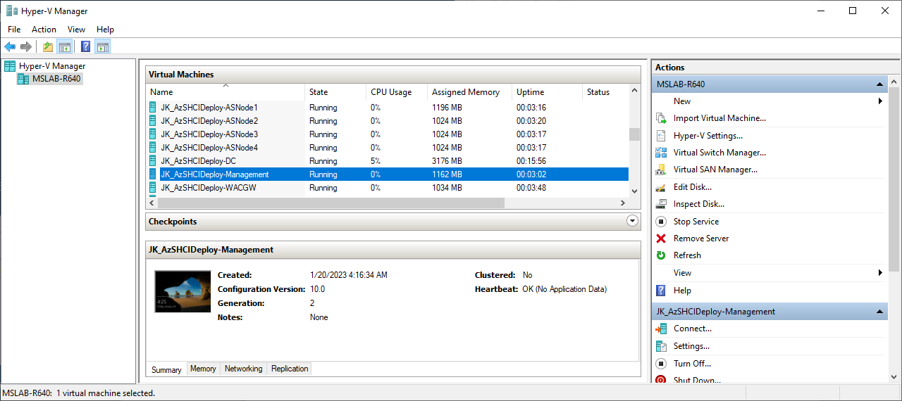

## Task01 - Prepare Active Directory

In this task you will create objects in Active Directory - groups and group managed service accounts. For Group Managed Service accounts you need KDS root key., so let's jump in.

This task will be performed in elevated powershell window in Management machine

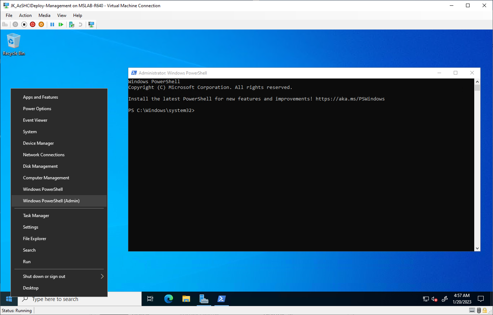

**Step 1** Login into Management machine and run following code in elevated PowerShell window to Provide variables and install required PowerShell modules

> as you can see, since there will be organization unit created and in current iteration is one OU per cluster, prefix and OU name will match cluster name

> you can also notice, that there is an account for deployment being created. It will be used once 

```PowerShell
$AsHCIOUName="OU=ASClus01,DC=Corp,DC=contoso,DC=com"
$Servers="ASNode1","ASNode2","ASNode3","ASNode4"
$DomainFQDN=$env:USERDNSDOMAIN
$ClusterName="ASClus01"
$Prefix="ASClus01"
$UserName="ASClus01-DeployUser"
$Password="LS1setup!"
$SecuredPassword = ConvertTo-SecureString $password -AsPlainText -Force
$Credentials= New-Object System.Management.Automation.PSCredential ($UserName,$SecuredPassword)


#install posh module for prestaging Active Directory
Install-PackageProvider -Name NuGet -Force
Install-Module AsHciADArtifactsPreCreationTool -Repository PSGallery -Force
 
```

**Step 2** Add KDS root key (if there is not any)

```PowerShell
    #add KDS Root Key
    if (-not (Get-KdsRootKey)){
        Add-KdsRootKey -EffectiveTime ((Get-Date).addhours(-10))
    }
 
```

**Step 3** (Optional) Check KD root key with GUI tool

```PowerShell
    Install-WindowsFeature -Name "RSAT-ADDS"
    & dssite.msc
 
```

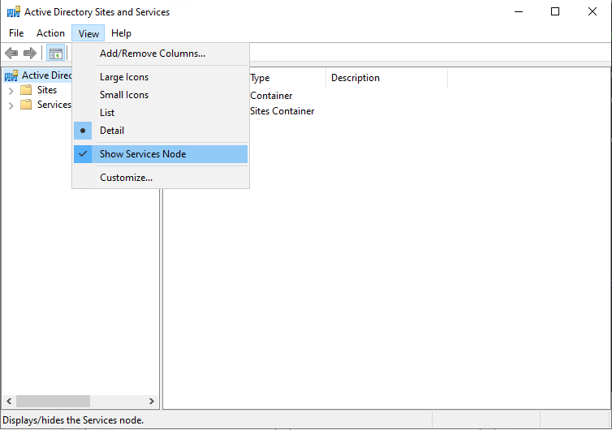

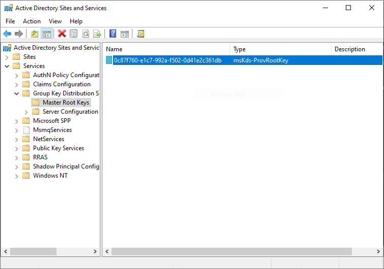

**Step 4** Populate objects into Active Directory

```PowerShell
    #make sure active directory module and GPMC is installed
    Install-WindowsFeature -Name RSAT-AD-PowerShell,GPMC

    #populate objects
    New-HciAdObjectsPreCreation -Deploy -AsHciDeploymentUserCredential $Credentials -AsHciOUName $AsHCIOUName -AsHciPhysicalNodeList $Servers -DomainFQDN $DomainFQDN -AsHciClusterName $ClusterName -AsHciDeploymentPrefix $Prefix
 
```


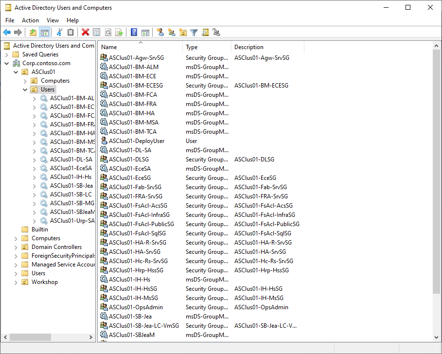

## Task02 - Bootstrap Seed Node

Cluster deployment will be done from "Seed Node" - one cluster node that has access to other nodes

**Step 1** Log in into ASNode1

> Simply use credentials Administrator/LS1setup!

> Once logged in, press 15 to exit to command line (PowerShell)

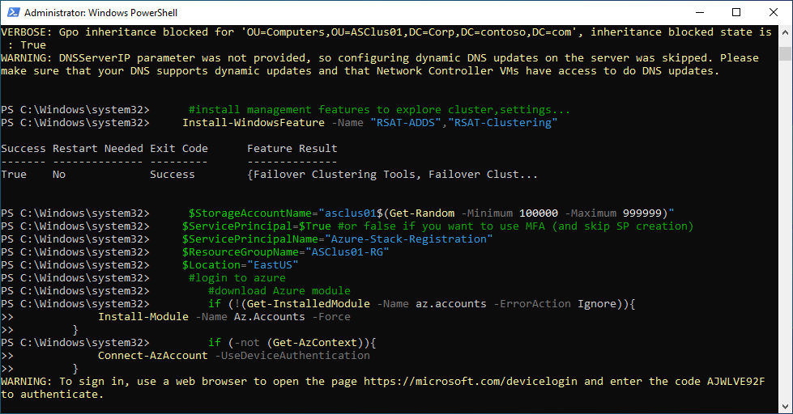

**Step 2** Make sure "D" drive is online

> in this lab environment we added "tools" disk, but the default SAN policy will keep it attached offline.
> since machines are not domain joined, you need to add servers into trusted hosts (there is no way to validate if servers are legit before sending credentials to address)

```PowerShell
#make D drives online
$Servers="ASNode1","ASNode2","ASNode3","ASNode4"
#add $Servers into trustedhosts
Set-Item WSMan:\localhost\Client\TrustedHosts -Value $($Servers -join ',') -Force
#invoke command
Invoke-Command -ComputerName $Servers -ScriptBlock {
    get-disk -Number 1 | Set-Disk -IsReadOnly $false
    get-disk -Number 1 | Set-Disk -IsOffline $false
}
#set trusted hosts back to $Null
Set-Item WSMan:\localhost\Client\TrustedHosts -Value "" -force
 
```

**Step 3** Run following command to download required files and bootstrap deployment on ASNode1

> Bootstrap will create "special" instance of Windows Admin Center where you can create config or provide config to deploy Azure Stack HCI.

```PowerShell
#Download files
$downloadfolder="D:"
$files=@()
$Files+=@{Uri="https://go.microsoft.com/fwlink/?linkid=2210545" ; FileName="BootstrapCloudDeploymentTool.ps1" ; Description="Bootstrap PowerShell"}
$Files+=@{Uri="https://go.microsoft.com/fwlink/?linkid=2210546" ; FileName="CloudDeployment_10.2210.0.32.zip" ; Description="Cloud Deployment Package"}
$Files+=@{Uri="https://go.microsoft.com/fwlink/?linkid=2210608" ; FileName="Verify-CloudDeployment.zip_Hash.ps1" ; Description="Verify Cloud Deployment PowerShell"}

foreach ($file in $files){
    if (-not (Test-Path "$downloadfolder\$($file.filename)")){
        Start-BitsTransfer -Source $file.uri -Destination "$downloadfolder\$($file.filename)" -DisplayName "Downloading: $($file.filename)"
    }
}

#Start bootstrap (script is looking for file "CloudDeployment_*.zip"
& D:\BootstrapCloudDeploymentTool.ps1
 
```

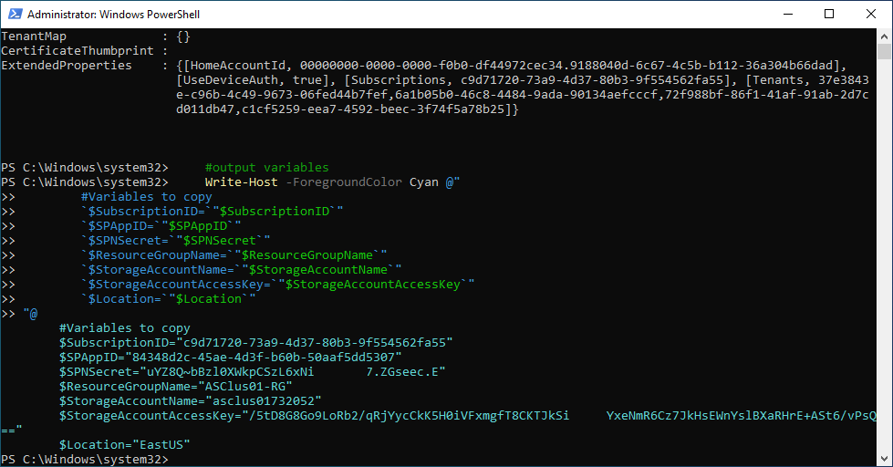


## Task03 - Explore deployment options

**Step 1** Log in into Management machine and Open Edge. In Edge open https://asnode1

> When prompted for credentials, use following: user: .\administrator pass: LS1setup!

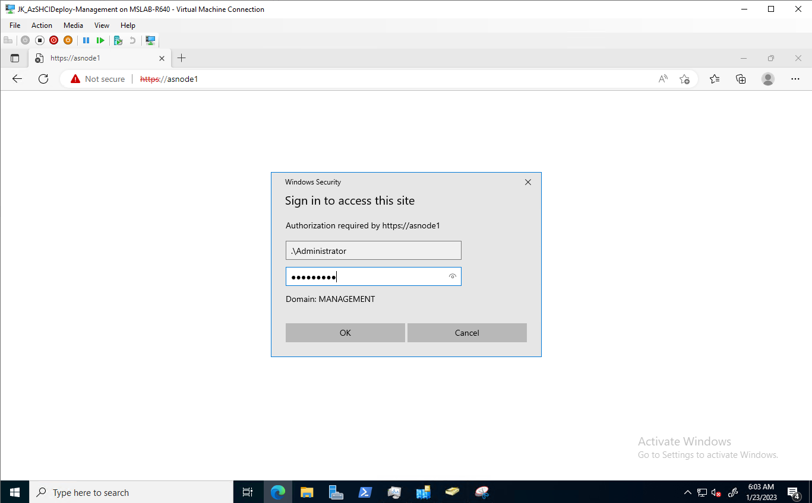

> you can see, that you can create a config file, or you can use an existing. For sake of simplicity, let's use PowerShell

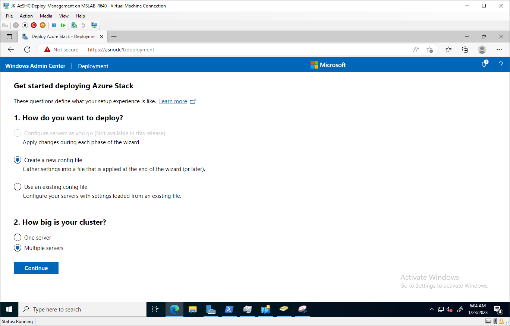

## Task04 - Deploy Azure Stack HCI cluster from Seed Node

> all steps will be performed from Seed node - **ASNode1**

**Step 1** Create Variables with deployment credentials

> keep powershell window open for next steps

```PowerShell
#create deployment credentials
$UserName="ASClus01-DeployUser"
$Password="LS1setup!"
$SecuredPassword = ConvertTo-SecureString $password -AsPlainText -Force
$DeploymentUserCred = New-Object System.Management.Automation.PSCredential ($UserName,$SecuredPassword)

$UserName="Administrator"
$Password="LS1setup!"
$SecuredPassword = ConvertTo-SecureString $password -AsPlainText -Force
$LocalAdminCred = New-Object System.Management.Automation.PSCredential ($UserName,$SecuredPassword)

#provide cloud name (AzureCloud)
$CloudName="AzureCloud"
#provide Service Principal Name
$ServicePrincipalName="Azure-Stack-Registration"
 
```

**Step 2** Install required modules and Login into Azure

```PowerShell
#login to azure
#download Azure module
if (!(Get-InstalledModule -Name az.accounts -ErrorAction Ignore)){
    Install-Module -Name Az.Accounts -Force
}
if (-not (Get-AzContext)){
    Connect-AzAccount -UseDeviceAuthentication
}
#select subscription if more available
$subscriptions=Get-AzSubscription
if (($subscriptions).count -gt 1){
    $SubscriptionID=($subscriptions | Out-GridView -OutputMode Single | Select-AzSubscription).Subscription.Id
}else{
    $SubscriptionID=$subscriptions.id
}
#install required modules
if (!(Get-InstalledModule -Name az.Resources -ErrorAction Ignore)){
    Install-Module -Name Az.Resources -Force
}
 
```

**Step 3** Create New role for registering Azure Stack HCI and new Service principal with that role

> to create just enough credentials to be able to register Azure Stack HCI, a role will be created. To be able to provide a password, Service Principal with name "Azure-Stack-Registration" will be created

```PowerShell
#Create Azure Stack HCI registration role https://learn.microsoft.com/en-us/azure-stack/hci/deploy/register-with-azure#assign-permissions-from-azure-portal
if (-not (Get-AzRoleDefinition -Name "Azure Stack HCI registration role")){
    $Content=@"
{
    "Name": "Azure Stack HCI registration role",
    "Id": null,
    "IsCustom": true,
    "Description": "Custom Azure role to allow subscription-level access to register Azure Stack HCI",
    "Actions": [
        "Microsoft.Resources/subscriptions/resourceGroups/read",
        "Microsoft.Resources/subscriptions/resourceGroups/write",
        "Microsoft.Resources/subscriptions/resourceGroups/delete", 
        "Microsoft.AzureStackHCI/register/action",
        "Microsoft.AzureStackHCI/Unregister/Action",
        "Microsoft.AzureStackHCI/clusters/*",
        "Microsoft.Authorization/roleAssignments/write",
        "Microsoft.Authorization/roleAssignments/read",
        "Microsoft.HybridCompute/register/action",
        "Microsoft.GuestConfiguration/register/action",
        "Microsoft.HybridConnectivity/register/action"
    ],
    "NotActions": [
    ],
    "AssignableScopes": [
        "/subscriptions/$SubscriptionID"
    ]
    }
"@
    $Content | Out-File "$env:USERPROFILE\Downloads\customHCIRole.json"
    New-AzRoleDefinition -InputFile "$env:USERPROFILE\Downloads\customHCIRole.json"
}

#Create AzADServicePrincipal for Azure Stack HCI registration
$SP=Get-AZADServicePrincipal -DisplayName $ServicePrincipalName
if (-not $SP){
    $SP=New-AzADServicePrincipal -DisplayName $ServicePrincipalName -Role "Azure Stack HCI registration role"
    #remove default cred
    Remove-AzADAppCredential -ApplicationId $SP.AppId
}

#Create new SPN password
$credential = New-Object -TypeName "Microsoft.Azure.PowerShell.Cmdlets.Resources.MSGraph.Models.ApiV10.MicrosoftGraphPasswordCredential" -Property @{
    "KeyID"         = (new-guid).Guid ;
    "EndDateTime" = [DateTime]::UtcNow.AddYears(10)
}
$Creds=New-AzADAppCredential -PasswordCredentials $credential -ApplicationID $SP.AppID
$SPNSecret=$Creds.SecretText
Write-Host "Your Password is: " -NoNewLine ; Write-Host $SPNSecret -ForegroundColor Cyan
$SPNsecStringPassword = ConvertTo-SecureString $SPNSecret -AsPlainText -Force
$SPNCred=New-Object System.Management.Automation.PSCredential ($SP.AppID, $SPNsecStringPassword)
 
```

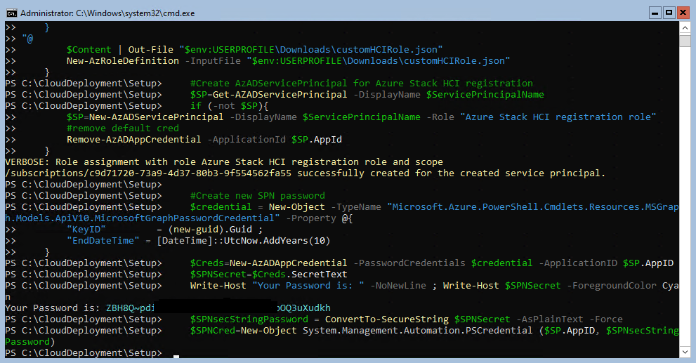

> you can see new Service Principal in "App Registrations" in Azure Portal

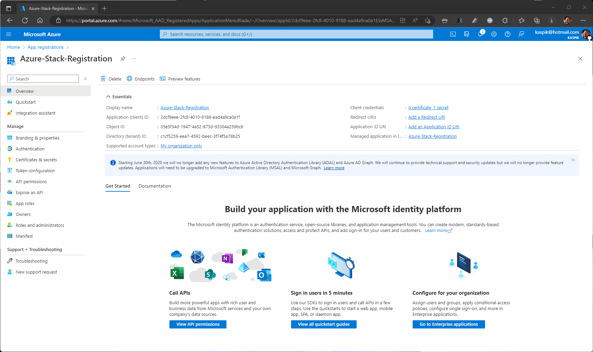

> custom role that was created is visible in Access control (IAM) 

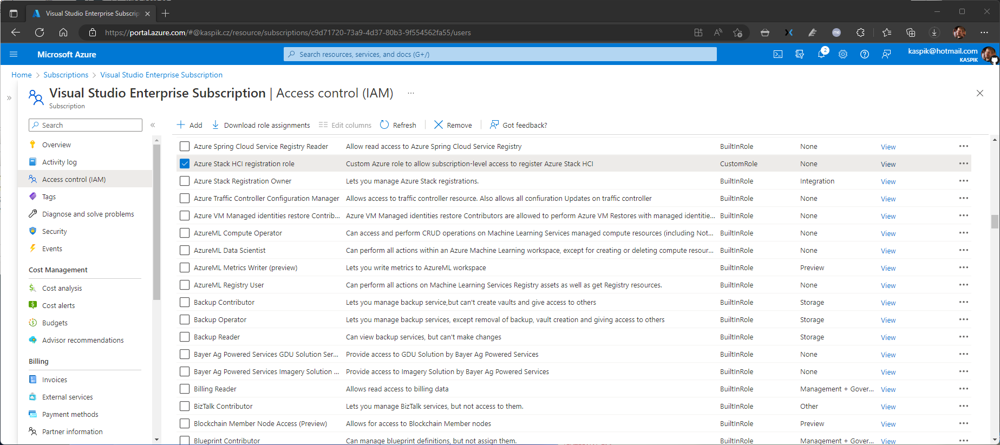

**Step 4** Create Config and start deployment

> Notice, that there are several parameters inside that config that are specific for this lab. Also IP Addresses are dynamically added as each "host" has it's DNS name registered and the host names are set during MSLab deploy.

```PowerShell
#create config.json
$Content=@"
{
    "Version": "3.0.0.0",
    "ScaleUnits": [
        {
            "DeploymentData": {
                "SecuritySettings": {
                    "SecurityModeSealed": true,
                    "SecuredCoreEnforced": true,
                    "VBSProtection": true,
                    "HVCIProtection": true,
                    "DRTMProtection": true,
                    "KernelDMAProtection": true,
                    "DriftControlEnforced": true,
                    "CredentialGuardEnforced": false,
                    "SMBSigningEnforced": true,
                    "SMBClusterEncryption": false,
                    "SideChannelMitigationEnforced": true,
                    "BitlockerBootVolume": true,
                    "BitlockerDataVolumes": true,
                    "SEDProtectionEnforced": true,
                    "WDACEnforced": true
                },
                "Observability": {
                    "StreamingDataClient": true,
                    "EULocation": true,
                    "EpisodicDataUpload": true
                },
                "Cluster": {
                    "Name": "ASClus01",
                    "StaticAddress": [
                        ""
                    ]
                },
                "Storage": {
                    "ConfigurationMode": "Express"
                },
                "OptionalServices": {
                    "VirtualSwitchName": "",
                    "CSVPath": "",
                    "ARBRegion": "westeurope"
                },
                "TimeZone": "Pacific Standard Time",
                "NamingPrefix": "ASClus01",
                "DomainFQDN": "corp.contoso.com",
                "ExternalDomainFQDN": "corp.contoso.com",
                "InfrastructureNetwork": [
                    {
                        "VlanId": "0",
                        "SubnetMask": "255.255.255.0",
                        "Gateway": "10.0.0.1",
                        "IPPools": [
                            {
                                "StartingAddress": "10.0.0.100",
                                "EndingAddress": "10.0.0.199"
                            }
                        ],
                        "DNSServers": [
                            "10.0.0.1"
                        ]
                    }
                ],
                "PhysicalNodes": [
                    {
                        "Name": "ASNode1",
                        "IPv4Address": "$((Get-NetIPAddress -InterfaceAlias ethernet -AddressFamily ipv4 -CimSession ASNode1).IPAddress)"
                    },
                    {
                        "Name": "ASNode2",
                        "IPv4Address": "$((Get-NetIPAddress -InterfaceAlias ethernet -AddressFamily ipv4 -CimSession ASNode2).IPAddress)"
                    },
                    {
                        "Name": "ASNode3",
                        "IPv4Address": "$((Get-NetIPAddress -InterfaceAlias ethernet -AddressFamily ipv4 -CimSession ASNode3).IPAddress)"
                    },
                    {
                        "Name": "ASNode4",
                        "IPv4Address": "$((Get-NetIPAddress -InterfaceAlias ethernet -AddressFamily ipv4 -CimSession ASNode4).IPAddress)"
                    }
                ],
                "HostNetwork": {
                    "Intents": [
                        {
                            "Name": "Compute_Management_Storage",
                            "TrafficType": [
                                "Compute",
                                "Management",
                                "Storage"
                            ],
                            "Adapter": [
                                "Ethernet",
                                "Ethernet 2"
                            ],
                            "OverrideVirtualSwitchConfiguration": false,
                            "VirtualSwitchConfigurationOverrides": {
                                "EnableIov": "",
                                "LoadBalancingAlgorithm": ""
                            },
                            "OverrideQoSPolicy": false,
                            "QoSPolicyOverrides": {
                                "PriorityValue8021Action_Cluster": "",
                                "PriorityValue8021Action_SMB": "",
                                "BandwidthPercentage_SMB": ""
                            },
                            "OverrideAdapterProperty": false,
                            "AdapterPropertyOverrides": {
                                "JumboPacket": "",
                                "NetworkDirect": "",
                                "NetworkDirectTechnology": ""
                            }
                        }
                    ],
                    "StorageNetworks": [
                        {
                            "Name": "Storage1Network",
                            "NetworkAdapterName": "Ethernet",
                            "VlanId": 711
                        },
                        {
                            "Name": "Storage2Network",
                            "NetworkAdapterName": "Ethernet 2",
                            "VlanId": 712
                        }
                    ]
                },
                "ADOUPath": "OU=ASClus01,DC=Corp,DC=contoso,DC=com",
                "DNSForwarder": [
                    "10.0.0.1"
                ]
            }
        }
    ]
}
"@
$Content | Out-File -FilePath d:\config.json

#start deployment
.\Invoke-CloudDeployment -JSONFilePath D:\config.json -DeploymentUserCredential  $DeploymentUserCred  -LocalAdminCredential $LocalAdminCred -RegistrationSPCredential $SPNCred -RegistrationCloudName $CloudName -RegistrationSubscriptionID $SubscriptionID
 
```

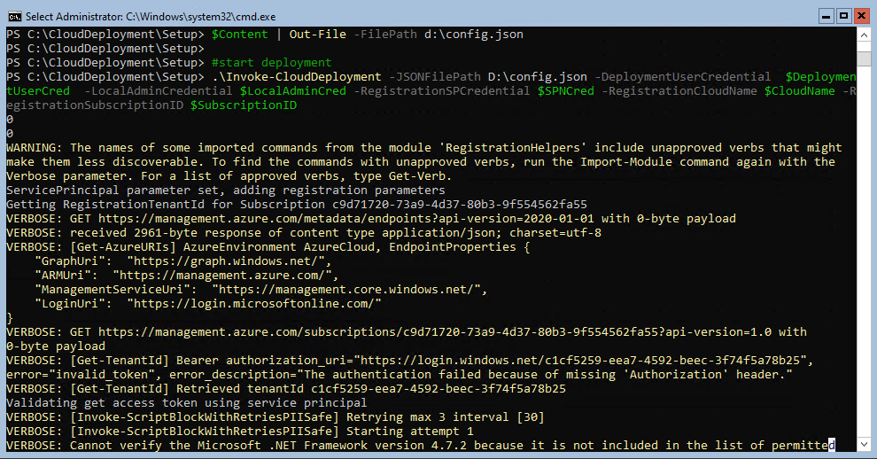

> vm will now restart multiple times. Once it reboots, simply log in again. Preferably just open basic session in VMConnect

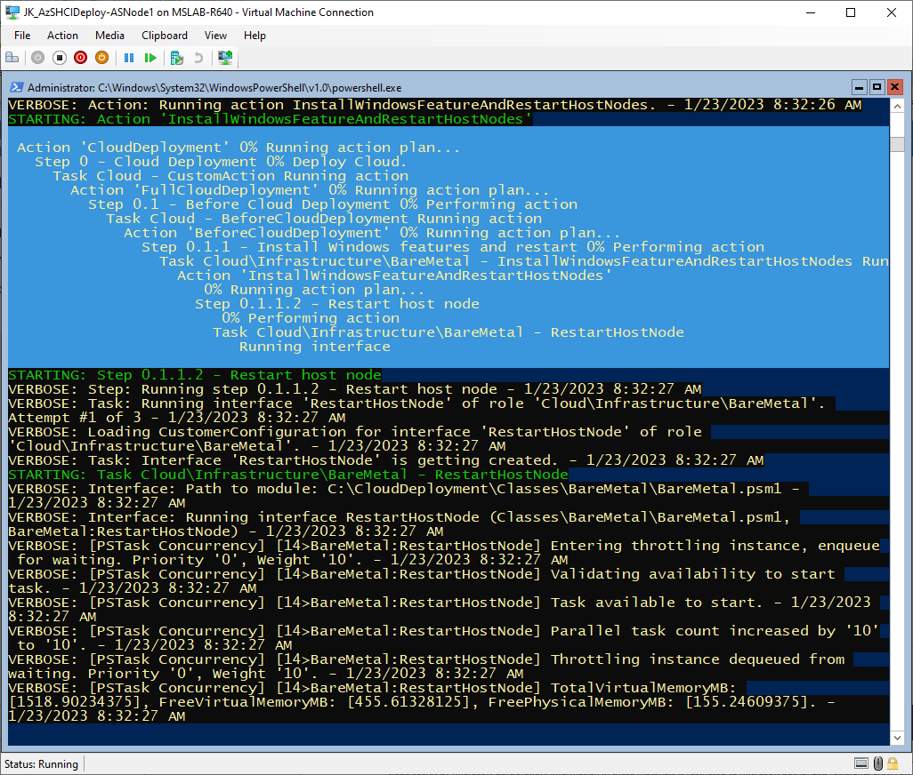


## Task05 - Monitor and validate deployment

**Step 1** From Management machine open Edge and navigate to Asnode1

> you should see deployment progress as on picture below

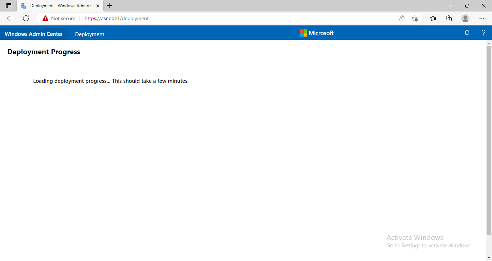

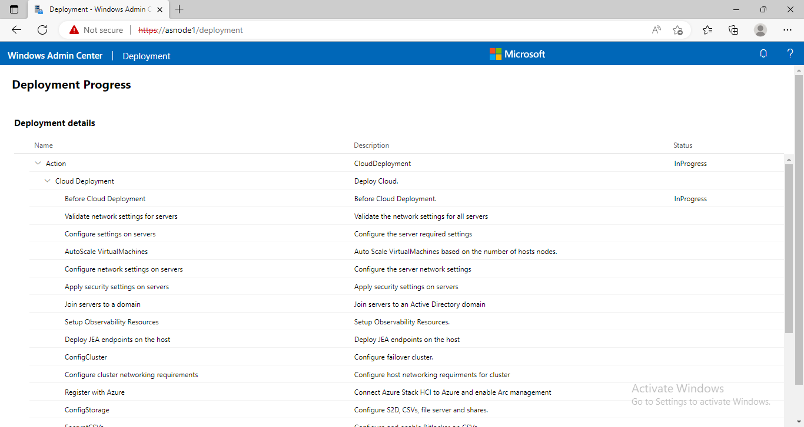

**Step 2** You can also validate deployment running following PowerShell command from Management machine

```PowerShell
$SeedNode="ASNode1"

Invoke-Command -ComputerName $SeedNode -ScriptBlock {
    ([xml](Get-Content C:\ecestore\efb61d70-47ed-8f44-5d63-bed6adc0fb0f\086a22e3-ef1a-7b3a-dc9d-f407953b0f84)) | Select-Xml -XPath "//Action/Steps/Step" | ForEach-Object { $_.Node } | Select-Object FullStepIndex, Status, Name, StartTimeUtc, EndTimeUtc, @{Name="Durration";Expression={new-timespan -Start $_.StartTimeUtc -End $_.EndTimeUtc } } | ft -AutoSize
}
 
```

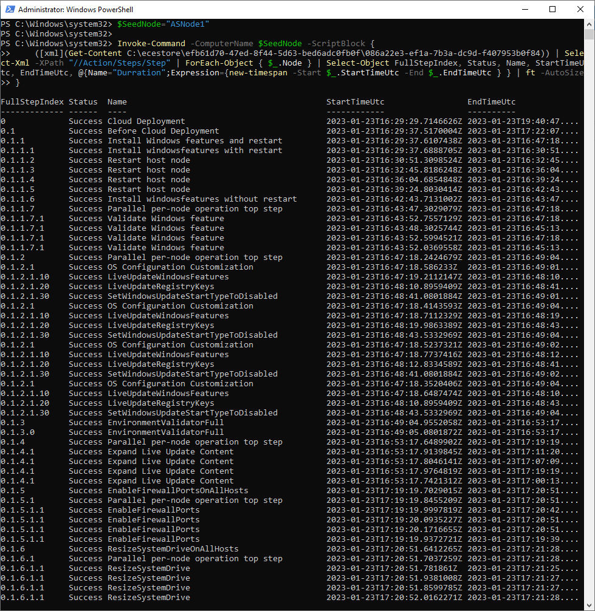

**Step 3** Explore other logs - navigate to \\ASNode1\C$\CloudDeployment\Logs

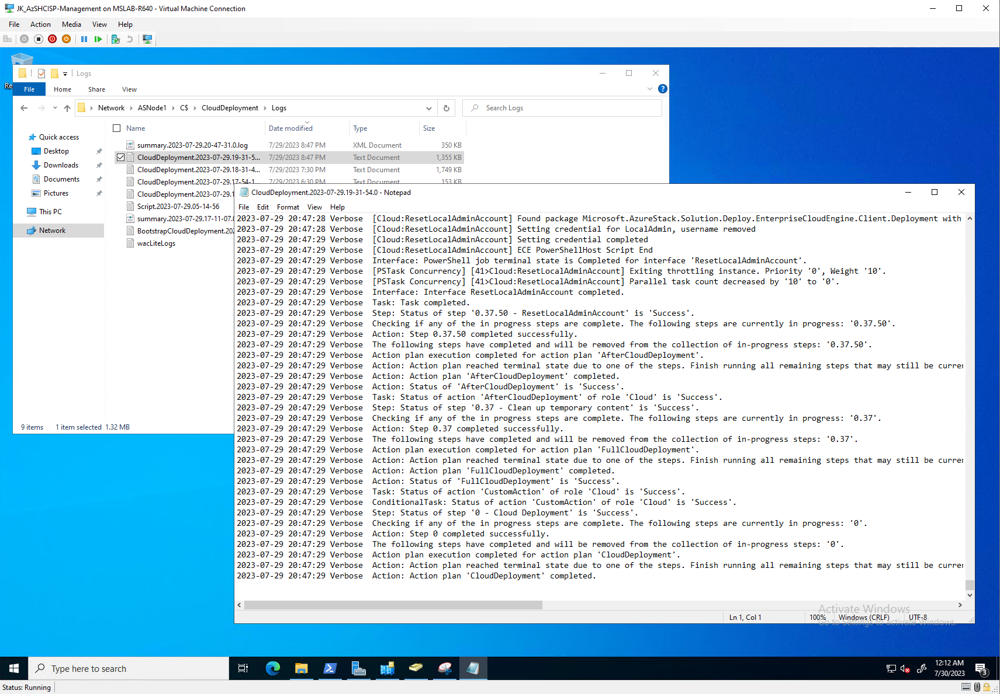


## Task06 - Explore what was configured

**Step 1** Install management tools on Management machine

```PowerShell
#install management features to explore cluster,settings...
Install-WindowsFeature -Name RSAT-Clustering,RSAT-Clustering-Mgmt,RSAT-Clustering-PowerShell,RSAT-Hyper-V-Tools,RSAT-Feature-Tools-BitLocker-BdeAducExt
 
```

**Step 2** Install Windows Admin Center on WACGW

```PowerShell
$GatewayServerName="WACGW"
#Download Windows Admin Center if not present
if (-not (Test-Path -Path "$env:USERPROFILE\Downloads\WindowsAdminCenter.msi")){
    Start-BitsTransfer -Source https://aka.ms/WACDownload -Destination "$env:USERPROFILE\Downloads\WindowsAdminCenter.msi"
    #Or preview (not updated for some time)
    #Start-BitsTransfer -Source https://aka.ms/WACInsiderDownload -Destination "$env:USERPROFILE\Downloads\WindowsAdminCenter.msi"
}
#Create PS Session and copy install files to remote server
#make sure maxevenlope is 8k
Invoke-Command -ComputerName $GatewayServerName -ScriptBlock {Set-Item -Path WSMan:\localhost\MaxEnvelopeSizekb -Value 8192}
$Session=New-PSSession -ComputerName $GatewayServerName
Copy-Item -Path "$env:USERPROFILE\Downloads\WindowsAdminCenter.msi" -Destination "$env:USERPROFILE\Downloads\WindowsAdminCenter.msi" -ToSession $Session

#Install Windows Admin Center
Invoke-Command -Session $session -ScriptBlock {
    Start-Process msiexec.exe -Wait -ArgumentList "/i $env:USERPROFILE\Downloads\WindowsAdminCenter.msi /qn /L*v log.txt REGISTRY_REDIRECT_PORT_80=1 SME_PORT=443 SSL_CERTIFICATE_OPTION=generate"
} -ErrorAction Ignore

$Session | Remove-PSSession

#Configure Resource-Based constrained delegation
Install-WindowsFeature -Name RSAT-AD-PowerShell
$gatewayObject = Get-ADComputer -Identity $GatewayServerName
$computers = (Get-ADComputer -Filter {OperatingSystem -eq "Azure Stack HCI"}).Name

foreach ($computer in $computers){
    $computerObject = Get-ADComputer -Identity $computer
    Set-ADComputer -Identity $computerObject -PrincipalsAllowedToDelegateToAccount $gatewayObject
}

#update installed extensions
#https://docs.microsoft.com/en-us/windows-server/manage/windows-admin-center/configure/use-powershell
    #Copy Posh Modules from wacgw
    $Session=New-PSSession -ComputerName $GatewayServerName
    Copy-Item -Path "C:\Program Files\Windows Admin Center\PowerShell\" -Destination "C:\Program Files\Windows Admin Center\PowerShell\" -Recurse -FromSession $Session
    $Session | Remove-PSSession

    #Import Posh Modules
    $Items=Get-ChildItem -Path "C:\Program Files\Windows Admin Center\PowerShell\Modules" -Recurse | Where-Object Extension -eq ".psm1"
    foreach ($Item in $Items){
        Import-Module $Item.fullName
    }

    #list commands
    Get-Command -Module ExtensionTools

    #grab installed extensions 
    $InstalledExtensions=Get-Extension -GatewayEndpoint https://$GatewayServerName  | Where-Object status -eq Installed
    $ExtensionsToUpdate=$InstalledExtensions | Where-Object IsLatestVersion -eq $False

    foreach ($Extension in $ExtensionsToUpdate){
        Update-Extension -GatewayEndpoint https://$GatewayServerName -ExtensionId $Extension.ID
    }
 
```

**Step 3** After WAC was installed, you can navigate to https://wacgw and add your Azure Stack HCI cluster

> notice, that Windows Defender Application Control is enforced

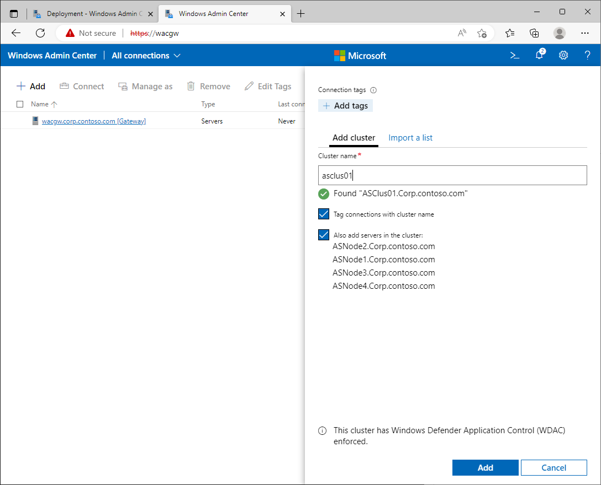

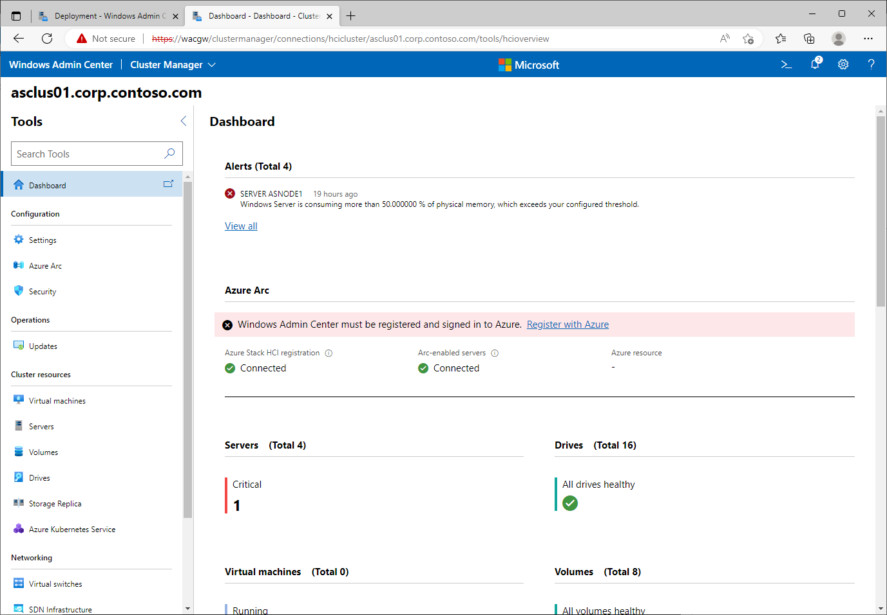

**Step 4** Explore cluster with cluadmin.msc


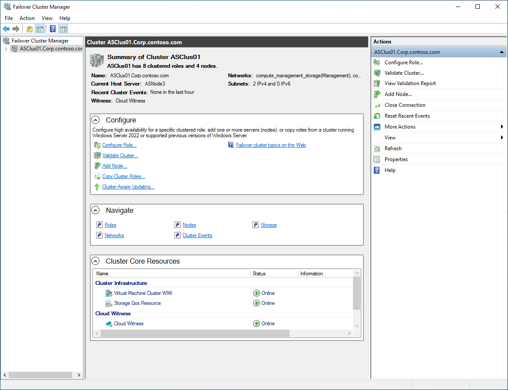


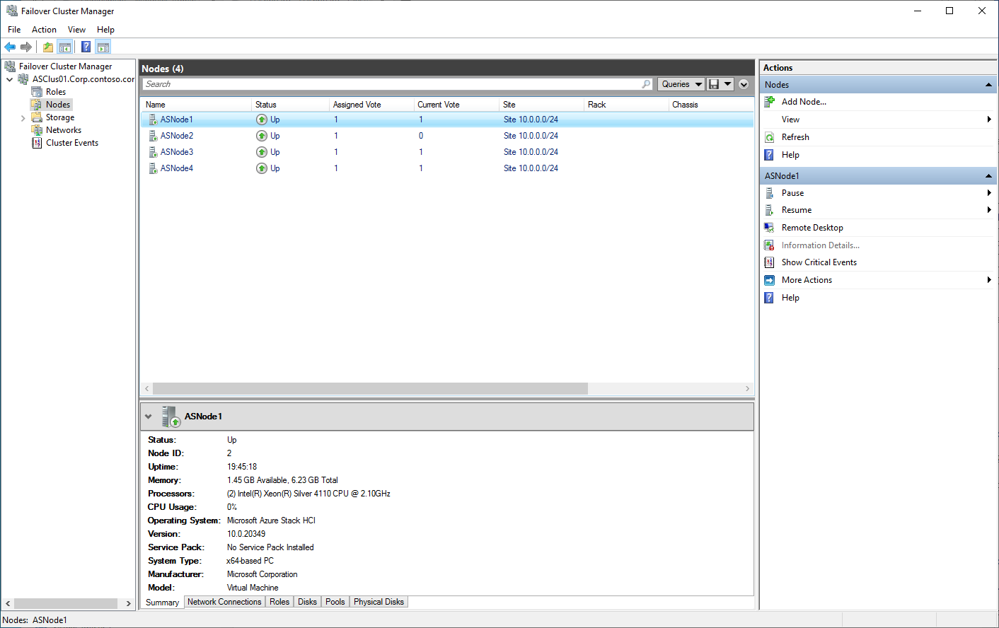

> As you can notice here, Volumes were BitLocker encrypted (as requested in config)

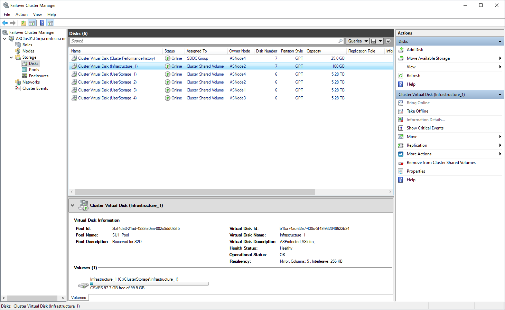

> NetIntent (NetATC) was configured to use just one VLAN (number 8) as deployment scripts detected a VM. Also you can notice, that cluster networks were not renamed.

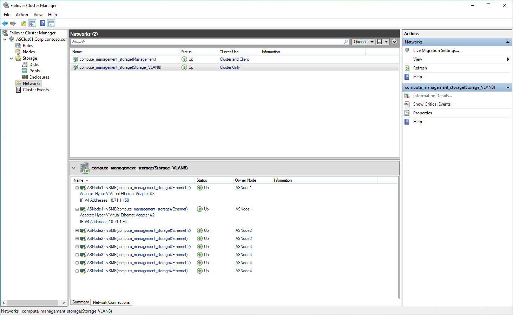