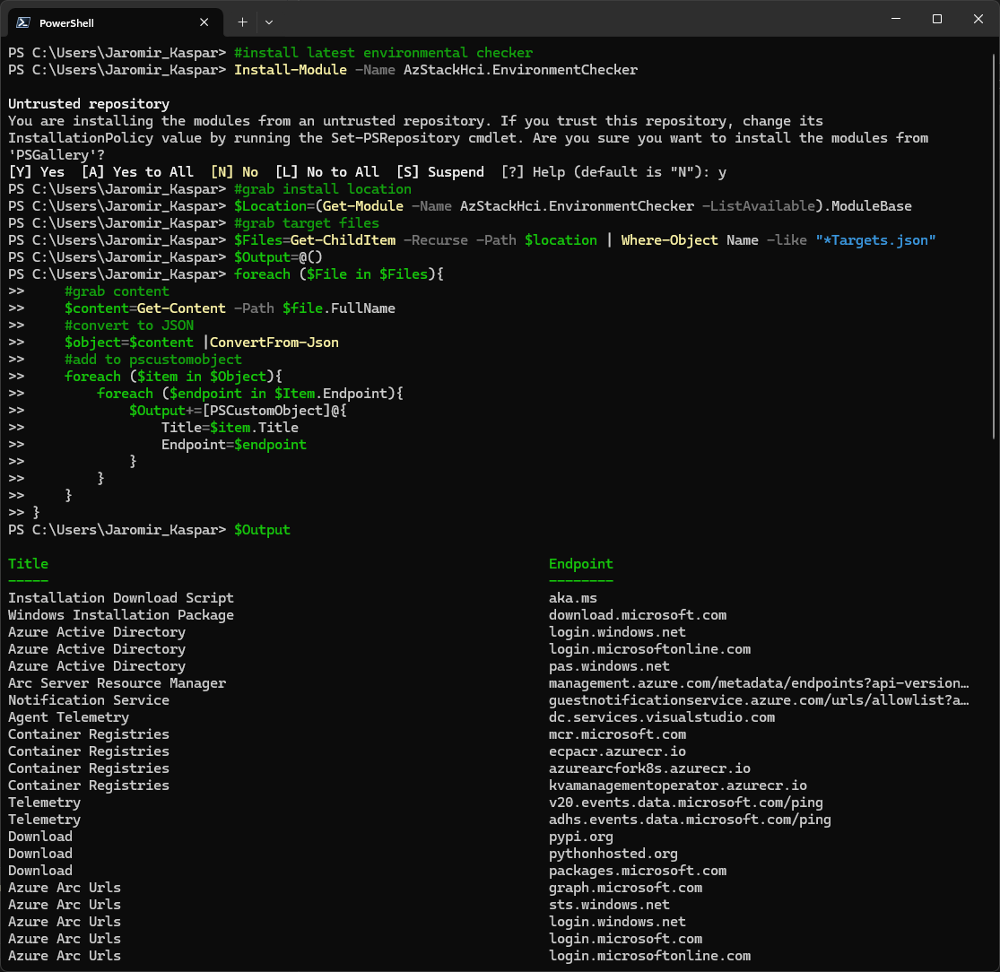

Recently I learned, that [Microsoft Documentation](https://learn.microsoft.com/en-us/azure-stack/hci/concepts/firewall-requirements) is/was missing several URLs that were later tested with [Azure Stack HCI Environmental Checker](https://learn.microsoft.com/en-us/azure-stack/hci/manage/use-environment-checker?tabs=connectivity).

Let's take a look what URLs are actually tested.

```PowerShell
#install latest environmental checker
Install-Module -Name AzStackHci.EnvironmentChecker
#grab install location
$Location=(Get-Module -Name AzStackHci.EnvironmentChecker -ListAvailable).ModuleBase
#grab target files
$Files=Get-ChildItem -Recurse -Path $location | Where-Object Name -like "*Targets.json"
$Output=@()
foreach ($File in $Files){
    #grab content
    $content=Get-Content -Path $file.FullName
    #convert to JSON
    $object=$content |ConvertFrom-Json
    #add to pscustomobject
    foreach ($item in $Object){
        foreach ($endpoint in $Item.Endpoint){
            $Output+=[PSCustomObject]@{
                Title=$item.Title
                Endpoint=$endpoint
            }
        }
    }
}
$Output
 
```



As you can see, it will output simple table with URLs.

I also added these URLs below

| Title                                                                                                        | Endpoint                                                                                  |
|--------------------------------------------------------------------------------------------------------------|-------------------------------------------------------------------------------------------|
| Installation Download Script                                                                                 | aka.ms                                                                                    |
| Windows Installation Package                                                                                 | download.microsoft.com                                                                    |
| Azure Active Directory                                                                                       | login.windows.net                                                                         |
| Azure Active Directory                                                                                       | login.microsoftonline.com                                                                 |
| Azure Active Directory                                                                                       | pas.windows.net                                                                           |
| Arc Server Resource Manager                                                                                  | management.azure.com/metadata/endpoints?api-version=2022-08-01                            |
| Notification Service                                                                                         | guestnotificationservice.azure.com/urls/allowlist?api-version=2020-01-01&location=eastus2 |
| Agent Telemetry                                                                                              | dc.services.visualstudio.com                                                              |
| Container Registries                                                                                         | mcr.microsoft.com                                                                         |
| Container Registries                                                                                         | ecpacr.azurecr.io                                                                         |
| Container Registries                                                                                         | azurearcfork8s.azurecr.io                                                                 |
| Container Registries                                                                                         | kvamanagementoperator.azurecr.io                                                          |
| Telemetry                                                                                                    | v20.events.data.microsoft.com/ping                                                        |
| Telemetry                                                                                                    | adhs.events.data.microsoft.com/ping                                                       |
| Download                                                                                                     | pypi.org                                                                                  |
| Download                                                                                                     | pythonhosted.org                                                                          |
| Download                                                                                                     | packages.microsoft.com                                                                    |
| Azure Arc Urls                                                                                               | graph.microsoft.com                                                                       |
| Azure Arc Urls                                                                                               | sts.windows.net                                                                           |
| Azure Arc Urls                                                                                               | login.windows.net                                                                         |
| Azure Arc Urls                                                                                               | login.microsoft.com                                                                       |
| Azure Arc Urls                                                                                               | login.microsoftonline.com                                                                 |
| Set-AksHciConfig                                                                                             | msk8s.api.cdp.microsoft.com                                                               |
| Set-AksHciConfig                                                                                             | msk8s.b.tlu.dl.delivery.mp.microsoft.com                                                  |
| Set-AksHciConfig                                                                                             | msk8s.f.tlu.dl.delivery.mp.microsoft.com                                                  |
| Set-AksHciRegistration                                                                                       | login.microsoftonline.com                                                                 |
| Set-AksHciRegistration                                                                                       | login.windows.net                                                                         |
| Set-AksHciRegistration                                                                                       | management.azure.com/metadata/endpoints?api-version=2022-08-01                            |
| Set-AksHciRegistration                                                                                       | www.microsoft.com                                                                         |
| Set-AksHciRegistration                                                                                       | msft.sts.microsoft.com                                                                    |
| Set-AksHciRegistration                                                                                       | graph.windows.net                                                                         |
| Install-AksHci                                                                                               | mcr.microsoft.com                                                                         |
| Install-AksHci                                                                                               | ecpacr.azurecr.io                                                                         |
| Install-AksHci                                                                                               | akshci.azurefd.net                                                                        |
| HCI Diagnostic Data                                                                                          | v20.events.data.microsoft.com                                                             |
| HCI Diagnostic Data                                                                                          | adhs.events.data.microsoft.com                                                            |
| Observability Services                                                                                       | azurewatsonanalysis-prod.core.windows.net/ping                                            |
| Observability Services                                                                                       | westus-shared.prod.warm.ingest.monitor.core.windows.net/api/v1/ingestion/status           |
| Observability Services                                                                                       | gcs.prod.monitoring.core.windows.net                                                      |
| Active Directory Authority                                                                                   | login.microsoftonline.com                                                                 |
| Graph                                                                                                        | graph.windows.net                                                                         |
| Resource Manager                                                                                             | management.azure.com/metadata/endpoints?api-version=2022-08-01                            |
| Dataplane                                                                                                    | dp.stackhci.azure.com/_ping                                                               |
| Dataplane                                                                                                    | licensing.platform.edge.azure.com/_health                                                 |
| Dataplane                                                                                                    | billing.platform.edge.azure.com/_health                                                   |
| Dataplane Previous URL                                                                                       | azurestackhci.azurefd.net                                                                 |
| Microsoft Update                                                                                             | windowsupdate.microsoft.com/windowsupdate/v6/default.aspx?ln=en-us                        |
| Microsoft Update                                                                                             | download.windowsupdate.com                                                                |
| Microsoft Update                                                                                             | go.microsoft.com                                                                          |
| Microsoft Update                                                                                             | dl.delivery.mp.microsoft.com                                                              |
| Microsoft Update                                                                                             | ctldl.windowsupdate.com                                                                   |
| Microsoft Update                                                                                             | download.microsoft.com                                                                    |
| MOCStack Prerequisite Artifacts Firewall URL Requirement                                                     | mcr.microsoft.com                                                                         |
| MOCStack's Kubernetes Service Firewall URL Requirement                                                       | hybridaks.azurecr.io                                                                      |
| MOCStack Authentication Firewall URL Requirement                                                             | sts.windows.net                                                                           |
| MOCStack Agent Download Firewall URL Requirement                                                             | ecpacr.azurecr.io                                                                         |
| MOCStack Kubernetes Download Image Firewall URL Requirement                                                  | azurearcfork8s.azurecr.io                                                                 |
| MOCStack Python Package Firewall URL Requirement                                                             | pythonhosted.org                                                                          |
| MOCStack Python Package Firewall URL Requirement                                                             | files.pythonhosted.org                                                                    |
| MOCStack Python Package Firewall URL Requirement                                                             | pypi.org                                                                                  |
| MOCStack Resource Bridge Component Download Firewall Requirement                                             | kvamanagementoperator.azurecr.io                                                          |
| MOCStack Azurestackhci Extension Download Firewall URL Requirement hybridaksstorage.z13.web.core.windows.net | azurearcfork8sdev.azurecr.io                                                              |
| MOCStack Azurestackhci Arc-enabled Kubernetes URL Requirement                                                | azurearcfork8sdev.azurecr.io                                                              |
| Remote Support                                                                                               | login.microsoftonline.com                                                                 |
| Remote Support                                                                                               | edgesupprd.trafficmanager.net                                                             |
| System Check - SSL Inspection Detection                                                                      | login.microsoftonline.com                                                                 |
| System Check - SSL Inspection Detection                                                                      | portal.azure.com                                                                          |