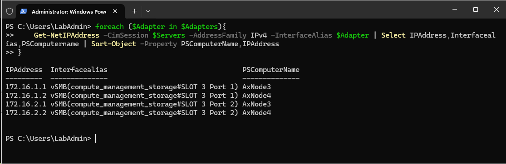
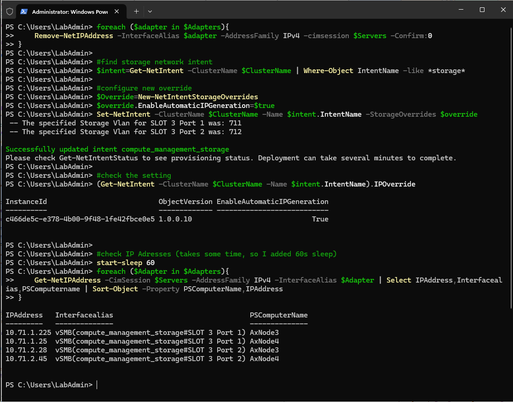

# Override IP addresses in NetATC intent

<!-- TOC -->

- [Override IP addresses in NetATC intent](#override-ip-addresses-in-netatc-intent)
    - [Identify storage network intent and Adapters](#identify-storage-network-intent-and-adapters)
    - [Change IP Override settings](#change-ip-override-settings)
    - [Change IP Adresses](#change-ip-adresses)
    - [Revert back](#revert-back)

<!-- /TOC -->

Note: This guide assumes you are running Windows Server 2025 as management machine (it contains network ATC powershell module).

## Identify storage network intent and Adapters

```PowerShell
$ClusterName="AXClus02"

#make sure NetworkATC and Failover Clustering is installed
Add-WindowsFeature -Name NetworkATC,RSAT-Clustering-Powershell

#find storage network intent
$intent=Get-NetIntent -ClusterName $ClusterName | Where-Object IntentName -like *storage*

#identify adapter names
$AdapterNames=$intent.NetAdapterNamesAsList
$AdapterNames

#identify Adapters to work with
#if it's storage only intent, then you'll need to change IP addresses on $adapternames. If it's converged, then adapters will be vSMB(intentname)

if ($intent.IsOnlyStorage){
    $Adapters=$AdapterNames
}else{
    $Adapters=@()
    foreach ($AdapterName in $AdapterNames){
        $Adapters+="vSMB($($intent.IntentName)#$AdapterName)"
    }
}
$Adapters

```


## Change IP Override settings

```PowerShell
#explore IP override settings
$intent.IPOverride

#configure new override
$Override=New-NetIntentStorageOverrides
$override.EnableAutomaticIPGeneration=$false
Set-NetIntent -ClusterName $ClusterName -Name $intent.IntentName -StorageOverrides $override

#check the setting
(Get-NetIntent -ClusterName $ClusterName -Name $intent.IntentName).IPOverride

#after some time IP adresses should be removed (I added 60s sleep)
$Servers=(Get-ClusterNode -Cluster $ClusterName).Name
Start-Sleep 60
#check IP Adresses
foreach ($Adapter in $Adapters){
    Get-NetIPAddress -CimSession $Servers -AddressFamily IPv4 -InterfaceAlias $Adapter | Select-Object IPAddress,Interfacealias,PSComputername | Sort-Object -Property PSComputerName,IPAddress
}

```


## Change IP Adresses

Note: This code assumes that you have just 2 SMB NICs. With more just modify the code or let me know and I'll adapt it.

```PowerShell
#you can remove IPs if there are any leftovers, but it should be already removed as network intent was reconfigured
<#
foreach ($adapter in $Adapters){
    Remove-NetIPAddress -InterfaceAlias $adapter -AddressFamily IPv4 -cimsession $Servers -Confirm:0
}
#>

#and now let's configure static IP address
$Stornet1="172.16.1."
$Stornet2="172.16.2."
$StartIP=1
$Servers=(Get-ClusterNode -Cluster $ClusterName).Name

foreach ($Server in $Servers){
    New-NetIPAddress -IPAddress ($StorNet1+$StartIP.ToString()) -InterfaceAlias $Adapters[0] -CimSession $Server -PrefixLength 24
    New-NetIPAddress -IPAddress ($StorNet2+$StartIP.ToString()) -InterfaceAlias $Adapters[1] -CimSession $Server -PrefixLength 24
    $StartIP++
}

#check IP Adresses
Start-Sleep 10
foreach ($Adapter in $Adapters){
    Get-NetIPAddress -CimSession $Servers -AddressFamily IPv4 -InterfaceAlias $Adapter | Select-Object IPAddress,Interfacealias,PSComputername | Sort-Object -Property PSComputerName,IPAddress
}

```



## Revert back

```PowerShell
foreach ($adapter in $Adapters){
    Remove-NetIPAddress -InterfaceAlias $adapter -AddressFamily IPv4 -cimsession $Servers -Confirm:0
}

#find storage network intent
$intent=Get-NetIntent -ClusterName $ClusterName | Where-Object IntentName -like *storage*

#configure new override
$Override=New-NetIntentStorageOverrides
$override.EnableAutomaticIPGeneration=$true
Set-NetIntent -ClusterName $ClusterName -Name $intent.IntentName -StorageOverrides $override

#check the setting
(Get-NetIntent -ClusterName $ClusterName -Name $intent.IntentName).IPOverride

#check IP Adresses (takes some time, so I added 60s sleep)
start-sleep 60
foreach ($Adapter in $Adapters){
    Get-NetIPAddress -CimSession $Servers -AddressFamily IPv4 -InterfaceAlias $Adapter | Select IPAddress,Interfacealias,PSComputername | Sort-Object -Property PSComputerName,IPAddress
}

```

