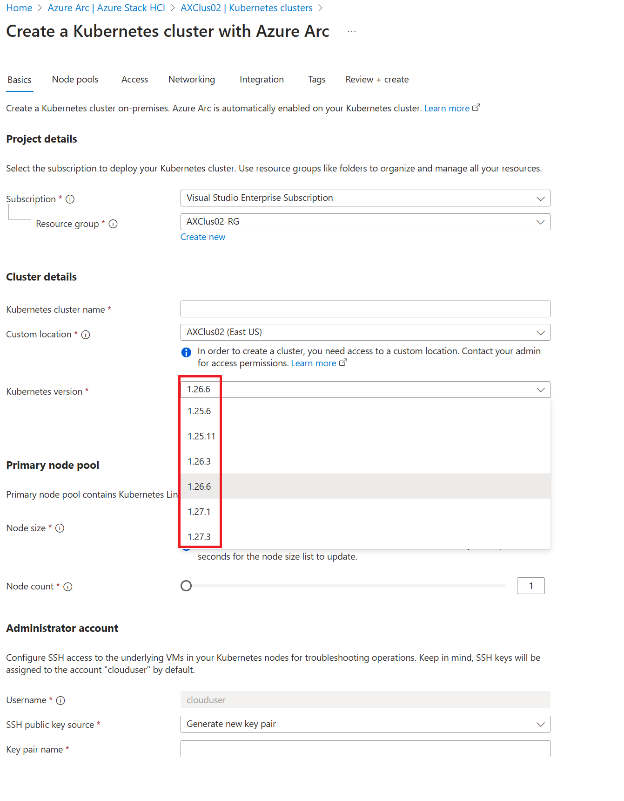
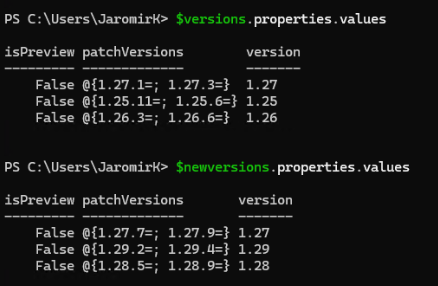
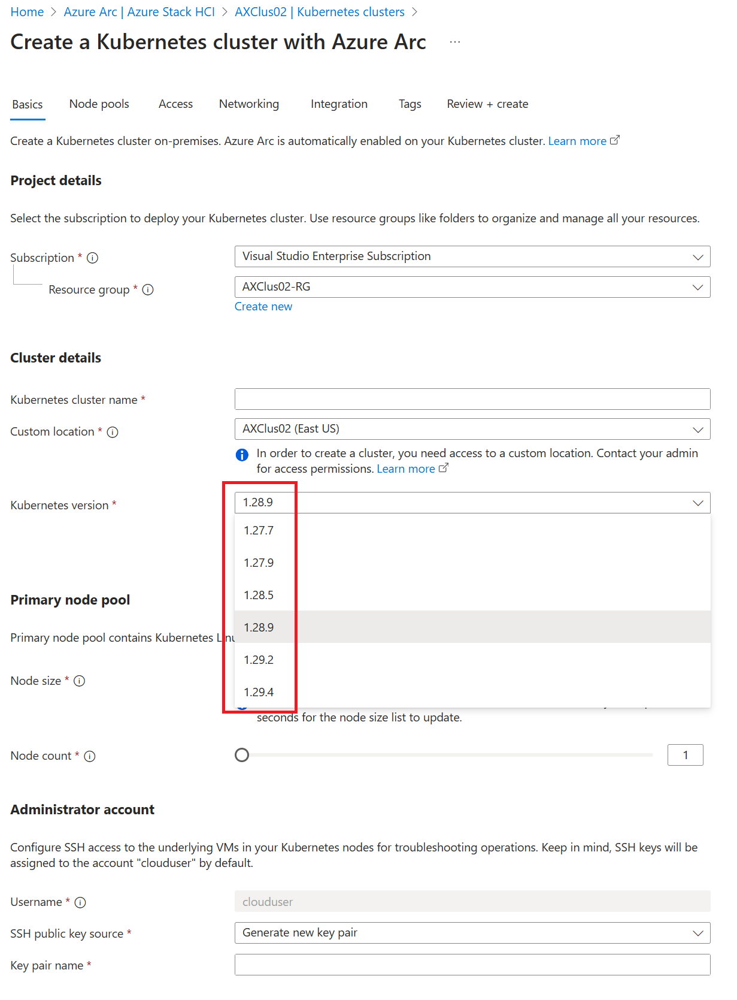

## The problem

When deploying AKS cluster I received an error, that version is not supported. I noticed, that in portal I can only select versions 1.26.6 - 1.27.3. However supported versions for 2408 are [1.27.7-1.29.4](https://learn.microsoft.com/en-us/azure/aks/hybrid/aks-whats-new-23h2#supported-component-versions-for-2408)



## The fix

```PowerShell

#install az cli and log into az
Start-BitsTransfer -Source https://aka.ms/installazurecliwindows -Destination $env:userprofile\Downloads\AzureCLI.msi
Start-Process msiexec.exe -Wait -ArgumentList "/I  $env:userprofile\Downloads\AzureCLI.msi /quiet"
#add az to enviromental variables so no posh restart is needed
[System.Environment]::SetEnvironmentVariable('PATH',$Env:PATH+';C:\Program Files (x86)\Microsoft SDKs\Azure\CLI2\wbin')

#login with device authentication
az login --use-device-code

#add custom location extension
az extension add --name customlocation

#Grab CustomLocation
$Customlocations=az customlocation list | ConvertFrom-Json
$CustomLocation=$CustomLocations | Select DisplayName,Location,ID,ResourceGroup | Out-GridView -OutputMode Single -Title "Please select custom location"

#grab subscriptionID and customlocation ID
$account=(az account show) | ConvertFrom-Json
$SubscriptionId=$account.id
$CustomLocationID=($CustomLocation).ID

#fix
    $token = $(az account get-access-token --query accessToken)
    $url = "https://management.azure.com$CustomLocationID/providers/Microsoft.HybridContainerService/kubernetesVersions/default?api-version=2024-01-01"

    # Get the kubernetes version azure resource (optional)
    $versions=(az rest --headers "Authorization=Bearer $token" "Content-Type=application/json;charset=utf-8" --uri $url --method GET) | ConvertFrom-JSON
    #display versions
    $versions.properties.values | ConvertTo-Json -Depth 4

    # Delete the kubernetes version azure resource
    az rest --headers "Authorization=Bearer $token" "Content-Type=application/json;charset=utf-8" --uri $url --method DELETE

    # Get the kubernetes version using CLI (it will automatically create the kubernetes version resource in Azure)
    az aksarc get-versions --custom-location $CustomLocationID
    #display versions
    $newversions=(az rest --headers "Authorization=Bearer $token" "Content-Type=application/json;charset=utf-8" --uri $url --method GET) | ConvertFrom-JSON
    $newversions.properties.values | ConvertTo-Json -Depth 4

```

## Result

Versions before and after patching



