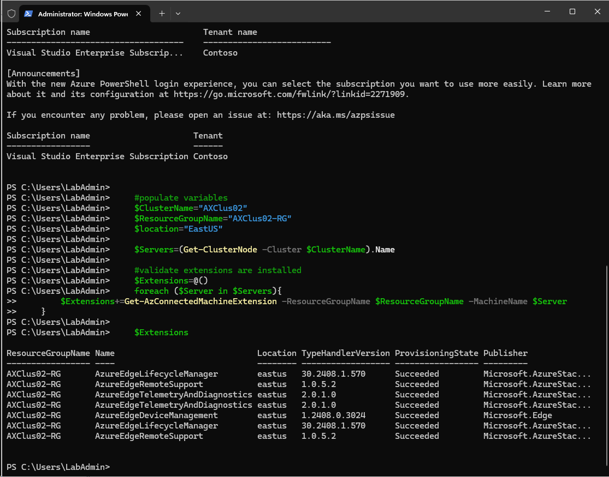
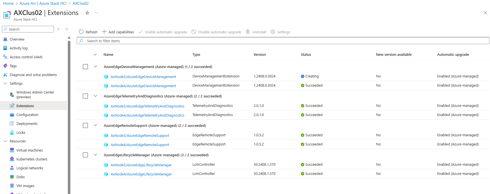
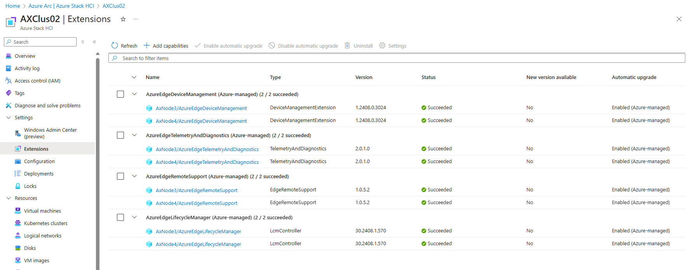

# Fix Azure Stack HCI extensions

In case there is something wrong with Azure Stack HCI externsion, is bit tricky to either reinstall or simply add an extension as it's not available in the list in GUI.

This lab will help you both fixing and/or adding missing extension. As you can see below, there is a problem with one extension. Let's try to fix it.


## Grab some info about the extensions

```PowerShell
    #make sure management tools are installed
    Add-WindowsFeature -Name RSAT-Clustering-Powershell

    #download Azure modules
    Install-PackageProvider -Name NuGet -MinimumVersion 2.8.5.201 -Force
    $Modules="Az.ConnectedMachine","Az.Accounts","Az.Resources"
    Foreach ($Module in $Modules){
        if (!(Get-InstalledModule -Name $Module -ErrorAction Ignore)){
            Install-Module -Name $Module -Force 
        }
    }

    #login
    Connect-AzAccount -UseDeviceAuthentication

    #populate variables
    $ClusterName="AXClus02"
    $ResourceGroupName="AXClus02-RG"
    $location="EastUS"

    $Servers=(Get-ClusterNode -Cluster $ClusterName).Name

    #validate extensions are installed
    $Extensions=@()
    foreach ($Server in $Servers){
        $Extensions+=Get-AzConnectedMachineExtension -ResourceGroupName $ResourceGroupName -MachineName $Server
    }

    $Extensions

```

If there's a failed externsion, you would see it failed in the list. In this case there's just one extension missing.




## Fix failed extension

```PowerShell
    #Fix failed extensions (in case one is failed)
    $FailedExtensions=$Extensions | Where-Object ProvisioningState -eq Failed

    foreach ($FailedExtension in $FailedExtensions){
        #remove lock first
        $lock=Get-AzResourceLock -ResourceGroupName $ResourceGroupName | Where-Object ResourceID -like "*HybridCompute/machines/$(($FailedExtension).MachineName)*"
        $lock | Remove-AzResourceLock -force
        #remove extension
        Remove-AzConnectedMachineExtension -Name $FailedExtension.Name -ResourceGroupName $FailedExtension.ResourceGroupName -MachineName $FailedExtension.MachineName
        #add extension back
        $Settings = @{ "CloudName" = "AzureCloud"; "RegionName" = $FailedExtension.Location ; "DeviceType" = "AzureEdge" }
        New-AzConnectedMachineExtension -Name $FailedExtension.Name -ResourceGroupName $FailedExtension.ResourceGroupName -MachineName $FailedExtension.MachineName -Location $FailedExtension.Location -Publisher $FailedExtension.Publisher -Settings $Settings -ExtensionType $FailedExtension.MachineExtensionType
    }
```

## Add missing extensions

```PowerShell
    #add missing extensions
    $Settings = @{ "CloudName" = "AzureCloud"; "RegionName" = $Location ; "DeviceType" = "AzureEdge" }

    $ExtensionList=@()
    $ExtensionList+=@{ Name = "AzureEdgeTelemetryAndDiagnostics" ; Publisher ="Microsoft.AzureStack.Observability"; MachineExtensionType="TelemetryAndDiagnostics"}
    $ExtensionList+=@{ Name = "AzureEdgeDeviceManagement"        ; Publisher ="Microsoft.Edge"                    ; MachineExtensionType="DeviceManagementExtension"}
    $ExtensionList+=@{ Name = "AzureEdgeLifecycleManager"        ; Publisher ="Microsoft.AzureStack.Orchestration"; MachineExtensionType="LcmController"}
    $ExtensionList+=@{ Name = "AzureEdgeRemoteSupport"           ; Publisher ="Microsoft.AzureStack.Observability"; MachineExtensionType="EdgeRemoteSupport"}

    #check what extensions are installed
    $Extensions=@()
    foreach ($Server in $Servers){
        $Extensions+=Get-AzConnectedMachineExtension -ResourceGroupName $ResourceGroupName -MachineName $Server
    }
    $Extensions

    #install if extension is missing
    foreach ($Server in $Servers){
        foreach ($Extension in $ExtensionList){
            #check if externsion is already there
            if (-not ($Extensions | Where-Object {$_.Name -eq $Extension.Name -and $_.MachineName -eq $Server} )){
                New-AzConnectedMachineExtension -Name $Extension.Name -ResourceGroupName $ResourceGroupName -MachineName $Server -Location $Location -Publisher $Extension.Publisher -Settings $Settings -ExtensionType $Extension.MachineExtensionType
            }
        }
    }
```

If extension was missing, you'll see it being added in portal



After powershell script will finish, all should be OK

