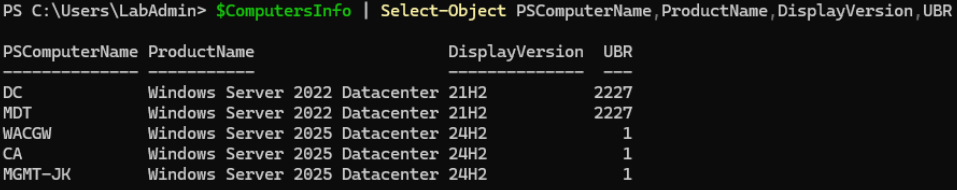
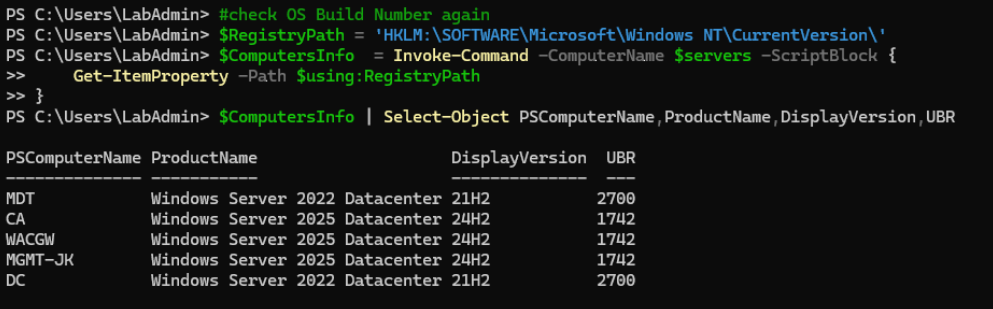
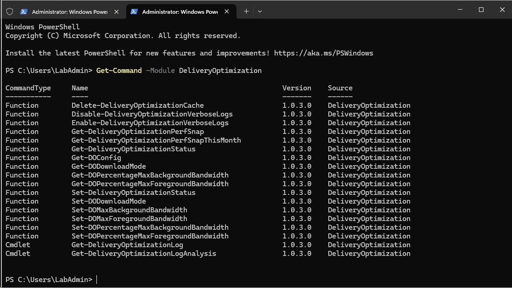
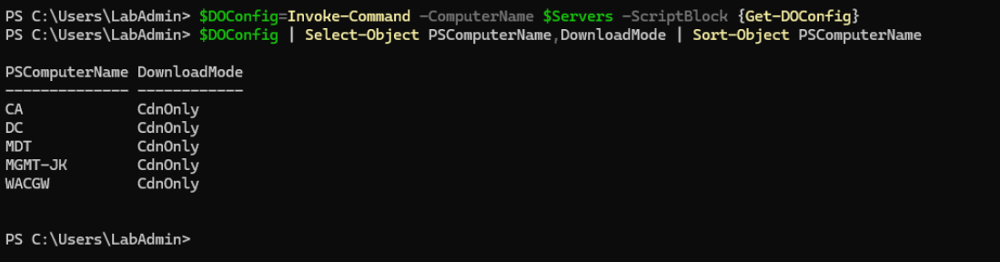
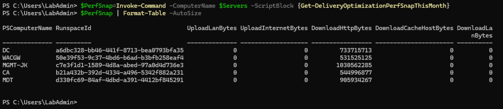

This code will simply pull all servers from AD, will let you choose and will update it to latest version.

Run this code from management machine

```PowerShell
#make sure AD PowerShell is installed to query for computers from AD
Install-WindowsFeature -Name RSAT-AD-PowerShell

#Grab servers
$Servers=(Get-ADComputer -Filter * | Out-GridView -OutputMode Multiple -Title "Please select servers to update").Name

#check OS Build Number
$RegistryPath = 'HKLM:\SOFTWARE\Microsoft\Windows NT\CurrentVersion\'
$ComputersInfo  = Invoke-Command -ComputerName $servers -ScriptBlock {
    Get-ItemProperty -Path $using:RegistryPath
}
$ComputersInfo | Select-Object PSComputerName,ProductName,DisplayVersion,UBR

#update all servers
    Invoke-Command -ComputerName $servers -ScriptBlock {
        New-PSSessionConfigurationFile -RunAsVirtualAccount -Path $env:TEMP\VirtualAccount.pssc
        Register-PSSessionConfiguration -Name 'VirtualAccount' -Path $env:TEMP\VirtualAccount.pssc -Force
    } -ErrorAction Ignore
    #sleep a bit
    Start-Sleep 2
    # Run Windows Update via ComObject.
    Invoke-Command -ComputerName $servers -ConfigurationName 'VirtualAccount' -ScriptBlock {
        $Searcher = New-Object -ComObject Microsoft.Update.Searcher
        $SearchCriteriaAllUpdates = "IsInstalled=0 and DeploymentAction='Installation' or
                                IsInstalled=0 and DeploymentAction='OptionalInstallation' or
                                IsPresent=1 and DeploymentAction='Uninstallation' or
                                IsInstalled=1 and DeploymentAction='Installation' and RebootRequired=1 or
                                IsInstalled=0 and DeploymentAction='Uninstallation' and RebootRequired=1"
        $SearchResult = $Searcher.Search($SearchCriteriaAllUpdates).Updates
        if ($SearchResult.Count -gt 0){
            $Session = New-Object -ComObject Microsoft.Update.Session
            $Downloader = $Session.CreateUpdateDownloader()
            $Downloader.Updates = $SearchResult
            $Downloader.Download()
            $Installer = New-Object -ComObject Microsoft.Update.Installer
            $Installer.Updates = $SearchResult
            $Result = $Installer.Install()
            $Result
        }
    }
    #remove temporary PSsession config
    Invoke-Command -ComputerName $servers -ScriptBlock {
        Unregister-PSSessionConfiguration -Name 'VirtualAccount'
        Remove-Item -Path $env:TEMP\VirtualAccount.pssc
    }

#reboot
Restart-Computer -ComputerName $Servers -Protocol WSMan -Wait -For PowerShell

#check OS Build Number again
$RegistryPath = 'HKLM:\SOFTWARE\Microsoft\Windows NT\CurrentVersion\'
$ComputersInfo  = Invoke-Command -ComputerName $servers -ScriptBlock {
    Get-ItemProperty -Path $using:RegistryPath
}
$ComputersInfo | Select-Object PSComputerName,ProductName,DisplayVersion,UBR
 
```

Before update




After update




Btw. this is nice opener for another topic - [Delivery optimization in Windows](https://learn.microsoft.com/en-us/windows/deployment/do/delivery-optimization-test)



By default, all servers are configured with "CdnOnly". This setting effectively [disables peer-to-peer caching](https://learn.microsoft.com/en-us/windows/win32/delivery_optimization/downloadmode)

```PowerShell
$DOConfig=Invoke-Command -ComputerName $Servers -ScriptBlock {Get-DOConfig}
$DOConfig | Select-Object PSComputerName,DownloadMode | Sort-Object PSComputerName
 
```




To configure simply change config to LAN

```PowerShell
Invoke-Command -ComputerName $Servers -ScriptBlock {Set-DODownloadMode -downloadMode Lan}

```

After that, you can simply view how much data was downloaded from internet and how much from peers on local network (in my case I switched it after updating servers, so there's 0 from local peers)

```PowerShell
$PerfSnap=Invoke-Command -ComputerName $Servers -ScriptBlock {Get-DeliveryOptimizationPerfSnapThisMonth}
$PerfSnap | Format-Table -AutoSize

```


