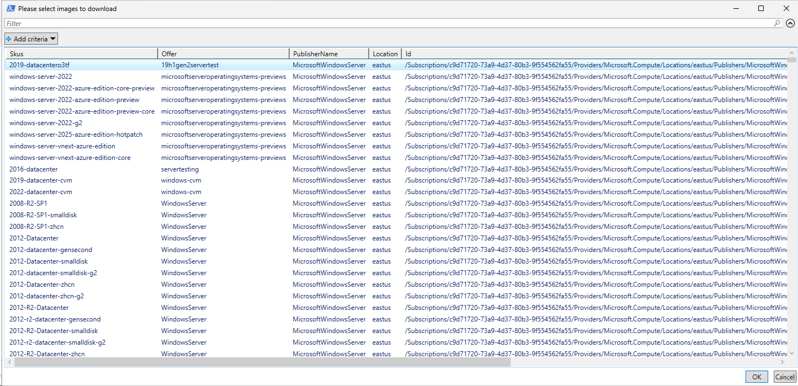
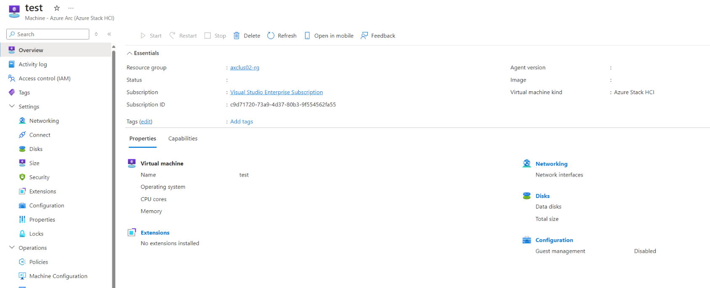
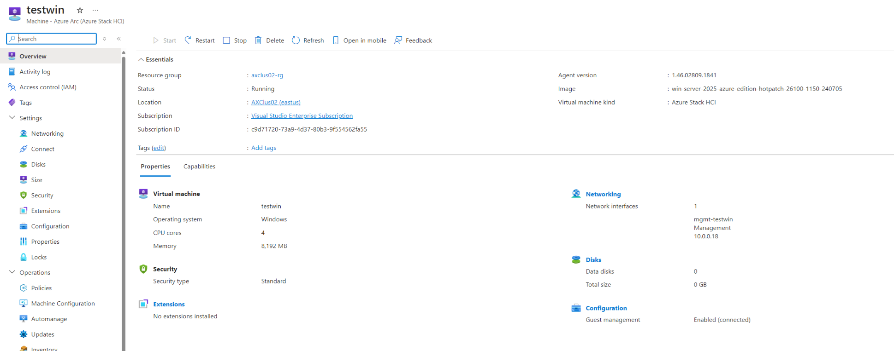
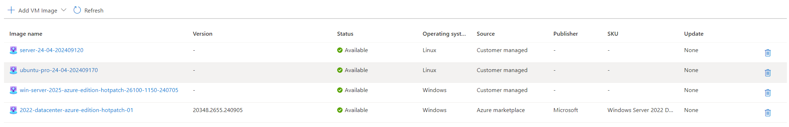
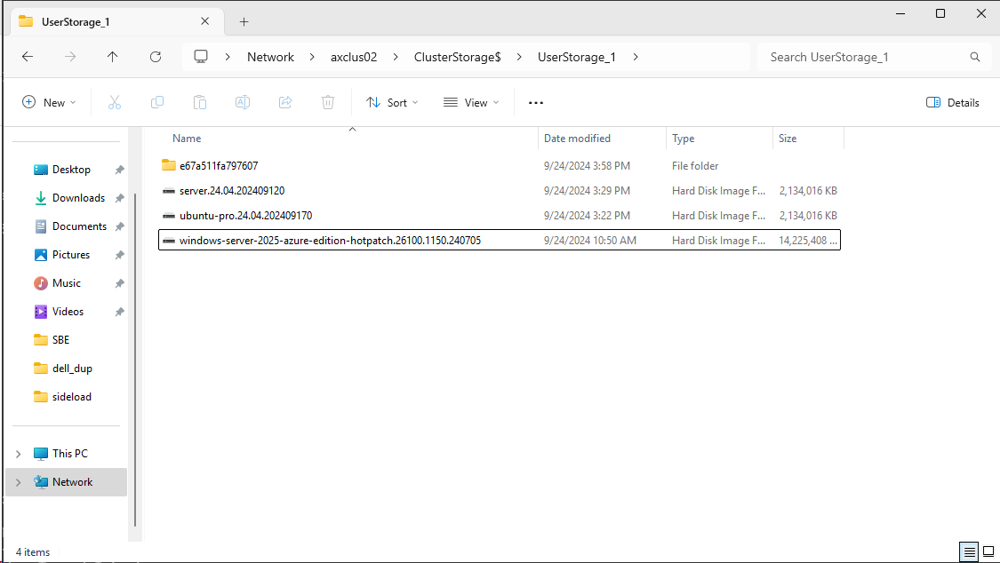

# Pulling Image from Azure

<!-- TOC -->

- [Pulling Image from Azure](#pulling-image-from-azure)
    - [About the lab](#about-the-lab)
    - [Define Variables and install all required modules](#define-variables-and-install-all-required-modules)
    - [Choose what image to download](#choose-what-image-to-download)
    - [Download images and add to Azure](#download-images-and-add-to-azure)

<!-- /TOC -->

## About the lab

In this lab you will pull images from azure and add it as custom image into your Azure Stack HCI cluster.

## Define Variables and install all required modules

```PowerShell
$region="EastUS"
$ResourceGroupName="AXClus02-RG"
$ClusterName="AXCLus02"

#install powershell modules
    Install-PackageProvider -Name NuGet -MinimumVersion 2.8.5.201 -Force
    $ModuleNames="Az.Accounts","Az.Compute","Az.Resources"
    foreach ($ModuleName in $ModuleNames){
        if (!(Get-InstalledModule -Name $ModuleName -ErrorAction Ignore)){
            Install-Module -Name $ModuleName -Force
        }
    }

#install AZ
        Start-BitsTransfer -Source https://aka.ms/installazurecliwindows -Destination $env:userprofile\Downloads\AzureCLI.msi
        Start-Process msiexec.exe -Wait -ArgumentList "/I  $env:userprofile\Downloads\AzureCLI.msi /quiet"
        #add az to enviromental variables so no posh restart is needed
        [System.Environment]::SetEnvironmentVariable('PATH',$Env:PATH+';C:\Program Files (x86)\Microsoft SDKs\Azure\CLI2\wbin')


#login to Azure
    if (-not (Get-AzContext)){
        Login-AzAccount -UseDeviceAuthentication
    }

    az login --use-device-code

#add extensions 
    az extension add --name "stack-hci"
    az extension add --name "stack-hci-vm" --version "1.1.20" #version has to match what's on cluster
    #you can validate what version is running on cluster with following command
    $AZVersions=Invoke-Command -ComputerName $CLusterName -ScriptBlock { az version | ConvertFrom-Json}
    $Azversions.extensions

#grab Subscription ID
    $account=(az account show) | ConvertFrom-Json
    $SubscriptionID=$account.id

```

## Choose what image to download

```PowerShell

#find image and add to library (note, there is a limitation for Linux as there is no ARC integration) When deploying Linux Image, it wont have arc integration (guest management)

    Get-AzVMImagePublisher -Location $region | Out-GridView

    $Publishers="MicrosoftWindowsServer","microsoftwindowsdesktop","Canonical","Credativ","Kinvolk","RedHat","RedHat-RHEL","Oracle","SuSE","Suse.AzureHybridBenefit"

    #Grab image offers from publishers above
    $ImageOffers=@()
    foreach ($Publisher in $Publishers){
        $ImageOffers+=Get-AzVMImageOffer -Location $region -PublisherName  $Publisher
    }

    #grab all possible image SKUs
    $ImageSKUs=@()
    foreach ($ImageOffer in $ImageOffers){
         $ImageSKUs+=Get-AzVMImageSku -Location $region -PublisherName  $ImageOffer.PublisherName -Offer $ImageOffer.Offer
    }

    $ImageSKUsToDownload=$ImageSKUs | Out-GridView -OutputMode Multiple -Title "Please select images to download"


```




Note: if you deploy Linux VM, it wont have Gest Management enabled. It's currently known limitation

Linux:




Windows:



## Download images and add to Azure

```PowerShell
    foreach ($ImageSKUToDownload in $ImageSKUsToDownload){
        #Grab Latest Image
        $LatestImage=Get-AzVMImage -Location $region -PublisherName  $ImageSKUToDownload.PublisherName -Offer $ImageSKUToDownload.Offer -SKU $ImageSKUToDownload.SKUs | Sort-Object Version -Descending |Select-Object -First 1

        # Export the OS disk
        $imageOSDisk = @{Id = $($LatestImage.id)}
        $DiskName="$($LatestImage.SKUs).$($LatestImage.Version)"
        $OSDiskConfig = New-AzDiskConfig -Location $region -CreateOption "FromImage" -ImageReference $imageOSDisk
        New-AzDisk -ResourceGroupName $ResourceGroupName -DiskName $DiskName -Disk $OSDiskConfig

        #add to Azure Stack HCI Library
            #first you need to download image so we can shrink it and convert to vhdx
            #Grant Access https://docs.microsoft.com/en-us/azure/storage/common/storage-sas-overview
            $output=Grant-AzDiskAccess -ResourceGroupName $ResourceGroupName -DiskName "$($LatestImage.SKUs).$($LatestImage.Version)" -Access 'Read' -DurationInSecond 3600
            #Grab shared access signature
            $SAS=$output.accesssas
            $SAS
            #Start-BitsTransfer -Source $SAS -Destination "\\$ClusterName\ClusterStorage$\$LibraryVolumeName\$SKU.vhd"
 
            #download using AzCopy as it's faster than bits transfer
            #https://aka.ms/downloadazcopy-v10-windows\
                # Download the AZCopy package 
                if (-not (Test-Path $env:UserProfile\Downloads\azcopy.exe )){
                    Start-BitsTransfer -Source "https://aka.ms/downloadazcopy-v10-windows" -Destination "$env:UserProfile\Downloads\AzCopy.zip"
                    Expand-Archive -Path "$env:UserProfile\Downloads\AzCopy.zip" -DestinationPath "$env:UserProfile\Downloads\AZCopy" -Force
                    $item=Get-ChildItem -Name azcopy.exe -Recurse -Path "$env:UserProfile\Downloads\AZCopy" 
                    Move-Item -Path "$env:UserProfile\Downloads\AZCopy\$item" -Destination "$env:UserProfile\Downloads\"
                    Remove-Item -Path "$env:UserProfile\Downloads\AZCopy\" -Recurse
                    Remove-Item -Path "$env:UserProfile\Downloads\AzCopy.zip"
                }
                #download VHD to userstorage1
                & $env:UserProfile\Downloads\azcopy.exe copy $sas "\\$ClusterName\ClusterStorage$\UserStorage_1\$DiskName.vhd" --check-md5 NoCheck --cap-mbps 500
            
            #once disk is downloaded, disk access can be revoked
            Revoke-AzDiskAccess -ResourceGroupName  $ResourceGroupName -Name $DiskName
            #and disk itself can be removed
            Remove-AzDisk -ResourceGroupName $ResourceGroupName -DiskName $DiskName -Force
        
            #convert image to dynamic VHDx
            Invoke-Command -ComputerName $ClusterName -ScriptBlock {
                Convert-VHD -Path "c:\clusterstorage\UserStorage_1\$using:DiskName.vhd" -DestinationPath "c:\clusterstorage\UserStorage_1\$using:DiskName.vhdx" -VHDType Dynamic -DeleteSource
                Optimize-VHD -Path "c:\clusterstorage\UserStorage_1\$using:DiskName.vhdx" -Mode Full
            }

            #add disk from local share https://learn.microsoft.com/en-us/azure-stack/hci/manage/virtual-machine-image-local-share?tabs=azurecli

            #grab custom location
            $customLocationID=(Get-AzCustomLocation -ResourceGroupName $ResourceGroupName).ID
            #define OSType
            if ($LatestImage.PublisherName -like "*Windows*"){$OSType="Windows"}else{$OSType="Linux"}

            $DisknameNew=$Diskname.replace("windows","win").replace(".","-") #because of Trademarked names and hyphens 
            az stack-hci-vm image create --subscription $subscriptionID --resource-group $ResourceGroupName --custom-location $customLocationID --location $region --image-path "c:\clusterstorage\UserStorage_1\$DiskName.vhdx" --name $DisknameNew --os-type $osType --offer $LatestImage.Offer --publisher $LatestImage.PublisherName --version $latestimage.version
    }

```

as result of this code, you will download images you choose. These images will be converted to dynamic vhdx and added to Azure Images



